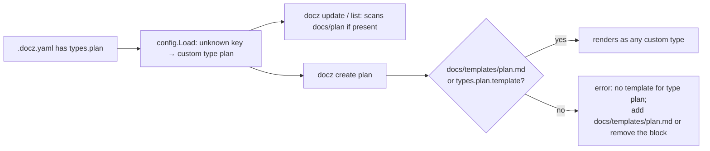
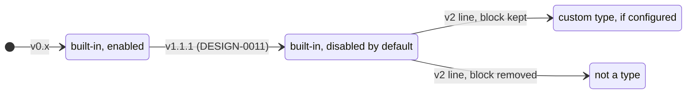

<!-- markdownlint-disable-file MD025 MD041 -->

# ADR-0003: Remove plan from the built-in document types

<!--toc:start-->
- [Summary](#summary)
- [Context](#context)
- [Decision](#decision)
  - [Supporting Data](#supporting-data)
  - [What a legacy config does after removal](#what-a-legacy-config-does-after-removal)
- [Consequences](#consequences)
  - [Positive](#positive)
  - [Negative](#negative)
  - [Neutral](#neutral)
- [Alternatives Considered](#alternatives-considered)
- [Open Questions](#open-questions)
  - [1. Semver treatment](#1-semver-treatment)
  - [2. Sequencing against the API work](#2-sequencing-against-the-api-work)
- [References](#references)
<!--toc:end-->

## Summary

`plan` leaves the built-in document type registry: no `PLAN` prefix, no
`plan` directory, no embedded `plan.md` or `index_plan.md`, five built-in
types instead of six. Nobody has ever written a PLAN document; phased
planning happens in IMPL documents. A repo that still carries a `plan:`
block in `.docz.yaml` keeps working as a custom type and only loses
`docz create plan` until it supplies its own template. The removal ships on
the v2 line with the API, first in the beta that carries the `cmd/` swap
(ADR-0002); the v1 line keeps `plan` as it is.

## Context

docz shipped with six built-in types. PLAN was meant to sit between RFC
(proposal) and IMPL (phased execution), a slot every repo in the fleet fills
with DESIGN + IMPL instead. DESIGN-0011 turned it off by default in v1.1.1
after finding no usage; the registry entry, the two embedded templates, the
`docz --help` line, the README section, and about 25 test references stayed.

The cost is no longer only cruft. DESIGN-0013 introduced `pkg/impl`, a typed
model of an IMPL document, whose natural root name was `Plan`. With a `plan`
doc type in the registry the word meant two things — `impl.Plan` versus
`docz create plan` — and tempy's own design prose already says "plan" for
both. ADR-0002 settles the type package's root name as `Doc` regardless, so
the collision is avoided, but the built-in type itself remains dead weight
and a standing source of the confusion that made the naming question hard.
Issue #103 records the facts.

## Decision

1. **Remove the `plan` registry entry** from `pkg/doczcore/config/doctype.go`.
   `DocTypeNames()`, `TypesHelp()`, `DefaultConfig().Types`, and
   `DefaultNavTitles()` all derive from the registry, so it is the single
   removal point in code. This lands on the v2 line only (Open Question 2):
   v1.x keeps the entry and its templates unchanged.

   ```go
   // doctype.go — the entry that goes. Everything else derives from the slice.
   {
       Name:    "plan",
       Aliases: nil,
       DefaultConfig: func() TypeConfig {
           return TypeConfig{Enabled: false, Dir: "plan", IDPrefix: "PLAN", /* … */}
       },
       NavTitle: "Plans", PluralLabel: "Plans", TemplateName: "plan",
       HelpDescription: "Planning documents — goal, approach, components",
   },
   ```

2. **Remove the embedded templates** `internal/template/templates/plan.md`
   and `index_plan.md`, their goldens, and the `types.plan.enabled: true`
   comment in `docz_yaml.tmpl`. Issue #99 also edits `index_plan.md`;
   whichever lands second rebases onto the other.

3. **A legacy `plan:` block is a custom type.** No migration code. Config
   decoding already treats an unknown `types.<name>` key as a custom type
   (DESIGN-0006), so a repo with the block keeps loading, validating,
   listing, and updating. `docz create plan` fails with a clear error naming
   the fallback: add `docs/templates/plan.md` or delete the block.

4. **Docs and derived surfaces follow.** README (types table and the PLAN
   section), CLAUDE.md ("Six built-in doc types" becomes five), release
   notes with the fallback spelled out. `docz --help` and `docz init` output
   derive from the registry and need no edit.

5. **Downstream issues at decision time** (the docz-api pattern): one in
   claude-skills for the docz plugin's bundled `templates/plan.md`, doc-types
   reference, and `docz:create` fallback mapping; one in docz-api only if
   its contract package enumerates built-in type names.

### Supporting Data

| Fact | Value | Source |
| ---- | ----- | ------ |
| PLAN documents across docz, docz-api, sdk-booty-sh, tempy | 0 | #103 |
| Repos whose `.docz.yaml` still enables `plan` | 3 (docz, docz-api, sdk-booty-sh — pre-v1.1.1 `docz init` output); tempy has it disabled | #103 |
| Default since | v1.1.1 (DESIGN-0011): `enabled: false` | `doctype.go` comment |
| Code references outside the registry | 2 embedded templates, `docz_yaml.tmpl` comment, ~25 test and golden references, README ×5, DEVELOPMENT.md worked example | `grep` 2026-09-14 |
| Other templates that mention PLAN | `impl.md` and `investigation.md` "Implements / Triggered by" comments — prose hints, kept as-is or trimmed | `grep` |
| Public catalogue affected | `config.DocTypeNames()` loses one value; `config.LookupDocType("plan")` returns false | ADR-0001 contract |

### What a legacy config does after removal



The type's lifecycle, for the record:



## Consequences

### Positive

- **One word, one meaning.** "Plan" no longer names a docz type; the IMPL
  model's vocabulary (phases, tasks) has no built-in neighbour to collide
  with.
- **Less to carry.** Two templates, a registry entry, and their tests and
  goldens go; `docz --help` and the README stop advertising a type nobody
  uses.
- **Custom-type support is exercised for real.** The legacy-block fallback
  is the DESIGN-0006 path with a real config on it.

### Negative

- **A removal from a frozen catalogue.** `config.DocTypeNames()` and
  `LookupDocType` are v1.0 contract; dropping a value is a breaking change,
  which is why it rides the v2 line (Open Question 1).
- **Three fleet repos need a one-line config edit** or they keep a dormant
  custom type. Harmless, but it shows up in `docz config` output until
  fixed.
- **`docz template override plan` can no longer export a starting point.**
  A repo that wants PLAN back writes the template from scratch or copies it
  from git history.

### Neutral

- **Sequencing with #99** (index header scaffolding) touches the same file;
  ordering is a rebase, not a design question.
- **The claude-skills plugin** ships its own copy of the templates and
  updates on its own cadence; until then its fallback can still produce a
  PLAN file that the CLI treats as custom.

## Alternatives Considered

- **A. Keep it disabled** (status quo since v1.1.1). *Pros:* nothing to do.
  *Cons:* the confusion, the dead templates, the help text, and the tests
  stay; the naming problem recurs with every type package.
- **B. Deprecate, then remove in v2.** Warn on load when `types.plan.enabled`
  is true for one minor, remove at the next major. *Pros:* semver-clean.
  *Cons:* a warning for a type with zero documents, and a v2 that has no
  other reason to exist.
- **C. Rename the built-in** (`roadmap`, `outline`). *Pros:* keeps the slot.
  *Cons:* renames an unused type; the slot itself is what the fleet does not
  use.
- **D. This ADR.** Remove it, document the custom-type fallback, decide the
  semver treatment explicitly.

## Open Questions

> Each question is numbered; option `a` is my recommendation, later letters
> are alternatives, and the last is a free-form "other".

### 1. Semver treatment

> **Resolved 2026-09-19: (c).** The removal is the breaking change it
> technically is and rides the v2 line that ships the API and the `/v2`
> module path — first in a `v2.0.0-beta.N`, never in a v1 release
> (ADR-0002 Decisions 3 and 6). No deprecation cycle.

- a. **One `minor` with a prominent release-note callout.** Zero documents
  exist, the fallback is graceful and documented, and the only observable
  change for a legacy config is `docz create plan` needing a template. A
  major bump for this would be ceremony. *(recommendation)*
- b. Deprecate first (Alternative B), remove in v2.
- c. Treat it as the `major` it technically is and bundle any other
  breaking cleanups behind it.
- d. Other.

### 2. Sequencing against the API work

> **Resolved 2026-09-19: (a), with the v1 line untouched.** The removal
> lands inside the `cmd/` swap, which ships as `v2.0.0-beta.1`. Nothing changes on
> v1.x: no warning, no template edit; `plan` stays a disabled built-in
> there for as long as v1.x exists.

- a. **Land inside the `cmd/` swap release** (ADR-0002 Decision 6): one
  release whose release notes already speak to library consumers, so the
  catalogue change and the new packages are read together, and the
  `docz_yaml.tmpl` and `index_*.md` edits ride the `doctemplate` promotion
  instead of conflicting with it. *(recommendation)*
- b. Its own earlier `minor`, ahead of the API work, so the registry is
  final before `repo` and `doctemplate` are specified against it.
- c. After the swap, in the following minor.
- d. Other.

## References

- [Issue #103](https://github.com/donaldgifford/docz/issues/103) — facts,
  touch points, acceptance
- [ADR-0002](0002-docz-is-an-api-package-whose-first-consumer-is-the-cli.md)
  — the `Doc` root-type convention and the release this removal rides with
- [DESIGN-0011](../design/0011-api-config-block-index-page-and-additionaldocs-for-docz-api-and.md)
  — PLAN off by default in v1.1.1
- [DESIGN-0006](../design/0006-custom-document-type-support.md) — the
  custom-type decoding the fallback relies on
- [DESIGN-0013](../design/0013-library-first-docz-per-type-document-packages-and-a-core-api.md)
  Open Question 2 — where the naming collision was first raised
- [Issue #99](https://github.com/donaldgifford/docz/issues/99) — the
  `index_plan.md` edit to sequence with
