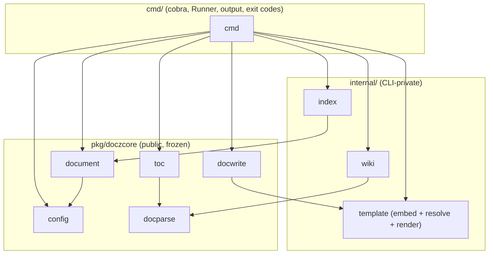
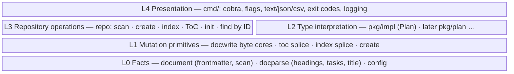
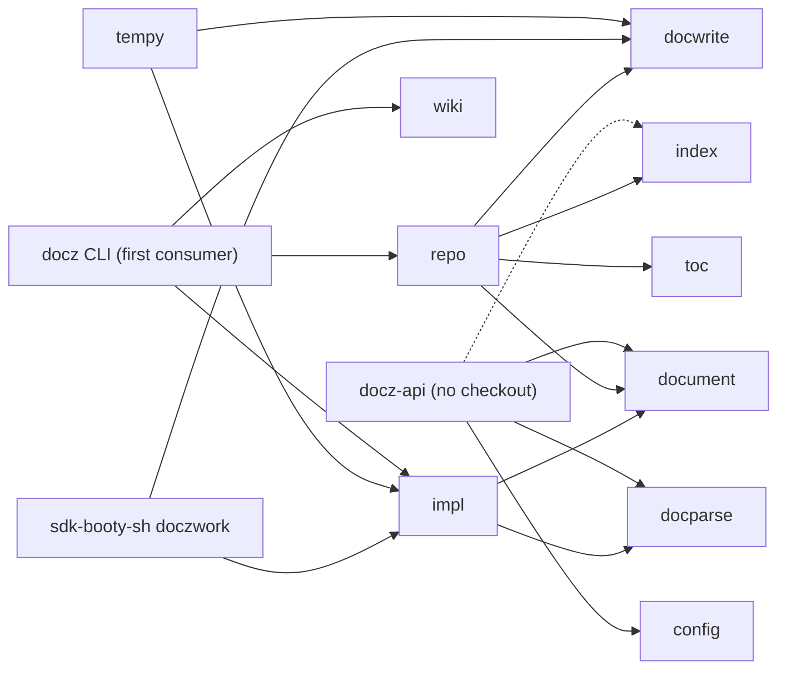
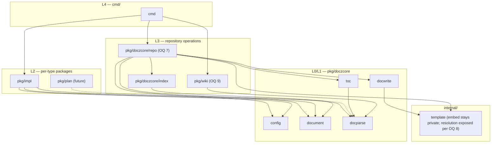
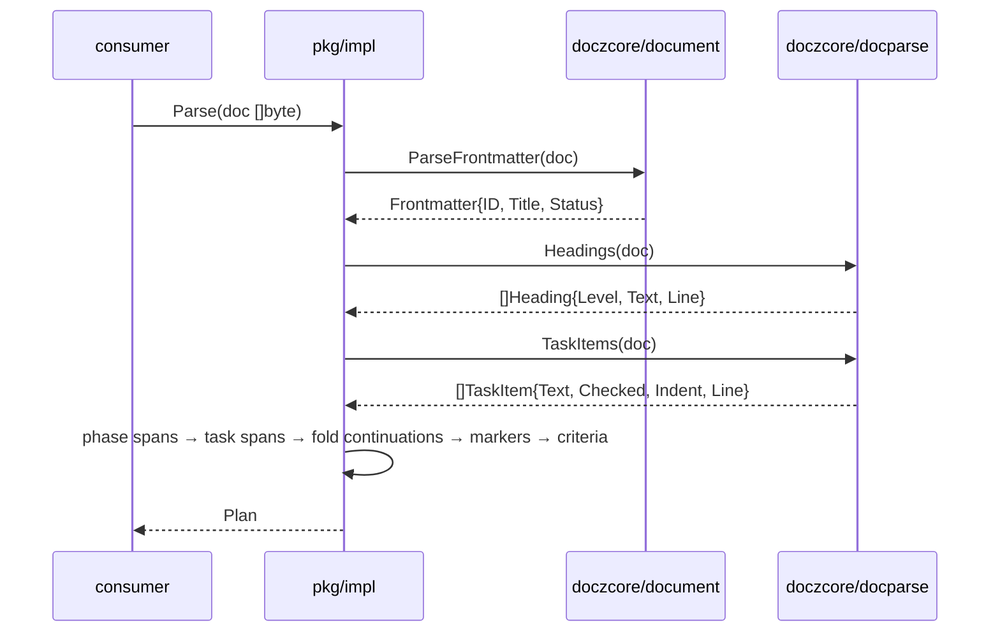
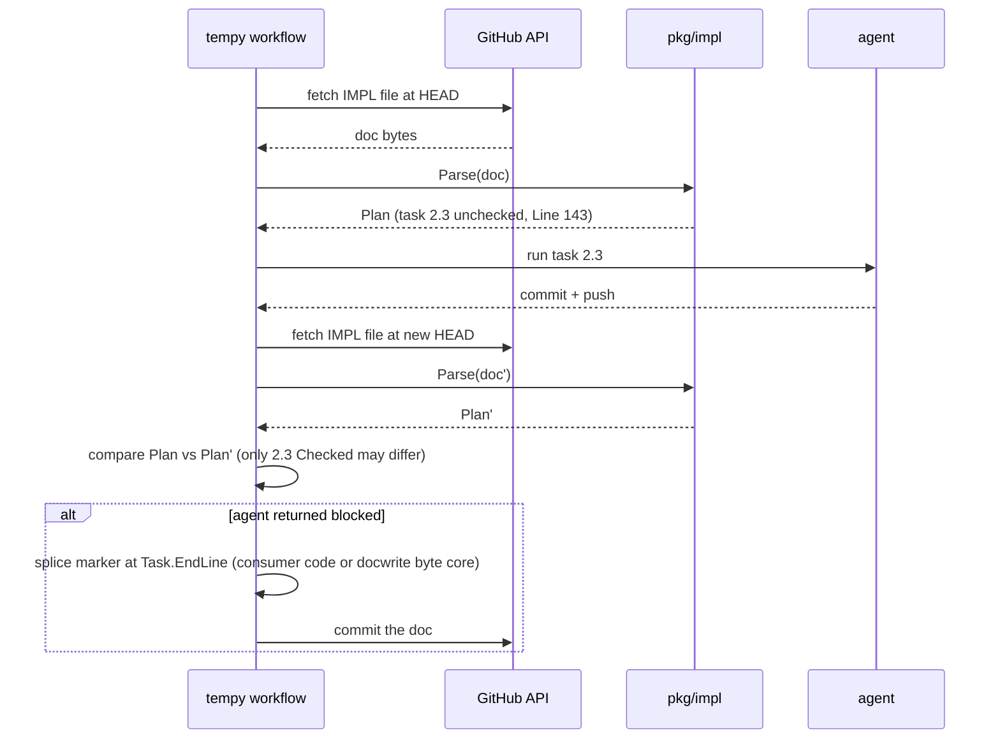
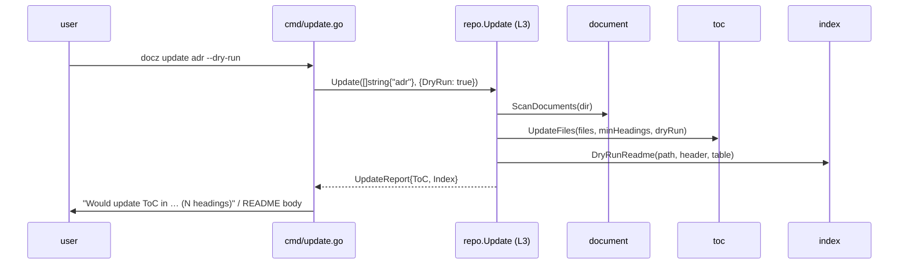
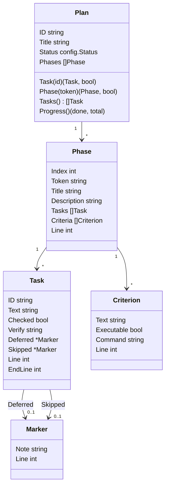
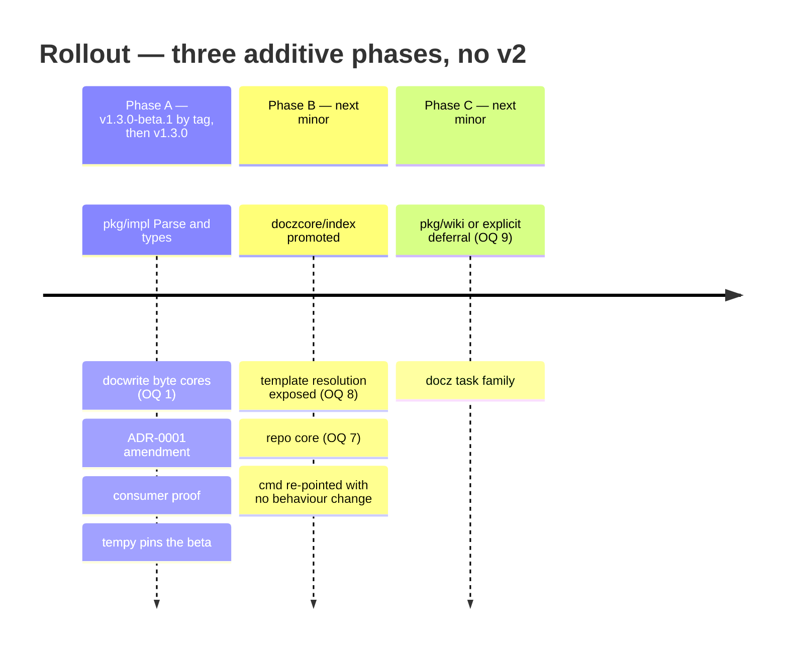
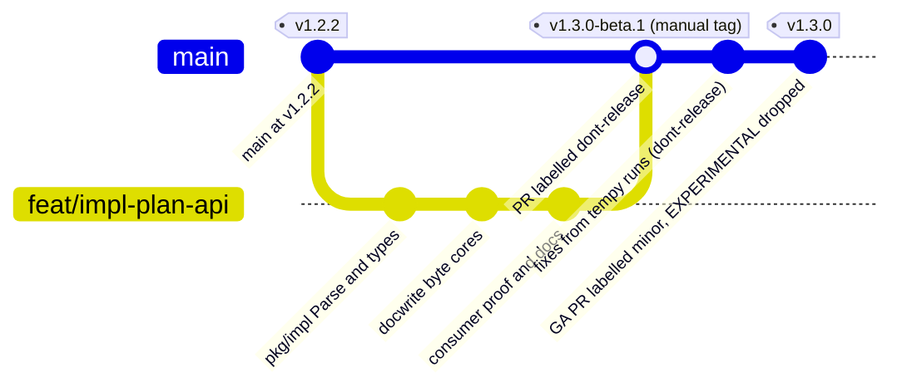

<!-- markdownlint-disable-file MD025 MD041 -->

# DESIGN-0013: Library-first docz: per-type document packages and a core API the CLI can sit on

<!--toc:start-->
- [Overview](#overview)
- [Goals and Non-Goals](#goals-and-non-goals)
  - [Goals](#goals)
  - [Non-Goals](#non-goals)
- [Background](#background)
- [Detailed Design](#detailed-design)
  - [1. Layers and rules](#1-layers-and-rules)
  - [2. The greenfield shape: an API package with the CLI as its first consumer](#2-the-greenfield-shape-an-api-package-with-the-cli-as-its-first-consumer)
  - [3. Inventory: what the CLI does today and where each piece lands](#3-inventory-what-the-cli-does-today-and-where-each-piece-lands)
  - [4. Target dependency graph](#4-target-dependency-graph)
  - [5. pkg/impl — the first type package](#5-pkgimpl--the-first-type-package)
    - [5.1 Surface](#51-surface)
    - [5.2 Grammar](#52-grammar)
    - [5.3 How it composes with the facts layer](#53-how-it-composes-with-the-facts-layer)
    - [5.4 What a consumer does with it (tempy, no checkout)](#54-what-a-consumer-does-with-it-tempy-no-checkout)
  - [6. Mutation primitives (L1) — byte cores](#6-mutation-primitives-l1--byte-cores)
  - [7. Repository-operations core (L3) — the thin-shell target](#7-repository-operations-core-l3--the-thin-shell-target)
  - [8. How types plug in without a type system](#8-how-types-plug-in-without-a-type-system)
- [API / Interface Changes](#api--interface-changes)
  - [First release (Phase A, beta)](#first-release-phase-a-beta)
  - [Later releases (shaped, not yet specified)](#later-releases-shaped-not-yet-specified)
- [Data Model](#data-model)
- [Testing Strategy](#testing-strategy)
- [Migration / Rollout Plan](#migration--rollout-plan)
- [Open Questions](#open-questions)
  - [1. What does pkg/impl ship in its first release?](#1-what-does-pkgimpl-ship-in-its-first-release)
  - [2. Identifier names and optional-marker representation](#2-identifier-names-and-optional-marker-representation)
  - [3. Phase and task grammar](#3-phase-and-task-grammar)
  - [4. Continuation folding and verify:](#4-continuation-folding-and-verify)
  - [5. Marker parsing on the read side](#5-marker-parsing-on-the-read-side)
  - [6. Criteria classification](#6-criteria-classification)
  - [7. Where the repository-operations core lives (Phase B)](#7-where-the-repository-operations-core-lives-phase-b)
  - [8. Exposing template resolution without the embed (Phase B)](#8-exposing-template-resolution-without-the-embed-phase-b)
  - [9. Wiki (Phase C)](#9-wiki-phase-c)
  - [10. Generic facts for the next type package](#10-generic-facts-for-the-next-type-package)
  - [11. Beta mechanics](#11-beta-mechanics)
  - [12. Release sequencing and the ADR record](#12-release-sequencing-and-the-adr-record)
- [References](#references)
<!--toc:end-->

## Overview

docz does five kinds of work over a docs tree — extract facts from a document,
mutate a document in place, interpret a document as a typed thing, operate on
the repository as a whole (scan, create, index, ToC, wiki, init), and present
results — but only the first two are reachable as a library today. The rest
lives in `cmd/` and `internal/`, so any consumer that wants to do what the CLI
does has to re-implement it. Issue #100 is the first such consumer with a
concrete ask: read an IMPL doc into a typed plan without the CLI or a
checkout.

This design takes the first-principles route the ask implies: it asks what
docz would look like if it were built again today as an API package whose
first consumer is the CLI. It defines that layered library, fixes the
dependency rules between layers, inventories every operation the CLI performs
today with its target home, and fully specifies the first slice —
`pkg/impl`, a standalone per-type package that parses an IMPL document into a
`Plan`. Later slices (the repository-operations core, wiki) are shaped and
sized here and specified in their own IMPLs.

## Goals and Non-Goals

### Goals

- **One library, many shells.** Every operation `docz` performs is reachable
  as a Go API with typed results; the CLI is one caller among tempy,
  sdk-booty-sh, and docz-api.
- **`pkg/doczcore` stays type-agnostic.** Per-type interpretation lives in a
  sibling package per type, starting with `pkg/impl`; nothing in `doczcore`
  knows what a phase is.
- **Bytes in, values out wherever no filesystem is required**, so a consumer
  with no checkout (docz-api, tempy over the GitHub API) is first-class; path
  variants wrap the byte core, never the reverse.
- **`pkg/impl` ships first**, small and concrete, as a beta tempy can pin.
- **A written rule for the next type.** Adding a typed model for PLAN or RFC
  later is a package that follows this design, not a new design.

### Non-Goals

- Rewriting `cmd/` now. The first release changes no CLI behaviour, output,
  or exit code.
- A runtime type system (go-cty style, schema-driven types). Go consumers
  want concrete structs; the IMPL grammar is fixed by docz's own template.
- Typed models for the other five built-in types or for custom types until a
  consumer asks. They keep the generic facts API, which already works on
  every type.
- Owning consumer workflow policy: iteration budgets, gates, retries, and
  the deferred/skipped lifecycle belong to the harness (tempy), not to docz.
- Promoting the embedded template *contents* into the compatibility contract.

## Background

**Where the public surface stands.** ADR-0001 (2026-07-03) froze
`pkg/doczcore/{config,document,docparse,docwrite,toc}` at v1.0.0 under two
rules that still hold: whole-package promotion where an external consumer has
demand, and *facts versus interpretation* — `docparse` reports headings and
checkbox items with byte-accurate lines and nothing more. IMPL-0014
Decision 3(d) applied that rule by dropping `ParsePlan`: "docz picking a
workflow semantic it has no use for itself." `template`, `index`, and `wiki`
stayed `internal/` for zero demand and CLI-shaped result types.

**What INV-0010 found.** Two consumers now carry the same plan model:
sdk-booty-sh's `doczwork` (260 lines over `docparse`, pinned to v1.0.0) and
tempy (DESIGN-0001, whose IMPL-0001 is blocked on docz#100). The corpus adds
constraints the issue did not state: most recent tasks wrap onto continuation
lines, which `docparse.TaskItems` does not fold; the only hand-written
`verify:` and deferred markers in the fleet do not match the proposed
spelling; the backtick criteria rule classifies about a tenth of legacy
criteria as executable; and no `cmd/` code calls `CheckTask`, so the CLI has
no task surface for the issue's acceptance bullet to compare against.

**Direction set in review (2026-09-13).** The per-type package is
`pkg/impl/`, standalone, not under `doczcore` — so `doczcore` stays the
generic core and a future generic interface, if ever needed, can live there
with each type package implementing it. `pkg/impl` should be simple: types and
methods that parse an IMPL doc and return something easier to use. docz
should not carry code a consumer needs beyond that, and the whole thing
should be designed as the API the CLI could eventually use for everything it
does, so it is built once.

**Today's dependency graph**, for contrast with the target below:



Everything a consumer would call to "do what `docz update` does" —
`updateType` in `cmd/update.go` — is orchestration living in the shell.

## Detailed Design

### 1. Layers and rules



A layer may call any layer beneath it. L3 and L2 sit side by side because a
repository operation may parse a typed document (a future `docz task`
resolves an IMPL by ID, then parses it), while a type package never needs
the repository.

| Rule | Statement | Why |
| ---- | --------- | --- |
| R1 | A layer imports only layers below it. | The shell stays thin; the library never depends on presentation. |
| R2 | `pkg/doczcore/*` is type-agnostic. `pkg/<type>` imports `doczcore`; `doczcore` never imports a type package. | The core has no opinion about what a phase is; a type package is additive. |
| R3 | Any operation that needs no filesystem takes `[]byte` and returns values. Path-based variants exist only where a caller needs in-place mutation, and they call the byte core. | docz-api and tempy have no checkout (ADR-0001 Decision 5, now the default rather than the exception). |
| R4 | Results are typed structs and enums. English wording, exit codes, and formatting exist only in L4. | `index.UpdateOutcome`'s action enum is the model; the `Warning: … has no markers` sentence is `cmd`'s. |
| R5 | `internal/` holds only what has a documented reason to stay private. Today that is the template embed. | ADR-0001's named exception, unchanged. |
| R6 | No library-defined interfaces. Consumers define their own at the call site. | ADR-0001 Decision 5; an exported interface is the hardest surface to evolve. |
| R7 | A type package's grammar is a contract of the *type*, not of the template file. | A repo that overrides `impl.md` and renames `#### Tasks` has left the contract; the parser does not chase it. |

### 2. The greenfield shape: an API package with the CLI as its first consumer

If docz were written today, API first, the module would be laid out so that
every CLI command is one library call plus printing. This is the shape the
rest of the design converges on; the inventory in §3 measures the distance
from today's tree.

```text
github.com/donaldgifford/docz
├── pkg/doczcore/           type-agnostic core — the library product
│   ├── config              load · merge · validate · type registry · RenderDefault
│   ├── document            frontmatter · scan · changelog             (L0)
│   ├── docparse            headings · task items · title · (sections) (L0)
│   ├── docwrite            byte cores + path wrappers · create         (L1)
│   ├── toc                 ToC splice                                  (L1)
│   ├── index               README index tables                         (L1)
│   ├── doctemplate         resolve + render; embed.FS unexported       (L1)
│   └── repo                Scan · List · Find · Create · Update · SetStatus · Init (L3)
├── pkg/impl                IMPL type model: Parse → Plan               (L2)
├── pkg/wiki                MkDocs / TechDocs integration               (integration)
├── cmd/                    cobra shell: flags → one call → print       (L4)
└── internal/               empty, or only what R5 justifies
```

The test of the shape is that each command reduces to a single call:

| Command | Library call | What stays in `cmd/` |
| ------- | ------------ | -------------------- |
| `docz init` | `repo.Init(InitOptions{Force})` | printing each `InitReport` entry |
| `docz create <type> <title>` | `repo.Create(CreateOptions{Type, Title, Author, Status, Update: !noUpdate})` | author resolution via git (an L4 dependency), printing |
| `docz update [type]` | `repo.Update(types, UpdateOptions{DryRun})` | wording for each report entry |
| `docz list` | `repo.List(types)` | status filter, text/json/csv rendering |
| `docz status set <type> <id> <status>` | `repo.SetStatus(id, status)` | `--dry-run` short-circuit, exit codes, text/json |
| `docz template show/export/override` | `doctemplate.Resolve(...)` / `repo.ExportTemplate(...)` | printing |
| `docz config` | `config.Load(...)` | YAML printing |
| `docz wiki init/update` | `wiki.Init(...)` / `wiki.UpdateNav(...)` | printing |
| `docz task list/check/uncheck` (future) | `impl.Parse` + `docwrite.SetTaskStateBytes` via `repo.Find` | printing, exit codes |
| `docz version` | — | all |

Anything a command does that is not on that line is a gap. Today the gaps
are concentrated in `update`, `create`, `status set`, and `init`, whose
orchestration lives in `cmd/`, and in the missing type layer. Nothing in the
greenfield shape requires a rewrite: every package that exists keeps its
path and API, and the missing ones are additive. That is why the rollout is
three phases rather than a v2.

Consumers and what they call:



### 3. Inventory: what the CLI does today and where each piece lands

| Command | Operation | Today | Result CLI-shaped? | Target home | Change |
| ------- | --------- | ----- | ------------------ | ----------- | ------ |
| `init` | render `.docz.yaml` from `DefaultConfig()` | `cmd/init.go` + `template.EmbeddedDoczYAML` | no (string) | `config.RenderDefault() (string, error)` in L0 | move ~20 lines |
| `init` | scaffold `<type>/README.md` with header + markers | `cmd/init.go` + `template.ResolveIndexHeader` | no | L3 `Init` | promote index + header resolution |
| `create` | validate type, default status | `cmd/create.go` over `config` | no | L3 `Create` | orchestration move |
| `create` | resolve author (flag → config → git) | `cmd/create.go` + `Runner.Git` | partly (git is an L4 dependency) | stays L4; L3 takes the resolved author | none |
| `create` | next ID, render template, write file | `docwrite.Create` (public) | no | L1 as-is | none |
| `create` | post-create index + wiki refresh | `cmd/create.go` calling `updateType` | no | L3 `Update` | orchestration move |
| `update` | scan a type dir | `document.ScanDocuments` (public) | no | L0 as-is | none |
| `update` | regenerate ToC fences | `toc.UpdateFiles` (public) | no (typed report) | L1/L3 as-is | none |
| `update` | build index table, splice README | `internal/index` | enum + path + body: fine | `pkg/doczcore/index` | promote whole |
| `update` | resolve the index header (3 tiers) | `internal/template.ResolveIndexHeader` | no | see OQ 8 | expose resolution, keep embed private |
| `list` | scan every enabled type, filter | `cmd/list.go` over `ScanDocuments` | `listEntry` is L4 | L3 `List`, formatting stays L4 | small |
| `status set` | find doc by frontmatter ID | `cmd/status.go` `findByID` over a scan | no | L3 `Find(id)` | move |
| `status set` | validate status against the type | `cmd/status.go` over `config` | no | L3 | move |
| `status set` | rewrite `status:` preserving bytes | `docwrite.SetStatus(path)` | path-based | L1: export the byte core (`SetStatusBytes`), path wrapper stays | ~20 lines |
| `template show/export/override` | resolve a type's template, copy to `docs/templates/` | `internal/template.Resolve` + `cmd/template.go` | no | OQ 8 | expose resolution |
| `config` | load, merge, validate, print | `config.Load` (public) + YAML print in L4 | no | L0 as-is | none |
| `wiki init` | write `mkdocs.yml`, scaffold `docs/index.md` | `internal/wiki.CreateMkDocs` + `cmd/wiki.go` | no | OQ 9 | promote or defer |
| `wiki update` | scan tree, merge nav order, write nav | `internal/wiki.{BuildNav,NavToYAML,WriteMkDocs}` | `NavEntry` is fine | OQ 9 | promote or defer |
| `version` | print build info | `cmd/version.go` | yes | L4 only | none |
| — | **read an IMPL doc as a plan** | nowhere (consumers re-implement) | — | **`pkg/impl` (L2)** | **this design's first slice** |
| — | flip a checkbox from bytes | `docwrite.CheckTask(path, line)` | path-based, check-only | L1: export a byte core with both directions | ~40 lines |

Two things stand out. The read side and the mutation primitives are already
library; what is missing is a **repository-operations core** (L3) that owns
the orchestration `cmd/` does today, and a **type layer** (L2) that did not
exist because ADR-0001 deferred it. Both are additive.

### 4. Target dependency graph



`doczcore` never points at `pkg/impl`. A consumer that wants only the plan
model compiles `impl`, `document`, `docparse`, `config`, and `yaml.v3` —
nothing from `internal/`, no template embed.

### 5. `pkg/impl` — the first type package

#### 5.1 Surface

```go
package impl // import "github.com/donaldgifford/docz/pkg/impl"

// Parse interprets an IMPL document. It never touches the filesystem.
func Parse(doc []byte) (Plan, error)

type Plan struct {
    ID     string        // frontmatter id, e.g. "IMPL-0017"
    Title  string        // frontmatter title
    Status config.Status // frontmatter status, typed like document.Frontmatter
    Phases []Phase
}

type Phase struct {
    Index       int         // 1-based ordinal among phases, doc order
    Token       string      // heading token: "1", "A", "2B" — equals Index for template docs
    Title       string      // text after "Phase <token>:", inline markdown stripped
    Description string      // prose between the heading and "#### Tasks", trimmed
    Tasks       []Task
    Criteria    []Criterion // nil when the phase has no "#### Success Criteria"
    Line        int         // heading line, 1-based
}

type Task struct {
    ID       string  // "<phase token>.<index>", e.g. "2.3"; index is 1-based, doc order
    Text     string  // folded across continuation lines; verify and markers removed
    Checked  bool
    Verify   string  // command from the task's verify: line, "" when absent
    Deferred *Marker // nil unless a deferred marker is present
    Skipped  *Marker // nil unless the task is struck through with a skipped note
    Line     int     // the checkbox line, byte-accurate — the splice target
    EndLine  int     // last continuation line of the task (== Line for one-liners)
}

type Marker struct {
    Note string // reason / note text, "" when the marker carries none
    Line int    // line the marker sits on
}

type Criterion struct {
    Text       string
    Executable bool   // true when the bullet starts with a backtick span
    Command    string // the span's contents when Executable
    Line       int
}

// Lookup helpers — methods on the value, no hidden state.
func (p Plan) Task(id string) (Task, bool)
func (p Plan) Phase(token string) (Phase, bool)
func (p Plan) Tasks() []Task            // every task across phases, doc order
func (p Plan) Progress() (done, total int) // checked over non-skipped

var ErrNoPhases = errors.New("impl: no phases found")
type DuplicatePhaseError struct{ Token string; Lines []int }
```

Every `Line` is byte-accurate against the input (the `docparse` contract), so
a consumer that wants to mutate the document can splice at `Task.Line`
with `docwrite`'s byte cores or its own code and stay byte-minimal. That is
what makes a parse-only first release enough for tempy (OQ 1).

#### 5.2 Grammar

| Element | Rule | Source of the rule |
| ------- | ---- | ------------------ |
| Frontmatter | `document.ParseFrontmatter`; `ErrNoFrontmatter` is fatal for an IMPL | facts layer |
| Phase | A level-3 heading whose stripped text matches `^Phase\s+([^\s/:]+):\s*(.+)$`. Span ends at the next heading of level ≤ 3 or EOF. Headings that do not match (`### Phase 1` under File Changes, `### In Scope`) are not phases. | INV-0010 Obs 3 (colon discriminates; IMPL-0001/0002) |
| Phase token / ID | Token = capture 1. Duplicate tokens → `DuplicatePhaseError`. `Index` is the 1-based ordinal. | `doczwork`; corpus is all numeric-contiguous |
| Description | Lines strictly between the heading and the first level-4 heading in the span, trimmed; HTML comments removed | template puts guidance in comments |
| Tasks span | The `#### Tasks` sub-span when present, else the whole phase span; ends at the next level-4-or-shallower heading | `doczwork` `subSpan` |
| Task | A `docparse.TaskItem` with `Indent == 0` inside the tasks span. Nested items are never tasks. | INV-0010 Obs 3 (0 nested in corpus, messy fixture has one) |
| Continuation | Following lines that are non-blank, indented deeper than the bullet, and not a list item themselves belong to the task; `EndLine` is the last such line | 48 of 56 tasks wrap in IMPL-0017 |
| Text | Continuation lines joined with single spaces after trimming; the `verify:` line and any marker text removed; other inline markdown kept verbatim (matches `TaskItem.Text`) | consumers match on Text |
| `verify:` | A continuation line whose trimmed text starts with `verify:` case-insensitively; `Verify` = contents of the first backtick span on that line; the rest of the line is ignored | docz-api IMPL-0004 (`Verify: \`cmd\` prints nothing`) |
| Deferred | The token `deferred` followed by `-`, `–`, or `—`, on the task line or a continuation line, optionally inside `**…**`; `Note` = text after the dash (and after an optional `human required:`), folded to the task's end | docz-api IMPL-0006 prefix form; issue #100 suffix form |
| Skipped | Task text wrapped in `~~…~~` followed by `skipped:` after any dash; `Note` = text after the colon | issue #100 (no legacy) |
| Criteria | Top-level dash bullets under `#### Success Criteria`, wrapped lines folded (as `doczwork`'s `extractBullets`), an optional leading `[ ]`/`[x]` tolerated; `Executable` iff the bullet text starts with a backtick span | issue #100; tempy OQ-6; INV-0010 Obs 5 caveat |
| Outside phases | Checkboxes under `## Testing Plan` or any level-2 section are not tasks; the ToC block's link list contains no checkboxes | template |
| Fences | Inherited from `docparse`: nothing inside a ``` fence is a heading or task | facts layer |
| Line endings | LF only; CR anywhere → error, matching `docwrite` | DESIGN-0005 Decision 7 |

Skipped tasks remain checkbox items, so positional IDs do not shift when a
task is skipped. Adding, removing, or reordering tasks does shift IDs; that
is the consumer's structural-change signal (tempy computes it from two
`Plan`s).

#### 5.3 How it composes with the facts layer



`impl` walks the raw lines only for what the facts layer does not report:
continuation folding, `verify:`, markers, description prose, and criteria
bullets. It does not re-derive headings or checkbox items.

#### 5.4 What a consumer does with it (tempy, no checkout)



Nothing in that sequence needs docz to know about deferral policy; it needs
`Line`/`EndLine` to be exact, which the facts layer guarantees.

### 6. Mutation primitives (L1) — byte cores

`docwrite` already has the byte-level logic; only the entry points are
path-shaped. Exporting the cores is additive and serves the CLI's own
`status set`, a future `docz task` command, and any no-checkout consumer:

```go
// SetStatusBytes rewrites status: in doc's frontmatter, preserving every
// other byte. Returns the new document and the old value.
func SetStatusBytes(doc []byte, status string) (out []byte, old string, err error)

// SetTaskStateBytes flips the checkbox on the given 1-based line in either
// direction. Validated with docparse.TaskItems like CheckTask.
func SetTaskStateBytes(doc []byte, line int, checked bool) ([]byte, error)
```

`SetStatus(path, …)` and `CheckTask(path, line)` become wrappers. Whether
these ship in the first `pkg/impl` release or wait for a caller is OQ 1.
IMPL-specific writers (deferred/skipped markers) are *not* proposed for docz:
they encode harness policy (R7's spirit and ADR-0001's "API docz never
calls" smell), and `Task.Line`/`EndLine` make them a few lines of consumer
code.

### 7. Repository-operations core (L3) — the thin-shell target

This is the slice that makes "the CLI could use the library for everything"
true. It is shaped here and specified in its own IMPL (Rollout, Phase B).

```go
package repo // pkg/doczcore/repo (name: OQ 7)

type Repo struct {
    Root string          // repo root; every path is joined under it
    Cfg  *config.Config  // loaded and validated by the caller
}

func (r *Repo) Scan(typeName string) ([]document.DocEntry, error)
func (r *Repo) List(types []string) ([]Entry, error)                  // Entry = DocEntry + type
func (r *Repo) Find(id string) (Entry, error)                          // frontmatter id, case-sensitive
func (r *Repo) Create(opts CreateOptions) (CreateResult, error)        // docwrite.Create + optional Update
func (r *Repo) Update(types []string, opts UpdateOptions) (UpdateReport, error) // ToC pass + index pass per type
func (r *Repo) SetStatus(id, status string) (StatusResult, error)     // Find + validate + SetStatus
func (r *Repo) Init(opts InitOptions) (InitReport, error)             // config + dirs + index READMEs
```

`UpdateReport` carries the existing `toc.UpdateReport` plus one
`index.UpdateOutcome` per type; `cmd/update.go`'s `updateType` becomes a call
plus printing. The before/after for `docz update`:



Today the three calls in the middle are made from `cmd`. Prerequisites for
Phase B, each additive: promote `internal/index` whole; expose template
*resolution* without the embed (OQ 8); keep `GitResolver` in L4 and pass the
resolved author into `CreateOptions`.

### 8. How types plug in without a type system

Every document, of any type including custom ones, already has the same
generic API: `document.ParseFrontmatter` → `Frontmatter`, `docparse.Headings`
/ `TaskItems` / `Title`, and `config` to map an ID prefix to a type. That is
the "pass-through" for types with no model. A type gains a model by adding
`pkg/<type>` with `Parse([]byte) (T, error)` and value-typed helpers,
following rules R2–R4 and R7. There is no registry, no interface, and no
dispatcher: a caller knows which type it asked for. If a future consumer
wants "parse whatever this is", `doczcore` can add a small dispatcher that
maps `Frontmatter.ID`'s prefix to a type name (the resolution `config`
already does) and the caller switches on it — still concrete types.

Two optional facts would make the next type package trivial and are
deferred until one exists (OQ 10): `docparse.Sections` (level-2 heading
spans with body bytes) for the prose-shaped types, and a `document.Kind`
helper for prefix → type.

## API / Interface Changes

### First release (Phase A, beta)

| Package | Change | Kind |
| ------- | ------ | ---- |
| `pkg/impl` (new) | `Parse`, `Plan`, `Phase`, `Task`, `Marker`, `Criterion`, `ErrNoPhases`, `DuplicatePhaseError`, `Plan.Task/Phase/Tasks/Progress` | additive, **EXPERIMENTAL** package doc until GA |
| `pkg/doczcore/docwrite` | `SetStatusBytes`, `SetTaskStateBytes` (OQ 1) | additive |
| `cmd/` | none | — |
| `.docz.yaml` | none | — |
| ADR-0001 | dated amendment: a second public tier, `pkg/<type>` per-type packages, under rules R1–R7; IMPL-0014 Decision 3 annotated | docs |
| `test/consumer` | imports `pkg/impl`, parses a fixture, asserts a task ID and line | proof |

### Later releases (shaped, not yet specified)

| Package | Change |
| ------- | ------ |
| `pkg/doczcore/index` | promoted whole from `internal/index` |
| `internal/template` | resolution exposed per OQ 8; embed stays private |
| `pkg/doczcore/repo` (OQ 7) | `Repo` with `Scan/List/Find/Create/Update/SetStatus/Init` |
| `cmd/` | `update`, `create`, `status set`, `list`, `init` re-pointed at `repo`; no behaviour change, pinned by the existing cmd tests |
| `pkg/wiki` (OQ 9) | promoted from `internal/wiki` or deferred |
| `cmd/task` | `docz task list`, `docz task check`, `docz task uncheck` (`<impl-id> [task-id]`) over `impl` + `docwrite` — the CLI's own consumer of the type layer |

## Data Model



Identity and stability:

| Key | Stable across | Shifts when |
| --- | ------------- | ----------- |
| `Phase.Token` | any edit that keeps the heading | the heading's token is edited |
| `Task.ID` | checkbox flips, marker edits, text edits, skips | a task is inserted, removed, or moved within the phase |
| `Task.Line` / `EndLine` | nothing above the task changes | any line count change earlier in the doc — re-parse before splicing |

No storage; `Plan` is a value computed from bytes and holds no reference to
the input (the `ParseChangelog` retention lesson: every string is copied).

## Testing Strategy

- **Golden fixtures from real docs**, snapshotted under `pkg/impl/testdata/`
  (never read from `docs/`): docz IMPL-0009 and IMPL-0017 (wrapping), IMPL-0001
  (non-phase `### Phase N` headings), IMPL-0007 (phases without criteria),
  docz-api IMPL-0004 (`Verify:` lines), docz-api IMPL-0006 (prefix deferred
  marker), `doczwork`'s clean and messy fixtures, a synthetic doc with a
  skipped task and one with a task inserted mid-run. Each with a `.golden.txt`
  fact file regenerated by `-update`.
- **Invariants** goldens cannot express: every `Task.Line` is a line
  `docparse.TaskItems` reports as a checkbox item; IDs are unique; no `Text`
  contains a `verify:` prefix or a marker; `EndLine >= Line`; a skipped task
  keeps the ID it had before skipping (parse the doc before and after a
  synthetic skip).
- **Fuzz** `Parse` for the never-panic contract, the `FuzzTitle` /
  `FuzzParseChangelog` pattern.
- **Byte cores**: `SetStatusBytes` and `SetTaskStateBytes` reuse the existing
  `docwrite` goldens through the path wrappers, plus a bytes-only table for
  the uncheck direction.
- **Consumer proof**: `test/consumer` imports `pkg/impl` from outside the
  module and reports a task ID and line for a fixture.
- **Phase B**: the existing `cmd/` tests pin CLI behaviour byte-for-byte
  while `update`/`create`/`status set` move onto `repo`.

## Migration / Rollout Plan



| Phase | Delivers | Release | Consumer signal |
| ----- | -------- | ------- | --------------- |
| **A** | `pkg/impl` parse; `docwrite` byte cores (OQ 1); ADR-0001 amendment; consumer proof; CLAUDE.md/README library section | `v1.3.0-beta.1` by tag (OQ 11), then `v1.3.0` GA via one `minor` PR once tempy has run real docs | tempy IMPL-0001 pins the beta; sdk-booty-sh issue to migrate `doczwork` onto `impl` |
| **B** | `pkg/doczcore/index` promotion, template resolution exposure, `repo` core, `cmd/` re-pointed with no behaviour change | `minor` | docz-api may adopt `index`/`repo` for its own indexing; no obligation |
| **C** | `pkg/wiki` (or explicit deferral), `docz task` CLI family | `minor` | — |
| — | IMPL-0017 (`updated:` field) retargets from v1.3.0 to the release after Phase A (OQ 12) | — | docz-api #36 unchanged |

Beta mechanics (from the review discussion): the Release workflow only fires
on pushes to `main` through `pr-semver-bump`, which has no pre-release mode.
A beta is `make release TAG=v1.3.0-beta.1` — an annotated tag pushed from
the merged commit, which is all a Go module consumer needs; a GitHub Release
with binaries needs either a tag-triggered workflow for `v*-*` tags or a
local `goreleaser release` with the CI signing key (OQ 11). Before tagging,
confirm with the action's `validate` mode that a pre-release tag does not
become the base for the next `minor` bump.



The Phase A PR merges under `dont-release` so the bump action stays quiet;
the beta is a manual tag on that merge commit; fixes land the same way; the
GA PR carries `minor` and the action cuts `v1.3.0` as usual.

Docs touched: ADR-0001 (amendment), IMPL-0014 (Decision 3 note), CLAUDE.md
(architecture bullet for `pkg/impl` and the layer rules), README (library
section), mkdocs.yml (`pymdownx.superfences` custom fence so the diagrams
render in the MkDocs wiki; docz-site and GitHub already render Mermaid v12).

## Open Questions

### 1. What does `pkg/impl` ship in its first release?

- a. **Parse and types only, plus the two `docwrite` byte cores.**
  `impl.Parse` with `Line`/`EndLine` on every task; `SetStatusBytes` and
  `SetTaskStateBytes` in `docwrite` because the CLI's own `status set` and a
  future `docz task` use them. Deferred/skipped *writers* and the plan diff
  stay consumer-side — they are harness policy, and with exact lines they
  are a few lines each. Smallest docz surface that fully unblocks tempy.
  *(recommendation)*
- b. Parse and types only; no `docwrite` change until a caller inside docz
  needs it.
- c. Everything in issue #100 inside `pkg/impl` (`SetTaskState`,
  `SetDeferred`, `SetSkipped`, `SetStatus`, `DiffPlans`) so every consumer
  spells the markers identically — at the cost of docz owning idempotency
  rules and diff matching it never uses.
- d. Other.

### 2. Identifier names and optional-marker representation

- a. **`impl.Parse` / `impl.Plan` / `impl.Task`**, no `Impl` prefix
  (`impl.ImplPlan` stutters); optional markers as `*Marker{Note, Line}` —
  nil when absent, and the line is needed to splice. *(recommendation)*
- b. The issue's names verbatim (`ParseImpl`, `ImplPlan`) with `*string`
  markers — matches tempy's design prose today; tempy has no code yet.
- c. Other.

### 3. Phase and task grammar

- a. **Colon-discriminated phases anywhere** (`^Phase\s+([^\s/:]+):`),
  tasks scoped to `#### Tasks` when present, top-level only, duplicate
  token is an error — §5.2 as written. *(recommendation)*
- b. Every level-3 heading is a phase with ordinal fallback (`doczwork`
  today) — `In Scope` becomes phase 1 in template docs.
- c. Phases only under `## Implementation Phases`.
- d. Other.

### 4. Continuation folding and `verify:`

- a. **Fold continuations into `Text`; `verify:` case-insensitive, first
  backtick span, trailing prose ignored** — the four hand-written
  docz-api lines parse. *(recommendation)*
- b. Strict lowercase `verify:` whose remainder is exactly one backtick
  span.
- c. First-line-only `Text` (facts literal) — truncates most recent tasks.
- d. Other.

### 5. Marker parsing on the read side

- a. **Lenient**: `deferred` after any dash, prefix or suffix, emphasis
  tolerated; `~~…~~` + `skipped:` after any dash. Canonical spellings are
  documented for writers (consumers), not enforced by the parser.
  *(recommendation)*
- b. Canonical suffix forms only; docz-api IMPL-0006 is hand-fixed.
- c. Other.

### 6. Criteria classification

- a. **As issue #100 states**: executable iff the bullet starts with a
  backtick span; the caveat that symbol-subject criteria (about a tenth in
  this repo) classify as executable is documented, and docz never runs
  anything. *(recommendation)*
- b. Executable only when the whole bullet is a backtick span.
- c. Token heuristics on the span (`/`, `.`, uppercase, `--` disqualify).
- d. Other.

### 7. Where the repository-operations core lives (Phase B)

- a. **`pkg/doczcore/repo`** — it is type-agnostic orchestration over the
  core, so it belongs in the core; `Repo{Root, Cfg}` value with methods,
  typed reports. *(recommendation)*
- b. `pkg/docz` — a top-level façade package outside `doczcore`, mirroring
  the CLI one-to-one.
- c. Stay in `cmd/` until an external consumer asks; Phase B is deferred
  indefinitely.
- d. Other.

### 8. Exposing template resolution without the embed (Phase B)

- a. **Promote `internal/template` as `pkg/doczcore/doctemplate` with the
  `embed.FS` unexported**: `Resolve`, `ResolveIndexHeader`,
  `ResolveWikiIndex`, `Render`, `FilenameSlug` become public; template
  *contents* remain outside the contract (they are already observable via
  `docz template show`). *(recommendation)*
- b. Keep `template` internal; move `ResolveIndexHeader` into `index`
  (taking the embedded header as an argument) and let `repo` reach the embed
  through `docwrite.Create`'s existing internal import.
- c. Other.

### 9. Wiki (Phase C)

- a. **Promote as `pkg/wiki`**, a sibling like `pkg/impl` — it is an
  integration (MkDocs/TechDocs), not core and not a doc type. *(recommendation)*
- b. Keep `internal/wiki`; `docz wiki` stays the one command with no library
  equivalent, documented as such.
- c. Other.

### 10. Generic facts for the next type package

- a. **Defer** `docparse.Sections` and `document.Kind` until a second type
  package exists; note the shapes in this design so they are not redesigned.
  *(recommendation)*
- b. Add `docparse.Sections` in Phase A — small, but a frozen API with no
  caller.
- c. Other.

### 11. Beta mechanics

- a. **Tag only** — `make release TAG=v1.3.0-beta.1` on the merged commit;
  no binaries; `pkg/impl` doc comment says EXPERIMENTAL; GA flips it.
  *(recommendation)*
- b. Tag-triggered `release-prerelease.yml` for `v*-*` tags running the
  existing goreleaser step with CI secrets.
- c. Local `goreleaser release` with the CI signing key.
- d. Other.

### 12. Release sequencing and the ADR record

- a. **Phase A takes v1.3.0; IMPL-0017 retargets to v1.4.0; ADR-0001 gets
  a dated amendment** (the DESIGN-0007 pattern) rather than a new ADR.
  *(recommendation)*
- b. Same sequencing, new ADR-0002 superseding ADR-0001 Decision 2.
- c. Ship Phase A and IMPL-0017 together in v1.3.0.
- d. Other.

## References

- [INV-0010](../investigation/0010-impl-plan-parse-and-write-back-api-for-doczcore-issue-100.md)
  — corpus findings, existing primitives, `doczwork` reference model
- [Issue #100](https://github.com/donaldgifford/docz/issues/100)
- [ADR-0001](../adr/0001-pkgdoczcore-as-the-single-public-core-cmd-as-a-thin-cli-shell.md)
  — Decisions 1, 2, 5, 7; the facts-versus-interpretation rule
- [IMPL-0014](../impl/0014-v100-the-five-package-pkgdoczcore-public-core.md)
  Decision 3 — `ParsePlan` dropped
- [DESIGN-0007](../design/0007-docz-changes-to-support-docz-api-and-docz-site.md) —
  the promotion and dated-amendment pattern
- [DESIGN-0005](../design/0005-status-set-cli-primitive.md) — byte-preservation
  contract; [IMPL-0011](../impl/0011-status-set-cli-primitive.md) — `status set`
- [DESIGN-0012](../design/0012-updated-frontmatter-field-opt-in-stamp-pass-in-docz-update.md)
  / [IMPL-0017](../impl/0017-v130-updated-frontmatter-field-and-the-docz-update-stamp-pass.md)
  — the release this design displaces
- tempy `docs/design/0001-temporal-orchestrated-impl-loop-execution.md`,
  `docs/impl/0001-temporal-orchestrated-impl-loop-worker-mvp.md`
- sdk-booty-sh `pkg/loop/doczwork`
- `cmd/{update,create,init,status,wiki,template,list}.go`,
  `internal/{index,template,wiki}`, `pkg/doczcore/*`
