<!-- markdownlint-disable-file MD025 MD041 -->

# DESIGN-0014: The docz API as one unit: packages, types, functions, and the cmd swap

<!--toc:start-->
- [Overview](#overview)
- [Goals and Non-Goals](#goals-and-non-goals)
  - [Goals](#goals)
  - [Non-Goals](#non-goals)
- [Background](#background)
- [Detailed Design](#detailed-design)
  - [1. Module layout and dependency graph](#1-module-layout-and-dependency-graph)
  - [2. Package specifications](#2-package-specifications)
    - [2.1 config (L0, unchanged)](#21-config-l0-unchanged)
    - [2.2 document (L0, unchanged)](#22-document-l0-unchanged)
    - [2.3 docparse (L0, unchanged)](#23-docparse-l0-unchanged)
    - [2.4 docwrite (L1, additive)](#24-docwrite-l1-additive)
    - [2.5 toc (L1, unchanged)](#25-toc-l1-unchanged)
    - [2.6 index (L1, promoted)](#26-index-l1-promoted)
    - [2.7 doctemplate (L1, promoted)](#27-doctemplate-l1-promoted)
    - [2.8 repo (L3, new)](#28-repo-l3-new)
    - [2.9 impl (L2, new)](#29-impl-l2-new)
    - [2.10 wiki (integration, promoted)](#210-wiki-integration-promoted)
  - [3. The IMPL grammar](#3-the-impl-grammar)
  - [4. The cmd swap](#4-the-cmd-swap)
  - [5. Consumer map](#5-consumer-map)
  - [6. Enforcing the layer rules](#6-enforcing-the-layer-rules)
- [API / Interface Changes](#api--interface-changes)
- [Data Model](#data-model)
- [Testing Strategy](#testing-strategy)
- [Migration / Rollout Plan](#migration--rollout-plan)
- [Open Questions](#open-questions)
  - [1. Phase and task grammar](#1-phase-and-task-grammar)
  - [2. Continuation folding and verify lines](#2-continuation-folding-and-verify-lines)
  - [3. Marker parsing on the read side](#3-marker-parsing-on-the-read-side)
  - [4. Criteria classification](#4-criteria-classification)
  - [5. Creation without I/O](#5-creation-without-io)
  - [6. Resolving a document by ID](#6-resolving-a-document-by-id)
  - [7. Where the status no-op short-circuit lives](#7-where-the-status-no-op-short-circuit-lives)
  - [8. How much of wiki is orchestration](#8-how-much-of-wiki-is-orchestration)
  - [9. Error shapes in repo](#9-error-shapes-in-repo)
  - [10. Generic facts for the next type package](#10-generic-facts-for-the-next-type-package)
  - [11. Delivery granularity](#11-delivery-granularity)
- [References](#references)
<!--toc:end-->

## Overview

ADR-0002 decides that docz is an API package whose first consumer is the
CLI, built as one unit and then swapped under `cmd/`. This design is that
unit: every package, type, function, and error the library exposes; the
IMPL grammar `pkg/impl` implements; the repository operations, wiki
integration, and config rendering that today live only in `cmd/`; the map
of which consumer calls what; and the `cmd/` swap that is the final step and
the acceptance test. DESIGN-0013's inventory and `pkg/impl` specification
carry over here; DESIGN-0013 itself is Abandoned.

## Goals and Non-Goals

### Goals

- **Specify the complete API once.** After this design, building the
  library is an IMPL with phases, not further design.
- **Every CLI command is one library call plus printing.** The swap PR's
  `cmd/` diff proves the API is complete.
- **Byte cores under every path helper** (ADR-0002 R3), so no-checkout
  consumers (tempy, docz-api) are first-class for mutation as well as
  reading.
- **`pkg/impl` fully specified** — surface, grammar, identity rules — with
  `Doc` as the root type, so tempy can pin it before anything else lands.
- **Typed results everywhere; wording nowhere but `cmd/`** (R4).
- **No CLI behaviour change** from the swap (ADR-0001 Decision 7).

### Non-Goals

- Typed models for RFC, ADR, DESIGN, or INV. The pattern is fixed (§2.9,
  §3); each waits for a consumer.
- A runtime type system or a library-defined interface over type packages
  (R6).
- Consumer policy in docz: deferred/skipped writers, plan diffs, iteration
  budgets, gates. `Task.Line` and `Task.EndLine` are the hook; the writers
  are the consumer's (ADR-0002 Decision 5).
- New CLI features beyond an optional read-only `docz task list` (ADR-0002
  Open Question 4).
- Changing `.docz.yaml`, the embedded template contents, or the
  `NNNN-slug.md` filename convention.
- The `updated:` field (DESIGN-0012 / IMPL-0017), which retargets to the
  release after the swap.

## Background

ADR-0002's decisions this design implements:

| ADR-0002 | Decision | Where it lands here |
| -------- | -------- | ------------------- |
| 1 | API package; CLI is the first consumer; one call per command | §4 swap table |
| 2 | Layers L0–L4, rules R1–R7 | §1 graph, §6 |
| 3 | One module | §1 |
| 4 | Standalone `pkg/<type>` with `Doc` root | §2.9, §3 |
| 5 | Primitives in docz, policy in consumers | §2.4 byte cores, §5 consumer map |
| 6 | Build the whole API, swap `cmd/` last | Rollout |
| 7 | ADR-0001 freeze lifted for new packages until the swap | API changes table |

Carried over from DESIGN-0013 without change in substance: the inventory of
what the CLI does and where each piece lands (§3 there, folded into §2 and
§4 here), the `pkg/impl` surface and grammar (§5 there, §2.9 and §3 here
with `Plan` renamed `Doc`), and the byte cores (§6 there, §2.4 here).
Resolved in the DESIGN-0013 review and taken as settled: `impl.Doc` (its
OQ 2), `pkg/doczcore/repo` as the home of repository operations (OQ 7),
`doctemplate` promoted with the embed unexported (OQ 8), `pkg/wiki`
promoted (OQ 9), no depguard for now (OQ 13), one module (OQ 15).

Today's dependency graph is in DESIGN-0013 Background. The distance from it
to §1 below is: three packages move out of `internal/`, two packages are
new, one package grows four functions, and `cmd/` shrinks.

## Detailed Design

### 1. Module layout and dependency graph

```text
github.com/donaldgifford/docz
├── pkg/doczcore/
│   ├── config        L0  load · merge · validate · type registry              unchanged
│   ├── document      L0  frontmatter · scan · changelog                      unchanged
│   ├── docparse      L0  headings · task items · title                       unchanged
│   ├── docwrite      L1  byte cores + path wrappers · render · create        +4 funcs
│   ├── toc           L1  ToC splice                                          unchanged
│   ├── index         L1  README index table + marker splice                  promoted
│   ├── doctemplate   L1  resolve + render · embed unexported · default yaml  promoted
│   └── repo          L3  Scan · List · Find · Create · Update · SetStatus · Init · templates   new
├── pkg/impl          L2  Parse([]byte) → Doc                                 new
├── pkg/wiki          --  MkDocs / TechDocs: nav, mkdocs.yml, Init, UpdateNav promoted
├── cmd/              L4  cobra shell: flags → one call → print               swapped
├── internal/         --  empty
└── test/consumer/    --  external-module proof over every pkg/ package
```

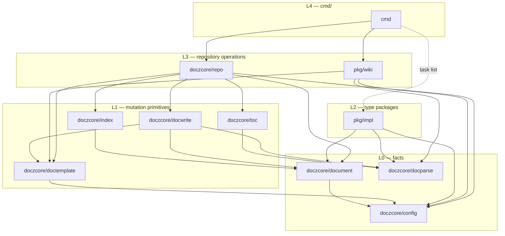

Every edge points downward or sideways within a layer; `doczcore` has no
edge into `pkg/impl` (R2); nothing points at `internal/` because nothing is
there (R5).

### 2. Package specifications

Each subsection lists the complete exported surface after the swap.
"Unchanged" packages are listed for completeness so the API is readable in
one place; their signatures are today's.

#### 2.1 config (L0, unchanged)

```go
package config // import "github.com/donaldgifford/docz/pkg/doczcore/config"

const ConfigFileName, IndexFileName, WikiIndexName, MkDocsFileName,
      TemplatesDir, DefaultChangelogFile, APILandingFileName string
const FileMode, DirMode os.FileMode

var ErrUnknownType, ErrInvalidChangelogFile, ErrInvalidAPIPath error

type Config struct { DocsDir; Types map[string]TypeConfig; Index; Author; Wiki; TOC; Changelog; API }
type TypeConfig struct { Enabled; Dir; Template; IDPrefix; IDWidth; Statuses; StatusField; PluralLabel; Aliases }
type IndexConfig, AuthorConfig, WikiConfig, TOCConfig, ChangelogConfig, APIConfig struct
type DocType, Status string
type DocTypeDef struct { Name; Aliases; DefaultConfig func() TypeConfig; NavTitle; PluralLabel; TemplateName; HelpDescription }

func DefaultConfig() Config
func Load(configFile, repoRoot string) (Config, error)
func (c *Config) Validate() error
func (c *Config) ValidateType(name string) (canonical string, err error)
func (c *Config) EnabledTypes() []string
func (c *Config) TypeDir(typeName string) string
func DocTypeNames() []string
func AllDocTypes() []DocTypeDef
func LookupDocType(name string) (DocTypeDef, bool)
func ResolveTypeAlias(name string) string
func DefaultNavTitles() map[string]string
func TypesHelp() string
```

`ValidateType` already resolves a name, an alias, or an `id_prefix` to the
canonical type, which is what `repo.Find` needs to map `IMPL-0017` to
`impl`. After ADR-0003 the registry has five entries; nothing here changes
shape. Rendering the default `.docz.yaml` is *not* added here — it needs
the template embed, which is `doctemplate`'s (§2.7).

#### 2.2 document (L0, unchanged)

```go
package document // import "github.com/donaldgifford/docz/pkg/doczcore/document"

var DoczFilePattern *regexp.Regexp
var ErrNoFrontmatter, ErrNoVersions error

type Frontmatter struct { ID, Title string; Status config.Status; Author, Created string }
type DocEntry struct { Frontmatter; Filename string; Content []byte }
type Changelog, ChangelogVersion, ChangelogGroup struct

func IsDoczFile(name string) bool
func ParseFrontmatter(content []byte) (Frontmatter, error)
func LoadFrontmatter(path string) (Frontmatter, []byte, error)
func ScanDocuments(dir string) ([]DocEntry, error)
func ParseChangelog(content []byte) (*Changelog, error)
```

`DocEntry.Content` stays populated by `ScanDocuments`; `repo.Update` feeds
it to `toc.UpdateFiles` and `repo.Find` returns it, so no operation reads a
document twice.

#### 2.3 docparse (L0, unchanged)

```go
package docparse // import "github.com/donaldgifford/docz/pkg/doczcore/docparse"

type Heading struct { Level int; Text, Anchor string; Line int }
type TaskItem struct { Text string; Checked bool; Indent, Line int }

func Headings(content []byte) []Heading
func TaskItems(content []byte) []TaskItem
func Title(content []byte) string
func AnchorSlug(text string) string
```

`pkg/impl` builds on `Headings` and `TaskItems` and re-walks raw lines only
for what they do not report (§3). `Sections` and a `document.Kind` helper
are deferred until a second type package exists (Open Question 10). The
slug and comment-heading defects in #96 are bug fixes inside the frozen
contract and are not part of this design.

#### 2.4 docwrite (L1, additive)

```go
package docwrite // import "github.com/donaldgifford/docz/pkg/doczcore/docwrite"

// Existing, unchanged.
var ErrUnsupportedLineEndings, ErrStatusFieldMissing error
var ErrLineOutOfRange, ErrNotTaskItem, ErrTaskAlreadyChecked error
type CreateOptions struct { Type config.DocType; Title, Author, Status, Prefix string; IDWidth int; DocsDir, TypeDir, TemplatePath string; CreatedAt time.Time }
type CreateResult struct { FilePath, Number, Filename string }
func Create(opts *CreateOptions) (CreateResult, error)
func SetStatus(path, newStatus string) (oldStatus string, err error)
func CheckTask(path string, line int) error

// New: byte cores (R3). The path helpers above become wrappers over these.
func SetStatusBytes(doc []byte, status string) (out []byte, old string, err error)
func SetTaskStateBytes(doc []byte, line int, checked bool) ([]byte, error)
var ErrTaskAlreadyUnchecked error // SetTaskStateBytes(…, false) on an unchecked item

// New: path wrapper in both directions, for a future docz task check/uncheck.
func SetTaskState(path string, line int, checked bool) error

// New: creation without I/O (ADR-0001 Decision 5's promised name+content form).
type Rendered struct { Filename string; Content []byte }
func NextNumber(dir string, width int) (string, error)          // "0001" for a missing or empty dir
func Render(opts *CreateOptions, number string) (Rendered, error) // resolve template, build Data, render
// Create == NextNumber + Render + write, behaviour unchanged.
```

Contracts that carry over from the path helpers to the byte cores:
`SetStatusBytes` rewrites only the value bytes and preserves key order,
quoting shape, spacing, and trailing comments (DESIGN-0005); it returns
`ErrUnsupportedLineEndings` on any CR, `ErrStatusFieldMissing` for an
absent or block/flow-scalar status key, and `document.ErrNoFrontmatter`
without a frontmatter block. `SetTaskStateBytes` validates the target line
by running `docparse.TaskItems` over it (one task-item definition
module-wide) and splices a single byte. `Render` resolves the template with
`doctemplate.Resolve` and never writes; `Create` keeps its exact current
behaviour, including the auto-increment scan (Open Question 5).

#### 2.5 toc (L1, unchanged)

```go
package toc // import "github.com/donaldgifford/docz/pkg/doczcore/toc"

const BeginMarker, EndMarker string
type FileInput struct { Path string; Content []byte }
type FileResult struct { Path string; Headings int }
type FileError struct { Path string; Err error }
type UpdateResult struct { Updated string; Headings []docparse.Heading; Found bool }
type UpdateReport struct { Updated, Unchanged, WouldUpdate []FileResult; Skipped []string; WriteErrors []FileError }

func GenerateToC(headings []docparse.Heading, minHeadings int) string
func UpdateToC(content string, minHeadings int) UpdateResult
func UpdateFiles(files []FileInput, minHeadings int, dryRun bool) (UpdateReport, error)
```

`repo.Update` calls `UpdateFiles` exactly as `cmd/update.go` does today and
embeds the report. The near-miss marker warning (#95) is a `Skipped`
consumer in `cmd/`, not a change here.

#### 2.6 index (L1, promoted)

Promoted whole from `internal/index` as `pkg/doczcore/index`, plus a
bytes-in splice and the scaffold `init` writes.

```go
package index // import "github.com/donaldgifford/docz/pkg/doczcore/index"

const BeginMarker = "<!-- BEGIN DOCZ AUTO-GENERATED -->"
const EndMarker   = "<!-- END DOCZ AUTO-GENERATED -->"

type UpdateAction int
const (
    ActionCreated UpdateAction = iota + 1
    ActionUpdated
    ActionNoMarkers
    ActionDryRunCreated
    ActionDryRunUpdated
)
type UpdateOutcome struct { Action UpdateAction; Path, Body string }

func GenerateTable(docs []document.DocEntry, heading string) string
func Splice(existing []byte, header, table string) (out []byte, action UpdateAction) // new; nil existing → ActionCreated
func Scaffold(header string) []byte                                                   // new; header + one empty marker pair
func UpdateReadme(readmePath, header, tableContent string) (UpdateOutcome, error)     // read → Splice → write
func DryRunReadme(readmePath, header, tableContent string) (UpdateOutcome, error)     // read → Splice, no write
```

`Splice` is the byte core; the two path helpers become wrappers and keep
their outcomes byte-for-byte. `Scaffold` exists so the README `docz init`
writes and the README `docz update` splices agree on the marker block in
one place — #99's doubled markers came from the header file and the
scaffold each emitting a pair. The action enum is the typed result ADR-0001
called CLI-flavoured; under R4 it is exactly the right shape, and the
"Warning: … has no markers" sentence stays in `cmd/`.

#### 2.7 doctemplate (L1, promoted)

Promoted whole from `internal/template` as `pkg/doczcore/doctemplate`
(the alias `cmd/` already imports it under), with the `embed.FS` unexported
and template contents outside the contract.

```go
package doctemplate // import "github.com/donaldgifford/docz/pkg/doczcore/doctemplate"

var ErrNoTemplate error // no embedded, on-disk, or configured template for the type

type Data struct { Number, Title, Date, Author string; Status config.Status; Type config.DocType; Prefix, Slug, Filename string }
type IndexHeaderData struct { TypeName, PluralLabel string }
type WikiIndexData struct { SiteName string; Types []WikiIndexType }
type WikiIndexType struct { Name, Label, Dir string }

func Resolve(docType, configPath, docsDir string) (string, error)                       // config path → <docsDir>/templates/<type>.md → embedded
func ResolveIndexHeader(docType, docsDir string, data IndexHeaderData) (string, error)  // on-disk override → embedded per-type → rendered generic
func ResolveWikiIndex(docsDir string) (string, error)
func Render(tmpl string, data *Data) (string, error)
func RenderWikiIndex(tmpl string, data *WikiIndexData) (string, error)
func FilenameSlug(title string) string
func EmbeddedDocumentTemplate(docType config.DocType) (string, error)
func EmbeddedWikiIndex() (string, error)
func DefaultConfigYAML() (string, error) // new: docz_yaml.tmpl rendered over config.DefaultConfig()
```

`DefaultConfigYAML` absorbs the twenty lines `cmd/init.go` spends rendering
the default config, so `docz init` and any consumer that scaffolds a repo
produce the same file from the same source of defaults. `Resolve` returns
`ErrNoTemplate` (wrapped, naming the type and the on-disk path it looked
for) when a custom type has no template — the clear error #92 asks for and
the one ADR-0003's legacy `plan:` block hits. The embedded *contents* remain
observable through `docz template show` but are not semver-governed; a
consumer that wants a template's text calls `Resolve` and treats the result
as data.

#### 2.8 repo (L3, new)

The package that makes "the CLI is one call plus printing" true. A `Repo`
is a root directory and a loaded config; every method is the orchestration
one `cmd/` handler performs today, with the printing removed.

```go
package repo // import "github.com/donaldgifford/docz/pkg/doczcore/repo"

type Repo struct {
    Root string         // repository root; every config-relative path is joined under it
    Cfg  *config.Config // loaded and validated by the caller
}

func Open(root, configFile string) (*Repo, error) // config.Load(configFile, root); a struct literal is equally valid

// Paths (pure).
func (r *Repo) Path(rel string) string           // filepath.Join(Root, rel)
func (r *Repo) TypeDir(typeName string) string   // Path(Cfg.TypeDir(typeName))
func (r *Repo) ReadmePath(typeName string) string

// Reads.
func (r *Repo) Scan(typeName string) ([]document.DocEntry, error)  // ValidateType → ScanDocuments(TypeDir)
func (r *Repo) List(types []string) ([]Entry, error)              // nil types → Cfg.EnabledTypes()
func (r *Repo) Find(id string) (Entry, error)                     // type from the ID prefix, then FindIn
func (r *Repo) FindIn(typeName, id string) (Entry, error)         // frontmatter id, case-sensitive

// Writes.
func (r *Repo) Create(opts CreateOptions) (CreateResult, error)
func (r *Repo) Update(types []string, opts UpdateOptions) (UpdateReport, error)
func (r *Repo) SetStatus(typeName, id, status string, opts StatusOptions) (StatusResult, error)
func (r *Repo) Init(opts InitOptions) (InitReport, error)

// Templates.
func (r *Repo) Template(typeName string) (string, error)                                     // doctemplate.Resolve with the type's config path
func (r *Repo) ExportTemplate(typeName, dest string, opts ExportOptions) (ExportResult, error) // dest "" → <DocsDir>/templates/<type>.md (override)
```

```go
type Entry struct {
    document.DocEntry
    Type string // canonical type name
    Path string // repo-relative, e.g. "docs/impl/0017-….md"
}

type CreateOptions struct {
    Type   string    // any token ValidateType accepts: name, alias, id_prefix
    Title  string
    Author string    // resolved by the caller — git is an L4 dependency
    Status string    // "" → the type's first status
    Now    time.Time // zero → time.Now()
    Update bool      // run Update for the type afterwards
}
type CreateResult struct {
    Type string
    docwrite.CreateResult          // FilePath, Number, Filename
    Update *TypeReport             // nil when Update was false
}

type UpdateOptions struct { DryRun bool }
type UpdateReport struct { Types []TypeReport }
type TypeReport struct {
    Type  string
    Dir   string             // repo-relative type dir
    Docs  int
    ToC   *toc.UpdateReport  // nil when Cfg.TOC.Enabled is false
    Index index.UpdateOutcome
}

type StatusOptions struct { DryRun bool }
type StatusResult struct {
    ID, Type, Path string
    Old, New      string
    Changed       bool // false when Old == New (no write) or DryRun
}

type InitOptions struct { Force bool }
type InitAction int
const ( InitCreated InitAction = iota + 1; InitSkipped; InitOverwritten )
type InitFile struct { Path string; Action InitAction }
type InitReport struct { Files []InitFile } // .docz.yaml, each type dir, each README

type ExportOptions struct { Overwrite bool }
type ExportResult struct { Path string; Overwritten bool }

var ErrNotFound     = errors.New("document not found")       // Find, FindIn, SetStatus
var ErrTypeDisabled = errors.New("document type is disabled") // Scan, Create on a disabled type
var ErrExists       = errors.New("file exists")               // Init without Force, ExportTemplate without Overwrite
type InvalidStatusError struct { Type, Status string; Allowed []string }
// config.ErrUnknownType passes through from ValidateType, wrapped with the token.
```

What each write does, in order:

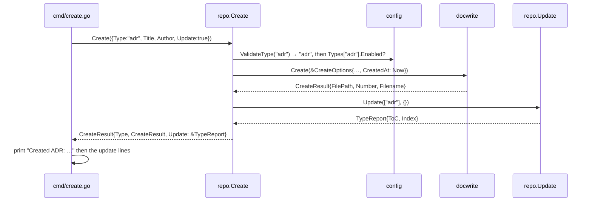

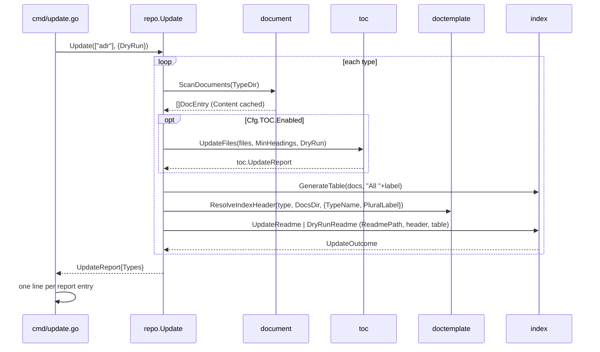

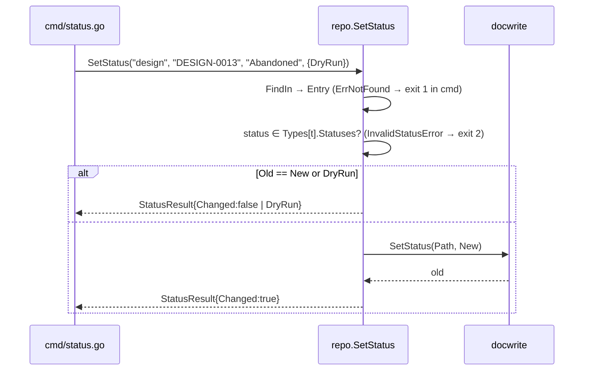

Rules the package keeps: `List` and `Update` with `nil` types iterate
`Cfg.EnabledTypes()` (built-ins first, custom sorted), so custom types are
never skipped; `Scan` on a disabled type returns `ErrTypeDisabled` rather
than an empty slice, which is what `cmd/update.go`'s debug "type disabled,
skipping" branch tests today; `Init` writes `.docz.yaml` via
`doctemplate.DefaultConfigYAML`, creates each enabled type's directory, and
writes `index.Scaffold(header)` per README, reporting one `InitFile` each;
`ExportTemplate` with an empty destination is `docz template override`.
`Repo` holds no logger and prints nothing (R4); a caller that wants the
debug narration `cmd/` emits today gets it from the report.

#### 2.9 impl (L2, new)

Carried over from DESIGN-0013 §5 with the root type renamed.

```go
package impl // import "github.com/donaldgifford/docz/pkg/impl"

// Parse interprets an IMPL document. It never touches the filesystem.
func Parse(doc []byte) (Doc, error)

type Doc struct {
    ID     string        // frontmatter id, e.g. "IMPL-0017"
    Title  string        // frontmatter title
    Status config.Status // frontmatter status, typed like document.Frontmatter
    Phases []Phase
}

type Phase struct {
    Index       int         // 1-based ordinal among phases, document order
    Token       string      // heading token: "1", "A", "2B" — equals Index for template docs
    Title       string      // text after "Phase <token>:", inline markdown stripped
    Description string      // prose between the heading and "#### Tasks", trimmed, comments removed
    Tasks       []Task
    Criteria    []Criterion // nil when the phase has no "#### Success Criteria"
    Line        int         // heading line, 1-based
}

type Task struct {
    ID       string  // "<phase token>.<index>", e.g. "2.3"; index is 1-based, document order
    Text     string  // folded across continuation lines; verify line and markers removed
    Checked  bool
    Verify   string  // command from the task's verify line, "" when absent
    Deferred *Marker // nil unless a deferred marker is present
    Skipped  *Marker // nil unless the task is struck through with a skipped note
    Line     int     // the checkbox line, byte-accurate — the splice target
    EndLine  int     // last continuation line (== Line for one-liners)
}

type Marker struct {
    Note string // reason text, "" when the marker carries none
    Line int    // line the marker sits on
}

type Criterion struct {
    Text       string
    Executable bool   // the bullet starts with a backtick span
    Command    string // the span's contents when Executable
    Line       int
}

func (d Doc) Task(id string) (Task, bool)
func (d Doc) Phase(token string) (Phase, bool)
func (d Doc) Tasks() []Task              // every task across phases, document order
func (d Doc) Progress() (done, total int) // checked over non-skipped

var ErrNoPhases = errors.New("impl: no phases found")
type DuplicatePhaseError struct { Token string; Lines []int }
```

Every `Line` is byte-accurate against the input (the `docparse` contract),
so a consumer can splice at `Task.Line` with `docwrite.SetTaskStateBytes`,
or append a marker after `Task.EndLine` with its own code, and stay
byte-minimal. `Doc` holds no reference to the input; every string is
copied (the `ParseChangelog` retention lesson).

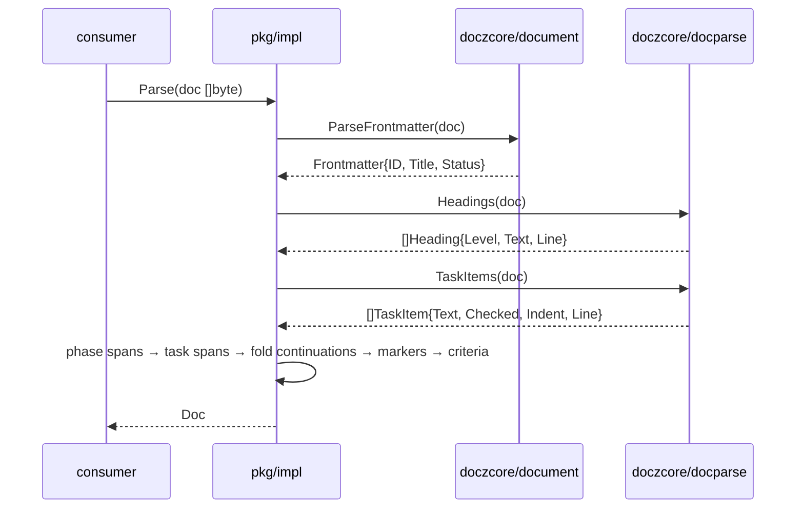

The convention for the next type package is this package: `pkg/<type>`,
`Parse([]byte) (Doc, error)`, value-typed helpers, its own sentinel errors,
imports only L0, no interface. A consumer that wants "parse whatever this
is" maps `Frontmatter.ID`'s prefix to a type with `config.ValidateType`
and switches — still concrete types.

#### 2.10 wiki (integration, promoted)

Promoted whole from `internal/wiki` as `pkg/wiki`, a sibling of `pkg/impl`
rather than part of `doczcore`: it is an integration with MkDocs and
TechDocs, not core and not a type. The existing primitives keep their
signatures; two orchestration functions absorb `cmd/wiki.go`.

```go
package wiki // import "github.com/donaldgifford/docz/pkg/wiki"

// Existing primitives, unchanged.
type MkDocsConfig struct { SiteName, SiteDescription, DocsDir, RepoURL, SiteURL, Theme string; Plugins, MarkdownExtensions []string }
type NavEntry struct { Title, Path string; Children []NavEntry }
func CreateMkDocs(path string, cfg *MkDocsConfig) error
func ReadMkDocs(path string) (map[string]any, error)
func WriteMkDocs(path string, data map[string]any) error
func ScanDocs(docsDir string, exclude []string, navTitles map[string]string) ([]NavEntry, error)
func BuildNav(docsDir string, exclude []string, navTitles map[string]string, existingOrder []string) ([]NavEntry, error)
func SortEntries(entries []NavEntry) []NavEntry
func MergeNavOrder(existing []string, newEntries []NavEntry) []NavEntry
func ExistingNavOrder(data map[string]any) []string
func NavToYAML(entries []NavEntry) []any
func CountPages(entries []NavEntry) int
func DocTitle(filePath string) (string, error)   // frontmatter "ID: Title" → docparse.Title → FilenameTitle
func DirTitle(dir string, navTitles map[string]string) string
func FilenameTitle(filename string) string

// New: the orchestration cmd/wiki.go performs today.
type Action int
const ( Created Action = iota + 1; Skipped; Overwritten )
type InitOptions struct { SiteName, SiteDescription, RepoURL, SiteURL, Theme string; Force bool }
type InitReport struct { MkDocsPath string; MkDocs Action; IndexPath string; Index Action }
func Init(root string, cfg *config.Config, opts InitOptions) (InitReport, error) // mkdocs.yml + <DocsDir>/index.md from ResolveWikiIndex

type NavOptions struct { DryRun bool }
type NavReport struct { Path string; Entries []NavEntry; Pages int; Written bool }
func UpdateNav(root string, cfg *config.Config, opts NavOptions) (NavReport, error) // Read → ExistingNavOrder → BuildNav → NavToYAML → Write
```

What stays in `cmd/wiki.go`: defaulting the site name from the git remote
(an L4 dependency like author resolution), the `.docz.yaml`-exists
precondition, and the printed nav tree. `repo.Create` does **not** call
`wiki.UpdateNav`; `cmd/create.go` keeps that call behind
`Cfg.Wiki.AutoUpdate` so `doczcore` never imports `pkg/wiki` (R1 —
`wiki` is a sibling, not below `repo`). Open Question 8 asks whether the two
orchestration functions belong here at all.

### 3. The IMPL grammar

The grammar is a contract of the IMPL *type* (R7): it is what docz's own
template produces, plus the tolerances the fleet's hand-written documents
need (INV-0010). A repo that overrides `impl.md` and renames the section
headings has left the contract.

| Element | Rule | Source |
| ------- | ---- | ------ |
| Frontmatter | `document.ParseFrontmatter`; `ErrNoFrontmatter` is fatal | facts layer |
| Phase | A level-3 heading whose stripped text matches `^Phase\s+([^\s/:]+):\s*(.+)$`. The span ends at the next heading of level 3 or shallower, or EOF. Headings that do not match (`### Phase 1` under File Changes, `### In Scope`) are not phases. | INV-0010 Obs 3 — the colon discriminates |
| Phase token and ID | Token is capture 1; duplicate tokens → `DuplicatePhaseError`; `Index` is the 1-based ordinal | the corpus is numeric and contiguous |
| Description | Lines strictly between the heading and the first level-4 heading in the span, HTML comments removed, trimmed | template guidance lives in comments |
| Tasks span | The `#### Tasks` sub-span when present, else the whole phase span; ends at the next heading of level 4 or shallower | sdk-booty-sh `subSpan` |
| Task | A `docparse.TaskItem` with `Indent == 0` inside the tasks span; nested items are never tasks | INV-0010 Obs 3 |
| Continuation | Following lines that are non-blank, indented deeper than the bullet, and not themselves list items belong to the task; `EndLine` is the last such line | 48 of 56 tasks wrap in IMPL-0017 |
| Text | Continuation lines joined with single spaces after trimming; the verify line and marker text removed; other inline markdown kept verbatim | consumers match on Text |
| Verify | A continuation line whose trimmed text starts with `verify:` case-insensitively; `Verify` is the contents of the first backtick span on that line; the rest of the line is ignored | docz-api IMPL-0004 |
| Deferred | The token `deferred` followed by a hyphen, en dash, or em dash, on the task line or a continuation, optionally inside bold; `Note` is the text after the dash, after an optional `human required:`, folded to the task's end | docz-api IMPL-0006 prefix form; issue #100 suffix form |
| Skipped | Task text wrapped in `~~…~~` followed by `skipped:` after any dash; `Note` is the text after the colon | issue #100 |
| Criteria | Top-level dash bullets under `#### Success Criteria`, wrapped lines folded, an optional leading checkbox tolerated; `Executable` iff the bullet text starts with a backtick span | issue #100; INV-0010 Obs 5 caveat |
| Outside phases | Checkboxes under `## Testing Plan` or any level-2 section are not tasks | template |
| Fences | Inherited from `docparse`: nothing inside a fence is a heading or a task | facts layer |
| Line endings | LF only; any CR → error, matching `docwrite` | DESIGN-0005 Decision 7 |

The line walker inside the tasks span is a small state machine; it is the
only place `impl` reads raw lines:

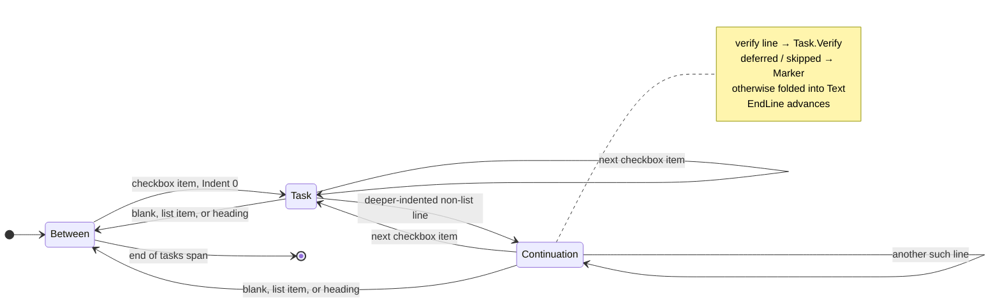

Identity and stability, which consumers rely on for structural-change
detection:

| Key | Stable across | Shifts when |
| --- | ------------- | ----------- |
| `Phase.Token` | any edit that keeps the heading | the heading's token is edited |
| `Task.ID` | checkbox flips, marker edits, text edits, skips | a task is inserted, removed, or moved within its phase |
| `Task.Line` and `EndLine` | nothing above the task changes | any earlier line-count change — re-parse before splicing |

Skipped tasks remain checkbox items, so positional IDs do not shift when a
task is skipped. A consumer that wants "what changed between two runs"
parses twice and compares by `Task.ID`; docz does not diff.

### 4. The cmd swap

The final step. Every handler becomes flags → one call → print, and the
existing `cmd/` tests must pass unchanged, byte-for-byte, on the new code
paths. `Runner` gains a `Repo *repo.Repo` built in `loadAndValidateConfig`
from `RepoRoot` and the loaded config; tests that construct a `Runner`
directly build one the same way.

| Command | Library call | What stays in `cmd/` |
| ------- | ------------ | -------------------- |
| `docz init` | `repo.Init(InitOptions{Force})` | one line per `InitFile` |
| `docz create <type> <title>` | `repo.Create(CreateOptions{Type, Title, Author, Status, Now, Update: !noUpdate})`, then `wiki.UpdateNav` if `Wiki.AutoUpdate` | author resolution via `GitResolver`, printing |
| `docz update [type]` | `repo.Update(types, UpdateOptions{DryRun})` | wording per `TypeReport`; the #95 near-miss warning over `ToC.Skipped` |
| `docz list [type]` | `repo.List(types)` | `--status` filter, text/json/csv rendering of `listEntry` |
| `docz status set <type> <id> <status>` | `repo.SetStatus(type, id, status, StatusOptions{DryRun})` | `errors.Is` → exit 1 (`ErrNotFound`, write error) or exit 2 (`ErrUnknownType`, `InvalidStatusError`, `ErrUnsupportedLineEndings`); text/json |
| `docz template show <type>` | `repo.Template(type)` | printing |
| `docz template export <type> [path]` | `repo.ExportTemplate(type, path, ExportOptions{})` | printing |
| `docz template override <type>` | `repo.ExportTemplate(type, "", ExportOptions{})` | printing |
| `docz config` | `config.Load` (via `Open`) | YAML printing |
| `docz wiki init` | `wiki.Init(root, cfg, InitOptions{…})` | site-name default from git, `.docz.yaml` precondition, printing |
| `docz wiki update` | `wiki.UpdateNav(root, cfg, NavOptions{DryRun})` | nav tree printing |
| `docz task list <impl-id>` (ADR-0002 OQ 4) | `repo.Find(id)` then `impl.Parse(entry.Content)` | text/json rendering of tasks |
| `docz version` | — | all |

Removed from `cmd/` by the swap: `updateType`, `runToCUpdate`,
`indexLabel`, `writeDefaultConfig`, `writeIndexReadme`, `findByID`,
`updateWikiNav`, `updateWikiNavDryRun`, `ensureDocsIndex`, and the
type-validation and status-validation branches of `create` and
`status set`. Kept: `Runner`, `GitResolver`, `buildLogger`, `exitCodeFor`,
every `print*`/`emit*`/`format*` function, and the flag definitions.
Expected size: `cmd/` non-test lines fall from about 4 600 to roughly half.

### 5. Consumer map

| Package | docz CLI | tempy | sdk-booty-sh doczwork | docz-api |
| ------- | :------: | :---: | :-------------------: | :------: |
| `config` | yes | statuses, prefix → type | yes | yes |
| `document` | yes | via `impl` | yes | yes (`ParseFrontmatter`) |
| `docparse` | via `toc`, `wiki` | via `impl` | yes | yes |
| `docwrite` | yes | `SetTaskStateBytes`, `SetStatusBytes` | `SetTaskStateBytes` | — |
| `toc` | yes | — | — | — |
| `index` | yes | — | — | maybe (`GenerateTable` for its own indexes) |
| `doctemplate` | yes | — | — | — |
| `repo` | yes | — | — | — (no checkout) |
| `impl` | `task list` | yes | yes (migrates off its own model) | maybe (progress rendering) |
| `wiki` | yes | — | — | — |

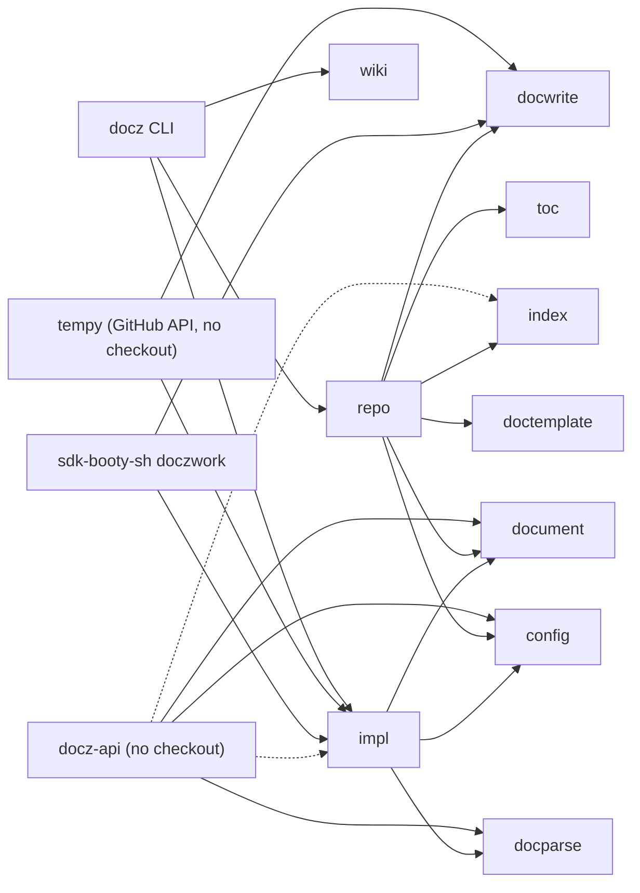

No consumer needs a package it does not import: a tempy binary compiles
`impl`, `docwrite`, `doctemplate` (through `docwrite.Create`'s dependency —
the one ride-along ADR-0001 accepted), `document`, `docparse`, `config`,
and `yaml.v3`. Nothing from `repo`, `index`, `toc`, or `wiki`.

### 6. Enforcing the layer rules

No depguard for now (DESIGN-0013 OQ 13, resolved in review). Enforcement is
three things that already exist or fall out of the swap: reviewers read
imports against §1; `test/consumer` imports every `pkg/` package from
outside the module so a package that quietly depends on `cmd/` or
`internal/` fails to build there; and after the swap `internal/` is empty,
so an import of it is a compile error. A `depguard` rule can be added when
the tree is stable if drift appears.

## API / Interface Changes

| Package | Change | Kind | Frozen from |
| ------- | ------ | ---- | ----------- |
| `pkg/doczcore/config` | none | — | v1.0.0 |
| `pkg/doczcore/document` | none | — | v1.0.0 |
| `pkg/doczcore/docparse` | none (#96 fixes are bugs) | — | v1.0.0 |
| `pkg/doczcore/docwrite` | `SetStatusBytes`, `SetTaskStateBytes`, `SetTaskState`, `NextNumber`, `Render`, `Rendered`, `ErrTaskAlreadyUnchecked` | additive | v1.0.0 (existing), swap release (new) |
| `pkg/doczcore/toc` | none | — | v1.0.0 |
| `pkg/doczcore/index` | promoted whole; `Splice`, `Scaffold`, marker constants exported | new public | swap release |
| `pkg/doczcore/doctemplate` | promoted whole; `DefaultConfigYAML`, `ErrNoTemplate` | new public | swap release |
| `pkg/doczcore/repo` | new | new public | swap release |
| `pkg/impl` | new | new public | swap release |
| `pkg/wiki` | promoted whole; `Init`, `UpdateNav`, options and reports | new public | swap release |
| `internal/` | emptied | — | — |
| `cmd/` | re-pointed; optional `task list` | no behaviour change | — |
| `.docz.yaml` | none | — | — |
| `config.DocTypeNames()` | loses `plan` (ADR-0003) | catalogue change, same release | — |

Per ADR-0002 Decision 7, every "swap release" row is experimental until the
swap ships: its package doc comment opens with `EXPERIMENTAL` and a link to
ADR-0002, and it may change between beta pins without a major bump. The
swap PR removes the markers and the whole table is contract from then on.

## Data Model

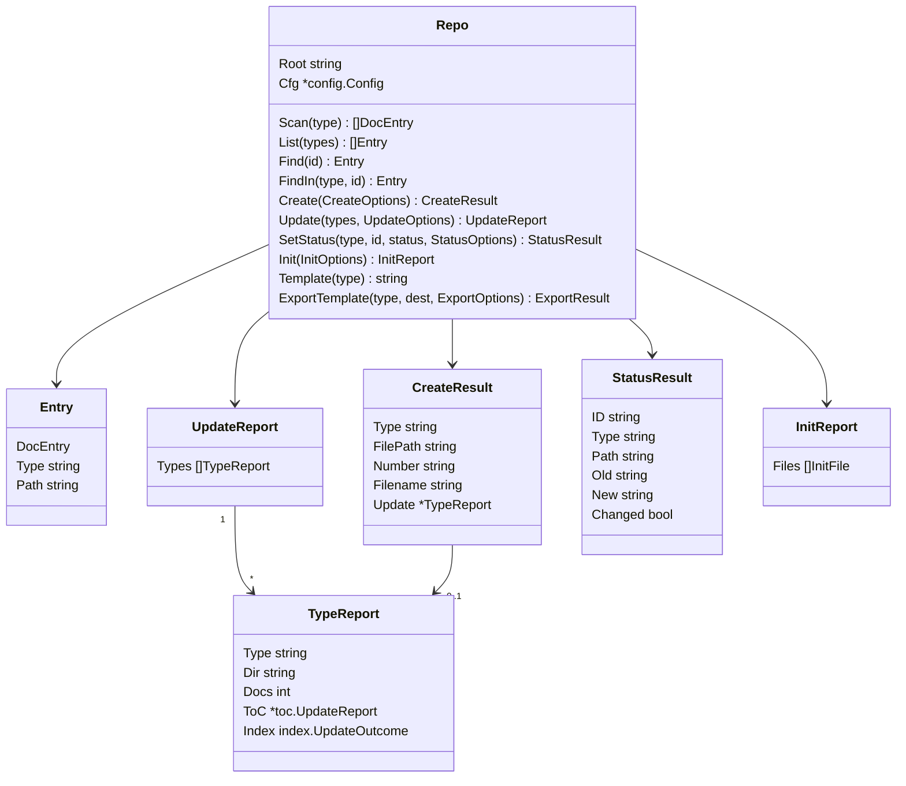

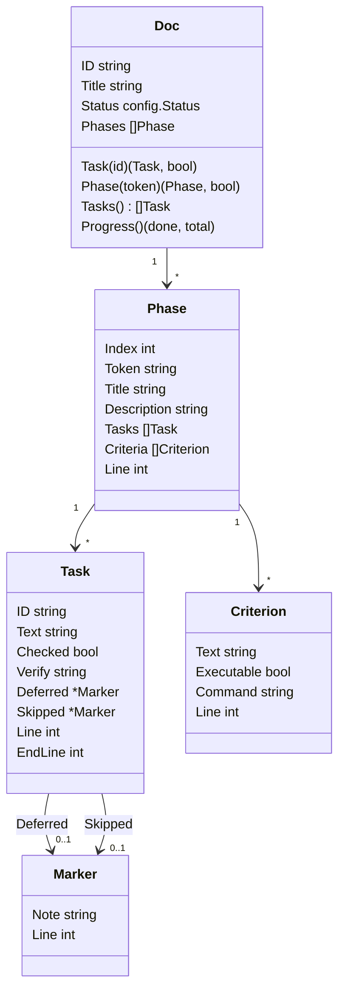

No storage anywhere: every value is computed from bytes or from a scan and
holds no handle to the filesystem. `Repo` is two fields and is safe to
construct per call.

## Testing Strategy

- **`pkg/impl`**: golden fixtures snapshotted under `pkg/impl/testdata/`
  (never read from `docs/`): docz IMPL-0009 and IMPL-0017 (wrapping),
  IMPL-0001 (non-phase `### Phase N` headings), IMPL-0007 (phases without
  criteria), docz-api IMPL-0004 (verify lines), docz-api IMPL-0006 (prefix
  deferred marker), sdk-booty-sh's clean and messy fixtures, a synthetic doc
  with a skipped task and one with a task inserted mid-run. Each with a
  `.golden.txt` fact file regenerated by `-update`. Invariants goldens
  cannot express: every `Task.Line` is a line `docparse.TaskItems` reports;
  IDs are unique; no `Text` contains a verify prefix or a marker;
  `EndLine >= Line`; a skipped task keeps its ID. `FuzzParse` pins
  never-panic.
- **`docwrite` byte cores**: the existing `status` and `checktask` goldens
  run through the path wrappers unchanged, plus a bytes-only table for the
  uncheck direction and for `Render` (output equals what `Create` writes).
- **`index` and `doctemplate`**: `git mv` carries the tests; `Splice` gets a
  table pinning that `UpdateReadme`'s outcomes are unchanged; `Scaffold`
  gets the #99 regression (exactly one marker pair for every type).
- **`repo`**: table tests over `t.TempDir()` repos for every method, each
  asserting the typed report and the on-disk result; error tests for every
  sentinel and `InvalidStatusError`.
- **`wiki`**: existing goldens carry over; `Init` and `UpdateNav` get
  temp-dir tests mirroring today's `cmd/wiki` tests.
- **The swap**: the `cmd/` test suite runs unchanged. Any test that has to
  change is a behaviour change and blocks the PR (ADR-0001 Decision 7).
- **Consumer proof**: `test/consumer` imports every `pkg/` package —
  `repo`, `index`, `doctemplate`, `impl`, `wiki` join the existing five —
  and exercises one call each from outside the module.
- **Layer rule R2**: a test in `pkg/doczcore` walks `go list -deps` for
  each core package and fails if `pkg/impl` or `pkg/wiki` appears.

## Migration / Rollout Plan

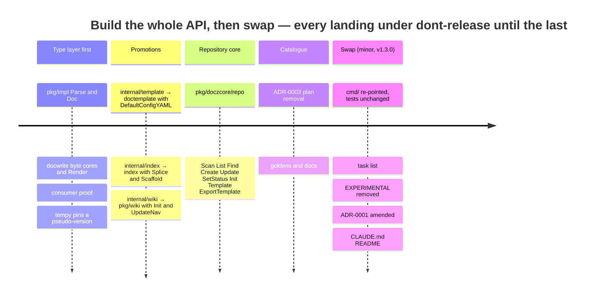

| Step | Delivers | PR label | Consumer signal |
| ---- | -------- | -------- | --------------- |
| 1 | `pkg/impl`; `docwrite` byte cores, `SetTaskState`, `NextNumber`, `Render`; consumer proof | `dont-release` | tempy IMPL-0001 pins `docz@<sha>`; sdk-booty-sh issue to migrate `doczwork` |
| 2 | `doctemplate`, `index`, `wiki` promotions (`git mv` + additions); `internal/` emptied | `dont-release` | — |
| 3 | `repo` | `dont-release` | — |
| 4 | ADR-0003: `plan` removed, goldens regenerated, docs | `dont-release` | claude-skills issue |
| 5 | `cmd/` swap; optional `task list`; EXPERIMENTAL markers removed; ADR-0001 amendment; CLAUDE.md, README library section, release notes | `minor` → v1.3.0 | tempy re-pins the tag; docz-api may adopt `index`/`impl` at its leisure |
| — | IMPL-0017 (`updated:` field) retargets from v1.3.0 to v1.4.0 | — | docz-api #36 unchanged |

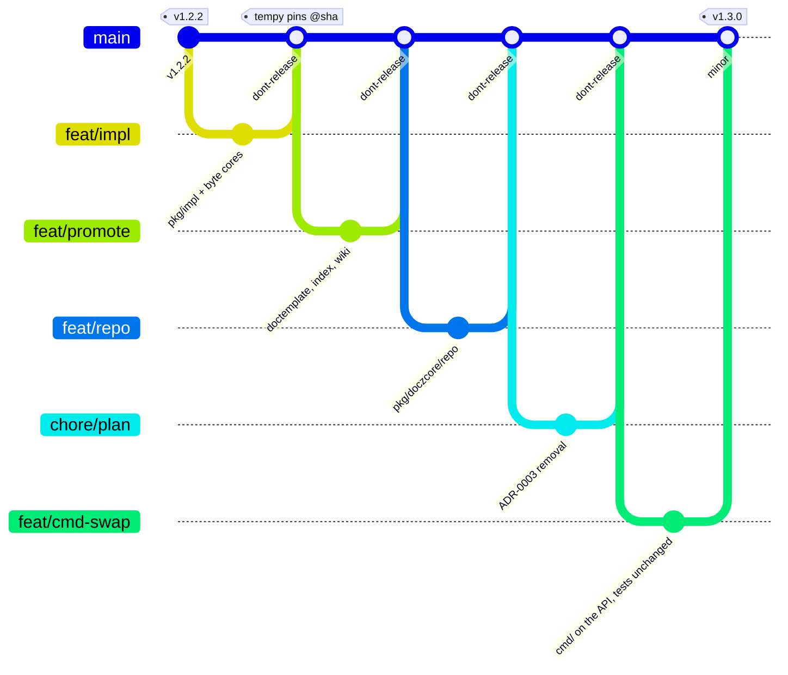

Steps 1–4 each leave the CLI on its current code paths, so a `main` build
at any point behaves exactly like v1.2.2 for CLI users while carrying the
new packages for library consumers. Beta pinning uses pseudo-versions
unless a consumer asks for a tag (ADR-0002 Open Question 3). Step 5 is the
release; its release notes are the library changelog for everything above.

Docs touched by the work: ADR-0001 (dated amendment, Open Question 2 of
ADR-0002), IMPL-0014 (Decision 3 note), DESIGN-0013 (Abandoned — done with
this design), CLAUDE.md (architecture bullets for the five new packages and
the emptied `internal/`), README (library section; six types become five),
DEVELOPMENT.md (the "add a type" walkthrough moves its template paths),
`mkdocs.yml` (`pymdownx.superfences` so these diagrams render in the wiki).

## Open Questions

> Each question is numbered; option `a` is my recommendation, later letters
> are alternatives, and the last is a free-form "other". Questions 1–4 are
> DESIGN-0013's 3–6, carried over unresolved.

### 1. Phase and task grammar

- a. **Colon-discriminated phases anywhere** (`^Phase\s+([^\s/:]+):`),
  tasks scoped to `#### Tasks` when present, top-level only, duplicate
  token is an error — §3 as written. *(recommendation)*
- b. Every level-3 heading is a phase with ordinal fallback (sdk-booty-sh
  today) — `In Scope` becomes phase 1 in template docs.
- c. Phases only under `## Implementation Phases`.
- d. Other.

### 2. Continuation folding and verify lines

- a. **Fold continuations into `Text`; verify is case-insensitive, first
  backtick span, trailing prose ignored** — the four hand-written docz-api
  lines parse. *(recommendation)*
- b. Strict lowercase `verify:` whose remainder is exactly one backtick
  span.
- c. First-line-only `Text` (the facts literal) — truncates most recent
  tasks.
- d. Other.

### 3. Marker parsing on the read side

- a. **Lenient**: `deferred` after any dash, prefix or suffix, emphasis
  tolerated; strikethrough plus `skipped:` after any dash. Canonical
  spellings are documented for writers (consumers), not enforced by the
  parser. *(recommendation)*
- b. Canonical suffix forms only; docz-api IMPL-0006 is hand-fixed.
- c. Other.

### 4. Criteria classification

- a. **As issue #100 states**: executable iff the bullet starts with a
  backtick span; the caveat that symbol-subject criteria (about a tenth in
  this repo) classify as executable is documented, and docz never runs
  anything. *(recommendation)*
- b. Executable only when the whole bullet is a backtick span.
- c. Token heuristics on the span.
- d. Other.

### 5. Creation without I/O

- a. **`NextNumber(dir, width)` plus `Render(opts, number)`**, with `Create`
  composed from them. Two small functions; a no-checkout consumer supplies
  its own number (it knows its tree) and gets `Rendered{Filename, Content}`
  to commit through its own API. *(recommendation)*
- b. One `Prepare(opts) (Rendered, error)` that scans for the next number
  itself — fewer names, but it needs the filesystem, which defeats the
  purpose.
- c. Neither now; `Create` stays the only creation entry point until a
  consumer asks.
- d. Other.

### 6. Resolving a document by ID

- a. **Both `Find(id)` and `FindIn(type, id)`.** `Find` derives the type
  from the prefix through `ValidateType` (which already resolves
  `id_prefix` tokens, and `validateResolution` guarantees uniqueness) and
  serves consumers that only hold an ID, such as `task list`; `FindIn`
  mirrors `status set <type> <id>` exactly. *(recommendation)*
- b. `FindIn` only; callers split the prefix themselves.
- c. `Find` only; `status set` ignores its `<type>` argument beyond
  validation.
- d. Other.

### 7. Where the status no-op short-circuit lives

DESIGN-0005 Decision 8 put "current equals new → no write" in `cmd/`.

- a. **In `repo.SetStatus`, reported as `Changed: false`.** It is not
  wording; it is the operation's semantics, and every consumer wants the
  same rule. `cmd/` output is unchanged because it prints from the result.
  *(recommendation)*
- b. Keep it in `cmd/`; `repo.SetStatus` always writes when called, like
  the `docwrite` helper.
- c. Other.

### 8. How much of wiki is orchestration

- a. **`Init` and `UpdateNav` live in `pkg/wiki`.** They are the two things
  a consumer would otherwise copy from `cmd/wiki.go`, and the primitives
  stay exported for anyone who wants a different composition.
  *(recommendation)*
- b. Primitives only; the orchestration stays in `cmd/wiki.go` and `wiki`
  is the one command with no single-call equivalent.
- c. Put `Init` and `UpdateNav` on `repo` — but then `doczcore` imports
  `pkg/wiki`, breaking R1's sibling rule.
- d. Other.

### 9. Error shapes in repo

- a. **Sentinels for the yes/no cases (`ErrNotFound`, `ErrTypeDisabled`,
  `ErrExists`) and one typed `InvalidStatusError` carrying the allowed
  list**, with `config.ErrUnknownType` passing through. `cmd/` maps them to
  exit codes with `errors.Is`/`errors.As` and keeps its current messages.
  *(recommendation)*
- b. Typed errors everywhere (`NotFoundError{Type, ID}` …) — richer, more
  surface to freeze.
- c. Sentinels everywhere; the allowed-status list is re-derived by the
  caller from `Cfg`.
- d. Other.

### 10. Generic facts for the next type package

- a. **Defer** `docparse.Sections` and `document.Kind` until a second type
  package exists; the shapes are noted so they are not redesigned.
  *(recommendation)*
- b. Add `docparse.Sections` now — small, but a frozen API with no caller.
- c. Other.

### 11. Delivery granularity

- a. **One IMPL document with a phase per rollout step** (five phases, the
  swap last), so the unit of delivery matches the unit of design and the
  acceptance criteria of the last phase are the swap's. *(recommendation)*
- b. One IMPL per package, tracked in a parent issue.
- c. Other.

## References

- [ADR-0002](../adr/0002-docz-is-an-api-package-whose-first-consumer-is-the-cli.md)
  — the decisions this design implements
- [ADR-0003](../adr/0003-remove-plan-from-the-built-in-document-types.md)
  — the catalogue change that ships in the same release
- [ADR-0001](../adr/0001-pkgdoczcore-as-the-single-public-core-cmd-as-a-thin-cli-shell.md)
  — the frozen base and the API principles kept
- [DESIGN-0013](0013-library-first-docz-per-type-document-packages-and-a-core-api.md)
  — Abandoned; inventory and `pkg/impl` specification carried over
- [INV-0010](../investigation/0010-impl-plan-parse-and-write-back-api-for-doczcore-issue-100.md)
  — corpus grammar facts, existing primitives, consumer model
- [DESIGN-0005](0005-status-set-cli-primitive.md) — byte-preservation
  contract; [IMPL-0011](../impl/0011-status-set-cli-primitive.md)
- [DESIGN-0006](0006-custom-document-type-support.md) — type resolution
  and custom types; [DESIGN-0007](0007-docz-changes-to-support-docz-api-and-docz-site.md)
  — the promotion pattern
- [IMPL-0014](../impl/0014-v100-the-five-package-pkgdoczcore-public-core.md)
  — the v1.0.0 core; [IMPL-0017](../impl/0017-v130-updated-frontmatter-field-and-the-docz-update-stamp-pass.md)
  — retargets to v1.4.0
- Issues [#100](https://github.com/donaldgifford/docz/issues/100),
  [#103](https://github.com/donaldgifford/docz/issues/103),
  [#92](https://github.com/donaldgifford/docz/issues/92),
  [#95](https://github.com/donaldgifford/docz/issues/95),
  [#96](https://github.com/donaldgifford/docz/issues/96),
  [#99](https://github.com/donaldgifford/docz/issues/99)
- tempy `docs/design/0001-temporal-orchestrated-impl-loop-execution.md`,
  `docs/impl/0001-temporal-orchestrated-impl-loop-worker-mvp.md`;
  sdk-booty-sh `pkg/loop/doczwork`
- `cmd/{update,create,init,status,wiki,template,list}.go`,
  `internal/{index,template,wiki}`, `pkg/doczcore/*`
