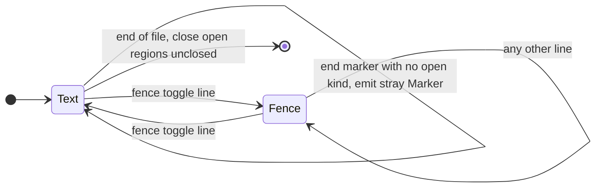
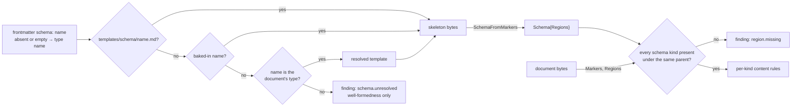
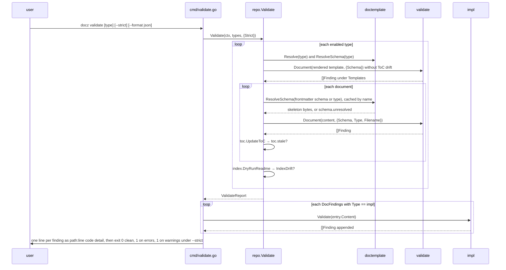
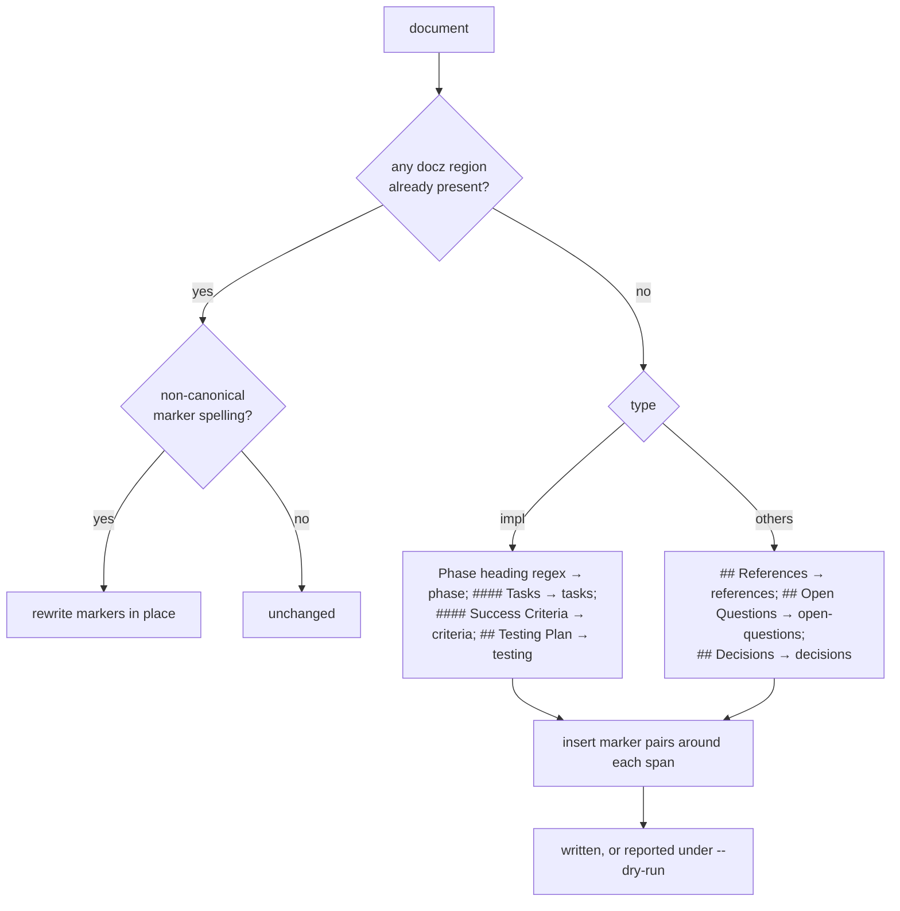
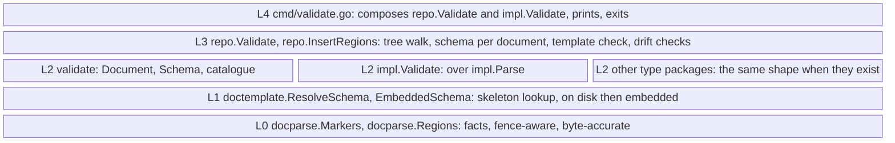
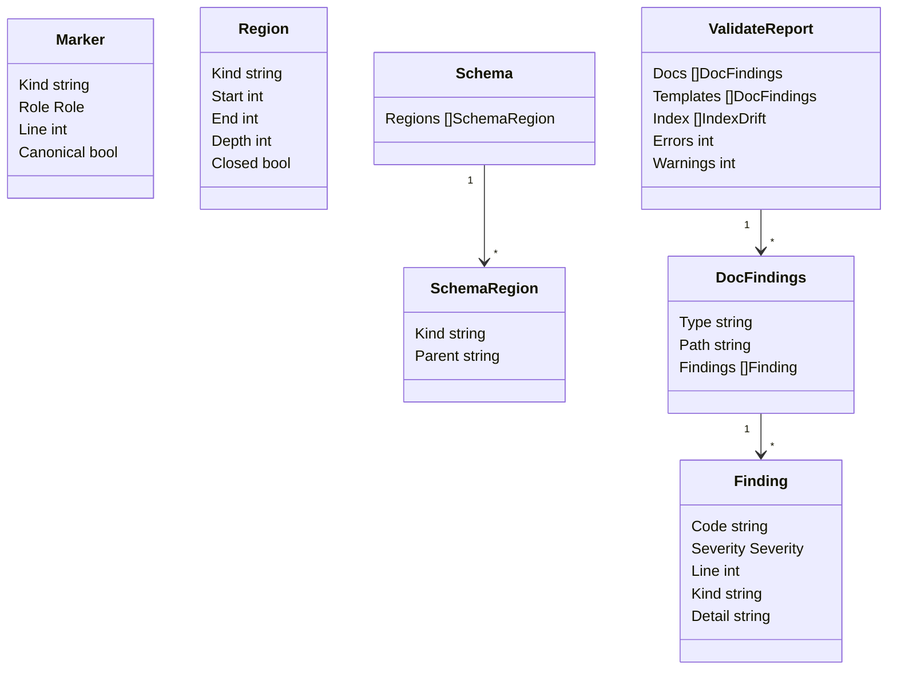

<!-- markdownlint-disable-file MD025 MD041 -->

# DESIGN-0015: Structured regions and docz validate

<!--toc:start-->
- [Overview](#overview)
- [Goals and Non-Goals](#goals-and-non-goals)
  - [Goals](#goals)
  - [Non-Goals](#non-goals)
- [Background](#background)
- [Detailed Design](#detailed-design)
  - [1. Marker syntax and the walker](#1-marker-syntax-and-the-walker)
  - [2. Kind catalogue](#2-kind-catalogue)
  - [3. The schema: a marker skeleton the document names](#3-the-schema-a-marker-skeleton-the-document-names)
  - [4. Validation: generic, per-type, repository](#4-validation-generic-per-type-repository)
  - [5. Effect on the IMPL grammar](#5-effect-on-the-impl-grammar)
  - [6. Migrating the corpus](#6-migrating-the-corpus)
  - [7. Where each piece sits in the layers](#7-where-each-piece-sits-in-the-layers)
- [API / Interface Changes](#api--interface-changes)
- [Data Model](#data-model)
- [Testing Strategy](#testing-strategy)
- [Migration / Rollout Plan](#migration--rollout-plan)
- [Open Questions](#open-questions)
  - [1. Where does the schema come from?](#1-where-does-the-schema-come-from)
  - [2. Marker spelling on the read side](#2-marker-spelling-on-the-read-side)
  - [3. Is the finding message part of the contract?](#3-is-the-finding-message-part-of-the-contract)
  - [4. How is the corpus migrated?](#4-how-is-the-corpus-migrated)
  - [5. Do ToC and index drift belong to validate?](#5-do-toc-and-index-drift-belong-to-validate)
  - [6. Which regions does the IMPL template mark?](#6-which-regions-does-the-impl-template-mark)
  - [7. Hand-rolled walker or a CommonMark AST?](#7-hand-rolled-walker-or-a-commonmark-ast)
  - [8. Unknown kinds](#8-unknown-kinds)
  - [9. Should the ToC and index splices sit on the region walker?](#9-should-the-toc-and-index-splices-sit-on-the-region-walker)
- [References](#references)
<!--toc:end-->

## Overview

docz documents get explicit structure: HTML-comment markers that delimit
typed regions of a document, a fact-level walker that reports them, a
validator that checks documents against the schema they name — a marker
skeleton baked in per built-in type or kept as a file in the repo — and a
`docz validate` command and library entry point over both.
The markers replace the heading-text heuristics that DESIGN-0014's IMPL
grammar would otherwise need to find phases and task lists, give custom
types checkable structure without a Go package per type, and make a
document's well-formedness something the CLI can gate on and docz-api can
report. This design is a requirement of the API unit DESIGN-0014 delivers:
no release carries one without the other.

## Goals and Non-Goals

### Goals

- **Explicit spans.** A program finds a document's references, open
  questions, phases, tasks, and criteria by marker, never by matching
  heading text.
- **Structure for every type, including custom ones,** without Go code. A
  repo that adds a `frameworks` type gets a scaffolded template and schema
  pair and the same validation as a built-in.
- **A validator that is bytes in, findings out,** so docz-api validates a
  document it fetched over an API and the CLI validates a tree, from one
  implementation.
- **A checkable gate for agent-written documents.** The conventions the
  docz skills describe in prose become findings the CLI reports.
- **One grammar.** The corpus is migrated once so the heading heuristics
  retire instead of surviving as a permanent fallback.
- **Learn from INV-0009.** Marker spelling variants are read leniently and
  reported, never silently skipped.

### Non-Goals

- Attributes on markers. A marker names a kind and nothing else; the
  human-visible data stays in the headings and lists it delimits.
- A schema language. A schema is a marker skeleton read by the same walker
  as a document; there is nothing to learn beyond the markers.
- Rendering. Markers are HTML comments and are invisible in every renderer
  docz targets. Nothing here changes how a document looks.
- Replacing `docparse.Headings` or the ToC walker. Regions are one more
  fact function beside them.
- Auto-fixing content findings. The migration pass inserts markers and
  canonicalizes their spelling; it never rewrites prose, tasks, or
  frontmatter.

## Background

**The precedent is already in the tree.** The ToC splice owns a region
between `<!--toc:start-->` and `<!--toc:end-->`; the README index owns one
between `BEGIN` and `END DOCZ AUTO-GENERATED` markers. Both are HTML
comments, both are matched on a trimmed line, both are the only markdown
extension mechanism that survives GitHub, MkDocs, and docz-site unchanged.
The same idea underlies markdown-magic's `doc-gen` blocks and, outside
markdown, the structured-comment metadata Donald's ini package reads. This
design generalizes it: a region has a kind, the kind is open, and docz knows
the semantics of a few.

**What the heuristics cost.** DESIGN-0014 §3 finds a phase by a level-3
heading matching `Phase <token>:`, a task list by a `#### Tasks` heading,
and excludes checkboxes under `## Testing Plan` by heading text. Rule R7
has to defend that with "a renamed heading has left the contract."
INV-0010 Observation 3 found the corpus follows the template closely enough
for the heuristics to work, and INV-0009 Finding 4 found what happens when
a marker is spelled slightly differently: the file is skipped and nobody is
told. Explicit regions remove the first fragility and the lenient reader
plus validator remove the second.

**The goldmark question.** A CommonMark AST such as goldmark's would give
higher-fidelity facts than the line walkers docz has, but it supplies
structure, not typing: it can say "a level-3 heading followed by a list,"
not "a phase and its tasks." Something still has to name the kind, and the
candidates are heading-text heuristics or explicit markers. So an AST is an
implementation option for the walker underneath the same functions, not an
alternative to marking; Open Question 7 records the choice and the trigger
for revisiting it.

## Detailed Design

### 1. Marker syntax and the walker

A marker is an HTML comment on a line of its own:

```markdown
<!--docz:phase:start-->
### Phase 2: Promotions

<!-- Describe what this phase establishes. -->

<!--docz:tasks:start-->
#### Tasks

- [ ] internal/template moves to doctemplate
- [ ] internal/index moves to index
<!--docz:tasks:end-->

<!--docz:criteria:start-->
#### Success Criteria

- `make ci` passes
<!--docz:criteria:end-->
<!--docz:phase:end-->

---
```

| Rule | Statement |
| ---- | --------- |
| Canonical form | `<!--docz:<kind>:start-->` and `<!--docz:<kind>:end-->`, no interior spaces, matching the ToC marker spelling |
| Kind | `[a-z][a-z0-9-]*`; kind names are open, docz assigns meaning to the catalogue in §2 |
| Placement | The whole trimmed line is the marker. Trailing text makes it not a marker. |
| Headings | A region wraps its own heading: `#### Tasks` sits inside the `tasks` region and the `### Phase N:` heading inside the `phase` region, which is also how the migration pass cuts a span (§6) |
| Thematic breaks | The `---` separators the IMPL template puts between phases sit outside every region |
| Lenient read | Optional whitespace after `<!--`, around the `docz:` token, and before `-->` is accepted and reported as a spelling finding, canonicalized by the fixer (INV-0009 Finding 4) |
| Fences | Inherited from `docparse`: a marker inside a fenced block is text |
| Nesting | Regions nest by a stack. An end marker closes the innermost open region of the same kind; an end marker with no matching open region is stray; a region still open at end of file ends there. |
| Repetition | Any kind may repeat at the same depth (phases). The catalogue says which kinds are singletons; repeating one is a finding, not a walker error. |
| Legacy ToC | `<!--toc:start-->` and `<!--toc:end-->` keep their spelling for Marksman compatibility and are reported as kind `toc` |
| Index markers | The README `DOCZ AUTO-GENERATED` pair is reported as kind `index` under its legacy spelling if Open Question 9 resolves (a); otherwise it stays an index-package concern and is not reported |

The walker is two fact functions in `docparse`, additive to the frozen
package and following its contract: bytes in, values out, no errors, never
panics, 1-based LF-accounted lines.

```go
package docparse

type Role int
const ( Start Role = iota + 1; End )

// Marker is every marker line the walker recognizes, in document order,
// including stray and non-canonical ones. Validation reasons over these.
type Marker struct {
    Kind      string
    Role      Role
    Line      int
    Canonical bool // false for a lenient-spelling match
}

// Region is a paired start and end. Depth is 0 at the top level.
// Closed is false when the region ended at end of file.
type Region struct {
    Kind   string
    Start  int // marker line
    End    int // marker line, or the last line when !Closed
    Depth  int
    Closed bool
}

func Markers(content []byte) []Marker
func Regions(content []byte) []Region
```



`Regions` is what type packages and the ToC-style tooling consume;
`Markers` is what the validator consumes to explain *why* a region is
missing or malformed. A consumer that only wants "the tasks of phase 2"
reads `Regions`, finds the `phase` region whose first heading carries
token 2, and takes the `tasks` region at depth 1 inside it.

### 2. Kind catalogue

Kinds docz assigns meaning to. Every other kind is well-formedness only.

| Kind | Types | Singleton | Content rule the validator checks | Programmatic consumer |
| ---- | ----- | :-------: | --------------------------------- | --------------------- |
| `references` | all | yes | every top-level bullet contains a markdown link | validate |
| `open-questions` | rfc, adr, design, inv | yes | `### N.` headings numbered contiguously from 1; each has lettered `- a.` options | validate; a future OQ resolver |
| `decisions` | inv, adr | yes | a table with a Decision column | none |
| `phase` | impl | no | first level-3 heading inside matches `Phase <token>:` once HTML comments are stripped (the template's placeholder title is a comment); tokens unique across the document | `impl.Parse` |
| `tasks` | impl, inside `phase` | per phase | every top-level bullet is a checkbox item; nested checkboxes are a warning | `impl.Parse`, `docwrite` |
| `criteria` | impl, inside `phase` | per phase | dash bullets, folded | `impl.Parse` |
| `testing` | impl | yes | checkboxes allowed; never tasks | `impl.Parse` excludes |
| `toc` | all | yes | headings after the region match the generated list | `toc`, validate |

The catalogue is data in the `validate` package, not an interface: a
`map[string]KindRule`. Adding a kind is one entry.

### 3. The schema: a marker skeleton the document names

A schema is a markdown file whose body is nothing but region markers: the
kinds a document must carry and how they nest. It is read by the same
`Markers` walker as a document, so there is no schema language and nothing
a schema can require that a document cannot show. Every kind listed is
required at least once under the same parent. A kind not listed is
optional, and when present it is still checked by its content rule (§2);
singleton-ness stays with the kind. A schema therefore only tightens by
growing, and adding a kind to a baked-in schema is a breaking change that
waits for a major.

The baked-in IMPL schema, `schema/impl.md` beside the embedded templates:

```markdown
<!--toc:start-->
<!--toc:end-->
<!--docz:phase:start-->
<!--docz:tasks:start-->
<!--docz:tasks:end-->
<!--docz:criteria:start-->
<!--docz:criteria:end-->
<!--docz:phase:end-->
<!--docz:testing:start-->
<!--docz:testing:end-->
<!--docz:references:start-->
<!--docz:references:end-->
```

The ToC pair keeps its legacy spelling here as everywhere (§1). The IMPL
template's single placeholder phase and a document's five phases both
satisfy the one `phase` entry, and a phase without a `tasks` region fails,
because the schema nests `tasks` under `phase`.

**A document names its schema in frontmatter.** The optional `schema:`
field holds a name. Absent or empty means the document's type name, which
is how every document created from a built-in template validates against
the baked-in schema without carrying a line for it. A name is
`[a-z0-9][a-z0-9_-]*`; anything else is the `schema.name` finding.

```yaml
---
id: IMPL-0021
title: "Runbook for the nightly rebuild"
status: Draft
schema: impl-strict
---
```

Resolution lives in `doctemplate` beside template resolution, with the
same on-disk-then-embedded order:

| Source | Location | Covers |
| ------ | -------- | ------ |
| Repo | `<docs-dir>/templates/schema/<name>.md` | the repo's own schemas, and overrides of baked-in ones by name |
| Baked-in | embedded `schema/<name>.md`, one per built-in type | versioned with the library |
| Template | the type's resolved template, read for its markers | only when the name is the type's own and neither file exists: a custom type that has not scaffolded a schema |

A name that resolves nowhere is the `schema.unresolved` finding, emitted by
whichever tier does the resolving — `repo.Validate` in a checkout, docz-api
over the API — because `Document` never touches a filesystem; validation
then runs with an empty schema, which is well-formedness only. docz-api,
with no checkout, reads `Frontmatter.Schema` from the bytes it fetched and
calls `EmbeddedSchema` with the name or the type, so the common case
validates from bytes alone and a repo-local schema it cannot fetch is
reported rather than guessed.



**Templates are golden tests, not schemas.** An earlier draft derived the
schema from the resolved template. Three things were wrong with that: a
consumer with no checkout has no templates, so docz-api could not validate
at all; the test "render every template, validate it, expect nothing"
could not fail on structure, because a template always contains its own
regions; and a template override that dropped a region silently loosened
the contract, the opposite of R7. With the schema its own artifact that
test is the check that a template and its schema agree, and it runs in two
places: a unit test over every embedded pair, and `repo.Validate` over
every enabled type's resolved pair (§4), so a repo that overrides a
template or writes a custom one is told when the pair drifts. The built-in
templates ship without a `schema:` line, so a file `docz create` writes is
byte-identical to v1.2.2's apart from the markers.

| | Built-in type | Custom type |
| - | ------------- | ----------- |
| Template | embedded; override at `templates/<type>.md` | `templates/<type>.md`, hand-written or scaffolded |
| Schema | embedded; override at `templates/schema/<type>.md` | `templates/schema/<type>.md`, scaffolded with the template; until then, derived from the template |
| A different contract | `schema:` in the template's frontmatter | the same, e.g. `schema: impl` on a type that wants phases, tasks, and criteria, which also gives it `impl.Parse` (ADR-0002 R7) |
| Golden test | unit test in `doctemplate` | `repo.Validate`'s template check |

**Scaffolding a custom type.** Today a custom type's template is written
by hand and `docz template override <type>` fails for one, since there is
nothing to copy. `repo.ExportTemplate` with no destination now scaffolds
instead when no template resolves: it writes the embedded generic template
`default.md` — frontmatter, title, a ToC pair, and a `references` region,
the sections every type shares — as `templates/<type>.md`, and the matching
`schema/default.md` as `templates/schema/<type>.md`, reporting both paths
(DESIGN-0014 §2.8). A custom type then has the same two artifacts a
built-in has and the same check over them. `docz create` is unchanged and
still fails clearly for a custom type with neither file (issue #92).

```go
package document

// Frontmatter gains one optional field, additive to the frozen package.
type Frontmatter struct {
    // … existing fields …
    Schema string `yaml:"schema,omitempty"` // "" when absent or empty
}

package doctemplate

var ErrNoSchema error // no on-disk or embedded schema of that name

func ResolveSchema(name, docsDir string) ([]byte, error) // <docsDir>/templates/schema/<name>.md → embedded schema/<name>.md
func EmbeddedSchema(name string) ([]byte, error)         // baked-in only: what docz-api uses without a checkout
func GenericTemplate() (string, error)                   // embedded default.md, for scaffolding a custom type

package validate

type SchemaRegion struct {
    Kind   string
    Parent string // "" at the top level
}

// Schema is the set of region kinds a document must carry. Empty means
// well-formedness only.
type Schema struct{ Regions []SchemaRegion }

// SchemaFromMarkers derives a schema from anything that carries region
// markers: a skeleton, a template, or a document. Everything else in the
// bytes is ignored.
func SchemaFromMarkers(b []byte) Schema
```

### 4. Validation: generic, per-type, repository

Three tiers, composed by the caller, never dispatched by a registry
(ADR-0002 Decision 4).

```go
package validate // import "github.com/donaldgifford/docz/v2/pkg/doczcore/validate"

type Severity int
const ( Error Severity = iota + 1; Warning )

type Finding struct {
    Code     string   // stable identifier, the contract: "region.unclosed", "frontmatter.status"
    Severity Severity
    Line     int      // 1-based; 0 when the finding concerns the whole document
    Kind     string   // region kind when relevant
    Detail   string   // default human-readable text; see Open Question 3
}

type Options struct {
    Schema   Schema            // resolved by the caller (§3); empty is well-formedness only
    Type     config.TypeConfig // statuses, id_prefix, id_width
    Filename string            // for the id-versus-filename check; "" skips it
}

// Document runs every generic check. It never fails; a document with no
// frontmatter is a document with a finding.
func Document(content []byte, opts Options) []Finding
```

Generic checks, by code family:

| Family | Codes | Severity |
| ------ | ----- | -------- |
| `marker.*` | `stray-end`, `unclosed`, `spelling`, `in-fence` | error, error, warning, warning |
| `region.*` | `missing`, `duplicate-singleton`, `wrong-parent` | error, warning, error |
| `frontmatter.*` | `missing`, `id-prefix`, `id-number`, `status`, `created`, `title` | error, error, error, error, warning, warning |
| `references.*` | `no-link` | warning |
| `open-questions.*` | `numbering`, `no-options` | warning, warning |
| `tasks.*` | `not-checkbox`, `nested-checkbox` | error, warning |
| `toc.*` | `stale`, `missing` | warning, warning |
| `file.*` | `crlf`, `name` | error, error |
| `schema.*` | `name`, `unresolved` | error, error |

`schema.name` is `Document`'s; `schema.unresolved` is emitted by the tier
that resolves names (§3), since `Document` only ever sees a resolved
`Schema`.

Per-type checks live in the type package, return the same `Finding` type,
and see the document through `impl.Parse`'s eyes:

```go
package impl

// Validate reports IMPL-specific findings. It runs Parse and inspects the
// result; a document Parse rejects yields a single finding for the error.
func Validate(doc []byte) []validate.Finding
// codes: impl.phase.duplicate-token, impl.phase.no-heading, impl.phase.no-tasks,
//        impl.task.empty, impl.task.verify-no-command, impl.task.skipped-no-note
```

The repository tier walks a tree, resolves a schema per document by name
(§3, cached by name for the run), runs the generic tier on every document,
checks every enabled type's rendered template against the schema its type
name resolves to, and adds the two drift checks that need the filesystem:
a stale ToC and a stale README index. The template check renders the
resolved template with placeholder data, so its frontmatter passes by
construction, and skips ToC drift, since a template's ToC is filled at
create time; anything it reports is structural drift between the pair.

```go
package repo

type ValidateOptions struct{ Strict bool } // Strict: warnings count as failures

type DocFindings struct {
    Type, Path string
    Findings   []validate.Finding
}
type IndexDrift struct{ Type, Path string } // README table differs from a fresh render

type ValidateReport struct {
    Docs      []DocFindings
    Templates []DocFindings // each enabled type's rendered template against its schema
    Index     []IndexDrift
    Errors   int
    Warnings int
}

func (r *Repo) Validate(ctx context.Context, types []string, opts ValidateOptions) (ValidateReport, error)
```

`repo.Validate` cannot call `impl.Validate` (R2: the core never imports a
type package), so the command composes the tiers:



docz-api has no checkout and composes the same two calls over bytes it
fetched, resolving the schema through `EmbeddedSchema` (§3); the sequence
is in DESIGN-0014 §7 alongside the other consumer flows.

Exit codes follow `status set`: 0 clean, 1 findings at the failing severity,
2 for a usage error such as an unknown type. `--format json` emits the
report verbatim so CI can annotate.

### 5. Effect on the IMPL grammar

DESIGN-0014 §3 keeps its content rows and loses its span-finding rows.
The replacement rows:

| Element | Rule | Replaces |
| ------- | ---- | -------- |
| Phase | A `phase` region at depth 0. The first level-3 heading inside it is the phase heading; its text, with inline markdown and HTML comments stripped, must match `^Phase\s+([^\s/:]+):\s*(.*)$` for the token and title, else `impl.phase.no-heading`; a title empty after stripping is the `impl.phase.no-title` warning. | "a level-3 heading whose text matches …; span ends at the next heading of level ≤ 3" |
| Tasks span | The `tasks` region at depth 1 inside the phase | "the `#### Tasks` sub-span when present, else the whole phase span" |
| Criteria | The `criteria` region at depth 1 inside the phase; absent means `Criteria == nil` | "top-level dash bullets under `#### Success Criteria`" |
| Outside phases | Any checkbox outside a `tasks` region is not a task; the `testing` region needs no special case | "checkboxes under `## Testing Plan` or any level-2 section are not tasks" |
| Description | Lines between the phase heading and the first depth-1 region inside the phase, comments removed, trimmed | unchanged in substance |

Continuation folding, `verify:` lines, deferred and skipped markers, the
criteria backtick rule, `Task.ID` positional identity, `Line`/`EndLine`
byte accuracy, and the LF-only rule are unchanged. The heading regex still
exists, but only to read the token from a heading the region already
located.

### 6. Migrating the corpus

Nothing in the fleet carries region markers. One additive pass on the
repository layer inserts them where the retiring heuristics find spans, so
the heuristics live in exactly one place and can be deleted with it.

```go
package repo

type InsertRegionsOptions struct{ DryRun bool }
type InsertRegionsResult struct {
    Path     string
    Inserted []string // kinds inserted, document order
    Fixed    int      // non-canonical marker spellings rewritten
}
type InsertRegionsReport struct {
    Changed   []InsertRegionsResult
    Unchanged []string // already carries docz regions, or nothing to find
}

func (r *Repo) InsertRegions(ctx context.Context, types []string, opts InsertRegionsOptions) (InsertRegionsReport, error)
```



Rules: a document that already has any `docz:` region is never given more
(idempotent by construction); a span is the heading through the line before
the next heading of the same or shallower level, minus trailing blank lines
and a trailing `---`, so the thematic breaks between phases stay outside the
regions; markers are inserted on their own lines with a blank line
preserved on each side; the pass runs
`Regions` on its own output and refuses to write a document whose result
is malformed. Every fleet repo runs it once, reviews the diff, and commits;
after that `docz validate` keeps it true.

### 7. Where each piece sits in the layers



`validate` imports only L0 and `config`. `impl` imports `validate` for the
`Finding` type, which is a downward edge. `repo` imports `validate`, and
`doctemplate` for schemas as it already does for templates. docz-api
imports `doctemplate` for the baked-in schemas and nothing above L2.
Nothing in `doczcore` imports `impl`, so R2 holds and the command composes.

## API / Interface Changes

| Package | Change | Kind |
| ------- | ------ | ---- |
| `pkg/doczcore/docparse` | `Markers`, `Regions`, `Marker`, `Region`, `Role` | additive to the frozen package |
| `pkg/doczcore/document` | `Frontmatter.Schema` | additive to the frozen package |
| `pkg/doczcore/doctemplate` | `ResolveSchema`, `EmbeddedSchema`, `GenericTemplate`, `ErrNoSchema`; embedded `schema/<type>.md` skeletons | part of the promoted package (DESIGN-0014 §2.7) |
| `pkg/doczcore/validate` | new: `Document`, `Options`, `Finding`, `Severity`, `Schema`, `SchemaRegion`, `SchemaFromMarkers`, the kind catalogue | new public in v2.0.0, experimental until then |
| `pkg/doczcore/repo` | `Validate`, `ValidateOptions`, `ValidateReport` with `Templates`, `DocFindings`, `IndexDrift`; `InsertRegions` and its types; `ExportTemplate` scaffolds a custom type's pair | part of the new package |
| `pkg/impl` | `Validate`; `Parse` locates spans by region | part of the new package |
| `internal/template/templates/*.md` | every built-in template gains region markers; new `schema/<type>.md` skeletons, `default.md`, and `schema/default.md` | template contents, not contract |
| `cmd/` | `docz validate [type] [--strict] [--format text\|json]`; `docz update --regions [--dry-run]`; `docz template override <custom-type>` scaffolds the pair | new commands, part of the swap |
| `test/consumer` | imports `validate`, validates a fixture from outside the module | proof |
| docz skills plugin | bundled templates and the create fallback gain markers; `docz validate` joins the workflow | claude-skills issue, filed when this design is approved |

`docz create` needs no change: it renders the template, the template
carries the markers, and no `schema:` line is written.

## Data Model



Every value is computed from bytes and holds no reference to its input;
`Regions` and `Markers` copy nothing but ints and short kind strings.

## Testing Strategy

- **Walker goldens** under `pkg/doczcore/docparse/testdata/regions/`: the
  canonical IMPL shape, nested and repeated kinds, stray end, unclosed at
  end of file, markers inside a fence, every lenient spelling variant, a
  document with only legacy ToC markers. `.golden.txt` fact files
  regenerated with `-update`; `FuzzRegions` pins never-panic and the
  invariants `Start < End`, depth consistency, and `Closed` semantics.
- **Validator tables** per code family, each with a passing and a failing
  document, including `schema.name` and `schema.unresolved`.
- **Golden pairs**: `Document` over every embedded template rendered with
  placeholder data, against its baked-in schema, asserting zero findings —
  the test that a template and its schema agree, and one that can fail;
  `SchemaFromMarkers` over each embedded skeleton asserting the expected
  kinds and parents; and the derivation from each built-in template
  equalling its skeleton, so the two can only be edited together.
- **Resolution**: a repo-local `templates/schema/impl.md` beats the baked-in
  one; an unknown name yields `schema.unresolved` and a well-formedness-only
  run; a custom type with no schema file validates against its template's
  markers; `ExportTemplate` on a template-less custom type writes both
  files, and the written pair validates clean.
- **`impl.Validate`** over the DESIGN-0014 fixtures after migration, plus
  synthetic duplicate-token and no-heading cases.
- **Migration**: run `InsertRegions` over snapshots of docz's own
  `docs/impl` and `docs/design` trees under `t.TempDir()`, then assert
  `Regions` on the output matches the expected kinds and that a second run
  changes nothing. `impl.Parse` over the migrated fixtures must agree with
  the pre-migration heuristic parse on every task ID and line, which is the
  parity proof that the heuristics can be deleted.
- **Command tests** for `validate` pin exit codes and both formats; for
  `update --regions` pin dry-run output.
- **Consumer proof**: `test/consumer` validates a fixture and asserts a
  known code.

## Migration / Rollout Plan

This design ships inside DESIGN-0014's unit and follows its steps; the
additions are:

| DESIGN-0014 step | Adds |
| ---------------- | ---- |
| 1, type layer | `docparse.Markers`/`Regions`; `validate` package with `SchemaFromMarkers`; `impl.Parse` over regions; `impl.Validate`; templates gain markers; embedded `schema/<type>.md` skeletons and the `default.md` pair; `Frontmatter.Schema`; goldens regenerated |
| 2, promotions | `doctemplate.ResolveSchema`, `EmbeddedSchema`, `GenericTemplate`, `ErrNoSchema` |
| 3, repository core | `repo.Validate` with the template check, `repo.InsertRegions`; `repo.ExportTemplate` scaffolds custom types |
| 5, the swap | `docz validate`, `docz update --regions`; docz's own `docs/` migrated in the same PR; README and skills documentation; claude-skills issue |
| after the release | nothing in this repo. External consumers are not part of this work: docz-api and sdk-booty-sh pin v1 and read a migrated corpus as before, since markers are HTML comments and a `schema:` line is an unknown key to a v1 parser; tempy, and any repo that wants regions, runs `docz update --regions` on its own docs when it adopts v2, in its own repo |

`impl.Parse` locates spans by region from its first commit, so any
document it is pointed at must have been migrated first. docz's own
`docs/` are migrated in the swap PR; the parity suite's fixtures carry
markers from the start.

## Open Questions

> Each question is numbered; option `a` is my recommendation, later letters
> are alternatives, and the last is a free-form "other".

### 1. Where does the schema come from?

> **Resolved 2026-09-19: (d) — a marker skeleton the document names.**
> Neither the template nor a config block. The schema is its own file
> under `templates/schema/<name>.md`, with a baked-in one per built-in
> type versioned with the library; a document names it in an optional
> `schema:` frontmatter field, absent meaning the type's own; the
> template becomes the golden test against it, and a custom type gets the
> pair scaffolded by `template override`. Reasoning and the full shape in
> §3. Raised by Donald on reading ADR-0002 Open Question 5: the template
> is a rendering artifact, and a schema that lives in it cannot be reached
> by docz-api, cannot be golden-tested, and is silently loosened by an
> override.

- a. **The resolved template, read through `Markers`.** Zero config, custom
  types get it for free, and `docz template override` is literally
  "edit the schema." Presence and nesting come from the template; content
  rules come from the kind. *(recommendation)*
- b. A `regions:` block under each type in `.docz.yaml`, with registry
  defaults for built-ins — explicit, but a second place to keep in step
  with the template.
- c. Both: the template by default, the config block as an override.
- d. Other.

### 2. Marker spelling on the read side

- a. **Lenient read, canonical write, spelling reported as a warning and
  fixed by the migration pass.** The INV-0009 lesson applied to the new
  markers on day one. *(recommendation)*
- b. Canonical spelling only; a variant is not a marker and validate
  reports the resulting missing region.
- c. Other.

### 3. Is the finding message part of the contract?

- a. **`Code` is the contract; `Detail` is a default a consumer may replace
  by code.** Linters work this way, docz-api can map codes to its own
  wording, and the CLI prints `Detail` as-is. R4's "wording only in L4"
  bends here on purpose: a validator with dozens of codes and no default
  text would force every consumer to write the same table.
  *(recommendation)*
- b. Codes and structured fields only, no `Detail`; `cmd/` owns a wording
  table.
- c. Other.

### 4. How is the corpus migrated?

- a. **`docz update --regions`, dry-run aware, one-shot by nature.** No new
  command family for a pass each repo runs once; the flag can be removed
  in a later major without anyone noticing. *(recommendation)*
- b. `docz migrate regions` — clearer name, one more command family.
- c. `docz validate --fix` — but the fixer only inserts and canonicalizes
  markers, and "fix" promises more.
- d. Other.

### 5. Do ToC and index drift belong to validate?

- a. **Yes.** A stale ToC is a document finding (`toc.stale`) and a stale
  README is a repository finding; `docz validate` therefore subsumes
  issue #97's `update --check` and the CI story is one command.
  *(recommendation)*
- b. Keep drift in `update --check` as #97 proposes and let validate check
  documents only.
- c. Other.

### 6. Which regions does the IMPL template mark?

- a. **The full set: `phase` with nested `tasks` and `criteria`, plus
  `testing` and `references`.** Fifteen pairs on a five-phase document is
  the cost; the spans a program needs are all explicit and the testing
  exclusion stops being a heading-text rule. *(recommendation, per review)*
- b. `phase` only, with `tasks` and `criteria` still found by heading
  inside the region — fewer markers, one heuristic kept.
- c. Other.

### 7. Hand-rolled walker or a CommonMark AST?

- a. **Hand-rolled, stdlib-only, matching the other `docparse` walkers.**
  Marker lines are trivially recognized at the line level; the public core
  stays stdlib plus yaml; the frozen fence rule is reused. Trigger for
  revisiting: if CommonMark-fidelity bugs like #96 keep arriving, migrate
  the walkers onto goldmark *behind* the frozen `docparse` contract with
  parity goldens, the way `toc` was moved onto `docparse`. The markers
  are unaffected either way. *(recommendation)*
- b. Adopt goldmark now for all of `docparse`, with a docz extension that
  parses markers into AST nodes.
- c. Other.

### 8. Unknown kinds

- a. **Allowed; well-formedness only.** A custom type's template can
  declare `<!--docz:risks:start-->` and validate checks pairing, nesting,
  and presence but no content rule. *(recommendation)*
- b. Warn on kinds outside the catalogue.
- c. Other.

### 9. Should the ToC and index splices sit on the region walker?

Both existing splices find their markers with `strings.Cut` and their own
spellings; the review asked how much existing behaviour the markers can
absorb.

- a. **Internally yes, externally nothing changes.** `Regions` reports
  `<!--toc:start-->` as kind `toc` and the README `DOCZ AUTO-GENERATED`
  pair as kind `index`, both under their legacy spellings; `toc.UpdateToC`
  and `index.Splice` locate their span through it. One marker walker
  module-wide, and validate's `toc.stale` check reads the same span the
  splicer writes. The frozen `toc` behaviour stays pinned by its golden.
  *(recommendation)*
- b. Leave both splices alone; `Regions` reports `toc` for validation
  only and never sees the index pair.
- c. Other.

## References

- [DESIGN-0014](0014-the-docz-api-as-one-unit-packages-types-functions-and-the-cmd.md)
  — the API unit this design is a requirement of; §3 grammar, §7 consumer
  flows
- [ADR-0002](../adr/0002-docz-is-an-api-package-whose-first-consumer-is-the-cli.md)
  — Decisions 4 and 5; Open Question 4 (validate as the first-party
  consumer)
- [INV-0009](../investigation/0009-toc-regeneration-in-docz-update-and-markdownlint-md051.md)
  Finding 4 — silently skipped marker variants
- [INV-0010](../investigation/0010-impl-plan-parse-and-write-back-api-for-doczcore-issue-100.md)
  Observation 3 — the corpus the heuristics were fitted to
- [DESIGN-0006](0006-custom-document-type-support.md) — custom types, which
  this design gives structure to
- Issues [#96](https://github.com/donaldgifford/docz/issues/96),
  [#97](https://github.com/donaldgifford/docz/issues/97),
  [#98](https://github.com/donaldgifford/docz/issues/98)
- `pkg/doczcore/toc/toc.go` and `internal/index/index.go` — the existing
  marker regions
- markdown-magic (`doc-gen` comment blocks) — prior art for
  comment-delimited regions in markdown
