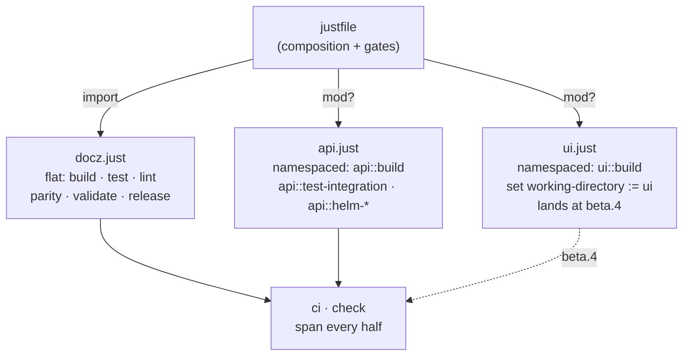
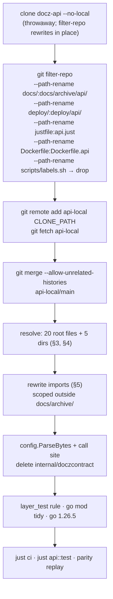
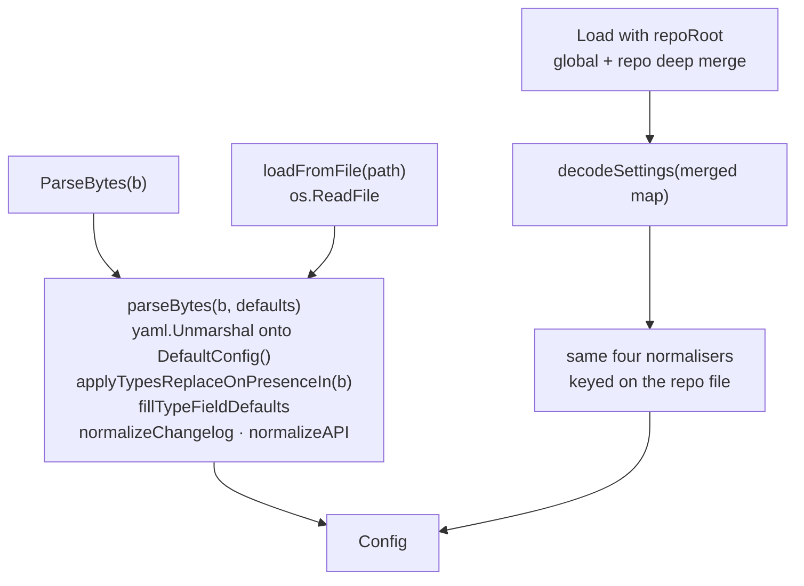

<!-- markdownlint-disable-file MD025 MD041 -->

# DESIGN-0016: Move docz-api in: internal, cmd/docz-api, api, charts, and config.ParseBytes

<!--toc:start-->
- [Overview](#overview)
- [Goals and Non-Goals](#goals-and-non-goals)
  - [Goals](#goals)
  - [Non-Goals](#non-goals)
- [Background](#background)
- [Detailed Design](#detailed-design)
  - [1. What arrives, and where](#1-what-arrives-and-where)
  - [2. just: 27 colliding names, and the composition that actually loads](#2-just-27-colliding-names-and-the-composition-that-actually-loads)
  - [3. The 20 colliding root files](#3-the-20-colliding-root-files)
  - [4. .github/: seven collisions, ten arrivals](#4-github-seven-collisions-ten-arrivals)
  - [5. The import rewrite](#5-the-import-rewrite)
  - [6. Grafting the history](#6-grafting-the-history)
  - [7. pkg/ may not import internal/](#7-pkg-may-not-import-internal)
  - [8. The document archive](#8-the-document-archive)
  - [9. go.mod, the toolchain, and what the consumer module sees](#9-gomod-the-toolchain-and-what-the-consumer-module-sees)
- [API / Interface Changes](#api--interface-changes)
  - [config.ParseBytes](#configparsebytes)
  - [The call site it deletes](#the-call-site-it-deletes)
  - [No other API changes](#no-other-api-changes)
- [Data Model](#data-model)
- [Testing Strategy](#testing-strategy)
  - [What has to keep passing unchanged](#what-has-to-keep-passing-unchanged)
  - [New tests this design requires](#new-tests-this-design-requires)
  - [Inherited suites](#inherited-suites)
  - [The gate](#the-gate)
- [Migration / Rollout Plan](#migration--rollout-plan)
- [Open Questions](#open-questions)
  - [1. How does just compose two halves whose recipe names collide?](#1-how-does-just-compose-two-halves-whose-recipe-names-collide)
  - [2. How are the two .golangci.yml configs reconciled?](#2-how-are-the-two-golangciyml-configs-reconciled)
  - [3. What happens to the two CHANGELOG.mds?](#3-what-happens-to-the-two-changelogmds)
  - [4. Is docs/archive/ published, and does the beta path publish a container?](#4-is-docsarchive-published-and-does-the-beta-path-publish-a-container)
  - [5. Does Dockerfile become Dockerfile.api now?](#5-does-dockerfile-become-dockerfileapi-now)
  - [6. Is a knowingly-red Phase 2 acceptable?](#6-is-a-knowingly-red-phase-2-acceptable)
- [References](#references)
<!--toc:end-->

<!--docz:overview:start-->
## Overview

docz-api moves into this repository as part of the same Go module: its 15
`internal/` packages, `cmd/docz-api`, the single `api/openapi.yaml`, and
`charts/docz-api`, with 161 commits of history grafted on rather than squashed.
Its 24 docz documents land verbatim under `docs/archive/api/` and nothing is
renumbered. The one API addition the move requires is `config.ParseBytes`, which
deletes the temp-directory write the server performs on every ingest. This is
the second of ADR-0004's three units and ships as `v2.0.0-beta.3`.

The load-bearing claim is that **no import path under `pkg/` changes**, so
everything `v2.0.0-beta.1` published stays true. What the move adds is a rule
the module graph used to enforce for free: `pkg/` may not import `internal/`.

<!--docz:overview:end-->

## Goals and Non-Goals

<!--docz:goals:start-->
### Goals

- **One module, both halves.** 106 Go files and 21 direct requirements merge
  into `go.mod`; `go build ./...` and `go test -race ./...` cover the library,
  the CLI, and the server in one run. A library change that breaks the server
  cannot be merged, which is strictly stronger than the pin guard it replaces.
- **History survives.** `git log` and `git blame` answer questions about
  `internal/store/` and `charts/docz-api/` after the move, because the commits
  carry target paths (`git filter-repo`) before the merge.
- **Zero import-path churn under `pkg/`** (ADR-0004 Decision 2) and zero
  renumbered documents (its Open Question 1, resolved (a)). The **482** ambiguous
  doc-ID references inside docz-api's own documents stay valid by never being
  touched.
- **`config.ParseBytes`** replaces `MkdirTemp` + `WriteFile` + `Load` in
  `internal/ingest`, and is pinned equal to `Load` on the same bytes.
- **The library/server boundary becomes a test.** `layer_test.go` gains one rule
  so DESIGN-0014 §7 R8 ("no telemetry, no logger under `pkg/`") is enforced by
  name rather than by whichever of seven OpenTelemetry modules happened to be at
  the end of a dependency chain.
- **`just` keeps working for both halves** without renaming either half's
  recipes, and without breaking a single command documented in PR #118.
- **The toolchain goes to `go 1.26.5`**, closing GO-2026-4970. It was
  deliberately held out of the `just` migration because sharing a module with
  docz-api is what forces it, and that is this unit.

<!--docz:goals:end-->

<!--docz:non-goals:start-->
### Non-Goals

- **docz-site / `ui/`.** That is `v2.0.0-beta.4` and its own design.
- **Renumbering, promoting, or editing any archived document.** Three stale
  statuses and two forward pointers are the only edits — ADR-0004's five and
  four count docz-site's as well — and they happen in the home repository
  before the merge.
- **Restructuring `pkg/`.** ADR-0004 Decision 2 deleted that work; this design
  does not reintroduce it.
- **Reshaping the server.** The HTTP surface, the Postgres schema, `sqlc`, the
  queue, and the search index arrive as they are. A consolidation that also
  refactored the thing being consolidated could not be reviewed.
- **Amending DESIGN-0008 or DESIGN-0009** (ADR-0004 Decision 9). `internal/doczcontract`
  is deleted, which is not an amendment — the pin it guarded is what goes.
- **An umbrella Helm chart.** Two charts side by side on one tag (Decision 8).
- **Deleting or archiving the docz-api repository.** That happens after this
  lands and is verified, not as part of it.

<!--docz:non-goals:end-->

<!--docz:background:start-->
## Background

ADR-0004 decided the consolidation and sequenced it: `just` migration →
docz-api → docz-site, a beta each. The `just` migration shipped in PR #118 and
is on `main`. INV-0011 is the inventory underneath both.

This design measured the incoming repository again rather than trusting the
inventory, and **four of ADR-0004's factual claims did not survive**. Three are
cheaper than the ADR thought and one is a blocker the ADR did not see:

| ADR-0004 claim | Measured | Effect |
| --- | --- | --- |
| Decision 4: "docz-api already splits `docker.just` out this way, so the pattern is imported rather than invented" | `docker.just` is referenced by **nothing**. Its own header says "justfile with `import 'docker.just'`" — the import line was never added | The pattern is invented here after all, and `docker.just` is dead code arriving |
| OQ 2: "12 files, 2 directories" duplicated | **20 root files collide**, none byte-identical, plus 10 arriving new; **5 top-level directories** collide | The reconciliation is roughly twice the size, and includes `.golangci.yml` and `CHANGELOG.md`, which the ADR's list omitted |
| OQ 2: "without docz-api's `deploy/secrets/` and `.env.local` lines, the first `git add -A` … commits a private key into a public repository" | docz's `.gitignore` **already** covers `secrets/`, `deploy/secrets/`, `*.pem`, `.env`, `.env.local`, `.env.production`, `.env.*.local`. Verified with `git check-ignore` on five representative paths | The one item flagged as non-cosmetic is already done. The real delta is `.idea/`, `.vscode/`, `coverage.html`, `coverage.txt` |
| Decision 4: "each half keeps its own recipes and the root file is composition" | **27 names collide** between `docz.just` and docz-api's `justfile` — 12 variables and 15 recipes — and `just` treats either as a **hard error**, refusing even `just --list` | Composition as written does not load. See §2 |

The last one is the reason this design exists as a document rather than as a
checklist. Everything else here is mechanical.

<!--docz:background:end-->

<!--docz:detailed-design:start-->
## Detailed Design

### 1. What arrives, and where

docz-api is 263 tracked files, 106 of them Go, across 161 commits. Its tree is
already the target layout for four of the five things that matter, because
ADR-0004 Decision 2 derived the layout from it.

| Incoming path | Target path | Files | Rewrite needed |
| --- | --- | --- | --- |
| `internal/` (15 packages) | `internal/` | 111 | import paths only |
| `cmd/docz-api/` | `cmd/docz-api/` | 4 | import paths only |
| `api/` | `api/` | 4 | import paths only |
| `charts/docz-api/` + `charts/.yamllint.yml` | same | 44 | none |
| `contrib/` | `contrib/` | 3 | none |
| `deploy/` | `deploy/api/` | 16 | path move |
| `docs/` | `docs/archive/api/` | 31 | path move, contents untouched |
| `justfile` | `api.just` | 1 | rename + §2 |
| `Dockerfile` | `Dockerfile.api` | 1 | rename (OQ 5) |
| `scripts/labels.sh` | drops — byte-identical to ours | 1 | none |
| 20 colliding root files | merged one by one | 20 | §3 |
| 10 new root files | arrive as they are | 10 | none |
| `.github/` | merged | 17 | §4 |

`internal/` is free: this repository has had no `internal/` since IMPL-0018
Phase 2, so the server's 15 packages land without a single name contest.

`cmd/` collides only as a directory. docz owns `cmd/*.go` (the Cobra tree) and
`cmd/docz/`; docz-api owns `cmd/docz-api/` and nothing else. **No file
collides.**

The incoming `internal/` packages, by file count:

```text
store 29   httpapi 12   ingest 10   auth 9    search 8
queue 8    doczcontract 8            session 5  webhook 4
telemetry 4  githubapp 4  config 4   authhttp 4  e2e 3   authorize 3
```

`internal/doczcontract` (8 files, 804 lines) is deleted rather than moved —
ADR-0004 Open Question 3 — with `TestConfigLoadsFixtureManifest` relocated to
the ingest tests. `internal/config` is the *server's* config (database URL,
OIDC issuer, telemetry endpoint) and has nothing to do with
`pkg/doczcore/config`; the two coexist because one is a path and the other is a
package name.

### 2. `just`: 27 colliding names, and the composition that actually loads

This is the one part of ADR-0004 Decision 4 that does not work as written.

docz-api's `justfile` and this repository's `docz.just` are structurally the
same file — deliberately, since `docz.just` was written from docz-api's pattern
in PR #118. That is exactly what makes them uncombinable:

| Colliding | Names |
| --- | --- |
| Variables (12) | `project_name` `project_owner` `go_package` `build_dir` `bin_dir` `coverage_out` `allowed_licenses` `goimports_local` `commit_hash` `version` |
| Recipes (15) | `build` `build-core` `clean` `run` `test` `test-all` `test-pkg` `test-coverage` `test-report` `lint` `lint-fix` `fmt` `license-check` `license-report` `release` `release-check` `release-local` |

Measured on `just 1.51.0`, a duplicate across two sibling `import`s is fatal for
either kind, and it fails at parse time — `just --list` does not even run:

```text
error: variable `project_name` has multiple definitions
error: recipe `build` first defined on line 3 is redefined on line 3
```

Three ways out, and the one that costs nothing already documented:

**Just modules.** `mod api 'api.just'` gives the imported file its own
namespace for both variables and recipes. Recipes are then addressed as
`just api build`, and a root recipe can depend on one as `api::build`. Verified:

```text
mod docz 'docz.just'   →  just docz build,  just api build
mod api  'api.just'       ci: docz::lint api::lint  works
                          just --list shows `docz ...` and `api ...`
```

Making *both* halves modules is the symmetric answer and the wrong one: every
command in `CLAUDE.md`, `CONTRIBUTING.md`, `DEVELOPMENT.md`, `README.md`,
`test/parity/README.md`, and `ci.yml` becomes `just docz build`, one PR after
those files were rewritten to say `just build`. That is a second documentation
sweep bought for symmetry alone.

**The hybrid loads and changes nothing.** Flat-import the half that owns the
root namespace; make the arriving halves modules:

```just
import 'docz.just'          # build, test, lint, parity, validate — unchanged
mod? api 'api.just'         # just api build, just api test-integration
mod? ui  'ui.just'          # arrives at beta.4; cwd is ui/ by its own setting

ci: lint test test-consumer parity validate build license-check \
    api::lint api::test api::helm-lint
    @echo "✓ CI pipeline complete"
```



Verified end to end: `just build`, `just lint`, and `just ci` behave exactly as
they do today; `just api build` and `just ui build` resolve; a root gate
depending on `api::lint` runs it with the repository root as its working
directory; and `mod?` means the root `justfile` loads before `api.just` exists,
which is what lets this land in stages.

`ui.just` needs `cwd = ui/` for its Bun commands, and there are two spellings
that produce it: put the file inside `ui/` (a module in a subdirectory runs
there) or keep it at the root with `set working-directory := "ui"`. Both were
verified to print `cwd=ui`. Open Question 1 takes the second, so the three
task-runner files sit together at the root as ADR-0004 Decision 4 describes.

Two consequences to write down. `api.just` arrives **essentially verbatim**: a
module has its own variable namespace, so not one of the twelve variables needs
renaming, which is the cheapest possible import of 324 lines. And
`docker.just` is dead on arrival (nothing references it), so it either becomes
part of `api.just` or is dropped — it is not "already split out".

Recipe inventory after the move, for the two halves that exist:

| Concern | docz (flat) | docz-api (`api::`) |
| --- | --- | --- |
| build / clean / run | `build` `build-core` `clean` `run` | `build` `clean` `run` `run-local` |
| test | `test` `test-pkg` `test-coverage` `test-report` `test-consumer` `parity` | `test` `test-pkg` `test-coverage` `test-report` `test-integration` |
| lint | `lint` `lint-fix` `fmt` | `lint` `lint-fix` `lint-config` `lint-actions` `lint-alerts` `lint-openapi` `fmt` |
| docs / validate | `validate` `docs-*` | — |
| codegen | — | `generate` `generate-check` (sqlc) |
| containers / dev env | — | `dev-*` `local-*` `monitor-*` `docker-*` |
| helm | — | `helm-lint` `helm-template` `helm-unittest` `helm-docs` |
| release | `release` `release-check` `release-local` | same three, namespaced |

`lint-openapi` matters beyond tidiness: it is the vacuum ruleset run against
`api/openapi.yaml`, the file that existed in two byte-identical hand-copied
versions with no sync step (INV-0011 Observation 4). After the move there is one
copy and one linter over it, which is the concrete thing consolidation buys.

### 3. The 20 colliding root files

None are byte-identical, so each is a decision rather than a deduplication.

| File | docz | api | Resolution |
| --- | --- | --- | --- |
| `go.mod` | 15 | 129 | Union of requires; `go 1.26.5`; module path stays `docz/v2` |
| `go.sum` | 22 | 392 | Regenerated by `go mod tidy` |
| `justfile` | 34 | 324 | api's becomes `api.just` (§2); docz's stays |
| `CLAUDE.md` | 94 | 1269 | Fold api's server sections into ours (Decision 2 of OQ 2) |
| `DEVELOPMENT.md` | 975 | 296 | Ours, plus an api section |
| `README.md` | 784 | 56 | Ours, plus a server section and the two-chart note |
| `CHANGELOG.md` | 460 | 277 | OQ 3 |
| `.golangci.yml` | 320 | 311 | OQ 2 |
| `.gitignore` | 90 | 64 | Add `.idea/`, `.vscode/`, `coverage.html`, `coverage.txt`. **Secrets already covered** |
| `.goreleaser.yml` | 87 | 97 | Two `builds:` entries; keep our `signs:` and api's syft SBOM |
| `.docz.yaml` | 98 | 112 | Ours. api's docs stop being a docz tree when they become an archive |
| `mise.toml` | 62 | 75 | Union of tools |
| `.markdownlint.yaml` | 53 | 62 | Union of disables |
| `.yamllint.yml` | 52 | 54 | Union; `charts/.yamllint.yml` stays chart-scoped |
| `.prettierrc.yaml` | 66 | 46 | Ours |
| `catalog-info.yaml` | 22 | 19 | Two Backstage components, one file |
| `.yamlfmt.yml` | 18 | 18 | Either; identical line count, differing content |
| `.codecov.yml` | 12 | 12 | Union of paths |
| `renovate.json5` | 9 | 10 | Union |
| `LICENSE` | 202 | 201 | Ours (Apache 2.0 both; the delta is the copyright line) |

Ten arrive with no contest: `.dockerignore`, `.env.example`, `.forge-lock.hcl`,
`cliff.toml`, `compose.yaml`, `ct.yaml`, `docker-bake.hcl`, `docker.just`,
`Dockerfile`, `sqlc.yaml`.

Directory-level: `.claude/`, `.github/`, `cmd/`, `docs/`, and `scripts/`
collide; `api/`, `charts/`, `contrib/`, `deploy/`, `internal/` arrive free;
`pkg/`, `test/`, `testdata/` are untouched.

`scripts/labels.sh` is **byte-identical** in both (verified by
`git hash-object`), so it collapses. `.claude/settings.json` is nearly a
superset already — ours has 41 `allow` entries to api's 33, and of api's six
extras three are dead `make` entries, one is `Bash(git *)` (excluded on
purpose), leaving `Bash(git commit -m ' *)` and `Bash(just --list)`.

One piece of unrelated debris to sweep while here: **`.checkmake.ini` is still
tracked** and has had nothing to configure since the Makefile was deleted.

### 4. `.github/`: seven collisions, ten arrivals

| Colliding | Resolution |
| --- | --- |
| `workflows/ci.yml` | Merge. api's has a `changes:` (Detect changes) job — the path filtering ADR-0004 OQ 4 chose, already built. Jobs to absorb: `lint-alerts`, `security`, `docker-build`, `helm-unittest`, `helm-test` |
| `workflows/release.yml` | Merge. Both are `push: [main]` + `pr-semver-bump`. api's adds `publish-ghcr` and `publish-ecr`; ours adds GPG import |
| `workflows/license-check.yml` | Union of allowed licences |
| `workflows/pr-labels.yml`, `labeler.yml` | Union of label rules |
| `CODEOWNERS`, `licenses-csv.tpl` | Either; single owner |

Arriving: `actionlint.yml`, `dependabot.yml`, `changelog.yml`,
`changelog-regen.yml`, `codeql.yml`, `dependabot-severity-label.yml`, `ecr.yml`,
`ghcr.yml`, `security.yml`, `trufflehog.yml`.

`ghcr.yml` and `ecr.yml` are `workflow_call`/`workflow_dispatch` only — they
publish nothing on their own. `release.yml` invokes them with the bumped tag.
Since the v2 line cuts **betas by hand** and never through `pr-semver-bump`,
nothing on the beta path publishes a container today. That is OQ 4.

### 5. The import rewrite

| Rewrite | Files | Lines |
| --- | --- | --- |
| `github.com/donaldgifford/docz-api/…` → `github.com/donaldgifford/docz/v2/…` | 44 | 107 |
| `github.com/donaldgifford/docz/pkg/…` → `github.com/donaldgifford/docz/v2/pkg/…` | 11 | 20 |
| Non-Go files naming the module path | 12 | — |

The second row is the whole of the "v2 upgrade" for the server. It uses eight
exported symbols in production code, all from packages frozen at v1.0.0:

```text
docparse.Title
config.{Config, DefaultConfig, Load, TypeConfig,
        APILandingFileName, TemplatesDir, WikiIndexName}
```

All eleven files alias the import as `doczcfg`, which stays correct and stays
useful: after the move `internal/ingest` imports both its own `config` and the
library's, in the same file.

The non-Go files are `go.mod`, `docker-bake.hcl`, `cliff.toml`,
`.goreleaser.yml`, `catalog-info.yaml`, `CHANGELOG.md`, `CLAUDE.md`,
`DEVELOPMENT.md`, and four under `charts/docz-api/`.

**Five files that name the module path must not be rewritten**: docz-api's
`docs/impl/0004`, `0008`, `0009`, `docs/design/0004`, and
`docs/investigation/0006`. They are archived records, and a record that cites
`github.com/donaldgifford/docz-api` is citing what was true. The rewrite is
therefore scoped to tracked files **outside `docs/archive/`**, and a test or
review step has to assert that, because a repository-wide `sed` is the obvious
way to do this and it is wrong.

### 6. Grafting the history



Two properties this ordering buys. The renames happen **before** the merge, so
every commit in the grafted history names the path the file lives at now, and
`git log docs/archive/api/` and `git blame internal/store/store.go` both work
without `--follow` heuristics. And the merge is a genuine merge commit with two
parents, so nothing is rewritten on `main` and the operation is revertible as
one commit until the follow-up work lands on top.

`--no-local` on the clone matters: a local clone hardlinks objects, and
`filter-repo` rewriting history through a hardlinked object store can corrupt
the source repository. The source is also the place where the status sweep and
the two forward pointers happen, so it must survive intact.

### 7. `pkg/` may not import `internal/`

ADR-0004 Decision 3 supersedes ADR-0001 Decision 3. Until now a public package
importing `internal/` was legal-but-moot; with the server there it would
silently give `pkg/` seven OpenTelemetry modules and a Postgres driver, making
DESIGN-0014 §7 R8 false without any test saying so.

`pkg/doczcore/layer_test.go` already fails on it by accident —
`TestLayerRules_ThirdPartyDependencies` allows exactly `go.yaml.in/yaml/v3`
under `pkg/...`, so any server dependency reaching the library fails there
today. The failure would name a database driver, not the rule. One new test:

```go
// TestLayerRules_PkgNeverImportsInternal pins ADR-0004 Decision 3. The
// third-party allow-list above already fails when a server dependency reaches
// pkg/, but it fails naming whichever module was at the end of the chain. This
// names the rule.
func TestLayerRules_PkgNeverImportsInternal(t *testing.T) { … }
```

It walks `go list <modulePath>/pkg/...` — the same enumeration the existing
tests use — and fails on any dependency prefixed `modulePath + "/internal/"`.
The reverse direction stays legal and is exercised immediately:
`internal/ingest` imports `pkg/doczcore/config`.

### 8. The document archive

24 documents, 6 type-directory READMEs, and `docs/operations/ecr-publish-setup.md`
move to `docs/archive/api/` with their bodies untouched. Statuses confirmed
against the live repository:

| Status | Count | IDs |
| --- | --- | --- |
| Finished | 19 | DESIGN-0001–0005, IMPL-0003–0005, IMPL-0007–0010, INV-0001, INV-0004–0009 |
| Stale, swept to `Completed` first | 3 | IMPL-0001 (Draft, 58/59 done), IMPL-0002 (Draft, 32/32), IMPL-0006 (In Progress, 31/32) |
| Genuinely unfinished → successor here | 2 | INV-0002, INV-0003 (both Open) |

The sweep runs in **docz-api** before the clone, so the archived frontmatter is
honest and the change is in that repository's history where it belongs.
INV-0002 and INV-0003 each get a successor document in this repository's
sequence citing the archived original, and the original gets a one-line dated
pointer forward.

Three mechanical consequences, all from the archive not being under a type
directory:

- `docz update` and `docz validate` never see it — including its frontmatter,
  which is correct for a record.
- `wiki.ScanDocs` walks all of `DocsDir`, so it *will* appear in the MkDocs nav
  unless excluded. Same for `api.exclude`. That is OQ 4.
- Each tree needs a one-line `README.md` stating the namespace rule — *inside
  this directory, an ID means docz-api's* — which is the only thing keeping 757
  ambiguous references honest.

### 9. `go.mod`, the toolchain, and what the consumer module sees

The merged `go.mod` is the union: 21 direct requirements (2 + 19 net of the
`docz` self-dependency, which disappears) and ~99 indirect, at `go 1.26.5`.
`test/consumer/go.mod` moves to 1.26.5 with it.

One consequence to measure rather than assume. `test/consumer` is a separate
module that `replace`s docz/v2 to `../..`, so its module graph includes every
requirement in docz/v2's `go.mod`. Today that is 6 modules and a 12-line
`go.sum`. After the move it is ~120, and `go mod tidy` there needs a `go.mod`
hash for each even though it builds packages from almost none of them (module
graph pruning still applies to *building*, not to graph loading).

This is not a problem to solve — it is ADR-0004 Decision 1's accepted cost,
made visible. `test/consumer` becomes the in-repo measurement of what a real
consumer pays, so the IMPL records `go.sum`'s line count before and after
rather than letting it drift silently.

<!--docz:detailed-design:end-->

<!--docz:api-changes:start-->
## API / Interface Changes

### `config.ParseBytes`

The only addition. It is additive, so ADR-0001 Decision 6's freeze holds under
ADR-0001 Open Question 7's roll-forward semver.

```go
// ParseBytes decodes one .docz.yaml's bytes onto the defaults. It reads no
// file and merges no global config, which is the point: a consumer holding
// bytes it fetched has neither.
//
// Normalisation matches Load exactly, so a config parsed from bytes and the
// same config parsed from a file cannot disagree. Validation stays the
// caller's call, as it is for Load.
func ParseBytes(b []byte) (Config, error)
```

**The signature returns `Config`, not `*Config`.** ADR-0004 Decision 6 wrote
`(*Config, error)`; `Load` returns `(Config, error)` and every caller in the
module and in docz-api holds a value. A pointer here would make the two
entry points to the same data disagree in shape for no benefit, and
`docwrite`'s byte cores set the precedent of matching the path version's
shape. This is a deliberate divergence from the ADR's illustrative snippet,
flagged rather than quietly taken.

**There is one real obstacle, and it is why this needs designing.** `Load`'s
normalisation chain ends in four calls, and the first of them takes a *path*:

```go
applyTypesReplaceOnPresence(&cfg, repoConfigPath)   // ← re-reads the file
fillTypeFieldDefaults(&cfg)
normalizeChangelog(&cfg)
normalizeAPI(&cfg)
```

`applyTypesReplaceOnPresence` enforces the INV-0003 contract — a `types:` block
in the repo config *replaces* the default type map instead of merging into it —
and it answers "did the user list types?" by calling `userListedTypeNames(path)`,
which does its own `os.ReadFile` and its own `yaml.Unmarshal` into a raw map.
`ParseBytes` has no path, so the helper has to be split:

```go
func userListedTypeNames(path string) []string      // ReadFile, then ↓
func userListedTypeNamesIn(data []byte) []string    // the existing body
```

With that, the whole of `loadFromFile`'s body becomes a bytes function and
`ParseBytes` *is* that function:



`Load`'s *merge* path keeps its own shape — it deep-merges two raw maps and
round-trips the result through `decodeSettings`, which single-file parsing has
no reason to do. So the guarantee is structural on one path and tested on the
other:

- `ParseBytes(b)` and `Load(path, "")` are the **same code**, so they cannot
  diverge.
- `ParseBytes(b)` and `Load("", dir)` where `dir` holds only that file are
  **pinned equal by test**, which is the non-tautological half and the one
  ADR-0004 Decision 6 asked for.

That second test must neutralise `HOME` (`t.Setenv("HOME", t.TempDir())`),
because `Load`'s merge path reads `$HOME/.docz.yaml` and a developer's global
config would otherwise decide whether the test passes. docz-api's own ingest
tests already do this for the same reason (INV-0011 Observation 2) — after
`ParseBytes` lands they no longer need to.

### The call site it deletes

`internal/ingest/parse.go` currently writes the bytes it fetched to a temp
directory on **every ingest**, loads from there, and removes it:

```go
func loadConfig(configYAML []byte) (doczcfg.Config, error) {
    dir, err := os.MkdirTemp("", "docz-ingest-*")      // ~20 lines of
    …                                                   // MkdirTemp, WriteFile,
    if err := os.WriteFile(filepath.Join(dir, ".docz.yaml"), configYAML, 0o600)
    cfg, err := doczcfg.Load("", dir)                   // deferred RemoveAll,
    …                                                   // and a slog.Warn
}
```

becomes `doczcfg.ParseBytes(configYAML)`. Three filesystem operations, a
goroutine-unsafe `$HOME` dependency, and a temp-directory cleanup path leave
the ingest hot path.

### No other API changes

`cmd/docz` gains nothing. `docz-api`'s CLI surface is unchanged. The eleven
experimental packages keep their `EXPERIMENTAL` markers — the v2.0.0 cut that
removes them is after docz-site, not here.

<!--docz:api-changes:end-->

<!--docz:data-model:start-->
## Data Model

**docz's data model does not change.** No frontmatter field, no `.docz.yaml`
key, no marker kind, and no golden file is touched by this move.

The server's data model arrives intact and unexamined:

| Concern | What arrives | Note |
| --- | --- | --- |
| Postgres schema | `internal/store/migrations` (embedded) | Unchanged; `sqlc.yaml` arrives with it |
| Generated queries | `sqlc` output under `internal/store` | `api::generate` / `api::generate-check` regenerate and verify |
| Queue | `asynq` over Valkey/Redis | Unchanged |
| Search index | Meilisearch documents | Unchanged |
| Session store | `internal/session` | Unchanged |
| Wire contract | `api/openapi.yaml`, embedded via `api/spec.go` | **Now one copy instead of two** |

`api/spec.go` is worth naming because it is the only Go file outside `internal/`
and `cmd/` that arrives. It is `package api` with a single
`//go:embed openapi.yaml` var, served verbatim at `GET /openapi.yaml` and loaded
by the `httpapi` contract test, so served bytes and tested bytes are provably
the same. After the move that property extends to the linter (`api::lint-openapi`)
and, at beta.4, to orval's generated client — one spec, three consumers, no
copy step.

<!--docz:data-model:end-->

<!--docz:testing:start-->
## Testing Strategy

### What has to keep passing unchanged

| Suite | Why it is at risk | Expectation |
| --- | --- | --- |
| `test/parity` (213 goldens, v1.2.2) | Goldens record CLI stdout/stderr/tree byte-for-byte | **Zero diff.** The move touches no `cmd/` file and no template |
| `test/consumer` (16 packages) | Its module graph grows from 6 to ~120 | Passes; `go.sum` line count recorded before and after (§9) |
| `pkg/doczcore/layer_test.go` | Gains a rule, and the server is the first thing that could break the old ones | 5 tests green, including the new one |
| `go test -race ./...` | Now spans both halves | Green. Integration tests are behind `//go:build integration`, so the default run needs no Postgres, Valkey, or Meilisearch |

That last row is the happy accident that makes the merge cheap: both
repositories' `test` recipe is *already* `go test -v -race ./...`, and all eight
of docz-api's service-dependent test files carry `//go:build integration`.
`testcontainers-go` is a direct requirement but is only reached from those
files, so the default suite stays hermetic.

### New tests this design requires

1. **`ParseBytes` ≡ `Load`** — table-driven over the `.docz.yaml` shapes that
   exercise each normaliser: a `types:` block (INV-0003 replacement), an
   explicit `changelog.file: ""`, an `api:` block with a trailing-slash
   `exclude`, a custom type with aliases, and an empty file. Each asserts
   `ParseBytes(b)` equals `Load("", dir)` with `HOME` neutralised.
2. **`ParseBytes` touches no filesystem** — run it with `HOME` and the working
   directory pointed at empty temp dirs and assert the result still matches a
   config with a global file present. The current temp-dir dance is what this
   is replacing, so proving the replacement reads nothing is the point.
3. **`TestLayerRules_PkgNeverImportsInternal`** — §7.
4. **The import rewrite spared the archive** — assert no tracked file outside
   `docs/archive/` names `github.com/donaldgifford/docz-api`, and that the five
   archived documents that do still do.
5. **`TestConfigLoadsFixtureManifest`**, relocated from `doczcontract` to the
   ingest tests, unchanged in substance.

### Inherited suites

`api::helm-unittest`, `api::helm-lint`, and chart-testing (`ct.yaml`) arrive and
run. `api::lint-openapi` (vacuum) now lints the only copy of the spec.
`api::lint-alerts` checks `contrib/prometheus/alerts.yaml`. `api::test-integration`
stays opt-in and out of the default gate.

### The gate

`just ci` grows to span both halves (§2). The acceptance criterion for the whole
move is that it is green, `just parity` shows zero golden diffs, and
`just api::test-integration` passes locally against `compose.yaml` — the last of
those is not in CI and is not claimed to be.

<!--docz:testing:end-->

<!--docz:rollout:start-->
## Migration / Rollout Plan

Six phases, one PR each, in this order. The ordering is chosen so that the
irreversible step (the history graft) happens when the tree around it is
already correct, and so every phase before it is independently revertible.

| Phase | Lands | Revertible | Gate |
| --- | --- | --- | --- |
| 0 | `go 1.26.5`; `.checkmake.ini` deleted; root `justfile` reshaped to `import 'docz.just'` + `mod?` stubs (OQ 1) | yes | `just ci` |
| 1 | `config.ParseBytes` + its tests, in docz alone | yes | `just ci`, `just test-consumer` |
| 2 | Status sweep + 2 forward pointers **in docz-api**; `filter-repo` clone (incl. `Dockerfile` → `Dockerfile.api`, OQ 5); `--allow-unrelated-histories` merge; root files, `.github/`, and the `cliff.toml` graft rule (OQ 3) resolved | as one merge commit | **red by decision** (OQ 6): `graft` label skips the Go jobs |
| 3 | Import rewrite (§5); `go mod tidy`; `api.just`; `internal/doczcontract` deleted, its one test relocated; `ParseBytes` call site swapped; `.golangci.yml` union to a zero baseline (OQ 2), `golines` reflow as its own commit | yes | `just ci` + `just api::test`; `graft` label removed |
| 4 | `layer_test` rule; `docs/archive/api/{README,CHANGELOG}.md`; `wiki.exclude` + `api.exclude` set together (OQ 4); `prerelease.yml` calls `ghcr.yml`; successors for INV-0002 and INV-0003 | yes | `just ci`, `just validate` |
| 5 | `v2.0.0-beta.3` cut by hand from the merge commit | n/a | `prerelease.yml`; then verify the published image, the wiki, and the `api:` listing (OQ 4) |

Phase 2 is the only one that cannot be split, and it is deliberately the phase
with the weakest gate: after an unrelated-histories merge the tree has 44 Go
files with unresolvable imports, so `go build ./...` failing is the *expected*
state and Phase 3 is what makes it green. Landing a knowingly-red commit is the
cost of keeping the graft as one reviewable merge; the alternative is a Phase 2
that also does the rewrite, which is a PR nobody can read. Open Question 6
takes that trade and pins the mechanism: a `graft` label the Go jobs check,
removed when Phase 3 lands.

**The docz-api repository is not touched between Phases 2 and 5**, other than
the status sweep and the two forward pointers that Phase 2 opens with. Those
edits land there first precisely so the clone that follows carries them.

**Rollback.** Before Phase 5 the whole move is `git revert -m 1` of Phase 2's
merge commit plus the ordinary reverts of 3 and 4. After the beta tag it is a
forward fix, which is the same posture every beta on this line has had.

**The docz-api repository stays live and untouched** until beta.3 is cut and
verified — it is the rollback target. Archiving it read-only is a follow-up,
not a task here.

<!--docz:rollout:end-->

<!--docz:open-questions:start-->
## Open Questions

> Each question is numbered; option `a` is my recommendation, later letters are
> alternatives, and the last is a free-form "other".

### 1. How does `just` compose two halves whose recipe names collide?

27 names collide and `just` treats either kind as a parse-time error (§2). This
is the one blocker in ADR-0004 Decision 4 as written, so it has to be answered
before Phase 0.

> **Resolved 2026-09-22: (a).** The end state is the three files ADR-0004
> Decision 4 names — `docz.just`, `api.just`, `ui.just` — all at the repository
> root beside the `justfile`, composed as:
>
> ```just
> import  'docz.just'        # flat: build · test · lint · parity · validate
> mod? api 'api.just'        # just api build · just api test-integration
> mod? ui  'ui.just'         # just ui build · set working-directory := "ui"
> ```
>
> Only the *addressing* is asymmetric: `docz.just`'s recipes keep the root
> namespace so every command PR #118 documented still works, and the two
> arriving halves are namespaced so none of their 27 colliding names has to be
> renamed. A module owns its variables, so `api.just` is docz-api's `justfile`
> under a new name and nothing else.
>
> One correction to §2, which had `ui.just` living inside `ui/`. A module in a
> subdirectory gets that directory as its working directory for free, which is
> what a Bun application needs — but `set working-directory := "ui"` in a
> root-level `ui.just` produces **exactly the same `cwd`** (verified on just
> 1.51.0, both spellings print `cwd=ui`). One declared line is worth keeping the
> three task-runner files together where a reader finds them, and it is what
> Decision 4 literally describes.
>
> Two settings notes for Phase 0: a module carries its own `set shell`, so
> `api.just` keeps docz-api's verbatim and the root `justfile` does not have to
> reach into it; and `mod?` makes both optional, so the root file loads today,
> before either file exists.

- a. **Flat-import `docz.just`, `mod?` the arriving halves.** `just build`,
  `just test`, `just lint`, `just ci` keep working exactly as PR #118
  documented them; the server is `just api build`, the frontend `just ui build`.
  Root gates span both via `api::lint`. `api.just` arrives verbatim — a module
  has its own variable namespace, so none of the twelve variables needs
  renaming. Verified working on just 1.51.0, including `mod?` loading before
  the file exists. The asymmetry is the cost: one half is privileged at the
  root and a reader has to know why. *(recommendation)*
- b. **Both halves as modules** (`mod docz`, `mod api`). Symmetric and
  self-documenting — `just --list` shows two namespaces and neither is
  special. Costs a second documentation sweep one PR after the first:
  `CLAUDE.md`, `CONTRIBUTING.md`, `DEVELOPMENT.md`, `README.md`,
  `test/parity/README.md`, and `ci.yml` all change `just X` to `just docz X`,
  and every command in every merged PR description goes stale.
- c. **Prefix docz-api's recipes and variables** (`api-build`, `api_project_name`)
  and keep two flat imports. No namespace concept to learn and
  `just api-build` tab-completes from the root. Costs rewriting all 324 lines
  of the incoming file — the opposite of importing it — and the prefixes have
  to be maintained by hand forever after.
- d. Other.

### 2. How are the two `.golangci.yml` configs reconciled?

320 lines against 311, both differing, and this one is not cosmetic: the server
is 106 Go files that have never been linted by docz's config, and docz's config
is tuned for a library (`TestLayerRules` territory — no globals, package
comments everywhere, `lll` off in favour of `golines`).

> **Resolved 2026-09-22: (a) — one config, union of enabled linters,
> path-scoped `issues.exclude-rules` for the server's legitimate exceptions.**
> The split-the-difference option I floated (land two configs, converge later
> in a follow-up issue) is **declined**: a convergence issue filed against a
> working two-config setup is an issue that stays open, and the repository
> would keep two answers to "how is this code linted" indefinitely.
>
> The cost lands squarely on Phase 3 and is named so nobody is surprised by it:
> the first `golangci-lint run ./...` over `internal/` is expected to produce
> tens to low hundreds of findings, and **Phase 3 is not done until each one is
> either fixed or excluded with a written reason**. An `exclude-rules` entry
> with no comment is not an exclusion, it is a deferral.
>
> Two consequences for the IMPL. The union is the strict direction, so the
> baseline is captured *before* any fixing (`golangci-lint run ./... > baseline`
> on the merge commit) and the phase closes when the count reaches zero — a
> number to work against beats a judgement call about when it feels clean
> enough. And `golines` runs as a formatter under golangci-lint here
> (`.golangci.yml:288`), so the server's 106 files get reflowed on first
> `just fmt`; that reflow is its own commit, kept out of the findings diff so a
> reviewer can read each.

- a. **One config, union of enabled linters, with `issues.exclude-rules`
  scoped by path for the server's legitimate exceptions.** One source of truth,
  and the union is the strict direction so nothing gets quietly downgraded.
  The cost is a Phase 3 that is part lint-fixing: the honest expectation is
  tens to low hundreds of findings on first run, and the phase is not done
  until they are fixed or explicitly excluded with a reason.
  *(recommendation — but see the note below, this is the one I am least sure
  about)*
- b. **Two configs**, `.golangci.yml` at the root for `pkg/`, `cmd/`, `test/`
  and a second under `internal/` for the server, with `api::lint` pointing at
  it. golangci-lint supports nearest-config resolution, so this works. Keeps
  Phase 3 honest-sized and lets each half keep the config its code was written
  against; costs the property that one command lints the repository the same
  way everywhere.
- c. **docz's config wins outright**, server exceptions added as they surface.
  Simplest to state and the most likely to generate a long tail of
  `//nolint` comments in code nobody is otherwise touching.
- d. Other.

Worth saying plainly: (a) is the right end state and (b) may be the right
*Phase 3*. Splitting the difference — land (b), converge to (a) in a follow-up
issue — is a legitimate answer and would be option (e) if you want it.

### 3. What happens to the two `CHANGELOG.md`s?

460 lines (docz, through `v2.0.0-beta.1`) and 277 (docz-api, through its own
`v1.x`), one `cliff.toml` after the merge, and `changelog-regen.yml` arriving —
a workflow that regenerates the changelog from git history on every push to
main. After the graft, that history contains both repositories' commits.

> **Resolved 2026-09-22: (a).** docz's `CHANGELOG.md` stays the only one;
> docz-api's moves to `docs/archive/api/CHANGELOG.md` verbatim, which is what
> the archive is for — a record of what a separate project released, under the
> namespace rule that already governs everything else in that directory.
>
> The `cliff.toml` rule is a **hard requirement of Phase 2, not a tidiness
> item**. `changelog-regen.yml` arrives with docz-api and runs on every push to
> `main`; the first run after the graft sees 161 commits that have never
> appeared in docz's changelog and, absent a rule, files them under docz's
> version headings — where `v1.8.2` would mean docz-api's and `v1.2.2` docz's,
> in one list. The commit-parser therefore skips everything reachable only
> through the grafted parent, and the IMPL verifies it by running the regen
> locally against the merge commit before the workflow ever fires on `main`.

- a. **Keep docz's `CHANGELOG.md` as the only one; move docz-api's to
  `docs/archive/api/CHANGELOG.md` verbatim.** The archive already exists for
  exactly this — a record of what a separate project released — and one
  changelog matches one version line. `cliff.toml` gains a commit-parser rule
  so the grafted pre-merge commits do not retroactively appear under docz's
  version headings. *(recommendation)*
- b. **Concatenate under a heading** (`## docz-api (pre-consolidation)`) in the
  single `CHANGELOG.md`. Everything in one file a reader already opens; makes
  that file the union of two unrelated version sequences, and `v1.8.2` in it
  means something different from `v1.2.2`.
- c. **Let `changelog-regen.yml` rebuild it from the merged history** and
  accept whatever git-cliff produces. Honest to the history and needs no
  decision; will interleave two version sequences by date and is the option
  most likely to produce something nobody wants to read.
- d. Other.

### 4. Is `docs/archive/` published, and does the beta path publish a container?

Two questions that turn out to be one, because both are "what does the outside
world see after beta.3".

The archive is 31 files that `wiki.ScanDocs` will walk and the `api:` block
will ingest unless excluded, with IDs that repeat elsewhere in the nav. And
separately: `ghcr.yml`/`ecr.yml` are `workflow_call` only, invoked by
`release.yml` on a `pr-semver-bump` tag — and the v2 line never produces one,
so **no container is published for a beta today**. `charts/docz-api` would then
reference an image tag that does not exist.

> **Resolved 2026-09-22: (a).** Both halves.
>
> The archive is excluded from `wiki.exclude` **and** `api.exclude`, as a pair
> and in the same commit. It stays a git-level record — readable in the
> repository, absent from the rendered wiki and from what docz-api publishes —
> which is what a read-only archive should mean, and it keeps 43 repeated IDs
> out of a nav that is already 54 pages. Option (c)'s warning applies to (a)
> too: the two settings are only correct together, so the IMPL sets them in one
> change and a test asserts neither lists a path the other does not.
>
> `prerelease.yml` gains a job calling `ghcr.yml` with the beta tag, so
> `v2.0.0-beta.3` produces an image and the chart in the same tag references
> something real. The ECR arm stays as docz-api has it — gated on
> `vars.ECR_PUBLISH_ENABLED` — so it remains off until that variable is set and
> no credential is needed to cut a beta.
>
> This is the one resolution that changes what the outside world sees, so it is
> also the one to check after beta.3 rather than assume: pull the published
> image by its beta tag, and fetch the wiki and the `api:` listing and confirm
> neither returns an archived document.

- a. **Exclude the archive from both `wiki.exclude` and `api.exclude`; teach
  `prerelease.yml` to call `ghcr.yml` with the beta tag.** The archive stays a
  git-level record — navigable in the repository, absent from the rendered
  wiki and from what docz-api publishes — which is what "read-only archive"
  should mean, and it keeps 43 repeated IDs out of a nav that is already 54
  pages. Publishing the image on the beta tag is what makes beta.3 a testable
  artifact rather than binaries plus a chart pointing at nothing.
  *(recommendation)*
- b. **Publish the archive under an `Archive` nav section; publish no container
  on betas.** The documents are genuinely useful reading and hiding them is a
  loss; the duplicate IDs are survivable because the section name
  disambiguates. Leaves the chart untestable from a beta tag, which is
  arguably correct — a beta is a source artifact.
- c. **Exclude from the wiki but ingest into the `api:` block** (or the
  reverse). Fine-grained and defensible, and the pair of settings will drift
  the first time someone edits one of them.
- d. Other.

### 5. Does `Dockerfile` become `Dockerfile.api` now?

ADR-0004 OQ 2 resolved to `Dockerfile.api` and `Dockerfile.ui`. At this move
there is no UI, so the rename produces a `.api` suffix with nothing to
distinguish it from for a whole beta cycle, and `docker-bake.hcl`,
`compose.yaml`, `ci.yml`'s `docker-build` job, and `deploy/` all name the file.

> **Resolved 2026-09-22: (a) — rename in Phase 2**, in the `filter-repo` pass
> rather than afterwards, so the history follows the file and `git log
> Dockerfile.api` reaches back through docz-api's commits. The five referencing
> sites are updated in the same phase, and `.dockerignore` is checked with them
> since it is the one that fails quietly rather than loudly.

- a. **Rename now.** It is the decided end state, it is five references, and
  doing it inside a PR that is already touching all five is free. A beta with
  a lonely `.api` suffix is a smaller cost than a rename in the middle of the
  docz-site move, which will have its own large diff. *(recommendation)*
- b. **Keep `Dockerfile` until docz-site arrives**, rename both together. The
  root stays conventional for one more beta and the rename lands where the
  distinction it encodes actually exists.
- d. Other.

### 6. Is a knowingly-red Phase 2 acceptable?

The graft (Phase 2) leaves 44 Go files with unresolvable imports; Phase 3 fixes
them. So either Phase 2 merges red, or it absorbs the rewrite and becomes a PR
of roughly 161 grafted commits plus 107 edited import lines plus 20 reconciled
root files.

> **Resolved 2026-09-22: (a) — merge Phase 2 red**, keeping the graft as one
> `git revert -m 1`-able merge commit. That property is worth more on the only
> irreversible step than an unbroken CI history is.
>
> The mechanism has to be explicit rather than improvised, because "CI was red
> and we merged anyway" is a habit and not a decision. Phase 2's PR carries a
> **`graft` label**; `ci.yml`'s Go jobs (`lint`, `test-go`, `build`) gain
> `if: !contains(github.event.pull_request.labels.*.name, 'graft')`; and the
> label is removed the moment Phase 3 lands, which is also what re-arms the
> jobs. `Check Required Labels` still runs, so `dont-release` is still
> enforced on that PR.
>
> Two guards, since a skipped gate is only acceptable if something else is
> watching. The label is scoped to this one PR by review, and Phase 3's gate is
> the full `just ci` **plus** `just api::test` — it does not merely restore
> green, it is the first time both halves have ever been tested together, and
> that is the real acceptance of the graft. `main` is knowingly red for the
> span between two PRs, and no beta is cut from inside it.

- a. **Merge Phase 2 red, with CI's Go jobs skipped by an explicit path/label
  condition and the reason in the PR body.** The graft stays one reviewable
  merge commit and stays `git revert -m 1`-able, which is the property worth
  protecting on the only irreversible step. *(recommendation)*
- b. **Combine Phases 2 and 3** so `main` is never red. Honest CI throughout;
  produces one unreviewable PR, and the review that matters — "are these the
  right 20 root-file resolutions" — gets buried under mechanical import
  churn.
- c. **Graft onto a long-lived integration branch**, land Phases 2–4 there, and
  merge to `main` once green. `main` never breaks and each phase is still its
  own reviewable PR; costs a second long-lived branch and delays every beta
  behind it, which ADR-0004 Decision 5 rejected for the v2 line generally.
- d. Other.

<!--docz:open-questions:end-->

<!--docz:references:start-->
## References

- [ADR-0004](../adr/0004-one-repository-docz-docz-api-and-docz-site-as-a-single-go-module.md)
  — the decision this design implements. Decision 2 (layout), 3 (`internal/` is
  the server's), 4 (`just`, `go 1.26.5`), 6 (`config.ParseBytes`), 7 (history
  preserved), 8 (sequence and two charts). Four of its factual claims are
  corrected in Background above.
- [INV-0011](../investigation/0011-consolidating-docz-api-and-docz-site-into-one-repo-layout.md)
  — the inventory: Observation 1 (19 symbols, 3 packages), 2 (`$HOME`
  neutralisation), 4 (the duplicated spec), 5 (120 requirements, 7 OTel
  modules), 9 (`doczcontract` guards a pin), 11 (the 43 documents).
- [ADR-0002](../adr/0002-docz-is-an-api-package-whose-first-consumer-is-the-cli.md)
  — Decision 3 (one module at v2), Decision 6 (the consolidation commitment),
  Decision 7 (experimental until v2.0.0), R5 and R8.
- [ADR-0001](../adr/0001-pkgdoczcore-as-the-single-public-core-cmd-as-a-thin-cli-shell.md)
  — Decision 3, superseded by ADR-0004 Decision 3; Decision 6's freeze, kept;
  Open Question 7's roll-forward semver, which makes `ParseBytes` legal.
- [DESIGN-0008](../design/0008-docz-api-cross-repo-docz-registry-and-ingestion-service.md)
  — the service as a separate-repo consumer, and the R1–R12 clauses
  `internal/doczcontract` asserted against a pin. Stands as written.
- [DESIGN-0014](../design/0014-the-docz-api-as-one-unit-packages-types-functions-and-the-cmd.md)
  — §2.7 (the byte-core shape `ParseBytes` follows), §7 R8 (no telemetry under
  `pkg/`, now enforced by §7's new test).
- [DESIGN-0015](../design/0015-structured-regions-schemas-and-the-three-tier-validator.md)
  — why documents created from here are marked from birth, which is why this
  file was recreated with the v2 binary rather than the v1.2.2 one on `PATH`.
- [IMPL-0018](../impl/0018-v200-beta1-the-docz-api-as-one-unit-structured-regions-and-the.md)
  — `v2.0.0-beta.1`, and the six-PR-per-phase shape the rollout above follows.
- [`git filter-repo`](https://github.com/newren/git-filter-repo) — the path
  rewriting Phase 2 relies on; `--no-local` on the clone is not optional.
- [just modules](https://just.systems/man/en/modules.html) — `mod` / `mod?`,
  the namespacing Open Question 1 turns on. Verified against just 1.51.0.
- [GO-2026-4970](https://pkg.go.dev/vuln/GO-2026-4970) — open against
  `go 1.26.4`, closed by the Phase 0 bump.
- [docz-api](https://github.com/donaldgifford/docz-api) — 263 tracked files,
  106 Go, 161 commits, `go 1.26.5`, module
  `github.com/donaldgifford/docz-api`.

<!--docz:references:end-->
