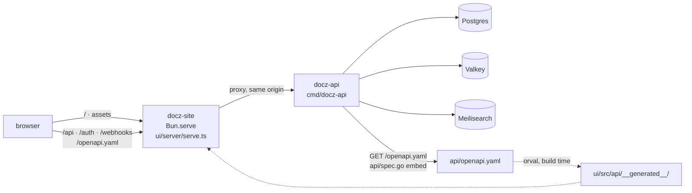
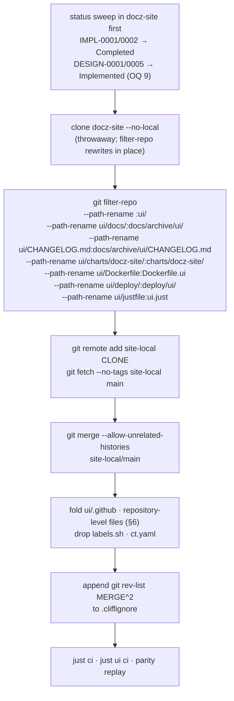
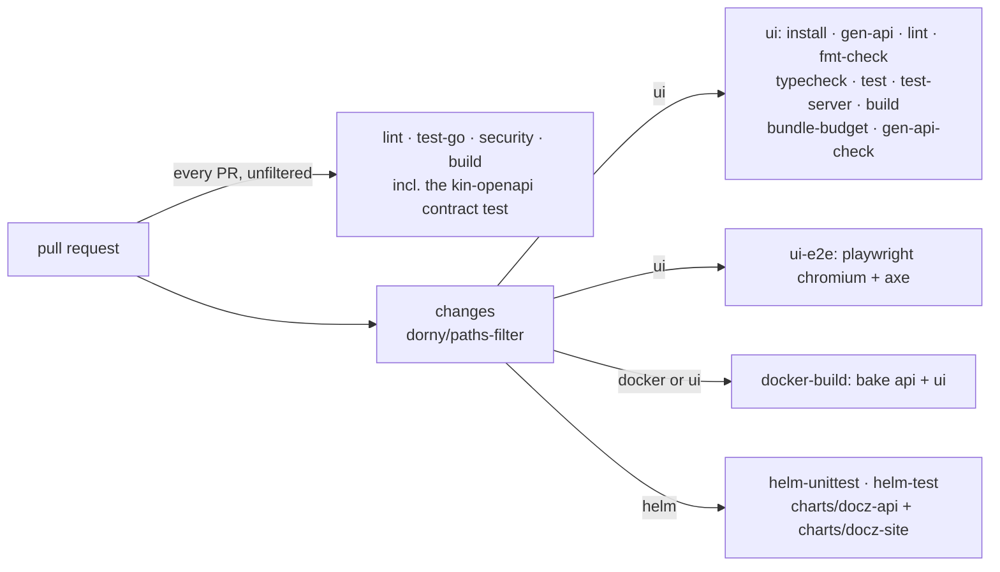
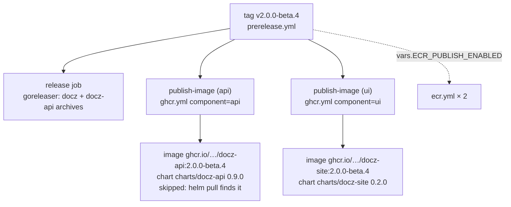

<!-- markdownlint-disable-file MD025 MD041 -->

# DESIGN-0017: Move docz-site in: ui/, charts/docz-site, and orval on the one spec

<!--toc:start-->
- [Overview](#overview)
- [Goals and Non-Goals](#goals-and-non-goals)
  - [Goals](#goals)
  - [Non-Goals](#non-goals)
- [Background](#background)
- [Detailed Design](#detailed-design)
  - [1. What arrives, and where](#1-what-arrives-and-where)
  - [2. Grafting the history](#2-grafting-the-history)
  - [3. ui/ is a Bun project, and its npm tree is a Go problem](#3-ui-is-a-bun-project-and-its-npm-tree-is-a-go-problem)
  - [4. One spec: orval reads api/openapi.yaml](#4-one-spec-orval-reads-apiopenapiyaml)
  - [5. just: ui.just as a module](#5-just-uijust-as-a-module)
  - [6. The root files and .github/](#6-the-root-files-and-github)
  - [7. CI: the ui jobs and the path filter](#7-ci-the-ui-jobs-and-the-path-filter)
  - [8. Containers, charts, and the publish path](#8-containers-charts-and-the-publish-path)
  - [9. The document archive](#9-the-document-archive)
  - [10. Local stacks: deploy/ui/](#10-local-stacks-deployui)
- [API / Interface Changes](#api--interface-changes)
- [Data Model](#data-model)
- [Testing Strategy](#testing-strategy)
  - [What has to keep passing unchanged](#what-has-to-keep-passing-unchanged)
  - [New checks this design requires](#new-checks-this-design-requires)
  - [Inherited suites](#inherited-suites)
  - [The gate](#the-gate)
- [Migration / Rollout Plan](#migration--rollout-plan)
- [Open Questions](#open-questions)
  - [1. What stays in ui/, and what lifts to the root?](#1-what-stays-in-ui-and-what-lifts-to-the-root)
  - [2. How is the npm tree kept out of the Go module?](#2-how-is-the-npm-tree-kept-out-of-the-go-module)
  - [3. How does the ui image build see api/openapi.yaml?](#3-how-does-the-ui-image-build-see-apiopenapiyaml)
  - [4. What happens to the MSW fixtures that import docs/ and CHANGELOG.md?](#4-what-happens-to-the-msw-fixtures-that-import-docs-and-changelogmd)
  - [5. How do ghcr.yml and ecr.yml publish two components?](#5-how-do-ghcryml-and-ecryml-publish-two-components)
  - [6. Does root just ci run the ui gates?](#6-does-root-just-ci-run-the-ui-gates)
  - [7. Does ADR-0004 Open Question 4's path filtering survive the move?](#7-does-adr-0004-open-question-4s-path-filtering-survive-the-move)
  - [8. How are the ui image and charts/docz-site versioned?](#8-how-are-the-ui-image-and-chartsdocz-site-versioned)
  - [9. Do docz-site DESIGN-0001 and DESIGN-0005 get successors?](#9-do-docz-site-design-0001-and-design-0005-get-successors)
- [References](#references)
<!--toc:end-->

<!--docz:overview:start-->
## Overview

docz-site moves into this repository as `ui/`: a Vite + React 19 single-page
application with its Bun production server (`server/`) under it, its Helm
chart lifted to `charts/docz-site` beside `charts/docz-api`, and 148 commits
of history grafted on. Its 25 docz files land verbatim under
`docs/archive/ui/`, and nothing is renumbered. The change that motivated the
move is small: orval stops reading a hand-copied spec and reads
`api/openapi.yaml`, so the server serves, vacuum lints, and the client is
generated from **one file**, with no copy step and no drift workflow. This
is the last of ADR-0004's three units and ships as `v2.0.0-beta.4`.

Unlike docz-api, docz-site brings **no Go code and no API change**: nothing
under `pkg/` changes and nothing in `internal/` changes. What it does bring
is a `node_modules/` tree inside the Go module, which turns out to matter
(§3).

<!--docz:overview:end-->

## Goals and Non-Goals

<!--docz:goals:start-->
### Goals

- **One spec, three consumers.** `api/openapi.yaml` is served by
  `api/spec.go`, linted by `api::lint-openapi`, and read directly by orval.
  The vendored `ui/api/openapi.yaml` and `spec-drift.yml` are deleted, and a
  spec change that breaks the client fails the same pull request that makes
  it (INV-0012).
- **History survives.** `git log ui/src/markdown/` and
  `git blame charts/docz-site/values.yaml` work after the move, because the
  commits carry their target paths (`git filter-repo`) before the merge.
- **Zero renumbered documents** (ADR-0004 Open Question 1). docz-site's own
  cross-references, 275 of which are ambiguous, stay valid because none of
  them is touched.
- **The Go half does not notice.** `just ci`, `just parity`, `test/consumer`,
  and every Go job produce the same results before and after, including
  on a checkout where `bun install` has run (§3).
- **The ui half keeps its gates.** Lint, typecheck, Vitest, `bun test
  server/`, the 130 KB bundle budget, the axe gate, Playwright e2e, and the
  orval regeneration check all run in this repository's CI, path-filtered
  (ADR-0004 Open Question 4).
- **Both images and both charts publish from one beta tag.** `v2.0.0-beta.4`
  produces `ghcr.io/donaldgifford/docz-api` and `ghcr.io/donaldgifford/docz-site`
  and both charts, signed and attested the same way (INV-0006's
  `attest-build-provenance`, which docz-site's own `slsa-github-generator`
  pipeline predates).
- **`just` keeps working unchanged** for everything PR #118 and IMPL-0019
  documented. The frontend is `just ui <recipe>`.

<!--docz:goals:end-->

<!--docz:non-goals:start-->
### Non-Goals

- **Embedding `ui/dist` in the docz-api binary.** Two images and two charts
  stay (ADR-0004 Decision 8). An embed is also the change that would
  invalidate the path filtering in §7, so it gets its own design if it ever
  comes.
- **Reshaping the application.** The route map, the markdown pipeline, the
  Bun server, the runtime config contract (`window.__DOCZ_CONFIG__`), and the
  chart's values arrive unchanged. A move that also refactored the thing
  being moved could not be reviewed.
- **A Bun workspace at the repository root.** There is exactly one JavaScript
  project, so there is nothing to make a workspace of. A root `package.json`
  would make every Go contributor's editor believe the repository is a Node
  project.
- **A JavaScript licence check.** docz-site never had one (its open PR #33
  proposes one). `just license-check` stays `go-licenses`. A Bun licence
  gate is a follow-up with its own allow-list decision.
- **INV-0013's deferred features.** The link graph, lifecycle metadata,
  labels, and typed relationships stay deferred. Two of them are now a `pkg/`
  change and a `ui/` change in one pull request, which is INV-0013's
  hypothesis, but no part of this move depends on them. docz-api INV-0003
  asked that the site's permanent non-goals be recorded in "the docz-site
  design" so that each has an owner. They are recorded here: **PDF export,
  raw-file ingest, and the MCP page are not planned.**
- **Amending DESIGN-0009** (ADR-0004 Decision 9). It is docz's own early
  design for the site, still Draft, and stays that way as a record.
- **Cutting v2.0.0.** It follows this beta, and restoring the `latest` image
  tag goes with it (PR #125). Neither happens here.
- **Deleting or archiving the docz-site repository.** That comes after beta.4
  is verified. Until then the repository is the rollback target.

<!--docz:non-goals:end-->

<!--docz:background:start-->
## Background

ADR-0004 decided the consolidation and its order: `just` migration →
docz-api → docz-site, a beta each. The first two shipped as
`v2.0.0-beta.2` (PR #118) and `v2.0.0-beta.3` (IMPL-0019, PRs #119–#126).
INV-0011 is the inventory under both. INV-0012 carried docz-api INV-0002's
unanswered consumer half forward, "how does docz-site generate its client
once the spec is in the same repository", and deferred the answer to
this design. §4 answers it.

As DESIGN-0016 did for docz-api, this design measured the incoming repository
again instead of relying on the inventory. **Four claims did not survive the
measurement**, and one of them is a trap the ADR could not see:

| Claim | Measured | Effect |
| --- | --- | --- |
| ADR-0004 Neutral: "`ui/` is invisible to Go tooling. It has no `go.mod` and no Go files" | After `bun install`, `ui/node_modules/flatted/golang/pkg/flatted/flatted.go` exists (npm's `flatted`, a transitive dependency via ESLint's cache). `go list ./...` in a module containing it **lists it as a package of the root module**. Verified in a scratch module | `go test ./...`, `golangci-lint run ./...`, `go-licenses check ./...`, and `govulncheck ./...` would all walk npm's Go file on any checkout where the UI has been installed. CI stays green because its Go jobs never run `bun install`, so it fails on developer machines and nowhere else. §3, Open Question 2 |
| ADR-0004 OQ 1: docz-site `DESIGN-0001` (Draft) and `DESIGN-0005` (In Review) are "genuinely unfinished" | DESIGN-0001's Open Questions section reads "None open"; all four were resolved 2026-07-09, and IMPL-0001 is 69/69. DESIGN-0005's are "All decided 2026-09-08", and it shipped as docz-site #27 (`0357e6d`, "DESIGN-0005 typography overhaul") | Both have stale statuses, like the five IMPLs the ADR already caught. **No successor documents are needed** for the UI half. Open Question 9 |
| INV-0011 Obs 11: docz-site "carries 19" documents | 19 typed documents **plus** `docs/input.md` (a second `id: DESIGN-0001`, described in its own body as a "historical exploratory design") and `docs/guides/markdown-specimen.md`, 25 tracked files with the READMEs | The archive is 25 files. The duplicate DESIGN-0001 is harmless because the archive is never scanned as a type directory (§9) |
| ADR-0004 Decision 7: "docz-site is `--to-subdirectory-filter ui` with `charts/docz-site` lifted back to the root" | That is two of **seven** renames: `docs/`, `CHANGELOG.md`, `Dockerfile`, `deploy/`, and `justfile` also leave `ui/`. `.github/` rides in and is folded, and the vendored `api/` is deleted after the merge | The filter is a list, not a flag (§2) |

The first is why this is a design and not a checklist. The rest is mechanical,
and mostly smaller than the docz-api move: there are no imports to rewrite,
so, unlike IMPL-0019's Phase 2, the graft is **green on arrival** (§2).

<!--docz:background:end-->

<!--docz:detailed-design:start-->
## Detailed Design

### 1. What arrives, and where

docz-site is 257 tracked files across 148 commits: 129 under `src/`, 16 under
`server/` (about 3,000 lines of Bun), 4 Playwright specs, and the chart. It
has no Go code and no `go.mod`. Its stack: Vite 8, React 19, react-router 8
in library mode, TanStack Query 5, Tailwind 4, the unified/remark/rehype
pipeline with Shiki and Mermaid 12, TypeScript pinned to 5.9, Vitest 4 + MSW 2,
Playwright + axe, and ESLint 10 + Prettier. Bun 1.3.14 is both the package
manager and the production runtime.

**It is not a static bundle.** `server/serve.ts` is a framework-free
`Bun.serve` that serves `dist/` (preferring `.gz`), answers `/healthz`,
`/readyz`, and `/metrics`, proxies `/api`, `/auth`, `/webhooks`, and
`/openapi.yaml` to `DOCZ_API_URL`, and injects `window.__DOCZ_CONFIG__`
into `index.html`. That proxy is what makes docz-api same-origin, so it
never sends CORS headers, and it is why the site has its own image and chart.



| Incoming path | Target path | Files | Rewrite needed |
| --- | --- | --- | --- |
| `src/`, `server/`, `e2e/`, `public/`, `scripts/*.ts`, `scripts/gen-api-check.sh` | `ui/…` | ~155 | none |
| JS tool configs: `package.json`, `bun.lock`, `bunfig.toml`, `tsconfig*.json` (4), `vite.config.ts`, `vitest.config.ts`, `playwright.config.ts`, `orval.config.ts`, `eslint.config.js`, `.prettierrc.yaml`, `.prettierignore`, `index.html`, `mockup.html` | `ui/…` | 17 | `orval.config.ts` input only (§4) |
| `README.md`, `CONTRIBUTING.md`, `CLAUDE.md`, `.markdownlint.yaml`, `.gitignore` | `ui/…` | 5 | repository URLs (OQ 1) |
| `charts/docz-site/` | `charts/docz-site/` | ~30 | `home:`, links, `cliff.toml` include-path |
| `charts/.yamllint.yml` | merged into ours | 1 | union (hashes differ) |
| `docs/` | `docs/archive/ui/` | 25 | none, contents untouched |
| `CHANGELOG.md` | `docs/archive/ui/CHANGELOG.md` | 1 | none |
| `Dockerfile` | `Dockerfile.ui` | 1 | context (OQ 3) |
| `.dockerignore` | `ui/.dockerignore` | 1 | none if the context is `ui/` (OQ 3) |
| `deploy/` | `deploy/ui/` | 3 | build contexts (§10) |
| `justfile` | `ui.just` | 1 | §5 |
| `api/openapi.yaml` | `ui/api/openapi.yaml`, deleted after the merge | 1 | none (§4) |
| `.github/` (9 workflows, labeler, actionlint, CODEOWNERS) | `ui/.github/`, folded into ours and deleted in the same PR | 12 | §6 |
| `scripts/labels.sh` | drops, **byte-identical** to ours (`cfa1bb2`) | 1 | none |
| `ct.yaml` | drops, identical to ours bar one blank line | 1 | none |
| repository-level files: `mise.toml`, `renovate.json5`, `catalog-info.yaml`, `.codecov.yml`, `.docz.yaml`, `cliff.toml`, `.yamllint.yml`, `.yamlfmt.yml`, `LICENSE`, `.forge-lock.hcl`, `.claude/settings.json` | merged into ours, then deleted from `ui/` | 11 | §6 |

`ui/` is a free name: nothing in this repository uses it, and the root
`justfile` has carried `mod? ui 'ui.just'` since Phase 0 of IMPL-0019. The
root `.gitignore` already has `node_modules/`, `dist/`, `dist-msw/`,
`dist-server/`, `playwright-report/`, and the unanchored
`**/src/api/__generated__/`, whose comment already names the `ui/` spelling
it was written for.

### 2. Grafting the history

The mechanism is DESIGN-0016 §6's, with a longer rename list. `git filter-repo`
applies `--path-rename` in the order given, so the first rename moves the
whole tree under `ui/` and the rest move pieces back out:



Four details, three of them lessons from IMPL-0019:

- **`--no-local` on the clone is not optional.** A local clone hardlinks
  objects, and filter-repo rewriting through a hardlinked store can corrupt
  the source, which is the rollback target and the place the status sweep
  lives.
- **`git fetch --no-tags`.** docz-site has 13 tags, and five of them
  (`v0.1.0`, `v0.2.0`–`v0.5.0`) are names docz already uses for its own,
  unrelated releases. IMPL-0019 deleted docz-api's imported tags after the
  fact. Not fetching them is cheaper and cannot leave one behind for a
  `git push --tags` to publish.
- **`.cliffignore`, not a commit parser.** git-cliff's parsers cannot express
  "reachable only through the second parent" (IMPL-0019 Phase 2's deviation),
  so the merge's `^2` rev-list is appended to the existing file. Without it,
  `changelog-regen.yml` files 148 docz-site commits under docz's version
  headings on the first push to `main`. The IMPL runs the regeneration
  locally against the merge commit before it lands.
- **The graft is green on arrival.** docz-api's graft left 44 Go files with
  unresolvable imports and needed DESIGN-0016 Open Question 6's `graft`
  label. This one leaves no Go files at all. Its `ui/.github/` is inert
  because GitHub reads workflows only from the root. And `ui/` still holds its
  vendored spec, so orval keeps working until §4 swaps the input. **Phase 2
  merges under the full gate and needs no `graft` label.**

### 3. `ui/` is a Bun project, and its npm tree is a Go problem

`go` treats every directory under the module root as a potential package
unless its name begins with `.` or `_` or it is `testdata`. `node_modules`
is none of those. npm's `flatted`, which reaches docz-site through
ESLint's `flat-cache`, ships a Go port at `golang/pkg/flatted/flatted.go`,
and measured in a scratch module:

```text
$ go list ./...                          # ui/node_modules/flatted present
example.com/m/ui/node_modules/flatted/golang/pkg/flatted
$ printf 'module ui\n' > ui/go.mod
$ go list ./...
go: warning: "./..." matched no packages
```

Every Go recipe in `docz.just` and `api.just` uses `./...`: `test`,
`test-coverage`, `lint`, `lint-fix`, `license-check`, `license-report`, and
`govulncheck` in CI. After a developer runs `just ui install`, all of them
start scanning a third-party package this repository never chose. The best
case is noise. The likely case is `go-licenses` failing on `flatted`'s ISC
licence, or `golangci-lint` reporting findings in someone else's code. The
worst case is the one that never shows in CI, because CI's Go jobs never
install the UI.

**A `go.mod` boundary is the fix** (Open Question 2 (a)): a one-line
`ui/go.mod` makes `ui/` a separate module, and a nested module is outside
the parent's `./...`. This is the same mechanism `test/consumer/` already
uses to stay out of root `./...`, so the repository already relies on it
and documents it. The file carries a comment saying why it exists and that
it is not a Go module anyone builds. A test in `test/archive` (§Testing)
pins the property rather than the file. The last half of ADR-0004's
"invisible to Go tooling" line becomes true by construction rather than by
accident.

It also answers INV-0011 Observation 6's note that `node_modules/` inside the
module tree slows tooling that walks directories: gopls stops at a module
boundary. And it keeps `ui/` out of the **module zip** the Go proxy serves
for `go get github.com/donaldgifford/docz/v2`, which excludes nested
modules. Without the boundary, every library consumer downloads the site's
source with the library.

### 4. One spec: orval reads `api/openapi.yaml`

This is INV-0012's question, and the answer is the hypothesis it recorded.
Today:

```text
docz-api/api/openapi.yaml ──(copied by hand)──► docz-site/api/openapi.yaml
                                                    │
spec-drift.yml: curl raw.githubusercontent…/docz-api/main/api/openapi.yaml
                and diff, warn on PR, open an issue on schedule
```

After the move there is one file. `ui/orval.config.ts` changes one line:

```ts
input: "../api/openapi.yaml",   // was "./api/openapi.yaml"
```

and `ui/api/` and `spec-drift.yml` are deleted. The two copies are
byte-identical today (both at `info.version: 1.5.0`, verified with
`diff`), so the swap changes no generated byte. `gen-api-check.sh`
proves that on the swap commit itself.

What pins the client to the spec after that is **the pull request**, not a
schedule. The generated client is gitignored, so every ui job regenerates it
before typechecking, which means:

| A change to `api/openapi.yaml` that… | Fails in the same PR at |
| --- | --- |
| drifts from the handlers | `internal/httpapi` kin-openapi contract test (Go job) |
| breaks vacuum's ruleset | `api::lint-openapi` |
| removes or retypes a field the UI reads | `just ui typecheck` over the regenerated client |
| changes generated output nondeterministically | `just ui gen-api-check` |

The third row is new and is the purpose of the whole consolidation. It only
holds if the ui jobs run when the spec changes, which is why §7's path
filter routes `api/openapi.yaml` to both halves. That arm is ADR-0004
Open Question 4's "must not be narrowed".

INV-0012 is concluded by this design's IMPL with verdict *confirmed*, citing
this section. The design adds no check that INV-0012's hypothesis did not
already name.

### 5. `just`: `ui.just` as a module

The root `justfile` needs no change. It already declares `mod? ui 'ui.just'`,
and the comment beside it says the file will carry
`set working-directory := "ui"`. docz-site's `justfile` arrives as `ui.just`
through the filter-repo rename, and five recipe names collide with the root
(`build`, `test`, `lint`, `fmt`, `ci`). A module namespace makes all five
harmless, which is DESIGN-0016 Open Question 1 working as designed.

Edits on arrival, all inside `ui.just`:

| Line(s) | Change | Why |
| --- | --- | --- |
| top | `set working-directory := "ui"` | Bun, orval, Vite, Playwright, and `bundle-budget.ts` all resolve paths from the cwd |
| `helm-lint` `helm-template` `helm-unittest` `helm-docs` | `charts/docz-site` → `../charts/docz-site` | the chart left `ui/`. The paths are relative to the module's working directory |
| `local-up` `local-down` | `deploy/compose.local.yaml` → `../deploy/ui/compose.local.yaml`, and the "run `just local-up` in `../docz-api`" hint → `just api local-up` | §10 |
| `default` | kept | `just ui` with no argument runs a module's first recipe, which is this listing |

The root gate question, whether `just ci` runs the UI, is Open Question 6.
Recipe inventory after the move:

| Concern | docz (flat) | docz-api (`api::`) | docz-site (`ui::`) |
| --- | --- | --- | --- |
| install / build | `build` `build-core` | `build` | `install` `build` `build-server` `serve-bundle` |
| dev | `run` | `run` `run-local` `dev-*` | `dev` `dev-msw` `preview` `local-up` `local-down` |
| test | `test` `test-consumer` `parity` | `test` `test-integration` | `test` `test-server` `e2e` `bundle-budget` |
| lint / format | `lint` `fmt` | `lint` `lint-openapi` `fmt` | `lint` `fmt` `fmt-check` `typecheck` |
| codegen | — | `generate` `generate-check` (sqlc) | `gen-api` `gen-api-check` (orval) |
| helm | — | `helm-*` | `helm-*` |
| gate | `ci` `check` | — | `ci` |

### 6. The root files and `.github/`

Where a file is repository-level (the repository has one Renovate
config, one Backstage catalog, one mise toolchain), docz-site's copy merges
into ours and then leaves `ui/`. Where a file is project-level and read from
its own directory (TypeScript, ESLint, Prettier, markdownlint), it stays in
`ui/`. Open Question 1 settles the edge cases.

| Incoming | Resolution |
| --- | --- |
| `mise.toml` | Add `bun = "1.3.14"` and `node = "24.14.0"` to ours; the other tools overlap or are already pinned. Drop its `_.file = ".env.local"`: ours has no env block, and the site's `.env.local` becomes `ui/.env.local`, read by Vite from its own cwd |
| `renovate.json5` | Add the `:node` preset to our `extends`. Renovate's bun manager finds `ui/package.json` and `ui/bun.lock` without configuration |
| `catalog-info.yaml` | A third Backstage `Component`, `docz-site`, with `source-location` `…/tree/main/ui` |
| `.codecov.yml` | Nothing. docz-site uploads no coverage, so there is nothing to union |
| `.docz.yaml` | Drops. Its `docs_dir`, `changelog`, and `api.additional_docs: [README.md]` name paths in a repository that no longer exists; the archive is ours now (§9) |
| `cliff.toml` | Drops. Ours governs the one changelog. `charts/docz-site/cliff.toml` stays with its chart |
| `.yamllint.yml`, `.yamlfmt.yml` | Drop. Ours cover the repository |
| `charts/.yamllint.yml` | Union with ours (hashes differ); one file stays chart-scoped |
| `LICENSE` | Drops. Apache-2.0 in both |
| `.forge-lock.hcl` | Drops. It records a scaffold of a repository that stops existing, and ours is docz-api's |
| `.claude/settings.json` | Union of `allow` entries, as in DESIGN-0016 §3 |

`.github/`, folded in the Phase 2 PR, then `ui/.github/` deleted:

| docz-site workflow | Resolution |
| --- | --- |
| `ci.yml` | Becomes the `ui` jobs in ours (§7). Its `changes` filter and Helm jobs merge into ours, which already has both |
| `ghcr.yml` | Superseded by ours, parameterised (§8, OQ 5). Its `slsa-github-generator` provenance is the scheme INV-0006 replaced, so none of it survives |
| `release.yml` | Drops. Ours is `push: [main]` + `pr-semver-bump`, and betas are hand-cut |
| `changelog.yml`, `changelog-regen.yml`, `pr-labels.yml` | Drop. Ours are identical in purpose |
| `codeql.yml` | Ours gains `javascript-typescript` in its `language` matrix (currently `[go]`) with docz-site's `security-extended` query suite |
| `trufflehog.yml` | Ours stays. docz-site runs `--results=verified,unknown`, and ours runs `verified`. Taking the stricter setting is a one-flag change noted in the IMPL, not decided here |
| `spec-drift.yml` | **Deleted** (§4) |
| `labeler.yml` | Drops. It is forge boilerplate that no workflow ran. Ours gains a `ui` label rule on `ui/**` |
| `actionlint.yml`, `CODEOWNERS` | Drop. Same owner, and ours covers it |

Two pre-existing root files need a line for `ui/`, and one of them fails
silently without it:

- **The root `.dockerignore` must exclude `ui/`.** `Dockerfile.api`'s build
  context is the repository root, and today its `.dockerignore` excludes
  `docs`, `*.md`, `.github`, and friends, but not `ui/`. After the move, every
  docz-api image build would send `ui/node_modules/` (hundreds of megabytes on
  a developer machine) to the builder, and nothing would fail. It would just
  be slow.
- **`.golangci.yml` needs nothing** once `ui/go.mod` exists. Without it, the
  file would need an exclusion that §3 argues is the wrong layer.

### 7. CI: the `ui` jobs and the path filter

ADR-0004 Open Question 4 resolved to path-filtered jobs "for now" and said
to revisit at this move. The condition it set for revisiting was "the
moment a Go change can break the UI other than through the spec". It has not
arrived: the UI reaches the server only through HTTP described by the spec,
and nothing embeds `ui/dist`. So the filter stays (Open Question 7), and
`changes` grows one output:

```yaml
ui:
  - 'ui/**'
  - 'api/openapi.yaml'      # the drift the consolidation exists to catch
  - 'Dockerfile.ui'
```



The Go jobs are not path-filtered at all. `lint`, `test-go`, `security`, and
`build` run on every pull request, so a spec-only change already runs the
kin-openapi contract test in `internal/httpapi`, and needs no filter to do so.
The one arm this move adds is `api/openapi.yaml` in the `ui` filter. Without
it, a spec change that breaks the client would pass CI.

The `ui` job mirrors the rest of `ci.yml`. It pins its tools with their own
actions (`oven-sh/setup-bun` at 1.3.14, `extractions/setup-just`) instead of
`mise-action`, matching the CLAUDE.md note that this repository's CI has
never used mise-action. It sets `defaults.run.working-directory: ui` and
calls `just ui <recipe>` step by step, so a failure names the recipe. e2e is
its own job, because installing Playwright's chromium is the slowest step
and does not block the lint and unit feedback.

Two inherited facts the jobs must respect, both from docz-site's CLAUDE.md:
`test-server` runs **before** `build` (the server tests assume there is no
`dist/`), and CI has never built the site's image. The second changes here,
because `docker-build` bakes both images (§8).

`helm-unittest` changes from `helm unittest charts/docz-api` to a loop over
`charts/*/`. `helm-test`'s `ct lint`/`ct install` already walk
`chart-dirs: [charts]`, so they pick up `charts/docz-site` with no edit. Its
`ci/ci-values.yaml` is the fixture ct uses, as it did in the site repository.

### 8. Containers, charts, and the publish path

**`Dockerfile.ui`** (renamed in the filter-repo pass so `git log
Dockerfile.ui` reaches back) needs the spec at build time, because
`bun run gen-api` runs inside the build stage. Its context was the
site's root, and the spec was in that root. Open Question 3 (a) keeps the
context at `ui/` and passes the spec as a **named build context**:

```hcl
target "ui" {
  inherits   = ["_common_ui"]
  context    = "ui"
  dockerfile = "../Dockerfile.ui"
  contexts   = { spec = "api" }        # COPY --from=spec openapi.yaml ../api/
}
```

The Dockerfile gains one `COPY --from=spec openapi.yaml /app/api/openapi.yaml`,
laid out so orval's `../api/openapi.yaml` resolves inside the stage exactly as
it does on disk. `ui/.dockerignore` keeps working as written, and nothing but
the spec crosses from outside `ui/`. `docker build` without bake spells the
same thing `--build-context spec=api`, and `ui.just` gets a `docker-build`
recipe that does.

**`docker-bake.hcl`** becomes two-component: `_common` splits into
`_common_api` and `_common_ui`, each target gets an `-api`/`-ui` pair
(`dev-api`, `ci-ui`, `release-ui`…), and `group "ci"` builds both. The
`IMAGE_NAME` variable becomes per-target, since `docz-api` is hardcoded
today.

**Publishing** is where docz-site's pipeline and ours differ most, and ours
wins on every axis: it bakes instead of calling build-push-action, attests
with `attest-build-provenance` (INV-0006), and captures the digest from the
bake metadata. Open Question 5 (a) parameterises `ghcr.yml` and `ecr.yml`
with one `component` input and has `prerelease.yml` and `release.yml` call
them once per component:



| `component` | `IMAGE_REPO` | bake target | chart dir |
| --- | --- | --- | --- |
| `api` | `donaldgifford/docz-api` | `release-api` | `charts/docz-api` |
| `ui` | `donaldgifford/docz-site` | `release-ui` | `charts/docz-site` |

The image name stays **`docz-site`**, not `docz-ui`. The chart's
`values.yaml`, its unit tests, and every deployment that pulls it name
`ghcr.io/donaldgifford/docz-site`, and a directory name is not a reason to
break a pull reference.

Three latent defects this fixes on the way, each found while reading
`ghcr.yml` for this design:

- **The chart-changelog step's `--include-path "charts/**"`** is correct with
  one chart and wrong with two: each chart's `CHANGELOG.md` would list the
  other chart's commits. It becomes `charts/<component chart>/**`, and
  `charts/docz-site/cliff.toml` gets the same fix.
- **GHCR package access is per package, and there are two new ones.** The
  beta.3 chart publish failed `403 write_package` until `charts/docz-api` was
  granted Actions access separately from the image. `docz-site` and
  `charts/docz-site` exist already (the site repository published them), but
  their grants name the `docz-site` repository, not this one. **Both must be
  granted to `donaldgifford/docz` before the tag**, and the IMPL lists that as
  a human task ahead of Phase 5, not after a failed run.
- **No `latest`.** docz-site's `ghcr.yml` tags `latest` and
  `{major}.{minor}`. Ours carries neither since PR #125, and the site image
  inherits that until v2.0.0 proper restores `latest` for both.

Goreleaser needs nothing: the UI's artifact is its image and chart, and the
GitHub release carries the Go binaries only.

### 9. The document archive

The filter-repo pass lands docz-site's 25 docz files and its `CHANGELOG.md`
at `docs/archive/ui/`, with their bodies untouched. The status sweep runs
**in docz-site before the clone**, so the corrected frontmatter is in that
repository's history:

| Document | Status | Measured | Swept to |
| --- | --- | --- | --- |
| IMPL-0001 | Draft | 69/69 tasks | Completed |
| IMPL-0002 | Draft | 38/38 tasks | Completed |
| DESIGN-0001 | Draft | "None open"; MVP shipped via IMPL-0001 | Implemented (OQ 9) |
| DESIGN-0005 | In Review | every OQ decided 2026-09-08; shipped in #27 | Implemented (OQ 9) |

The other 15 are already Completed, Implemented, or Concluded. With OQ 9 (a),
**no successor documents are written** for the UI half, and ADR-0004's
"four documents get one" becomes two, both on the docz-api side and both
already written (INV-0012, INV-0013).

What already works, set up by IMPL-0019 Phase 4:

- `wiki.exclude` and `api.exclude` both carry `archive`, which matches the
  directory name `docs/archive/`, so `docs/archive/ui/` is excluded from the
  rendered wiki and the `api:` listing **with no edit**. `TestExcludesAgreeOnArchive`
  already pins the pair.
- The archive is not under a type directory, so `docz update` and
  `docz validate` never see it. The duplicate `DESIGN-0001` in `input.md`
  is therefore harmless.

What is new: `docs/archive/ui/README.md` states the namespace rule in one
line (*inside this directory, an ID means docz-site's*), mirroring
`docs/archive/api/README.md`. And `docs/archive/README.md`, if there is one by
then, lists both trees.

One thing does not work as-is: docz-site's MSW fixtures import files that
this section moves (Open Question 4).

### 10. Local stacks: `deploy/ui/`

`deploy/compose.yaml` builds docz-api from `context: ../../docz-api`, a
sibling checkout that stops being necessary. Under `deploy/ui/` it becomes
`context: ../..` with `dockerfile: Dockerfile.api`, and the site builds
from `../../ui` with the named spec context (§8). That makes it the one
compose file that runs **the whole product from one checkout**, which the
three-repository layout could not do.

`deploy/ui/compose.local.yaml` joins the external network
`docz-api-local_default`, the default network of docz-api's local stack,
whose name derives from that stack's compose project name. The IMPL checks
that `just api local-up` still produces that name after IMPL-0019's
`deploy/` → `deploy/api/` rename, and pins `name:` in the api stack if it
does not, because a renamed network fails the site's `local-up` with an
error about a network rather than about a rename.

<!--docz:detailed-design:end-->

<!--docz:api-changes:start-->
## API / Interface Changes

**None.** No Go package gains, loses, or changes a symbol. No `.docz.yaml` key,
frontmatter field, marker kind, or CLI flag changes, and the parity goldens
are untouched. The eleven experimental packages keep their `EXPERIMENTAL`
markers, because the v2.0.0 cut that removes them follows this beta.

The **wire contract** does not change either: `api/openapi.yaml` stays at
`1.5.0`, and the only thing that changes about it is who reads it. The
site's runtime contract with its deployment (`DOCZ_API_URL`,
`DOCZ_AUTH_PROVIDERS`, `DOCZ_NAV_LINKS`, `DOCZ_MERMAID_LAYOUT`, the
`DOCZ_LOG_*`/`DOCZ_METRICS_ENABLED`/`OTEL_*` variables, and
`window.__DOCZ_CONFIG__`) arrives unchanged, so an existing
`charts/docz-site` release upgrades to the beta.4 chart with no values
change.

Developer-facing surface that does change:

| Before | After |
| --- | --- |
| `cd docz-site && just ci` | `just ui ci` from the root |
| `just gen-api` against a vendored spec | `just ui gen-api` against `api/openapi.yaml` |
| `spec-drift.yml` issues | a failing ui job on the PR that changed the spec |
| `just local-up` in `../docz-api`, then in docz-site | `just api local-up`, then `just ui local-up` |

<!--docz:api-changes:end-->

<!--docz:data-model:start-->
## Data Model

**Nothing persistent changes.** The site stores nothing: its state is
TanStack Query's cache and the URL. docz-api's Postgres schema, queue, search
index, and session store are untouched by this move.

The one data artifact that moves is the **generated client**,
`ui/src/api/__generated__/`: gitignored, regenerated by every build, and
now derived from the same bytes `api/spec.go` embeds and the contract test
loads. After this move the spec has a single copy, read in four places:

| Consumer | Reads `api/openapi.yaml` via | Fails on drift in |
| --- | --- | --- |
| docz-api at runtime | `//go:embed` in `api/spec.go`, served at `GET /openapi.yaml` | — (it is the source) |
| Contract test | the same embed, `internal/httpapi` | Go job |
| vacuum | `api::lint-openapi` | lint job |
| orval | `ui/orval.config.ts` → `../api/openapi.yaml` | ui job (`typecheck`, `gen-api-check`) |

<!--docz:data-model:end-->

<!--docz:testing:start-->
## Testing Strategy

### What has to keep passing unchanged

| Suite | Why it is at risk | Expectation |
| --- | --- | --- |
| `test/parity` (213 goldens, v1.2.2) | Nothing in `cmd/` or the templates changes | **Zero diff** |
| `go test -race ./...`, `golangci-lint run ./...`, `go-licenses check ./...` | `ui/node_modules/` inside the module (§3) | Same package list **with `ui/node_modules` populated**, proven by the new test below |
| `test/consumer` | Nothing, the Go graph is unchanged | Passes; `go.sum` stays 4 lines |
| `pkg/doczcore/layer_test.go` | Nothing | Unchanged |
| docz-site's own gates | cwd moved from the repo root to `ui/` | `just ui ci` green: lint, fmt-check, typecheck, Vitest, `bun test server/`, build, 130 KB bundle budget, axe, Playwright, `gen-api-check` |
| `api::helm-unittest`, `ct lint`, `ct install` | `charts/` gains a chart | Both charts green |

### New checks this design requires

1. **`TestNoPackageUnderUI`** (in `test/archive`, which already pins
   repository-layout properties): `go list <modulePath>/...` from the root
   returns no package under `ui/`, run in CI **after** a `bun install`
   into `ui/` so `flatted` is actually present. It asserts the property of
   §3 rather than the mechanism, so OQ 2 (b) would satisfy it too.
2. **The spec swap is byte-neutral**: `just ui gen-api-check` passes on the
   commit that changes orval's input, before `ui/api/` is deleted and after.
3. **Spec drift fails the UI**: a scratch commit that removes a required
   field from a response schema the UI reads fails `just ui typecheck`. It
   is run once in the IMPL and recorded, not kept, since a permanently
   broken fixture spec would be a second spec.
4. **The repository URLs are gone**: `test/archive` gains the site half.
   No tracked file outside `docs/`, `testdata/`, and `CHANGELOG.md` names
   `github.com/donaldgifford/docz-site`, which finds a stale
   `Chart.yaml home:`, a `catalog-info.yaml` source location, or a
   `CONTRIBUTING.md` clone URL. The demo-org slug `donaldgifford/docz-site` in
   fixtures and e2e specs is data rather than a URL and is left alone.
5. **The image builds**: `docker buildx bake ci-ui` in `docker-build`. docz-site's
   CI never built its image, and its CLAUDE.md told developers to build it by
   hand after touching `server/` or the Dockerfile. That instruction becomes
   a CI job.

### Inherited suites

docz-site's Vitest (jsdom + Testing Library + MSW), its XSS suite over
`schema.ts`, the axe and contrast gates, the Playwright specs, the
no-auto-instrumentation test in `server/`, and the chart's six helm-unittest
suites all arrive and run as they did. `api::test-integration` is not
affected.

### The gate

Every phase closes on `just ci` + `just ui ci` + `just parity`, with the
`ui` jobs green in CI. Phase 5 adds the published-artifact checks (§Rollout).

<!--docz:testing:end-->

<!--docz:rollout:start-->
## Migration / Rollout Plan

Five phases, one PR each, the shape IMPL-0019 used. There is no Phase 1 API
work, so the numbering starts where the graft does.

| Phase | Lands | Revertible | Gate |
| --- | --- | --- | --- |
| 0 | `ui/`-shaped root edits that are safe before `ui/` exists: `.dockerignore` excludes `ui/`; `ghcr.yml`/`ecr.yml` gain the `component` input, called with `api` (OQ 5); the chart-changelog include-path fix; `mise.toml` gains bun and node; `changes` gains the `ui` output (no job reads it until Phase 2) | yes | `just ci`; the next docz-api publish is unchanged |
| 1 | **In docz-site:** status sweep of four documents (§9, OQ 9); close PR #33 as superseded | n/a (other repo) | `docz validate` there |
| 2 | `filter-repo` clone, `--no-tags` fetch, `--allow-unrelated-histories` merge (§2); `ui/go.mod` (§3, OQ 2); `ui/.github/` and repository-level files folded (§6); `ui.just` edits (§5); `.cliffignore` appended; `ui` + `ui-e2e` jobs; CodeQL gains `javascript-typescript` | as one merge commit | **green**: `just ci`, `just ui ci`, all CI jobs |
| 3 | orval input → `../api/openapi.yaml`; `ui/api/` and `spec-drift.yml` deleted (§4); `Dockerfile.ui` named spec context + bake `-ui` targets (OQ 3); MSW fixtures (OQ 4); `deploy/ui/` contexts (§10); repository URLs rewritten; `test/archive` gains both new tests | yes | `just ci`, `just ui ci`, `docker buildx bake ci-ui` |
| 4 | `docs/archive/ui/README.md`; `charts/docz-site` `version: 0.2.0`, `appVersion: "2.0.0-beta.4"` (OQ 8); `prerelease.yml` calls `ghcr.yml` with `component=ui`; CLAUDE.md, README.md, DEVELOPMENT.md; INV-0012 → Concluded; **human:** GHCR Actions access for `docz-site` and `charts/docz-site` granted to this repository | yes | `just ci`, `just validate` |
| 5 | `v2.0.0-beta.4` cut by hand **from Phase 4's merge commit**, which carries the workflows the tag will run | n/a | `prerelease.yml` green; both images and both charts pulled by tag; `docker run … docz-site` serves `/healthz`; the beta chart installs against the beta.3 docz-api |

Why this order:

- **Phase 0 changes the publish pipeline while it still has one component.**
  The next docz-api publish proves the parameterised `ghcr.yml` before a
  second component depends on it. If the refactor is wrong, it fails on a
  shape that already worked.
- **Phase 2 carries no API or spec change.** The vendored spec keeps orval
  working through the merge, so the only question Phase 2's review answers
  is whether these are the right folds, the one DESIGN-0016 wanted
  kept separate from mechanical churn. Unlike IMPL-0019's Phase 2, it is not
  red.
- **Phase 5 tags the commit whose workflows are right.** IMPL-0019 tagged
  `b5350ec` rather than its Phase 4 merge because a tag runs the workflows
  as they exist in the tagged commit. Phase 4 here is the last workflow
  change, so its merge commit is the tag.

**Rollback.** Before the tag, the move is `git revert -m 1` of Phase 2's
merge plus ordinary reverts of 0, 3, and 4; the site keeps deploying from its
own repository's `v0.10.0` image throughout. After the tag it is a forward
fix. **The docz-site repository stays live and untouched** (Phase 1's sweep
excepted) until beta.4 is verified. Archiving it read-only, and pointing its
README at `ui/`, is a follow-up. So is cutting v2.0.0 proper, which comes
next and restores `latest`.

<!--docz:rollout:end-->

<!--docz:open-questions:start-->
## Open Questions

> Each question is numbered; option `a` is my recommendation, later letters are
> alternatives, and the last is a free-form "other".

### 1. What stays in `ui/`, and what lifts to the root?

§1 and §6 draw the line at "read from its own directory" versus
"repository-level". Two files sit on the line: `CLAUDE.md` (1 file, the
site's conventions and traps) and `CONTRIBUTING.md`/`README.md` (the site's
quickstart). docz-api's CLAUDE.md was folded into the root file under a
demoted heading, which made the root file very long.

> **Resolved 2026-09-23: (a).** `ui/CLAUDE.md`, `ui/README.md`, and
> `ui/CONTRIBUTING.md` stay in `ui/` with their repository URLs corrected, and
> the root CLAUDE.md gains a short "Frontend (`ui/`)" section pointing at
> them. Everything else follows §6: project-level configs stay in `ui/`, and
> repository-level files merge into the root copies and leave `ui/`.

- a. **Keep `ui/CLAUDE.md`, `ui/README.md`, and `ui/CONTRIBUTING.md` in
  `ui/`**, with repository URLs corrected, and add a short "Frontend (`ui/`)"
  pointer section to the root CLAUDE.md. Claude Code loads a nested
  `CLAUDE.md` when working under its directory, so the site's rules (`tsc -b`,
  no `dangerouslySetInnerHTML`, the bundle budget) are in context exactly when
  they apply, and the root file stops growing. Everything else follows §6.
  *(recommendation)*
- b. **Fold `ui/CLAUDE.md` into the root file**, as DESIGN-0016 did for the
  server. One file to read and one place to look; makes the root file longer
  still, and loads frontend rules into every Go session.
- c. **Hoist the JS tool configs to the root** as well (`package.json`,
  `tsconfig*`, ESLint) with `ui/` holding only source. A single cwd for
  everything; makes the root read as a Node project to every editor, and
  breaks every path in the site's configs that assumes `./src`.
- d. Other.

### 2. How is the npm tree kept out of the Go module?

§3: after `bun install`, `go ./...` lists npm's `flatted` as a package of
`github.com/donaldgifford/docz/v2`, and every Go recipe uses `./...`.

> **Resolved 2026-09-23: (a).** A stub `ui/go.mod` with a comment saying it
> exists only to fence off `node_modules`. `TestNoPackageUnderUI` pins the
> property, not the file, and runs after a `bun install` so `flatted` is
> really there. The IMPL records ADR-0004's "has no `go.mod`" line as
> corrected, the way DESIGN-0016's Background corrected four of its claims.

- a. **A stub `ui/go.mod`** (`module github.com/donaldgifford/docz/v2/ui` plus
  a comment saying it exists only to fence off `node_modules`). A nested
  module is outside the parent's `./...`, which is how `test/consumer`
  already stays out of it. One file, no recipe changes, and it covers gopls,
  `go-licenses`, `govulncheck`, and golangci-lint alike. It makes ADR-0004's
  "ui/ has no go.mod" false in letter so that its "invisible to Go tooling"
  is true in fact. *(recommendation)*
- b. **Scope every Go pattern** to named roots (`./cmd/... ./pkg/...
  ./internal/... ./api/... ./test/...`) in `docz.just`, `api.just`, and CI.
  No stub file; seven recipes and three CI steps to change, and the next
  top-level Go directory has to be added by hand everywhere or it is
  silently untested.
- c. **Exclusions per tool** (`.golangci.yml` `exclude-dirs`, a
  `go-licenses --ignore`, …). Treats the symptom tool by tool; `go test ./...`
  still compiles `flatted`.
- d. Other.

### 3. How does the ui image build see `api/openapi.yaml`?

`bun run gen-api` runs inside the build stage, and after §4 its input is
`../api/openapi.yaml`, outside the site's old build context.

> **Resolved 2026-09-23: (a).** The context stays `ui/`, bake passes
> `contexts = { spec = "api" }`, and `Dockerfile.ui` copies the spec from
> the named context. `ui.just` owns the `docker build --build-context
> spec=api` spelling, so nobody has to remember it.

- a. **Named build context.** Context stays `ui/`, bake passes
  `contexts = { spec = "api" }`, and `Dockerfile.ui` does
  `COPY --from=spec openapi.yaml …`. Only the spec crosses the boundary,
  `ui/.dockerignore` works as written, and the api image's context is
  unaffected. The cost is that a bare `docker build ui/` no longer works
  without `--build-context spec=api`, so `ui.just` owns that spelling.
  *(recommendation)*
- b. **Repository-root context** with a per-Dockerfile ignore file
  (`Dockerfile.ui.dockerignore`, which BuildKit reads beside the
  Dockerfile). Conventional `docker build -f Dockerfile.ui .`; every `COPY`
  gains a `ui/` prefix, and the ignore file has to exclude the whole Go half
  by hand.
- c. **Generate before building** and copy the generated client in, with the
  build stage no longer running orval. Simplest Dockerfile; the image then
  depends on a host step having run, and a stale local generation ships.
- d. Other.

### 4. What happens to the MSW fixtures that import `docs/` and `CHANGELOG.md`?

`ui/src/mocks/fixtures.ts` imports eight of the site's own files with
Vite's `?raw`, on purpose ("always current"): `../../CHANGELOG.md`,
`../../README.md`, and six under `../../docs/` (DESIGN-0001, IMPL-0001,
both type READMEs, the markdown specimen, and `input.md`). §2 moves `docs/`
and `CHANGELOG.md` to `docs/archive/ui/`, so seven break, in the MSW
build that Playwright's `webServer` runs (`build:msw && preview:msw`), not
in production. "Always current" also stops meaning anything: the archive is
frozen, and the root `CHANGELOG.md` is no longer the site's.

> **Resolved 2026-09-23: (a).** The seven archived fixtures are
> snapshotted into `ui/src/mocks/content/` beside the docz-api ones, and
> `README.md` stays a live import. The fixture comment's "always current"
> is reworded to say what the files are now: test data.

- a. **Snapshot them into `ui/src/mocks/content/`** (the directory already
  exists for this purpose) and point the imports there, beside the five
  docz-api fixtures that already live there. The fixtures become what they
  are, test data owned by the UI, and stop depending on an archive that is
  meant to be frozen. Seven copied files; `README.md` stays a live import. *(recommendation)*
- b. **Rewrite the imports into the archive** (`../../../docs/archive/ui/…`)
  and widen Vite's `server.fs.allow` to the repository root. No copies, but
  the UI's test data then lives in a read-only record, and the dev server can
  read the entire repository.
- c. **Leave `docs/` under `ui/`** instead of archiving it. No import changes;
  breaks ADR-0004's layout and puts a docz tree where `docz` never looks.
- d. Other.

### 5. How do `ghcr.yml` and `ecr.yml` publish two components?

Both hardcode `IMAGE_REPO: donaldgifford/docz-api`, `CHART_NAME: docz-api`,
and the `release` bake target.

> **Resolved 2026-09-23: (a).** One `component` input on `ghcr.yml` and
> `ecr.yml`, resolved to image repo, bake target, and chart directory in a
> first step. Lands in Phase 0 against `api` alone, so the next docz-api
> publish proves the refactor before `ui` depends on it.

- a. **One workflow, a `component` input** (`api`|`ui`) resolved to image
  repo, bake target, and chart directory in a first step, and called once per
  component from `prerelease.yml`/`release.yml`. One implementation of
  signing, provenance, digest capture, and the `helm pull` idempotency check,
  and those are the parts that were each wrong once (the empty-digest bug, the
  cosign/SLSA split). Landed in Phase 0 against `api` alone.
  *(recommendation)*
- b. **A copy per component** (`ghcr-ui.yml`, `ecr-ui.yml`). Nothing to
  parameterise; every future fix lands twice, and the copies drift, which is
  the problem this repository consolidated to escape.
- c. **A matrix inside one call** (`component: [api, ui]`). One caller line;
  a failure in one component's leg reruns as a matrix and cannot be released
  independently, and the ECR gate applies to both or neither.
- d. Other.

### 6. Does root `just ci` run the ui gates?

Today `ci` spans the library, the CLI, and the server. Adding `ui::` means
every contributor running `just ci` needs Bun installed and a `just ui install`.

> **Resolved 2026-09-23: (a).** Root `ci` gains the fast ui gates (`install`,
> `gen-api`, `lint`, `fmt-check`, `typecheck`, `test`, `test-server`, `build`,
> `bundle-budget`, `gen-api-check`). `e2e` stays in `just ui ci` and its own
> CI job. `mise install` provides Bun once §6 adds it to `mise.toml`.

- a. **Yes, the fast gates**: `ui::install ui::gen-api ui::lint
  ui::fmt-check ui::typecheck ui::test ui::test-server ui::build
  ui::bundle-budget ui::gen-api-check`. Not `e2e`, which needs Playwright
  browsers and stays in `just ui ci` and its own CI job. `just ci` keeps
  meaning "what CI runs", and a Go contributor who changes the spec learns
  locally that they broke the client. `mise install` already provides Bun
  once §6 adds it. *(recommendation)*
- b. **All of `ui::ci`, e2e included.** Exact CI parity; every local gate
  run installs and drives chromium.
- c. **No ui gates at the root.** `just ci` stays Go-only and `just ui ci` is
  separate. Nobody needs Bun to touch the library; the spec-drift arm then
  exists only in CI, and "green locally" stops meaning "green in CI".
- d. Other.

### 7. Does ADR-0004 Open Question 4's path filtering survive the move?

It resolved to path-filtered jobs "for now", to be revisited here, and named
the trigger: a Go change that can break the UI other than through the spec.

> **Resolved 2026-09-23: (a).** Path filtering stays, and a spec change runs
> both halves: the Go jobs are unfiltered, and the `ui` filter includes
> `api/openapi.yaml` (§7, corrected 2026-09-23: the Go jobs were never
> path-filtered, so no separate `spec` output is needed). The revisit condition (anything that lets a Go change
> break the UI other than through the spec, such as an embed of `ui/dist`)
> is written into CLAUDE.md beside the CI description.

- a. **Keep path filtering, with a spec change running both halves** (§7).
  The trigger has not arrived: nothing embeds `ui/dist`, and the UI reaches
  the server only over the specced HTTP surface. Record the revisit
  condition again, this time in CLAUDE.md where the next person to add an
  embed will see it. *(recommendation)*
- b. **A merge queue**, with the full suite on the queue and path-filtered
  jobs on the PR. Safe against any coupling; adds queue latency to every
  merge in a single-maintainer repository.
- c. **Everything on every PR.** Simplest; a docs-only PR waits for
  Playwright.
- d. Other.

### 8. How are the ui image and `charts/docz-site` versioned?

docz-site's last release is `v0.10.0`, and its chart is `0.1.10` with
`appVersion: "0.10.0"`. IMPL-0019 resolved the same question for docz-api:
the image follows the repository tag, and the chart keeps its own semver.

> **Resolved 2026-09-23: (a).** The image is tagged from the repository tag
> (`2.0.0-beta.4`, bare), and `charts/docz-site` goes `0.1.10` → `0.2.0` with
> `appVersion: "2.0.0-beta.4"`. This matches docz-api (IMPL-0019 Open
> Question 5 and its bare-`appVersion` deviation).

- a. **Same as docz-api.** The image is tagged from the repository tag,
  `2.0.0-beta.4` (bare, since metadata-action's `{{version}}` strips the `v`).
  `charts/docz-site` goes `0.1.10` → `0.2.0` with `appVersion: "2.0.0-beta.4"`,
  bare, as the chart's own unit test already requires. The image jumps from
  0.10.0 to 2.0.0-beta.4, which is honest: it is now built from the v2 line.
  *(recommendation)*
- b. **Chart version tracks the repository tag** (`2.0.0-beta.4`) for both
  charts. One number to remember; a chart-only fix then needs a repository
  release.
- c. **Keep docz-site's own `v0.x` line** from a separate tag namespace
  (`ui/v0.11.0`). Continuity for anyone pinning the image; two version lines
  in one repository, which ADR-0004 Decision 1 rejected.
- d. Other.

### 9. Do docz-site DESIGN-0001 and DESIGN-0005 get successors?

ADR-0004 Open Question 1 listed them as two of the four genuinely unfinished
documents that each get a successor. Measured (Background): both have every
open question resolved, and both shipped.

> **Resolved 2026-09-23: (a).** No successors. docz-site IMPL-0001/0002 go to
> `Completed` and DESIGN-0001/0005 to `Implemented` in docz-site before the
> clone, and the IMPL's closing notes amend ADR-0004's count: two
> documents got successors, both on the docz-api side.

- a. **No. Sweep them to `Implemented` with the two IMPLs**, and amend
  ADR-0004's count in the IMPL's closing notes, as DESIGN-0016's Background
  corrected four of its claims. A successor would carry nothing forward, and
  the rule was "unfinished work gets a successor", not "Draft documents do".
  *(recommendation)*
- b. **Write successors anyway**, as the ADR says. Keeps the ADR literally
  true; produces two documents whose only content is "this was finished".
- c. **Archive them with their stale statuses** and a note in
  `docs/archive/ui/README.md`. No edits in the other repository; the
  archive then says two shipped designs are still in review.
- d. Other.

<!--docz:open-questions:end-->

<!--docz:references:start-->
## References

- [ADR-0004](../adr/0004-one-repository-docz-docz-api-and-docz-site-as-a-single-go-module.md)
  — the decision this implements: Decision 2 (`ui/`), 4 (`ui.just`), 7
  (history, `--to-subdirectory-filter ui`), 8 (two charts, beta.4 before
  v2.0.0); Open Questions 1 (archive, successors), 2 (`Dockerfile.ui`,
  `deploy/ui/`), 4 (path filtering, revisited in OQ 7). Two claims corrected
  in Background.
- [INV-0011](../investigation/0011-consolidating-docz-api-and-docz-site-into-one-repo-layout.md)
  — Observation 4 (the hand-copied spec), 6 (`ui/`, `node_modules`, embeds),
  8 (tooling), 11 (the 43 documents and the site's `server/`).
- [INV-0012](../investigation/0012-docz-site-consumes-the-openapi-contract-from-the-same-repository.md)
  — the question §4 answers, concluded by this design's IMPL.
- [INV-0013](../investigation/0013-docz-site-deferred-features-after-the-move-link-graph-lifecycle.md)
  — deferred features. Out of scope, with the site's permanent non-goals
  recorded here as it asked.
- [DESIGN-0016](../design/0016-move-docz-api-in-internal-cmddocz-api-api-charts-and.md)
  — the docz-api move. §2 (`mod?` modules), §6 (filter-repo, `--no-local`),
  Open Question 1 (`ui.just` at the root with `set working-directory`).
- [IMPL-0019](../impl/0019-docz-api-move-in-v200-beta3.md) — the phase shape,
  and the lessons applied here: `.cliffignore`, imported tags, per-package
  GHCR grants, bare `appVersion`, tagging the commit whose workflows are
  right.
- [DESIGN-0009](../design/0009-docz-site-cross-repo-docz-viewer-and-search-ui.md)
  — docz's early design of the site, still Draft, unamended (ADR-0004
  Decision 9).
- [docz-site's records](https://github.com/donaldgifford/docz-site/tree/main/docs),
  archived by this move: `docs/archive/ui/design/0001-*.md` (the MVP design), `0005-*.md`
  (typography), `impl/0006-*.md` (spec 1.5.0 adoption), `impl/0007-*.md`
  and `design/0006-*.md` (server observability).
- [docz-site](https://github.com/donaldgifford/docz-site): 257 tracked files,
  148 commits, Bun 1.3.14, no `go.mod`, open PR #33.
- [git filter-repo](https://github.com/newren/git-filter-repo)
  — `--path-rename`, applied in order.
- [Docker named build contexts](https://docs.docker.com/build/concepts/context/#named-contexts)
  and [bake `contexts`](https://docs.docker.com/build/bake/reference/#targetcontexts)
  — Open Question 3 (a).
- [`flatted`](https://www.npmjs.com/package/flatted) — the npm package whose
  Go port makes §3 necessary.
<!--docz:references:end-->
