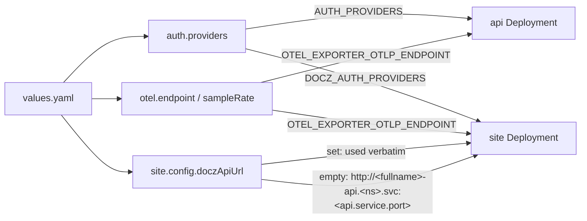
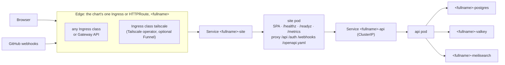
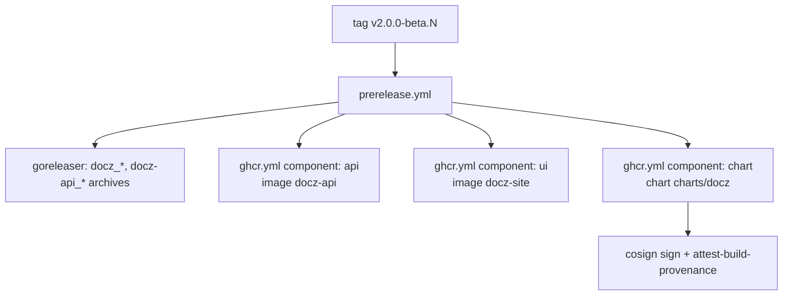
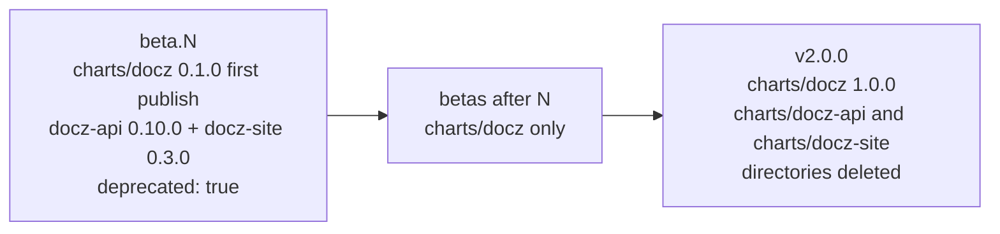

<!-- markdownlint-disable-file MD025 MD041 -->

# DESIGN-0018: One Helm chart for docz: charts/docz replaces docz-api and docz-site

<!--toc:start-->
- [Overview](#overview)
- [Goals and Non-Goals](#goals-and-non-goals)
  - [Goals](#goals)
  - [Non-Goals](#non-goals)
- [Background](#background)
- [Detailed Design](#detailed-design)
  - [1. Layout](#1-layout)
  - [2. Names, labels, and selectors](#2-names-labels-and-selectors)
  - [3. Values](#3-values)
  - [4. Wiring the site to the API](#4-wiring-the-site-to-the-api)
  - [5. The edge](#5-the-edge)
  - [6. Helpers](#6-helpers)
  - [7. From two charts to one, file by file](#7-from-two-charts-to-one-file-by-file)
  - [8. Schema, README, and changelog](#8-schema-readme-and-changelog)
  - [9. Publishing](#9-publishing)
  - [10. Recipes and CI](#10-recipes-and-ci)
  - [11. Retiring the old charts](#11-retiring-the-old-charts)
- [API / Interface Changes](#api--interface-changes)
- [Data Model](#data-model)
- [Testing Strategy](#testing-strategy)
- [Migration / Rollout Plan](#migration--rollout-plan)
- [Open Questions](#open-questions)
  - [1. What is the chart called?](#1-what-is-the-chart-called)
  - [2. What version does the chart start at?](#2-what-version-does-the-chart-start-at)
  - [3. Where do the backing services live in values?](#3-where-do-the-backing-services-live-in-values)
  - [4. How are resources named?](#4-how-are-resources-named)
  - [5. Which workloads can be turned off?](#5-which-workloads-can-be-turned-off)
  - [6. Is DOCZAPIURL overridable?](#6-is-doczapiurl-overridable)
  - [7. Where do the shared settings live?](#7-where-do-the-shared-settings-live)
  - [8. What does the edge point at?](#8-what-does-the-edge-point-at)
  - [9. Where does the Tailscale sidecar go?](#9-where-does-the-tailscale-sidecar-go)
  - [10. One ServiceAccount or two?](#10-one-serviceaccount-or-two)
  - [11. Does the role go into the Deployments' matchLabels?](#11-does-the-role-go-into-the-deployments-matchlabels)
  - [12. How does the chart publish?](#12-how-does-the-chart-publish)
  - [13. Where do the chart's just recipes live?](#13-where-do-the-charts-just-recipes-live)
  - [14. How are the unit tests laid out?](#14-how-are-the-unit-tests-laid-out)
  - [15. When are the old chart directories deleted?](#15-when-are-the-old-chart-directories-deleted)
  - [16. Does the first cut add a site alert?](#16-does-the-first-cut-add-a-site-alert)
  - [17. Is authRedirectBase derived from the edge?](#17-is-authredirectbase-derived-from-the-edge)
- [References](#references)
<!--toc:end-->

<!--docz:overview:start-->
## Overview

INV-0014 concluded that docz-api and docz-site should ship as one Helm chart.
It resolved the shape as a **single merged chart** (1b), not an umbrella; the
two published charts are **deprecated** (2a); and existing releases are **not
migrated** (3c). This design specifies that chart, `charts/docz`:

- its layout, names, and labels;
- its values, which put each workload in its own block, give the backing
  services one shared home, and hold the settings both workloads need in one
  place;
- how it derives the wiring between the site and the API that a user writes
  by hand today;
- where outside traffic enters;
- how it is tested and published;
- how `charts/docz-api` and `charts/docz-site` are retired.

Nothing inside either container changes. Every environment variable the
binaries read today is rendered from the new values, and the image tags are
the ones `v2.0.0-beta.4` already publishes.

The open questions were resolved on 2026-09-25, and the design below is
written to those answers. Two of them change the shape of the chart from
what INV-0014 described: both workloads always install (OQ 5), and the
Tailscale sidecar is dropped in favour of the Tailscale operator's Ingress,
which the chart documents but does not template (OQ 9).

<!--docz:overview:end-->

## Goals and Non-Goals

<!--docz:goals:start-->
### Goals

- **One install.** `helm install docz oci://ghcr.io/donaldgifford/charts/docz`
  gives a working product: the API, the site, and baked Postgres, Valkey, and
  Meilisearch.
- **One version.** A single `appVersion` defaults both images. The version
  skew INV-0014 Observation 1 found cannot occur.
- **Wiring derived, not typed.** The site's `DOCZ_API_URL` comes from the
  release's own API Service. The login-provider list and the tracing
  endpoint are each set once and reach both workloads.
- **Labelled for ownership.** Every resource the chart renders carries a
  `component` label (default `docz`) and an `owner` label (default `lab`),
  so a cluster's inventory can find everything docz installed.
- **Feature parity, less the sidecar.** Everything `charts/docz-api` 0.9.0
  and `charts/docz-site` 0.2.0 can render, the new chart can render, except
  the Tailscale sidecar:
  - the backend modes (`baked`/`cnpg`/`external` for Postgres,
    `baked`/`external` for Valkey and Meilisearch);
  - every login provider and `none`;
  - `existingSecret`;
  - both ServiceMonitors, the PrometheusRule, HPA, Ingress, and HTTPRoute.
- **Coverage kept.** The 145 unit tests (96 + 49) are ported, not dropped,
  apart from the Tailscale suite, and new tests pin the wiring and labels
  this design adds.
- **Same supply chain.** The chart is signed with cosign and carries build
  provenance through the existing `ghcr.yml` path.

<!--docz:goals:end-->

<!--docz:non-goals:start-->
### Non-Goals

- **Migrating existing releases** (INV-0014 3c). A docz-api or docz-site
  release keeps working on its old chart until someone reinstalls with the
  new one. No adoption or data-move procedure is written or tested.
- **An umbrella chart** (INV-0014 1a, rejected).
- **Partial installs.** Neither workload can be turned off (OQ 5). An
  install that wants only the API keeps using the deprecated
  `charts/docz-api` until v2.0.0, and after that runs the full chart.
- **Tailscale in the chart** (OQ 9). The sidecar, its serve ConfigMap, its
  RBAC, and its state Secret are not carried forward. Exposing docz on a
  tailnet is the Tailscale operator's job, through the chart's ordinary
  Ingress, and the README says how.
- **Changing either binary** or the name of any environment variable.
- **New runtime features**, such as a site alert (OQ 16) or pod disruption
  budgets.
- **Enabling ECR publishing.** It stays behind `vars.ECR_PUBLISH_ENABLED`;
  this design only keeps `ecr.yml` in step with `ghcr.yml`.

<!--docz:non-goals:end-->

<!--docz:background:start-->
## Background

The two charts today, as INV-0014 measured them:

| | `charts/docz-api` | `charts/docz-site` |
| --- | --- | --- |
| Version | `0.9.0`, `appVersion: 2.0.0-beta.3` | `0.2.0`, `appVersion: 2.0.0-beta.4` |
| `values.yaml` | 503 lines | 234 lines |
| Templates | 22 + a `helm test` hook | 8 + a `helm test` hook |
| Helpers | 23 (`docz-api.*`) | 6 (`docz-site.*`), a subset |
| Unit tests | 96 across 10 suites | 49 across 6 suites |
| State | 3 StatefulSets with PVCs (baked) | none |
| Front door | own Ingress/HTTPRoute; Tailscale sidecar with Funnel | own Ingress/HTTPRoute |
| Needs from the other | nothing | `config.doczApiUrl` (required), matching `authProviders` |

Four facts from the investigation shape this design:

1. **The site is the front door.** `ui/server/route-class.ts` proxies
   `/api`, `/auth`, `/webhooks`, and `/openapi.yaml` to the API, so the
   browser and GitHub can reach everything through the site's origin. The
   API does not need its own edge.
2. **Selector overlap is a known hazard.** The API chart's pods share
   `name`/`instance` labels with its baked backends, and chart 0.2.2 added
   `app.kubernetes.io/component: server` to the pod template and Service
   selector to stop the Service enrolling Meilisearch. That fix could not go
   into `spec.selector.matchLabels`, which is immutable, so it lives only in
   the Service. Because the new chart is new installs only, it can put the
   component into every selector from the start.
3. **The Tailscale sidecar exposed the API with Funnel.** Its serve config
   proxied `/` to the API container and set `AllowFunnel`, which is how a
   homelab install received GitHub webhooks from the public internet. With
   the site as the front door, the same job is an Ingress with the
   operator's `tailscale` class pointed at the site, and GitHub reaches
   `/webhooks` through the site's proxy.
4. **The pipeline is per component.** `ghcr.yml` and `ecr.yml` resolve
   `component: api|ui` into an image, a bake target, and a chart. The chart
   job is idempotent (`helm pull` precheck), signed, and attested.

<!--docz:background:end-->

<!--docz:detailed-design:start-->
## Detailed Design

### 1. Layout

```text
charts/docz/
├── Chart.yaml               name: docz, version 0.1.0, one appVersion
├── values.yaml              §3
├── values.schema.json       merged, permissive (additionalProperties: true)
├── README.md.gotmpl         → README.md via helm-docs, incl. the Tailscale section (§5)
├── CHANGELOG.md             chart changes only
├── cliff.toml               --include-path 'charts/docz/**'
├── ci/ci-values.yaml        busybox for both workloads, a dummy per required value
├── templates/
│   ├── _helpers.tpl         shared: name, fullname, labels, selectors (§2, §6)
│   ├── _api.tpl             the 16 backend/secret/auth helpers, renamed docz.api.*
│   ├── NOTES.txt
│   ├── api-deployment.yaml  api-service.yaml  api-serviceaccount.yaml
│   ├── api-secret.yaml      api-hpa.yaml      api-servicemonitor.yaml
│   ├── api-prometheusrule.yaml
│   ├── site-deployment.yaml site-service.yaml site-serviceaccount.yaml
│   ├── site-hpa.yaml        site-servicemonitor.yaml
│   ├── ingress.yaml         httproute.yaml    (one edge, to the site, §5)
│   ├── store-postgres.yaml  store-postgres-secret.yaml
│   ├── store-cnpg-cluster.yaml store-cnpg-pooler.yaml store-cnpg-pooler-service.yaml
│   ├── queue-valkey.yaml    queue-valkey-secret.yaml
│   ├── search-meili.yaml    search-meili-secret.yaml search-meili-servicemonitor.yaml
│   └── tests/test-connection.yaml   one hook, checks both /healthz
└── tests/
    ├── api/…_test.yaml      the docz-api suites, ported (Tailscale's dropped)
    ├── site/…_test.yaml     the 6 docz-site suites, ported
    └── chart/…_test.yaml    new: wiring, names, labels, selectors, edge
```

Backend templates keep their file names. Only the workload templates gain an
`api-`/`site-` prefix, so a reader can see which workload a file belongs to.

### 2. Names, labels, and selectors

`docz.fullname` is the standard Helm rule over chart name `docz`: a release
called `docz` renders `docz`, and a release called `prod` renders
`prod-docz`. Each workload and backend then takes a suffix:

| Resource | Name | `app.kubernetes.io/component` |
| --- | --- | --- |
| API Deployment, Service, ServiceAccount, Secret, HPA, ServiceMonitor, PrometheusRule | `<fullname>-api` | `api` |
| Site Deployment, Service, ServiceAccount, HPA, ServiceMonitor | `<fullname>-site` | `site` |
| Baked Postgres StatefulSet, Service, Secret | `<fullname>-postgres` | `postgres` |
| CNPG Cluster, Pooler (and the `-app` Secret CNPG writes) | `<fullname>-postgres` | `postgres` |
| Baked Valkey | `<fullname>-valkey` | `valkey` |
| Baked Meilisearch | `<fullname>-meilisearch` | `meilisearch` |
| Ingress / HTTPRoute | `<fullname>` | `site` |
| `helm test` hook pod | `<fullname>-test-connection` | `test` |

**Two kinds of label, two jobs.** Every resource carries two sets:

1. **The Kubernetes recommended labels**, which say what a resource *is*
   within the release: `helm.sh/chart`, `app.kubernetes.io/name: docz`,
   `instance`, `version`, `managed-by`, and `app.kubernetes.io/component`
   naming its role from the table above.
2. **The ownership labels**, which say *whose* it is in the cluster:
   `component` (default `docz`) and `owner` (default `lab`), from the
   top-level `labels` block (§3). Every key in that block is rendered, so a
   site can add its own (`team`, `cost-center`) without a chart change.

"Every resource" is meant literally. The ownership labels go on each
object's own `metadata.labels` **and** on everything a controller creates
from it, because that is where an inventory query lands:

- each Deployment's and StatefulSet's pod template;
- each StatefulSet's `volumeClaimTemplates`, so the PVCs carry them;
- the CNPG `Cluster`'s `spec.inheritedMetadata.labels`, so the pods, PVCs,
  and Services CNPG creates carry them;
- the `helm test` hook pod.

A test (§ Testing) renders every template in several modes and fails on any
object, or any of the nested templates above, missing either label.

**Selectors use the recommended labels only.** Both Deployments'
`spec.selector.matchLabels`, every Service's `selector`, and every
ServiceMonitor's `matchLabels` select on `name` + `instance` +
`app.kubernetes.io/component`, which keeps the six workloads apart
(Background fact 2). The ownership labels stay **out** of every selector,
because `matchLabels` is immutable and a changed `owner` must not make the
next `helm upgrade` fail. `docz.selectorLabels` takes the role as an
argument, so a selector without one does not render:

```yaml
{{- define "docz.selectorLabels" -}}
app.kubernetes.io/name: {{ include "docz.name" .ctx }}
app.kubernetes.io/instance: {{ .ctx.Release.Name }}
app.kubernetes.io/component: {{ required "docz.selectorLabels: component" .component }}
{{- end }}

{{- define "docz.labels" -}}
helm.sh/chart: {{ include "docz.chart" .ctx }}
{{ include "docz.selectorLabels" . }}
app.kubernetes.io/version: {{ .ctx.Chart.AppVersion | quote }}
app.kubernetes.io/managed-by: {{ .ctx.Release.Service }}
{{ include "docz.ownerLabels" .ctx }}
{{- end }}

{{- define "docz.ownerLabels" -}}
{{- toYaml .Values.labels }}
{{- end }}
```

A template calls `include "docz.labels" (dict "ctx" $ "component" "api")`
for its own metadata, and `include "docz.ownerLabels" $` next to
`docz.selectorLabels` in a pod template, where the recommended set is
already selector plus pod labels. `docz.componentFullname` takes the same
`dict`.

### 3. Values

The values file has five kinds of block:

- **ownership labels** (`labels`): rendered onto every resource;
- **one block per workload** (`api`, `site`): everything that is about one
  Deployment;
- **backing services** (`store`, `queue`, `search`): top level, keeping their
  current shape;
- **shared settings** (`auth`, `otel`, `metrics`, `serviceMonitor`,
  `prometheusRule`): set once and read by both workloads;
- **the edge** (`ingress`, `httpRoute`): one set, pointed at the site.

```yaml
nameOverride: ""
fullnameOverride: ""
imagePullSecrets: []

labels:                          # on every resource, never in a selector (§2)
  component: docz
  owner: lab

auth:
  providers: "github"            # → AUTH_PROVIDERS (api) and DOCZ_AUTH_PROVIDERS (site)

otel:
  endpoint: ""                   # empty = tracing off in both workloads
  sampleRate: 1
  # serviceName is per workload: api.otel.serviceName / site.otel.serviceName

metrics:
  enabled: true                  # both /metrics endpoints
serviceMonitor:
  enabled: false                 # one per workload, plus Meilisearch's
  interval: 30s
  labels: {}
prometheusRule:
  enabled: false                 # API alerts, as today
  labels: {}

api:
  replicaCount: 1
  revisionHistoryLimit: 3
  image: { repository: ghcr.io/donaldgifford/docz-api, pullPolicy: IfNotPresent, tag: "" }
  serviceAccount: { create: true, annotations: {}, name: "" }
  podAnnotations: {}
  podLabels: {}
  podSecurityContext: { runAsUser: 65532, … }     # unchanged defaults
  securityContext: { readOnlyRootFilesystem: true, … }
  service: { type: ClusterIP, port: 80 }
  resources: { … }                                # unchanged defaults
  livenessProbe: { … }
  readinessProbe: { … }
  config:                        # every docz-api config key except authProviders
    appId: ""
    port: 8080
    logLevel: info
    logFormat: json
    authRedirectBase: ""
    githubOAuthClientID: ""
    oktaIssuer: ""               # …and the rest of the provider keys, unchanged
    githubApiBase: ""
    sessionTTL: ""
    ingestDebounce: ""
  otel: { serviceName: "docz-api" }
  secrets: { create: true, existingSecret: "", … }   # unchanged shape
  autoscaling: { enabled: false, … }
  extraEnv: []
  extraVolumes: []
  extraVolumeMounts: []
  nodeSelector: {}
  tolerations: []
  affinity: {}

site:
  replicaCount: 1
  revisionHistoryLimit: 3
  image: { repository: ghcr.io/donaldgifford/docz-site, pullPolicy: IfNotPresent, tag: "" }
  serviceAccount: { create: true, annotations: {}, name: "" }
  # …the same per-workload keys as api…
  config:
    port: 8080
    doczApiUrl: ""               # empty = derived (§4)
    mermaidLayout: elk
    navLinks: []
    logLevel: info
    logFormat: json
  otel: { serviceName: "docz-site" }

store:  { backend: postgres, postgres: { mode: baked, … }, external: { … } }   # unchanged
queue:  { backend: valkey,   valkey:   { mode: baked, … }, external: { … } }   # unchanged
search: { meili: { mode: baked, … } }                                         # unchanged

ingress:   { enabled: false, className: "", annotations: {}, hosts: [], tls: [] }
httpRoute: { enabled: false, annotations: {}, parentRefs: [], hostnames: [], rules: [] }
```

There is no `enabled` key on either workload (OQ 5) and no `tailscale`
block (OQ 9). Both images default their tag to `.Chart.AppVersion`, so one
bump moves both. A user carrying values over from the old charts nests them
as in the Data Model table. The only keys that move out of a workload are
`authProviders` (to `auth.providers`) and the OTel endpoint and sample rate
(to `otel`).

### 4. Wiring the site to the API



- **`DOCZ_API_URL`** renders from `site.config.doczApiUrl` when set, and
  otherwise from `docz.api.internalUrl`:
  `http://<fullname>-api.<namespace>.svc.cluster.local:<api.service.port>`.
  The `required` check is gone. The override stays (OQ 6), for a site
  pointed at an API outside the release while the in-release API still runs.
- **Login providers** are one list. `docz.api.authProviders` and
  `docz.api.authDisabled` read `auth.providers`, and the site gets the same
  string. With `none`, the site shows no providers, which is what the API
  serves.
- **Tracing** is on for both workloads or for neither. Each workload keeps
  its own `OTEL_SERVICE_NAME`, so traces still name the hop.
- **`AUTH_REDIRECT_BASE`** stays `api.config.authRedirectBase`, required
  unless `auth.providers` is `none` (OQ 17). Its comment now says it must be
  the site's public URL, because the site proxies `/auth/callback`.

### 5. The edge



There is **one** `ingress` block and **one** `httpRoute` block, and both
send traffic to the **site Service** (OQ 8). The API's Service stays
`ClusterIP` and gets no edge of its own. Because both workloads always
install (OQ 5), the target is fixed and there is no fallback logic.

The HTTPRoute renders a default rule to the site when `rules` is empty.
That was docz-site's behaviour. docz-api's template rendered a route with no
rules, which attaches nothing, and is not carried forward.

**Tailscale** is no longer part of the chart (OQ 9). The sidecar existed to
put the API on a tailnet and, with Funnel, on the public internet for
GitHub. The [Tailscale Kubernetes operator](https://tailscale.com/kb/1439/kubernetes-operator-cluster-ingress) does the same thing
from outside the chart: an Ingress with `ingressClassName: tailscale`
becomes a tailnet device proxying to its backend, and the
`tailscale.com/funnel: "true"` annotation publishes it. So the chart's own
`ingress` block already covers it. The README gains a section, "Exposing
docz with the Tailscale operator", that shows:

- the operator as a prerequisite, installed once per cluster with its own
  OAuth client, and a pointer to its docs;
- the values to set:

  ```yaml
  ingress:
    enabled: true
    className: tailscale
    annotations:
      tailscale.com/funnel: "true"   # only if GitHub webhooks must reach it
    hosts:
      - host: docz                   # becomes docz.<tailnet>.ts.net
        paths: [{ path: /, pathType: Prefix }]
    tls:
      - hosts: [docz]
  ```

- that `api.config.authRedirectBase` is then `https://docz.<tailnet>.ts.net`
  and the GitHub App's webhook URL is `https://docz.<tailnet>.ts.net/webhooks/github`;
- that Funnel exposes the whole site, not only `/webhooks`, and that an
  install that needs no webhooks from GitHub should leave it off.

The chart never templates anything Tailscale-specific, so an operator
upgrade that changes its annotations is a README fix, not a chart release.

### 6. Helpers

`_helpers.tpl` holds only what every template needs:

- `docz.name`, `docz.fullname`, `docz.chart`;
- `docz.componentFullname` (`dict ctx component`);
- `docz.labels` and `docz.selectorLabels` (`dict ctx component`), and
  `docz.ownerLabels` (`ctx`) (§2);
- `docz.serviceAccountName` (`dict ctx component`), which reads
  `.Values.<component>.serviceAccount`;
- `docz.image` (`dict ctx component`), which renders
  `repository:tag|default AppVersion`.

`_api.tpl` holds the 16 helpers that describe the API's dependencies. Each
is renamed from `docz-api.X` to `docz.api.X`, with the same body except that
`.Values.config.authProviders` becomes `.Values.auth.providers` and fullname
calls go through `docz.fullname`:

- `secretName`;
- `postgresFullname`, `valkeyFullname`, `meiliFullname`;
- `storeSecretName`, `storeSecretKey`;
- `queueSecretName`, `queueSecretKey`;
- `valkeyPasswordSecretName`, `valkeyPasswordSecretKey`, `valkeyBakedDsn`;
- `meiliHost`, `searchSecretName`, `searchSecretKey`;
- `authProviders`, `authDisabled`.

It also gains one new helper, `internalUrl`, for §4. `tailscaleStateSecret`
is dropped with the sidecar.

The two charts' `-name`/`-fullname`/`-chart`/`-labels`/`-selectorLabels`/
`-serviceAccountName` helpers are duplicates of one another and collapse
into the shared set.

### 7. From two charts to one, file by file

| Today | In `charts/docz` |
| --- | --- |
| `docz-api/templates/deployment.yaml` | `api-deployment.yaml`, without the Tailscale container, volumes, and `TS_*` env |
| `docz-site/templates/deployment.yaml` | `site-deployment.yaml`, always rendered |
| both `service.yaml` | `api-service.yaml`, `site-service.yaml` |
| both `serviceaccount.yaml` | `api-serviceaccount.yaml`, `site-serviceaccount.yaml` |
| both `hpa.yaml` (identical bar names) | `api-hpa.yaml`, `site-hpa.yaml` over one `docz.hpa` helper |
| both `servicemonitor.yaml` | `api-servicemonitor.yaml`, `site-servicemonitor.yaml` |
| both `ingress.yaml` (identical bar names) | one `ingress.yaml` → the site Service |
| both `httproute.yaml` | one `httproute.yaml`, docz-site's default-rule behaviour |
| `docz-api/templates/secret.yaml` | `api-secret.yaml`, keys unchanged |
| `docz-api/templates/prometheusrule.yaml` | `api-prometheusrule.yaml`; `up{job=…}` names `<fullname>-api` |
| `store-*`, `queue-*`, `search-*` | same names, helpers renamed, ownership labels on pod and PVC templates and CNPG `inheritedMetadata` |
| `tailscale-configmap.yaml`, `tailscale-rbac.yaml` | removed; README section instead (§5) |
| both `NOTES.txt` | one; prints the front-door URL, and what is still required |
| both `templates/tests/test-connection.yaml` | one hook pod that `wget`s both Services' `/healthz` |

### 8. Schema, README, and changelog

- **`values.schema.json`** merges the two schemas under their new paths, and
  keeps their permissive style (`additionalProperties: true` everywhere). It
  also keeps every existing enum: the three backend `mode`s, both workloads'
  `logLevel`/`logFormat`, and `site.config.mermaidLayout`. `auth.providers`
  gets a pattern that allows only `github`, `okta`, `keycloak`, and `none`,
  comma-separated. `labels` is an object of strings whose values must be
  valid label values (≤63 characters, the label-value pattern), so a bad
  owner fails at render rather than at the API server.
- **`README.md`** is generated by `helm-docs` from `README.md.gotmpl`. The
  template is written fresh:
  - install;
  - the edge;
  - backend modes;
  - login providers;
  - labels;
  - "Exposing docz with the Tailscale operator" (§5);
  - "Coming from docz-api or docz-site", which points at the Data Model
    table and says no in-place upgrade exists and the sidecar is gone.
- **`CHANGELOG.md`** starts at the chart's first version, and `cliff.toml`
  scopes git-cliff to `charts/docz/**`.

### 9. Publishing



`ghcr.yml` and `ecr.yml` gain a third `component`, `chart`, whose resolve row
has no image and a chart directory of `charts/docz` (OQ 12). The `image` job
is gated on the row having an image, and the `chart` job on the row having a
chart. `prerelease.yml` and `release.yml` each call it once more
(`publish-chart`, `publish-ecr-chart`) under the same permissions ceiling.
The `api` and `ui` rows keep their chart columns only for the release that
publishes the deprecated final versions (§11), then lose them.

The OCI address is `oci://ghcr.io/donaldgifford/charts/docz`, a new GHCR
package. Like every package before it, it needs its own Actions access grant
before the first publish, or the push fails `403 write_package`.

### 10. Recipes and CI

- **just.** The chart is neither the server's nor the frontend's, so its
  recipes leave `api.just` and `ui.just`. They go to a new optional module,
  `chart.just` (`mod? chart`): `just chart lint`, `template`, `unittest`, and
  `docs`, each scoped to `charts/docz`. The root `ci` gate replaces
  `api::helm-lint` with `chart::lint` (OQ 13).
- **helm-unittest** runs as
  `helm unittest -f 'tests/**/*_test.yaml' charts/docz`, because the suites
  sit in subdirectories (OQ 14). CI's `for chart in charts/*/` loop needs no
  change while the old charts exist, apart from passing that glob for
  `charts/docz`.
- **chart-testing.** `ct lint` and `ct install` on kind pick the new chart
  up from `ct.yaml`'s `chart-dirs: [charts]` with no edit. `ci/ci-values.yaml`
  runs busybox for both workloads and keeps the ≥16-byte Meilisearch
  dummy key `ct install` needs.
- **Path filter.** The `helm` filter already covers `charts/**`.

### 11. Retiring the old charts



In the release that first publishes `charts/docz`, each old chart publishes
one final version (OQ 15): `docz-api` 0.10.0 and `docz-site` 0.3.0. That
version:

- sets `deprecated: true` in `Chart.yaml`, which Helm and Artifact Hub
  surface;
- sets `appVersion` to that release, which fixes INV-0014's skew on the way
  out;
- opens its `NOTES.txt` and README with the move to `charts/docz`, and says
  there is no in-place upgrade and that the Tailscale sidecar does not carry
  over.

After that release the old directories stop changing and are not published
again. They are deleted at the v2.0.0 cut, along with the `api`/`ui` chart
columns, `api.just`/`ui.just`'s helm recipes, and every doc line that names
them. The published versions stay in GHCR. `charts/docz` goes to 1.0.0 at
the same cut (OQ 2).

<!--docz:detailed-design:end-->

<!--docz:api-changes:start-->
## API / Interface Changes

The interface a user sees is the chart address and its values. The
containers' interface does not change.

| Surface | Before | After |
| --- | --- | --- |
| Install | two `helm install`s, site after API | `helm install docz oci://ghcr.io/donaldgifford/charts/docz` |
| Chart address | `charts/docz-api`, `charts/docz-site` | `charts/docz`; the old two deprecated |
| Resource names | `<release>-docz-api`, `<release>-docz-site`, `<release>-docz-api-postgres`… | `<fullname>-api`, `<fullname>-site`, `<fullname>-postgres`… (§2) |
| Labels | recommended set; `component: server` on API pods only | recommended set with a role on every object, plus `component: docz` and `owner: lab` everywhere |
| Partial install | either chart alone | both workloads, always |
| `DOCZ_API_URL` | required, hand-written | derived; override optional |
| Login providers | set twice, must match | `auth.providers`, once |
| Edge | one per chart | one, to the site |
| Tailscale | sidecar on the API pod | none; the operator's Ingress class, documented |
| Alert `DoczAPIDown` | `up{job="<release>-docz-api"}` | `up{job="<fullname>-api"}` |
| Environment variables | — | unchanged in name and meaning, less `TS_*` |

<!--docz:api-changes:end-->

<!--docz:data-model:start-->
## Data Model

Where each old key goes. Anything not listed moves under the workload's
block unchanged: for example, docz-api's `resources` becomes
`api.resources`, and docz-site's `affinity` becomes `site.affinity`.

| `charts/docz-api` key | `charts/docz` key |
| --- | --- |
| `replicaCount`, `revisionHistoryLimit`, `image`, `serviceAccount`, `pod*`, `securityContext`, `service`, `resources`, `*Probe`, `extra*`, `nodeSelector`, `tolerations`, `affinity` | `api.<same>` |
| `imagePullSecrets`, `nameOverride`, `fullnameOverride` | top level, shared |
| `config.authProviders` | `auth.providers` |
| `config.*` (every other key) | `api.config.*` |
| `otel.endpoint`, `otel.sampleRate` | `otel.endpoint`, `otel.sampleRate` |
| `otel.serviceName` | `api.otel.serviceName` (default `docz-api`) |
| `secrets.*` | `api.secrets.*` |
| `autoscaling.*` | `api.autoscaling.*` |
| `metrics`, `serviceMonitor`, `prometheusRule` | top level, shared |
| `store`, `queue`, `search` | top level, unchanged |
| `tailscale.*` | removed; see the README's Tailscale operator section |
| `ingress`, `httpRoute` | top level, targets the site |
| — | `labels` (new: `component`, `owner`) |

| `charts/docz-site` key | `charts/docz` key |
| --- | --- |
| per-workload keys, as above | `site.<same>` |
| `config.authProviders` | `auth.providers` |
| `config.doczApiUrl` | `site.config.doczApiUrl`, optional |
| `config.*` (every other key) | `site.config.*` |
| `otel.endpoint`, `otel.sampleRate` | `otel.*` |
| `otel.serviceName` | `site.otel.serviceName` (default `docz-site`) |
| `autoscaling.*` | `site.autoscaling.*` |
| `metrics`, `serviceMonitor` | top level, shared |
| `ingress`, `httpRoute` | top level |

<!--docz:data-model:end-->

<!--docz:testing:start-->
## Testing Strategy

**Ported suites.** The docz-api suites except `tailscale_test.yaml` move
under `tests/api/`, and all six docz-site suites move under `tests/site/`.
Their `set:` paths are rewritten to the new keys and their expected names to
§2. A ported suite keeps its assertions. A test that no longer applies is
deleted with a comment in its commit saying why; it is never edited until it
passes. Such tests include:

- docz-api's HTTPRoute rendering zero rules;
- every Tailscale assertion;
- anything gated on a workload being disabled.

**New suites under `tests/chart/`:**

- **wiring**:
  - `DOCZ_API_URL` renders the in-cluster API URL when unset and the
    override when set;
  - `auth.providers` reaches both `AUTH_PROVIDERS` and `DOCZ_AUTH_PROVIDERS`;
  - an empty `otel.endpoint` omits the tracing variables from both
    workloads;
- **labels**, run over every template in the default (all baked), CNPG,
  and all-external modes with the ServiceMonitors, PrometheusRule, HPAs,
  Ingress, and HTTPRoute all enabled:
  - every object carries `component: docz` and `owner: lab`;
  - so does every pod template, `volumeClaimTemplates` entry, and the CNPG
    `inheritedMetadata`;
  - overriding `labels.owner` and adding a key both show up everywhere;
- **selectors**: every Deployment `matchLabels`, Service `selector`, and
  ServiceMonitor `matchLabels` carries an `app.kubernetes.io/component`, no
  two workloads share one, and none contains `component` or `owner`;
- **edge**: Ingress and HTTPRoute send traffic to the site Service, and an
  empty `httpRoute.rules` yields the default rule;
- **nothing Tailscale**: no rendered object in any mode contains `tailscale`
  (case-insensitive), so a sidecar cannot drift back in through a ported
  template;
- **version**: both images default to `.Chart.AppVersion`, which matches
  bare semver (the existing guard, now over both images).

**Render parity**, run once during implementation and recorded in the IMPL,
not kept. Render the old charts and the new one with equivalent values: each
`ci-values.yaml`, plus a CNPG case, an all-external case, and a `none` auth
case. Normalise resource names to the §2 scheme and diff every container
spec, environment variable, volume, and Secret key. The only differences
allowed are:

- names and labels;
- `DOCZ_API_URL`;
- the edge target;
- the removed Tailscale container, volumes, and `TS_*` env.

This check is what shows the port kept feature parity.

**Install.** `ct install` on kind with `ci/ci-values.yaml`. Once, by hand,
install the real images with `auth.providers: none` and a port-forward, and
confirm that `/api/v1/repos` answers through the site. That is the proxy
round trip IMPL-0020 left open, and the derived `DOCZ_API_URL` is what makes
it work without typing a URL. If a cluster with the Tailscale operator is to
hand, follow the README section once and record the result; it is not a CI
gate.

**Gate.** `just ci`, which now runs `chart::lint`, plus CI's
`helm-unittest` and `helm-test`.

<!--docz:testing:end-->

<!--docz:rollout:start-->
## Migration / Rollout Plan

There is no migration for existing releases (INV-0014 3c). The rollout is
about the repository and the registry:

1. Build `charts/docz` beside the old charts. Neither old chart changes
   until step 3.
2. Wire `component: chart` into `ghcr.yml`/`ecr.yml`, then into
   `prerelease.yml` and `release.yml`. The first `release.yml` run after the
   merge would publish `charts/docz` from `main`, because the chart job
   publishes any version not yet in GHCR. That is acceptable only after the
   GHCR grant exists, so **the grant for `charts/docz` is made before this
   merges** (human).
3. In the same PR, publish `docz-api` 0.10.0 and `docz-site` 0.3.0 as
   `deprecated: true`, with `appVersion` set to the next beta.
4. Cut the next beta by hand, as every v2 beta is. Check the release:
   - `helm show chart oci://ghcr.io/donaldgifford/charts/docz` reports the
     beta's bare `appVersion`;
   - `cosign tree` shows a signature and provenance;
   - both old charts report `deprecated: true`.
5. Update README, DEVELOPMENT, CONTRIBUTING, CLAUDE.md, `deploy/api/README.md`,
   and `ui/CLAUDE.md` to name `charts/docz`, and drop their mentions of the
   Tailscale sidecar.
6. At the v2.0.0 cut, delete `charts/docz-api/` and `charts/docz-site/`, the
   `api`/`ui` chart columns, and their recipes, and bump `charts/docz` to
   1.0.0.

<!--docz:rollout:end-->

<!--docz:open-questions:start-->
## Open Questions

> Each question is numbered. Option `a` is my recommendation, the later
> letters are alternatives, and the last is "other" for your own answer.
> All seventeen were resolved on 2026-09-25.

### 1. What is the chart called?

- a. **`docz`** at `charts/docz`, published as
  `oci://ghcr.io/donaldgifford/charts/docz`. It is named for the product,
  it is short, and it matches the repository.
- b. `docz-platform` or `docz-stack`, which says "the whole thing" but is a
  name nothing else uses.
- c. Keep `docz-api` and fold the site into it. This avoids a new GHCR
  package, but the name no longer describes the chart.
- d. Other.

> **Resolved 2026-09-25: (a).** `charts/docz`.

### 2. What version does the chart start at?

- a. **`0.1.0` now, `1.0.0` at the v2.0.0 cut.** Chart and app versions
  stay independent, as both charts do today, and `1.0.0` marks the values
  interface as stable.
- b. Track the app: `2.0.0-beta.N` on each beta. This is simple to read,
  but a chart-only fix then needs an app version.
- c. `1.0.0` now.
- d. Other.

> **Resolved 2026-09-25: (a).** 0.1.0 now, 1.0.0 at v2.0.0.

### 3. Where do the backing services live in values?

- a. **Top level (`store`, `queue`, `search`), shape unchanged.** They are
  the product's infrastructure rather than the API's settings, and an
  existing values file copies across with no nesting.
- b. Under `api` (`api.store`…), because only the API uses them. This is
  truer to ownership but deepens every path.
- c. Other.

> **Resolved 2026-09-25: (a).** Top level, unchanged.

### 4. How are resources named?

- a. **`<fullname>-api`, `<fullname>-site`, `<fullname>-postgres`…**
  (§2). The names are symmetric, and each one says what it is.
- b. The API takes the bare `<fullname>` and only the site gets a suffix, on
  the grounds that the API is the "main" workload.
- c. Other.

> **Resolved 2026-09-25: (a).** Suffix every workload and backend.

### 5. Which workloads can be turned off?

- a. **`site.enabled` (default `true`); the API always renders.** A site
  without an API is useless, but an API without a site serves headless use
  (the API and search only).
- b. `api.enabled` and `site.enabled` both. This allows a site-only install
  pointed at an external API, at the cost of a second set of conditionals.
- c. Neither: both always render.
- d. Other.

> **Resolved 2026-09-25: (c).** Both workloads always install. The chart is
> the product, and there is no `enabled` key on either block. This removes
> the edge-target fallback and every `site.enabled` conditional from §5–§7.

### 6. Is `DOCZ_API_URL` overridable?

- a. **Derived by default, overridable with `site.config.doczApiUrl`.**
  The override costs one `if` and keeps the external-API case open.
- b. Always derived. This is simplest, and a site that needs another API
  uses its own chart.
- c. Other.

> **Resolved 2026-09-25: (a).** Derived, overridable.

### 7. Where do the shared settings live?

- a. **Plain top-level blocks (`auth.providers`, `otel`), read by both
  workloads.** Nothing about them needs Helm's `global` semantics, because
  there are no subcharts.
- b. A `global:` block, the usual Helm convention for shared values, but a
  convention meant for subcharts this chart does not have.
- c. Keep them per workload, and fail the render when the two disagree.
- d. Other.

> **Resolved 2026-09-25: (a).** Plain top-level blocks.

### 8. What does the edge point at?

- a. **One Ingress/HTTPRoute, to the site; to the API when the site is
  off** (§5). The site already proxies everything the API serves publicly.
- b. One edge per workload, as today. This allows exposing the API on its
  own host, but reintroduces two front doors.
- c. One edge to the site, plus an optional path rule sending `/webhooks`
  straight to the API and skipping the proxy hop.
- d. Other.

> **Resolved 2026-09-25: (a).** One edge, to the site. With OQ 5 resolved
> as (c) the site is always there, so the "API when the site is off" half
> no longer applies.

### 9. Where does the Tailscale sidecar go?

- a. **On the front-door pod, with `hostname` defaulting to `docz`.** Funnel
  then publishes the site, and webhooks reach the API through the proxy. A
  homelab install behind Tailscale has one tailnet name.
- b. Stay on the API pod, as today. This keeps webhook delivery independent
  of the site, but the browser-facing site then needs a separate way in.
- c. Per-workload sidecars (`api.tailscale`, `site.tailscale`).
- d. Other.

> **Resolved 2026-09-25: (d).** No sidecar. The chart carries no Tailscale
> templates or values. The README documents exposing docz through the
> Tailscale operator with the chart's own Ingress (`className: tailscale`,
> optional Funnel annotation) (§5).

### 10. One ServiceAccount or two?

- a. **One per workload**, each with its own `serviceAccount` block. The
  Tailscale Role binds only to the edge pod's account, which gives least
  privilege.
- b. One shared account. This is simpler, but the Tailscale Secret access
  extends to both workloads.
- c. Other.

> **Resolved 2026-09-25: (a).** One per workload. With the sidecar gone
> neither account needs a Role, but the split stays, so either workload can
> later be given cloud identity (IRSA, Workload Identity) without the other.

### 11. Does the role go into the Deployments' `matchLabels`?

- a. **Yes, everywhere** (§2). New installs only means no immutable-selector
  constraint, so the 0.2.2 compromise can end.
- b. Follow the old pattern: the role on pods and Services only. This keeps
  the charts alike, but carries forward a workaround for a constraint this
  chart does not have.
- c. Other.

> **Resolved 2026-09-25: (a).** `app.kubernetes.io/component` is in every
> selector. The ownership labels (`component`, `owner`) are not; see §2.

### 12. How does the chart publish?

- a. **A third `component: chart` row in `ghcr.yml`/`ecr.yml`**, with the
  image job skipped for a row without an image (§9). There is one table, one
  chart job, and one more call per workflow.
- b. A separate `chart.yml` reusable workflow. This is cleaner in isolation,
  but it duplicates the signing and attestation steps `ghcr.yml` already has.
- c. Keep the chart on the `api` row. This is the fewest changes, but it
  couples the product chart to one image.
- d. Other.

> **Resolved 2026-09-25: (a).** A `chart` row.

### 13. Where do the chart's `just` recipes live?

- a. **A new optional module `chart.just`** (`just chart lint`), which the
  root `ci` gate calls as `chart::lint`. The chart is neither the server's
  nor the frontend's.
- b. A `helm` group in `docz.just`, the root namespace. This saves a file,
  but `docz.just` is the library's.
- c. Keep them in `api.just` as `just api helm-*`.
- d. Other.

> **Resolved 2026-09-25: (a).** `chart.just`.

### 14. How are the unit tests laid out?

- a. **`tests/api/`, `tests/site/`, `tests/chart/`**, run with
  `-f 'tests/**/*_test.yaml'`. Ported suites stay recognisable, and the new
  ones are grouped.
- b. Flat, with prefixed names (`api-deployment_test.yaml`), which keeps the
  default glob.
- c. Other.

> **Resolved 2026-09-25: (a).** Three subdirectories.

### 15. When are the old chart directories deleted?

- a. **At the v2.0.0 cut**, after one deprecated final version of each ships
  in the first beta with `charts/docz` (§11).
- b. In the same PR that adds `charts/docz`, with no final deprecated
  versions published.
- c. Keep them indefinitely as deprecated, never publishing again.
- d. Other.

> **Resolved 2026-09-25: (a).** Deprecated finals, deleted at v2.0.0.

### 16. Does the first cut add a site alert?

- a. **No.** Carry the five API alerts over unchanged and file a follow-up
  for a `DoczSiteDown`/proxy-error alert, which needs its own thresholds.
- b. Yes: add `DoczSiteDown` (`up{job="<fullname>-site"} == 0`) now, since
  the PrometheusRule is being rewritten anyway.
- c. Other.

> **Resolved 2026-09-25: (a).** No site alert in the first cut; a follow-up
> issue.

### 17. Is `authRedirectBase` derived from the edge?

- a. **No, it stays explicit and required** (unless `none`). The chart
  cannot tell the scheme a TLS-terminating proxy presents, and a wrong
  callback URL fails at the identity provider, far from the chart.
- b. Default it to `https://<first ingress host or httpRoute hostname>` when
  unset, and keep the override.
- c. Other.

> **Resolved 2026-09-25: (a).** Explicit and required.

<!--docz:open-questions:end-->

<!--docz:references:start-->
## References

- [INV-0014](../investigation/0014-consolidate-the-docz-api-and-docz-site-helm-charts-into-one.md):
  the consolidation investigation and its three resolutions
- [ADR-0004](../adr/0004-one-repository-docz-docz-api-and-docz-site-as-a-single-go-module.md):
  one repository, one release
- [DESIGN-0017](0017-move-docz-site-in-ui-chartsdocz-site-and-orval-on-the-one-spec.md)
  and [IMPL-0020](../impl/0020-docz-site-move-in-v200-beta4.md): the
  docz-site move-in and the per-component publish path
- [Tailscale Kubernetes operator: cluster ingress](https://tailscale.com/kb/1439/kubernetes-operator-cluster-ingress)
- [Kubernetes recommended labels](https://kubernetes.io/docs/concepts/overview/working-with-objects/common-labels/)
- [Helm: Chart.yaml `deprecated`](https://helm.sh/docs/topics/charts/#the-chartyaml-file)
- [helm-unittest](https://github.com/helm-unittest/helm-unittest)


<!--docz:references:end-->
