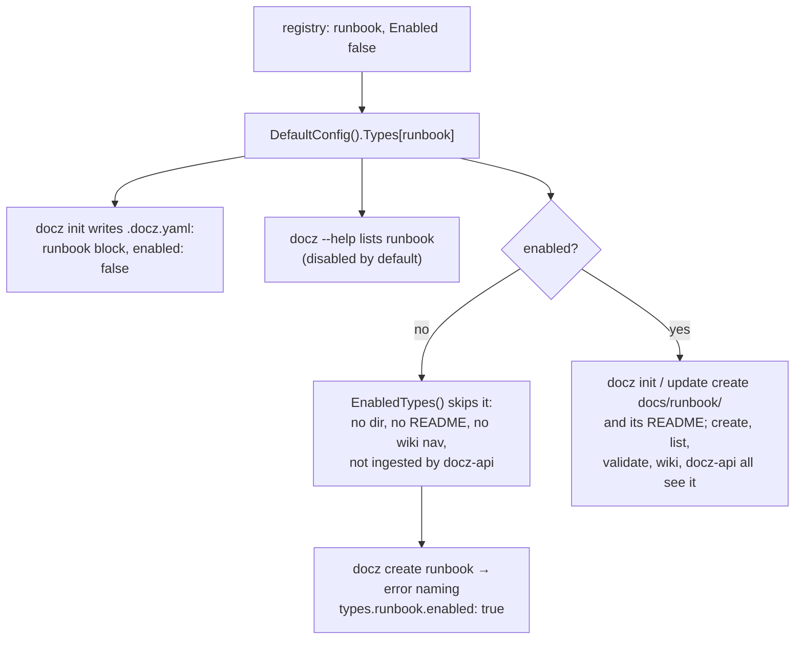
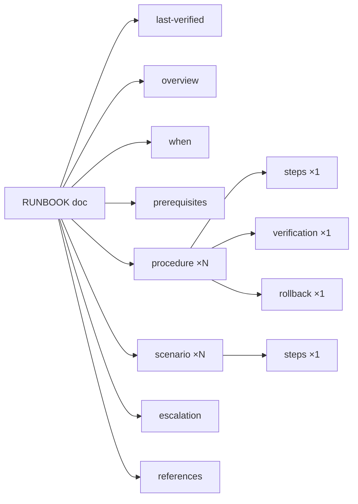
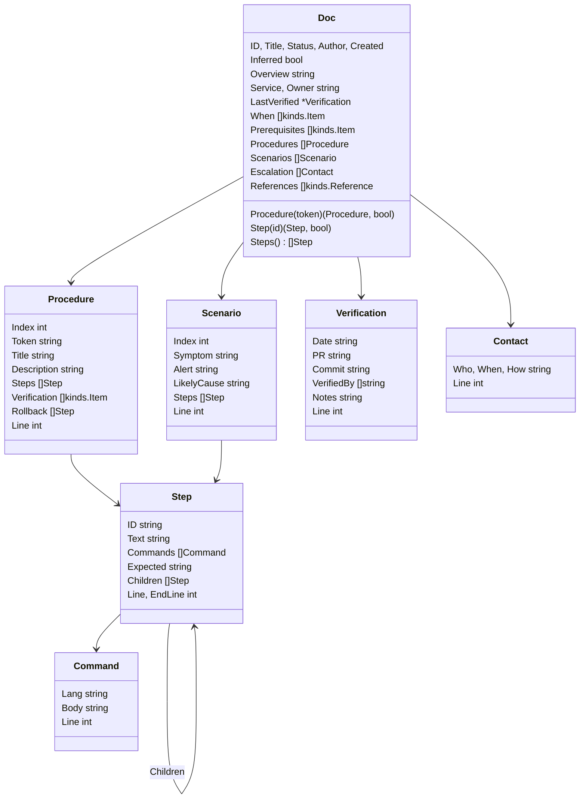
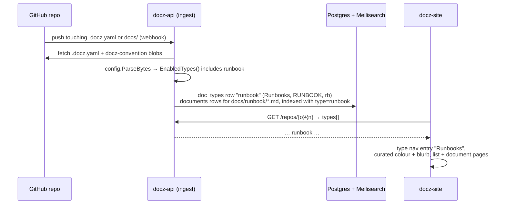

<!-- markdownlint-disable-file MD025 MD041 -->

# DESIGN-0019: Runbook: a sixth built-in document type, disabled by default

<!--toc:start-->
- [Overview](#overview)
- [Goals and Non-Goals](#goals-and-non-goals)
  - [Goals](#goals)
  - [Non-Goals](#non-goals)
- [Background](#background)
- [Detailed Design](#detailed-design)
  - [1. The registry entry](#1-the-registry-entry)
  - [2. Disabled by default: what each surface does](#2-disabled-by-default-what-each-surface-does)
  - [3. The template](#3-the-template)
  - [4. pkg/runbook](#4-pkgrunbook)
  - [5. The kind catalogue](#5-the-kind-catalogue)
  - [6. Wiring in cmd/ and the core](#6-wiring-in-cmd-and-the-core)
  - [7. Parity](#7-parity)
  - [8. docz-api and docz-site](#8-docz-api-and-docz-site)
  - [9. Documentation](#9-documentation)
  - [10. The first real runbook](#10-the-first-real-runbook)
- [API / Interface Changes](#api--interface-changes)
- [Data Model](#data-model)
- [Testing Strategy](#testing-strategy)
- [Migration / Rollout Plan](#migration--rollout-plan)
- [Open Questions](#open-questions)
  - [1. What are the ID prefix and directory?](#1-what-are-the-id-prefix-and-directory)
  - [2. Which aliases?](#2-which-aliases)
  - [3. Are steps ordered lists or checkboxes?](#3-are-steps-ordered-lists-or-checkboxes)
  - [4. One type for onboarding and troubleshooting, or two?](#4-one-type-for-onboarding-and-troubleshooting-or-two)
  - [5. Which statuses?](#5-which-statuses)
  - [6. Where does "last verified" live, and is it enforced?](#6-where-does-last-verified-live-and-is-it-enforced)
  - [7. Which regions does the schema require?](#7-which-regions-does-the-schema-require)
  - [8. How are a step's commands modelled?](#8-how-are-a-steps-commands-modelled)
  - [9. How does parity absorb the new config block?](#9-how-does-parity-absorb-the-new-config-block)
  - [10. Does this repository enable runbooks and write the first one?](#10-does-this-repository-enable-runbooks-and-write-the-first-one)
  - [11. How does docz --help show a disabled built-in?](#11-how-does-docz---help-show-a-disabled-built-in)
  - [12. Does docz-site get more than a colour and a blurb in this release?](#12-does-docz-site-get-more-than-a-colour-and-a-blurb-in-this-release)
  - [13. Is there an ADR?](#13-is-there-an-adr)
  - [14. How is docz-api version skew handled?](#14-how-is-docz-api-version-skew-handled)
- [References](#references)
<!--toc:end-->

<!--docz:overview:start-->
## Overview

This design adds `runbook` as a sixth built-in document type for
operational procedures. Onboarding a service or tool, troubleshooting a
symptom, and rotating a credential are the kinds of work it covers.

It ships **disabled**. Every generated `.docz.yaml` carries a `runbook:`
block with `enabled: false`, so a repository opts in by flipping one flag
and gets a structured template, a schema, and a typed reader for free. No
repository is opted in by default.

Like IMPL, a runbook is built from ordered work: procedures made of
numbered steps, which nest. Unlike IMPL, it is executed many times and is
never "done", so its steps are ordered lists and not checkboxes. The type
comes with its own package, `pkg/runbook`, because every built-in is a
structured type (ADR-0002).
<!--docz:overview:end-->

## Goals and Non-Goals

<!--docz:goals:start-->
### Goals

- `runbook` is a registry entry in `pkg/doczcore/config/doctype.go` with
  `Enabled: false`. The generated `.docz.yaml` shows the block, and
  `docz init` creates no `docs/runbook/` until it is enabled.
- One template covers the two shapes runbooks take in practice. An
  onboarding or change runbook is one or more **procedures** of ordered
  steps. A troubleshooting runbook is a list of **scenarios**, each a
  symptom with ordered diagnosis and resolution steps. One document may
  carry both.
- Steps are addressable. `Step.ID` is `<procedure token>.<n>[.<m>…]`, so a
  consumer can link to or display step `2.3.1` the way it addresses IMPL
  task `2.3` today.
- A runbook says who last ran it and against what. A **Last Verified**
  table at the top records the date, the PR, the commit, and who verified
  it, with a one- or two-sentence note. It is part of the body, so no
  type's frontmatter changes (§3).
- A command a step runs is part of the step. The fenced code block under a
  step is `Step.Commands`, so docz-site or a future CLI command can show or
  copy it without a markdown parser of its own.
- The type follows the same rules as the other five built-ins:
  - the template carries canonical `docz:` markers;
  - the template and `schema/runbook.md` derive the same `validate.Schema`;
  - heading inference works for unmarked documents;
  - `Parse` never touches the filesystem;
  - `cmd/validate.go` composes its per-type tier.
- **An enabled runbook is a first-class type in docz-api and docz-site.**
  A repo that turns it on gets a "Runbooks" type in the API
  (`/api/v1/repos/{owner}/{name}/types`), its documents listed, served,
  and searchable under the `runbook` facet, and a curated entry in
  docz-site's type navigation. An end-to-end test proves it (§8).
- It ships in `v2.0.0-beta.6`, as one IMPL and one PR, with the permitted
  parity delta documented.
<!--docz:goals:end-->

<!--docz:non-goals:start-->
### Non-Goals

- **Executing a runbook.** docz reads and validates runbooks and does not
  run their commands. `docz run` (or a docz-site "run mode") is out of
  scope, and nothing in this design is built for it beyond making steps
  and commands addressable.
- **Tracking a single execution.** The document is not mutated when
  somebody follows it: there are no checkboxes to tick and no per-run
  state. An incident log is a different document.
- **Alert integration.** A scenario can name the alert that triggers it.
  docz does not read Prometheus rules or PagerDuty services to check the
  names.
- **Freshness enforcement.** A runbook records when it was last verified,
  but validation stays time-independent, as every docz rule is today. No
  rule says a verification is "too old" (Open Question 6).
- **A docz-site procedure view.** docz-site renders runbooks as markdown
  with a curated colour and blurb. A step-aware view is a follow-up.
- **Turning it on in anybody's repository** except, possibly, this one
  (Open Question 10).
<!--docz:non-goals:end-->

<!--docz:background:start-->
## Background

**A disabled built-in has been tried once already.** `plan` was a built-in
from v0.x. DESIGN-0011 turned it off by default in v1.1.1 because nobody
used it, and ADR-0003 removed it on the v2 line because it was dead weight
and its name collided with IMPL's vocabulary. ADR-0003's case against
`plan` was about **no usage and no distinct purpose**, and it did not
object to disabled-by-default as such. `runbook` has a distinct purpose that
no existing type serves, and the user asking for it has runbooks to write.
The disabled-by-default machinery that `plan` exercised is still in place:
- `EnabledTypes()` skips disabled types;
- `repo.Init` scaffolds only enabled types;
- `docz_yaml.tmpl` renders every registry entry, including `enabled: false`.

Nothing new is needed to support it.

**Every built-in is a structured type, rigid by design** (ADR-0002, the
2026-09-20 decision recorded in DESIGN-0014 §2). A built-in is a package
with a `Doc`, a `Parse`, a `Validate`, and a heading table pinned to its
template, and it is not just a template. The escape hatch for loose markdown
is the `api:` block's additional docs. A runbook with no typed reader would
be the first exception, so this design gives it one.

**What runbooks look like in practice.** The industry shapes (Google SRE's
playbooks, PagerDuty's and Atlassian's runbook templates, and the
`contrib/` alert pack in this repository) converge on the same parts:

| Part | Onboarding / change | Troubleshooting |
| ---- | ------------------- | --------------- |
| What this is for, who owns it | yes | yes |
| When to use it (trigger, alert) | sometimes | yes |
| Prerequisites (access, tools) | yes | yes |
| Ordered steps with commands | yes: the procedure | yes: diagnose, then resolve |
| How to tell it worked | yes | yes |
| How to undo it | yes | sometimes |
| Who to call when it does not work | yes | yes |

The two columns share every row, so one type fits both (Open Question 4).

**Where the parts come from in the code.** The pieces the new package
needs already exist:
- `docparse.ListItems` walks ordered lists and reports indentation;
- `kinds` reads fields, items, criteria, and references;
- `impl`'s phase/task walk is the model for a repeated region carrying an
  addressable list.

`validate`'s catalogue is data, so new kinds are map entries.
<!--docz:background:end-->

<!--docz:detailed-design:start-->
## Detailed Design

### 1. The registry entry

```go
// pkg/doczcore/config/doctype.go — appended after investigation.
{
    Name:    "runbook",
    Aliases: []string{"rb"},
    DefaultConfig: func() TypeConfig {
        return TypeConfig{
            Enabled:     false,
            Dir:         "runbook",
            IDPrefix:    "RUNBOOK",
            IDWidth:     4,
            Statuses:    []string{"Draft", "Active", "Needs Review", "Deprecated"},
            StatusField: "status",
            PluralLabel: "Runbooks",
        }
    },
    NavTitle:        "Runbooks",
    PluralLabel:     "Runbooks",
    TemplateName:    "runbook",
    HelpDescription: "Runbooks — onboarding, operations, and troubleshooting procedures",
},
```

These choices are settled by Open Questions 1, 2, and 5:
- the prefix and directory are `RUNBOOK` and `runbook`, matching every other
  built-in's singular directory;
- the one alias is `rb`;
- the statuses are Draft → Active ⇄ Needs Review → Deprecated.

"Needs Review" is the state a runbook enters when a step is known to be
wrong or stale, and it is the only status a runbook moves back out of.

Because the entry is appended, `DocTypeNames()` gains `runbook` at the end,
and the `ValidateType` error string for an unknown type is unchanged: it
lists `EnabledTypes()`, which excludes a disabled runbook.

### 2. Disabled by default: what each surface does



| Surface | Disabled (default) | Enabled |
| ------- | ------------------ | ------- |
| `docz init` generated `.docz.yaml` | `runbook:` block, `enabled: false` | same file, user flips the flag |
| `docz init` / `docz update` | no `docs/runbook/`, no README | directory + index README |
| `docz create runbook` / `rb` / `RUNBOOK` | error naming the flag to set (below) | new `RUNBOOK-0001-<slug>.md` |
| `docz list`, `docz validate` | not listed / not validated | listed / validated with `runbook.Validate` |
| `docz --help` | listed, suffixed `(disabled by default)` (OQ 11) | listed |
| `docz template show runbook` | works (shows the embedded template) | works |
| wiki nav | absent; `nav_titles` still carries `runbook: Runbooks` | "Runbooks" section |
| docz-api ingest | files under `docs/runbook/` are not documents | documents of type `runbook` |

Today `docz create` on a disabled type fails with `document type "runbook"
is disabled in configuration` (exit 1), and the message does not say how to
turn the type on. For a type that is disabled *by default* that is the
first thing a new user hits, so this design extends the message in
`cmd/create.go` with the fix: `…; set types.runbook.enabled: true in
.docz.yaml`. The exit code is unchanged.

A repository whose `.docz.yaml` declares `types:` uses only the types it
lists (INV-0003). Such a repository gets no runbook until it adds the block
itself, which is the same rule every built-in already follows.

A repository that **already** declares a custom `runbook` type sees its
block override the built-in defaults key by key, exactly as a `types.rfc`
block does. It loses the "non-built-in type" warning and gains the embedded
template as a fallback for `docz create`. Its own `docs/templates/runbook.md`
still wins, because the template resolver's first two tiers are on disk.

The comment preamble in `docz_yaml.tmpl` changes from "keep all five
built-in types" to name six, and it gains two lines under the `types:`
explanation:

```yaml
#   `runbook` ships disabled. Set `types.runbook.enabled: true` to scaffold
#   docs/runbook/ and use `docz create runbook` (alias: rb).
```

### 3. The template

The body template is `pkg/doczcore/doctemplate/templates/runbook.md`. The
excerpt below shows its structure, with prose trimmed:

```markdown
# {{ .Prefix }}-{{ .Number }}: {{ .Title }}

<!--toc:start-->
<!--toc:end-->

<!--docz:last-verified:start-->
## Last Verified

| Date | PR | Commit | Verified by |
| ---- | -- | ------ | ----------- |
|      |    |        |             |

**Notes:** <!-- one or two sentences: what was run, and anything that differed -->

<!--docz:last-verified:end-->

<!--docz:overview:start-->
## Overview

<!-- What this runbook is for, in two or three sentences. -->

**Service:** <!-- the service, tool, or system -->
**Owner:** <!-- team or person -->

<!--docz:overview:end-->

<!--docz:when:start-->
## When to Use

- <!-- the trigger: an alert name, a request, a schedule -->

<!--docz:when:end-->

<!--docz:prerequisites:start-->
## Prerequisites

- <!-- access, credentials, tools, and versions -->

<!--docz:prerequisites:end-->

## Procedures

<!--docz:procedure:start-->
### Procedure 1: <!-- Onboard / Rotate / Deploy -->

<!-- One sentence on what this procedure achieves. -->

<!--docz:steps:start-->
#### Steps

1. Step description

   ```sh
   command to run
   ```

   **Expected:** what you should see

2. Step description
   1. Sub-step
   2. Sub-step

<!--docz:steps:end-->

<!--docz:verification:start-->
#### Verification

- <!-- how to tell the procedure worked -->

<!--docz:verification:end-->

<!--docz:rollback:start-->
#### Rollback

1. <!-- how to undo it; "Not applicable" is an answer -->

<!--docz:rollback:end-->
<!--docz:procedure:end-->

## Troubleshooting

<!--docz:scenario:start-->
### Scenario: <!-- the symptom, as the person paged would describe it -->

**Alert:** <!-- alert name, if one fires -->
**Likely cause:** <!-- one line -->

<!--docz:steps:start-->
#### Steps

1. Diagnose: ...
2. Resolve: ...

<!--docz:steps:end-->
<!--docz:scenario:end-->

<!--docz:escalation:start-->
## Escalation

| Who | When | How |
| --- | ---- | --- |
|     |      |     |

<!--docz:escalation:end-->

<!--docz:references:start-->
## References

<!--docz:references:end-->
```

The regions nest like this:



Two notes on the grammar:

- **`steps` is one kind with two parents.** Singleton checks are scoped by
  parent (`validate/region.go` keys on the enclosing region), so one
  `steps` per procedure and one per scenario need no special case. It is
  the same arrangement as `tasks` inside `phase`.
- **The placeholder headings generalise.** `### Procedure 1: <!-- … -->`
  and `### Scenario: <!-- … -->` both match `kinds`' `placeholderHeading`
  and become `Prefix` rules (`Procedure`, `Scenario`) under
  `SpecFromTemplate`. `Procedure A: Rotate the key` and
  `Scenario: Webhooks return 401` then infer correctly for an unmarked
  document, the same way `Phase 3: …` does. `TestInferenceEqualsMarkers`
  pins this.

**The Last Verified table** sits first, under the title, because it is
the first thing a person about to run the runbook needs to know. It has
exactly one data row, the most recent verification:

| Column | Holds | Example |
| ------ | ----- | ------- |
| Date | the day it was run end to end, `YYYY-MM-DD` | `2026-09-25` |
| PR | the pull request that recorded the verification (or that the run was for), as `#N` or a URL | `#141` |
| Commit | the commit it was verified against, 7–40 hex characters | `e41203e` |
| Verified by | one or more people, comma-separated handles or names | `@donaldgifford, @alice` |

`**Notes:**` below the table is one or two sentences: what was run and
anything that differed from the written steps. Re-verifying **replaces**
the row rather than appending one. The history is in git, and a table
that grows a row per run turns the top of the runbook into a log. The
data model does not depend on this date or any other: frontmatter stays
the same five keys for every type, and there is no `last_updated` field
to reuse (docz-api's `updated_at` is ingest time, not an authored date).

The schema skeleton `schema/runbook.md` lists each region once, since a
schema is a set and not a count. Which regions a document **must** carry is
Open Question 7. The recommendation is that every region in the template is
in the schema, and the optional ones (`when`, `rollback`, `scenario`,
`escalation`) may be present but empty, since no content rule fires on an
empty region of those kinds. The alternative is a template that carries a
region the schema does not require, which the derivation test forbids.

`index_runbook.md` is the README index header, written in the same way as
the other five.

### 4. `pkg/runbook`

The package has the same four files as every type package: `doc.go`,
`headings.go`, `parse.go`, and `validate.go`. It also gets a `walk.go` for
the step grammar, following `pkg/impl`.



**Parse** returns `(Doc, error)` and fails for the same two reasons every
type package fails for: no frontmatter, and CR line endings. It has no
`ErrNoPhases` analogue, because a runbook with only scenarios, or with
nothing filled in yet, is still a runbook and leaves its fields zero for
`validate.Document` to report. It switches on region kind and never on the
type name (R7).

**The step grammar** is the one new walk:

1. A step is an **ordered** list item in a `steps` or `rollback` region, as
   `docparse.ListItems` reports it (`Ordered: true`).
2. Its **children** are the ordered items indented under it. They nest to
   any depth, and IDs extend with each level: `2.3` is the third step of
   procedure 2, and `2.3.1` is that step's first child. A scenario's steps
   are addressed `S<index>.<n>` (Open Question 3), so scenario 2's first
   step is `S2.1`.
3. Continuation lines are folded into `Text` (IMPL's rule).
4. A fenced code block between a step and the next item at the same or a
   shallower indent belongs to that step, and it is appended to `Commands`
   with its info-string language.
5. A line `**Expected:** …` under a step is `Expected`, and it is removed
   from `Text`.
6. A bullet (unordered) item inside a step is prose and stays in `Text`: it
   is a note, not a step.

The model deliberately borrows `Token` from IMPL's phases. `Procedure A:`
gives token `A`, and a step's ID is built from the token, not the ordinal.
Reordering procedures therefore does not renumber a step a person has
linked to.

**Validate** returns `[]validate.Finding`, with codes in the
`runbook.<family>.<rule>` form:

| Code | Severity | Rule |
| ---- | -------- | ---- |
| `runbook.parse` | error | `Parse` rejected the document |
| `runbook.procedure.duplicate-token` | error | two procedures claim one token, so step IDs are ambiguous |
| `runbook.procedure.no-title` | warning | the heading still carries the placeholder |
| `runbook.procedure.no-steps` | error | a procedure with an empty `steps` region |
| `runbook.step.empty` | error | an ordered item with no text |
| `runbook.step.unordered` | warning | a bullet item at step level in `steps`; steps are ordered (OQ 3) |
| `runbook.scenario.no-symptom` | warning | the scenario heading carries only the placeholder |
| `runbook.scenario.no-steps` | error | a scenario with no steps |
| `runbook.overview.no-owner` | warning | `**Owner:**` is missing or empty |
| `runbook.last-verified.bad-date` | error | the Date cell is filled but is not `YYYY-MM-DD` |
| `runbook.last-verified.bad-pr` | warning | the PR cell is filled but is neither `#N` nor a URL |
| `runbook.last-verified.bad-commit` | error | the Commit cell is filled but is not 7–40 hex characters |
| `runbook.last-verified.no-verifier` | error | a row with a date but an empty Verified by |
| `runbook.last-verified.extra-rows` | warning | more than one data row; the first is read, and re-verifying replaces it |
| `runbook.last-verified.missing` | warning | status `Active` with no filled row: an active runbook nobody has run |
| `runbook.status.no-procedure` | error | status `Active` with neither a procedure nor a scenario |

`Doc.LastVerified` is nil while the row is still the template's empty
one. Nothing reads the clock: the date's *shape* is checked and its *age*
never is (Open Question 6).

### 5. The kind catalogue

The following entries are added to `pkg/doczcore/validate/kindrule.go`. The
count in the file's comment goes from forty-one to fifty.

| Kind | Singleton | Check |
| ---- | --------- | ----- |
| `last-verified` | yes | new `checkTable` over `date/pr/commit/verified-by` columns |
| `when` | yes | `checkItems` |
| `prerequisites` | yes | `checkItems` |
| `procedure` | no | — (well-formedness only; `runbook.Validate` owns its rules) |
| `steps` | yes, per parent | new `checkSteps`: `steps.not-ordered` (error) when the region carries list items and none is ordered |
| `verification` | yes, per parent | `checkItems` |
| `rollback` | yes, per parent | none: prose ("Not applicable") is an answer |
| `scenario` | no | — |
| `escalation` | yes | `checkTable` over `who/when/how` columns |

`checkTable` is the `file-changes` column check generalised to take its
column names, so `file-changes`, `last-verified`, and `escalation` share
one implementation.

`overview` and `references` already exist. `steps` is generic enough to be
reused by a custom type, which is the point of the catalogue being keyed by
kind and not by type.

### 6. Wiring in `cmd/` and the core

- `cmd/validate.go`'s `typeValidator` gains `case "runbook": return
  runbook.Validate`, the sixth arm. It is still the only type-name switch in
  the repository.
- `cmd/init.go`'s help stops saying "all five" and says "the enabled
  built-in types".
- `TypesHelp()` appends ` (disabled by default)` to an entry whose
  `DefaultConfig().Enabled` is false (Open Question 11). The change is one
  `if`, in one place.
- `pkg/doczcore/layer_test.go` adds `/pkg/runbook` to the packages the core
  may not import.
- `test/consumer` gains a `pkg/runbook` smoke test over an inline fixture,
  the Phase 1 pattern, which makes seventeen `pkg/` packages.

### 7. Parity

Adding a type changes two v1.2.2 outputs, and nothing else:

- **the generated `.docz.yaml`** (`init-empty`, seven goldens) gains the
  `runbook:` type block and a `runbook: Runbooks` nav title;
- **`docz config`** (seven goldens) gains the nav title, because
  `nav_titles` merges with the defaults even when `types:` replaces them.

The command lists are unaffected. `status set` on an unknown type lists
`EnabledTypes()`, so the "valid types" message does not change, and a
disabled type creates no directory or README.

The fix follows the `plan` precedent: a fifth named normaliser, `runbook`,
in `test/parity/parity.go`. It drops the `runbook:` block under `types:` and
the `runbook:` line under `nav_titles`. It runs on **both** sides, as `plan`
does, because it is symmetric: the golden never carries it, so it is a no-op
there. `test/parity/README.md` and CLAUDE.md list "a new built-in type's
config block" as a permitted delta. The goldens stay v1.2.2 captures, and
are never re-captured (Open Question 9).

### 8. docz-api and docz-site

When a repo enables runbook, it shows up as a type in both, with no
per-type code in either. The path is the one every type already takes:



| Stage | Code | Why no change is needed |
| ----- | ---- | ----------------------- |
| Fetch | `internal/githubapp` `classifyTree` | keeps every blob matching `document.IsDoczFile`, whatever its directory |
| Type registration | `internal/ingest` `buildDocTypes` | maps every `cfg.EnabledTypes()` entry to a `doc_types` row |
| Document assignment | `internal/ingest` `buildDocuments` | matches each blob's directory against every enabled type's dir |
| Resolution | `internal/httpapi` `resolveType` | name, `id_prefix`, or alias from the stored row, so `/types/rb/docs` and `/types/RUNBOOK/docs` resolve |
| Search | `internal/search` | `type` is a generic facet value |
| Contract | `api/openapi.yaml` | `type` is a free string; there is no enum to extend |
| Site navigation | `ui/src/components/repo-nav.tsx` | renders the repo's `types[]` from the API |
| Site labels | `ui/src/lib/docTypes.ts` | falls back to "`<plural_label>` for this repository" |

**What does change in `ui/`** is presentation, so a runbook looks like a
built-in rather than an unknown custom type:

- add `runbook` to `CURATED_TYPES` (`src/lib/colors.ts`), with a
  `--color-t-runbook` token in `src/theme/tokens.css`;
- add a `TYPE_BLURBS` entry (`src/lib/docTypes.ts`), dropping the stale
  `plan` blurb in the same edit;
- update `src/lib/colors.test.ts`, which uses `runbook` as its example of
  an **uncurated** type. It switches to `postmortem`.

A step-aware view (copy-command buttons, step anchors) is a follow-up
(Open Question 12). The ui CI jobs are path-filtered on `ui/**`, so the
edit runs them.

**Version skew is the one real risk.** A partial `types.runbook` block
gets its missing fields (`dir`, `id_prefix`, `statuses`, …) from the
**registry** at load time (`fillTypeFieldDefaults`). A docz-api older than
beta.6 has no runbook entry, so it reads the same block as a custom type
with nothing filled in. The rule is therefore: **upgrade docz-api to
beta.6 before any repo enables runbook with a short block.** A repo whose
block spells every field (as the `.docz.yaml` a beta.6 `docz init`
generates does) is safe against any version. docz and docz-api release
from one tag, so this is a deploy-order note in the release notes and the
chart's NOTES, not a code change.

**Proof.** An ingest test in `internal/ingest` (unit, fake fetcher) and
the real-Postgres e2e test (`internal/e2e`, `//go:build integration`)
onboard a fixture repo whose `.docz.yaml` enables runbook with the short
block, and assert:

- the `doc_types` row carries `runbook` / `Runbooks` / `RUNBOOK` / `rb`;
- `GET /api/v1/repos/{o}/{n}/types` lists it;
- `GET …/types/rb/docs` lists the runbook and `GET …/docs/RUNBOOK-0001`
  serves it;
- search with `type=runbook` returns it.

docz-site's MSW mocks gain a runbook type so a component test pins the nav
entry, colour, and blurb.

### 9. Documentation

- README: the types table and a RUNBOOK section, "Beyond the five
  built-ins" becomes six, and the sample config.
- CLAUDE.md: the built-in list, `pkg/{…}` with `runbook`, and the parity
  paragraph.
- DEVELOPMENT.md and CONTRIBUTING.md: the "adding a built-in type"
  walkthroughs use runbook as their worked example of a disabled one.
- `docs/index.md` lists type READMEs, and a disabled runbook adds none.

### 10. The first real runbook

The type packages' golden corpora are snapshots of real fleet documents.
Runbook has none yet. The recommendation (Open Question 10) is to enable the
type in this repository and write `RUNBOOK-0001: Cut a v2 beta release`,
which is `just release`, the GHCR grant, the prerelease checks, and the
`cosign tree` and `helm show chart` verification IMPL-0021 Phase 6 just did
by hand. It becomes the first corpus fixture as `.orig.md` plus its marked
sibling, and it is a runbook this repository needs anyway.

Its Last Verified row can be filled truthfully from day one, because the
procedure was run end to end for `v2.0.0-beta.5`: date `2026-09-25`, PR
`#137`, commit `e41203e`, verified by the maintainer. The beta.6 release
then re-verifies it and replaces the row, which is the first real use of
the table.
<!--docz:detailed-design:end-->

<!--docz:api-changes:start-->
## API / Interface Changes

**Public Go surface (experimental until v2.0.0 proper):**

- **`config` (frozen at v1):**
  - `DocTypeNames()` gains `"runbook"`;
  - `LookupDocType("runbook")` / `("rb")` resolve;
  - `DefaultConfig().Types` and `DefaultNavTitles()` gain an entry;
  - `TypesHelp()` gains a line.

  These are additions to a catalogue, the mirror of ADR-0003's removal,
  and they ride the v2 line.
- **`pkg/runbook` (new):** `Doc`, `Procedure`, `Scenario`, `Step`,
  `Command`, `Contact`, `Parse`, `Validate`, `Headings()`, and the `Code*`
  constants. It carries the `EXPERIMENTAL` paragraph.
- **`validate`:** eight catalogue kinds, plus `steps.not-ordered` and the
  `escalation` table codes.
- **`doctemplate`:** three embedded files (`runbook.md`, `index_runbook.md`,
  `schema/runbook.md`). Template contents stay outside semver.

**CLI:**
- `docz create runbook|rb|RUNBOOK` works once the type is enabled;
- `docz --help` gains a line;
- `docz validate` validates runbooks.

No commands or flags are added.

**Config:** the generated `.docz.yaml` gains a `types.runbook` block with
`enabled: false`, and a `wiki.nav_titles.runbook`.

**HTTP API:** no spec change. A repo that enables runbook serves it
through the existing type endpoints, so `info.version` is not bumped.
<!--docz:api-changes:end-->

<!--docz:data-model:start-->
## Data Model

Frontmatter is unchanged. A runbook carries the same five keys as every
other type, plus the optional `schema:`.

The runbook-specific metadata lives in the **body**:
- service and owner are fields under Overview, read with `kinds.Field`;
- the last verification is the one-row `last-verified` table plus its
  `**Notes:**` field, read with `docparse.Tables`.

This keeps `document.Frontmatter`, which is frozen at v1, the same for
every type, and it keeps the metadata where a person reads it (Open
Question 6). docz-api serves it as part of the document body; exposing
it as structured fields is a follow-up.

docz-api stores a runbook as a row in `documents` with `type = 'runbook'`,
and needs no migration.
<!--docz:data-model:end-->

<!--docz:testing:start-->
## Testing Strategy

- **Registry and config.**
  - `config_test.go`'s `len(cfg.Types) != 5` becomes 6.
  - `TestDocTypeNames` gains `runbook`.
  - `disabledByDefault` becomes `{"runbook": true}`.
  - A new test pins that a disabled built-in is absent from
    `EnabledTypes()` and present in `DefaultConfigYAML()` as
    `enabled: false`.
  - `TestTypesHelp` asserts the `(disabled by default)` suffix.
- **`repo.Init`.** `init_test.go:192` counts `EnabledTypes()` rather than
  `DocTypeNames()`, which was a latent bug `plan` used to mask. A new case
  pins that there is no `docs/runbook/` by default, and one with it enabled
  pins that the directory and README appear.
- **Templates.** The existing registry loops cover the new type once the
  embedded files exist:
  - template ≡ schema derivation;
  - the schema is markers only;
  - the rendered template yields zero findings;
  - inference equals markers;
  - render equals create;
  - one index pair.

  A golden `testdata/golden/runbook.md` joins the five.
- **`pkg/runbook`.**
  - table tests for the step grammar: nesting, commands, `Expected`,
    bullets as prose, and continuation lines;
  - golden fact files over the corpus;
  - the `.orig.md` inference invariant;
  - `FuzzParse`;
  - `headings_test.go` pinning `Headings()` to the template.
- **`validate`.** Tests for each new catalogue kind, for `checkSteps`, and
  for `checkTable` over all three tables it now serves (`file-changes`
  unchanged, `last-verified`, `escalation`).
- **Last Verified.** Table tests for each `runbook.last-verified.*` code:
  the empty template row is nil and clean, a filled row parses into
  `Verification`, `Verified by` splits on commas, a bad date or commit is
  an error, a second row is a warning, and `Active` with no row is a
  warning.
- **cmd.**
  - `docz create runbook` on a default config exits 1 with the flag named;
  - enabled, it creates `RUNBOOK-0001-*.md`;
  - `docz validate` runs `runbook.Validate`.

  These are new test files, because `cmd/*_test.go` is not edited to fit.
- **Parity.** The `runbook` normaliser has unit tests in `just test`, and
  `just parity` stays green against the unchanged v1.2.2 goldens.
- **docz-api.** The ingest unit test and the `internal/e2e` integration
  test in §8: an enabled runbook becomes a type, its documents are served
  by name, prefix, and alias, and search finds them under `type=runbook`.
- **Consumer.** `test/consumer` imports `pkg/runbook` and parses an inline
  fixture.
- **UI.** `bun test` covers the curated colour and blurb, with the colour
  test moved to `postmortem`, and a mocked repo with a runbook type pins
  the nav entry.
<!--docz:testing:end-->

<!--docz:rollout:start-->
## Migration / Rollout Plan

1. This design is reviewed, with its open questions resolved.
2. One IMPL is drafted, and its phases are built on `feat/runbook-type` as
   one PR (the IMPL-0021 pattern):
   - registry + templates + catalogue;
   - `pkg/runbook`;
   - cmd + parity + consumer;
   - ui + docs;
   - the first runbook.
3. The PR is merged with a merge commit and `dont-release`, and the tag is
   cut by hand with `just release v2.0.0-beta.6`.

Existing repositories need nothing. Their `.docz.yaml` is never rewritten,
so they see no `runbook` block until they add one, and `docz config` shows
the default (disabled) block through the merge. How a repository turns runbooks on depends on whether its `.docz.yaml`
has a `types:` block, because a `types:` block **replaces** the defaults
with exactly the types it lists (INV-0003):

- **It has one** (every repo `docz init` scaffolded does): add `runbook`
  to it. A short `runbook: {enabled: true}` gets every other field from
  the registry.
- **It has none:** adding a `types:` block that lists only `runbook`
  would switch off the other five. Either list all six, or copy the full
  `types:` block a beta.6 `docz init` generates and flip the flag.

Then run `docz update` to create `docs/runbook/` and its README. The
README and `docz_yaml.tmpl` preamble both say this, and the
`docz create` error (§2) names the flag.

docz-api must be on beta.6 before a repo enables runbook with a short
block (§8).

**Follow-ups**, filed as issues when the IMPL is drafted:

- **One ADR per built-in type** (Open Question 13). Each records what the
  type is for, why it is built in, and its structure, starting with
  runbook and back-filling rfc, adr, design, impl, and investigation.
- **A step-aware docz-site view** (Open Question 12): step anchors,
  copy-command buttons, procedure navigation, and the Last Verified row
  shown as a badge.
- **Runbook metadata as structured API fields**: owner, service, and last
  verification served beside the body, so docz-site and search can
  filter on them without parsing markdown.

Rollback: revert the PR. No stored data depends on the type, because
docz-api ingests runbooks only for repositories that enabled them.
<!--docz:rollout:end-->

<!--docz:open-questions:start-->
## Open Questions

### 1. What are the ID prefix and directory?

- a. **`RUNBOOK` / `runbook`**. This matches the other built-ins: a full
  word, a singular directory, and `RUNBOOK-0001` reads unambiguously.
- b. `RB` / `runbooks`. This gives a shorter ID, but it is the only
  abbreviated prefix and the only plural directory.
- c. `RUN` / `runbook`.
- d. Other.

> **Resolved 2026-09-30: (a).**

### 2. Which aliases?

- a. **`rb`**, for `docz create rb`. It matches `inv` for investigation.
- b. None. The name alone is used.
- c. `rb` and `runbooks`.
- d. Other.

> **Resolved 2026-09-30: (a).**

### 3. Are steps ordered lists or checkboxes?

- a. **Ordered lists (`1.`, `2.`), nested.** A runbook is run many times,
  and a checkbox ticked on one run is wrong for the next, so it would turn
  every execution into a diff. Scenario steps are addressed `S<n>.<m>` so
  they never collide with procedure step IDs.
- b. Checkboxes, as in IMPL, so `docwrite.SetTaskState` and progress
  counting work unchanged. This suits one-time onboarding checklists but
  fights repeated use.
- c. Ordered lists for procedures, checkboxes for prerequisites only
  ("I have access to X").
- d. Other.

> **Resolved 2026-09-30: (a).**

### 4. One type for onboarding and troubleshooting, or two?

- a. **One type, `runbook`, with both procedures and scenarios** in the
  template. A document fills in the half it needs and leaves the other
  empty. The two shapes share every other section.
- b. One type with a frontmatter `kind: onboarding | troubleshooting` that
  selects the required regions. This needs a new frontmatter key on a
  frozen struct, plus per-kind schemas.
- c. Two built-ins, `runbook` (procedures) and `playbook` (scenarios).
- d. Other.

> **Resolved 2026-09-30: (a).**

### 5. Which statuses?

- a. **Draft, Active, Needs Review, Deprecated.** "Needs Review" is the
  signal that a step is known to be stale, and it is the one status a
  runbook moves back from.
- b. Draft, Published, Archived.
- c. Draft, Active, Deprecated, with staleness carried only by
  `Last verified`.
- d. Other.

> **Resolved 2026-09-30: (a).**

### 6. Where does "last verified" live, and is it enforced?

- a. **A body field `**Last verified:** YYYY-MM-DD` under Overview**,
  parsed onto `Doc.LastVerified` and never judged. Validation stays
  clock-free, and a staleness report can be a later `--max-age` flag.
- b. A frontmatter key `last_verified`. This is machine-friendly but adds a
  field to the frozen `document.Frontmatter`.
- c. The body field plus a `runbook.overview.stale` warning past 180 days,
  which makes validation depend on the date it runs.
- d. Other.

> **Resolved 2026-09-30: (d).** No frontmatter key: a `last_verified`
> key would only mean something for one type, and frontmatter stays the
> same for all of them. docz has no `last_updated` field to reuse either.
> A runbook opens with a **Last Verified** table (Date, PR, Commit,
> Verified by) holding one row, plus a one- or two-sentence `**Notes:**`
> field. The shape of each cell is validated, never its age (§3, §4).

### 7. Which regions does the schema require?

- a. **Every region in the template.** The optional ones (when, rollback,
  scenario, escalation) may be empty, since no content rule fires on an
  empty region of those kinds. This keeps template ≡ schema, and a
  consumer can rely on every span existing.
- b. A minimal schema (overview, prerequisites, a procedure with steps),
  with the template trimmed to match, so the optional sections are
  hand-added as extra regions.
- c. Two templates and schemas, `runbook` and `runbook-troubleshooting`,
  selected with `schema:`.
- d. Other.

> **Resolved 2026-09-30: (a).**

### 8. How are a step's commands modelled?

- a. **The fenced code block under a step is `Step.Commands`**, with its
  language, plus an optional `**Expected:**` line as `Step.Expected`.
  This is enough for docz-site to show a copy button and for a future
  `docz run` to dry-run.
- b. Only inline code in the step text, with no block association.
- c. Commands are not modelled, and a step is text only.
- d. Other.

> **Resolved 2026-09-30: (a).**

### 9. How does parity absorb the new config block?

- a. **A `runbook` normaliser run on both sides**, dropping the
  `types.runbook` block and the nav title, with the change documented as a
  permitted delta. This is the `plan` precedent.
- b. Record the 14 changed cases as expected failures in a skip list.
- c. Re-capture the goldens. This is forbidden: goldens come from v1.2.2
  only.
- d. Other.

> **Resolved 2026-09-30: (a).**

### 10. Does this repository enable runbooks and write the first one?

- a. **Yes. Enable the type here and write `RUNBOOK-0001: Cut a v2 beta
  release`** as the first corpus fixture. It is real, it is needed, and
  IMPL-0021 Phase 6 already worked it out.
- b. No. The type ships disabled everywhere, and its corpus is synthetic
  until a fleet repo writes one.
- c. Enable it, but write a synthetic example runbook.
- d. Other.

> **Resolved 2026-09-30: (a).**

### 11. How does `docz --help` show a disabled built-in?

- a. **Listed with ` (disabled by default)`**, so the type is discoverable
  and the reason `docz create runbook` fails is on the same screen.
- b. Listed like the others, with no suffix.
- c. Hidden until enabled. Help would then vary by config, which it does
  not today.
- d. Other.

> **Resolved 2026-09-30: (a).**

### 12. Does docz-site get more than a colour and a blurb in this release?

- a. **No. Colour, blurb, and the colour-test fix only.** A step-aware view
  (copy buttons, step anchors, procedure navigation) is a follow-up issue.
- b. Add step anchors now, so `#step-2-3` links work.
- c. Nothing in `ui/`, so a runbook renders as an uncurated type.
- d. Other.

> **Resolved 2026-09-30: (a).**

### 13. Is there an ADR?

- a. **No. This design is the record.** It cites ADR-0003 for why a
  disabled built-in is acceptable when the type has a purpose, and
  ADR-0002 for the structured-type rule.
- b. A short ADR-0005, "Runbook is a built-in type", recording the
  catalogue addition as a decision alongside ADR-0003's removal.
- c. Amend ADR-0003 with a note.
- d. Other.

> **Resolved 2026-09-30: (d).** No ADR for runbook alone. The better
> record is **one ADR per built-in type**, stating what each type is for
> and why it is built in. That is a follow-up (see Migration / Rollout
> Plan), and this design stays the record for runbook until it lands.

### 14. How is docz-api version skew handled?

- a. **A deploy-order note.** docz-api goes to beta.6 before a repo
  enables runbook with a short block. It goes in the release notes, the
  `charts/docz` NOTES, and the README's enable instructions. docz and
  docz-api ship from one tag, so the window is one deploy.
- b. Recommend only full blocks in the docs, so a short block never
  reaches an old docz-api, at the cost of a longer enable snippet.
- c. Teach older docz-api nothing, but have `docz validate` warn when a
  `types.runbook` block omits `dir` or `id_prefix`.
- d. Other.

> **Resolved 2026-09-30: (a).**

<!--docz:open-questions:end-->

<!--docz:references:start-->
## References

- [ADR-0002](../adr/0002-docz-is-an-api-package-whose-first-consumer-is-the-cli.md): every built-in is a structured type (Decision 7, R7)
- [ADR-0003](../adr/0003-remove-plan-from-the-built-in-document-types.md): the removal of `plan`, a disabled-by-default built-in
- [DESIGN-0014](0014-the-docz-api-as-one-unit-packages-types-functions-and-the-cmd.md): the type package contract
- [DESIGN-0015](0015-structured-regions-and-docz-validate.md): markers, schemas, and validation
- [IMPL-0021](../impl/0021-chartsdocz-one-helm-chart-v200-beta5.md): Phase 6, the release procedure proposed as RUNBOOK-0001
- [Google SRE Workbook: On-Call](https://sre.google/workbook/on-call/): playbook structure
- [PagerDuty: What is a runbook?](https://www.pagerduty.com/resources/learn/what-is-a-runbook/)
<!--docz:references:end-->
