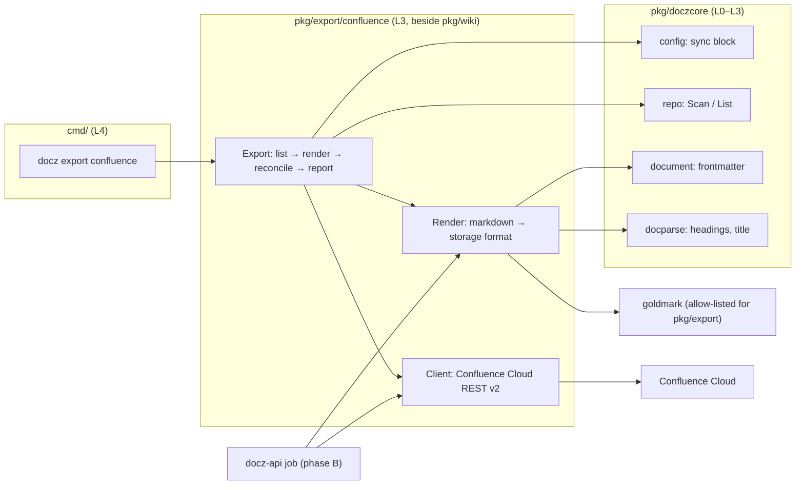
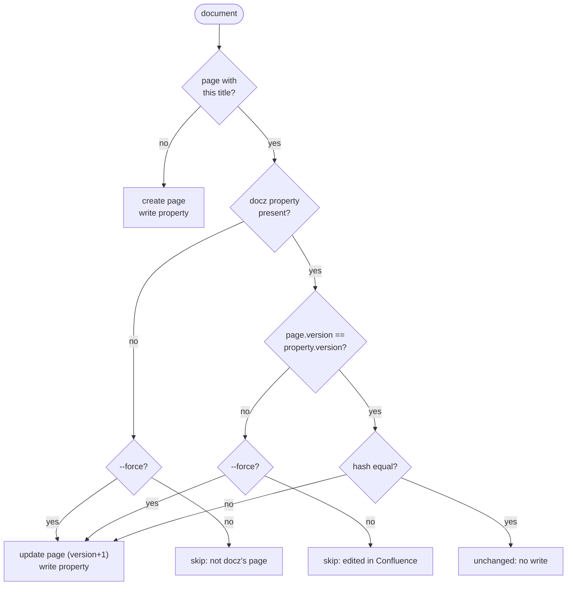
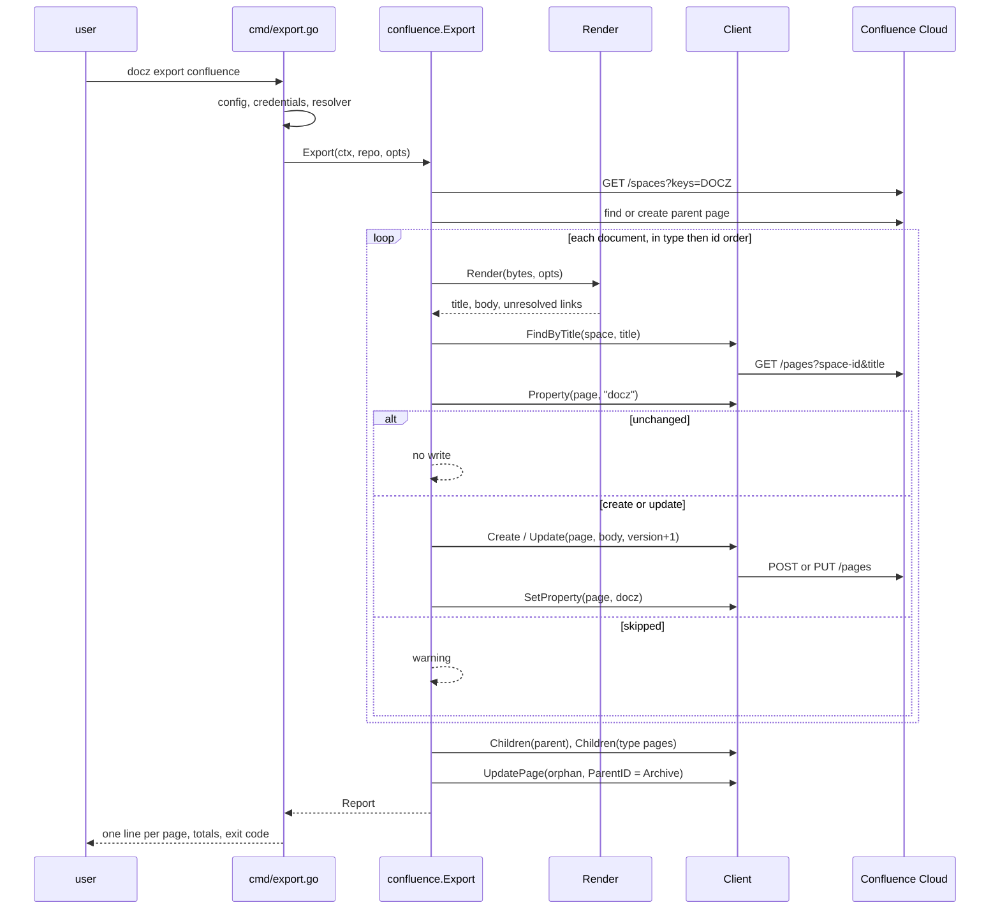

<!-- markdownlint-disable-file MD025 MD041 -->

# DESIGN-0020: Confluence export: docz documents as Confluence Cloud pages

<!--toc:start-->
- [Overview](#overview)
- [Goals and Non-Goals](#goals-and-non-goals)
  - [Goals](#goals)
  - [Non-Goals](#non-goals)
- [Background](#background)
- [Detailed Design](#detailed-design)
  - [1. Shape and layering](#1-shape-and-layering)
  - [2. The renderer](#2-the-renderer)
  - [3. The page model and reconcile](#3-the-page-model-and-reconcile)
  - [4. Mermaid through the viewer](#4-mermaid-through-the-viewer)
  - [5. Configuration](#5-configuration)
  - [6. The command](#6-the-command)
  - [7. The docz-api job (phase B, sketched)](#7-the-docz-api-job-phase-b-sketched)
  - [8. What the renderer does not try to be clever about](#8-what-the-renderer-does-not-try-to-be-clever-about)
- [API / Interface Changes](#api--interface-changes)
- [Data Model](#data-model)
- [Testing Strategy](#testing-strategy)
- [Migration / Rollout Plan](#migration--rollout-plan)
- [Open Questions](#open-questions)
  - [1. Which third-party modules does pkg/export/confluence bring in?](#1-which-third-party-modules-does-pkgexportconfluence-bring-in)
  - [2. How are pages arranged under the parent?](#2-how-are-pages-arranged-under-the-parent)
  - [3. What is hashed for the unchanged check?](#3-what-is-hashed-for-the-unchanged-check)
  - [4. Does the page say where it came from?](#4-does-the-page-say-where-it-came-from)
  - [5. What becomes of the ToC region?](#5-what-becomes-of-the-toc-region)
  - [6. Where do credentials come from, and which token kind?](#6-where-do-credentials-come-from-and-which-token-kind)
  - [7. Where does a relative link go when its target is not exported?](#7-where-does-a-relative-link-go-when-its-target-is-not-exported)
  - [8. Images](#8-images)
  - [9. Pages the sync wrote for documents that no longer exist](#9-pages-the-sync-wrote-for-documents-that-no-longer-exist)
  - [10. Where does the viewer's extension key live?](#10-where-does-the-viewers-extension-key-live)
  - [11. docz-api: one Atlassian site or many?](#11-docz-api-one-atlassian-site-or-many)
  - [12. What does a bare docz export confluence export?](#12-what-does-a-bare-docz-export-confluence-export)
  - [13. Is a skipped page a failure?](#13-is-a-skipped-page-a-failure)
- [Decisions](#decisions)
- [References](#references)
<!--toc:end-->

<!--docz:overview:start-->
## Overview

docz gains a Confluence Cloud target: a converter that renders a docz
document's markdown to Confluence storage format, a client that creates and
updates the matching page in a space, and a `docz export confluence` command
that runs both over a checkout. INV-0019 proved every piece live on a Free
Cloud site: the macros render, pages are found by title and gated by a
content property, mermaid draws through the Atlassian Labs viewer, and the
whole corpus converts in under a second. This design turns that prototype
into `pkg/export/confluence` and the command, delivered and validated first
on their own; the docz-api job that runs the same code after an ingest is a
second delivery, sketched here and designed in its own phase.

<!--docz:overview:end-->

## Goals and Non-Goals

<!--docz:goals:start-->
### Goals

- Render any docz document, built-in or custom type, to well-formed storage
  format with the constructs the corpus actually uses rendered natively:
  code panels, task lists, wide tables, alert panels, in-page anchors,
  cross-document links, the ToC, and mermaid through the viewer macro.
- Create or update one Confluence page per document under a configured
  parent, idempotently: an unchanged document costs no write, a changed one
  costs one page version.
- Never overwrite a page edited in Confluence unless `--force` is given;
  content flows from the markdown to Confluence, never back (INV-0019
  decision 6).
- Opt in per repository through a dormant `sync:` block in `.docz.yaml`,
  with credentials outside the repository (decision 4).
- Keep the renderer and client pure and injectable so docz-api can run them
  over fetched bytes with no checkout (decision 3), and keep the layer rules
  in `pkg/doczcore/layer_test.go` true.
- Work entirely within Atlassian's Free plan and a free Marketplace app
  (decisions 10 and 11).

<!--docz:goals:end-->

<!--docz:non-goals:start-->
### Non-Goals

- Two-way sync, merging, or importing Confluence edits into the repository.
- Jira work items. They are decision 8 of INV-0019 and get their own
  DESIGN after this one.
- Notion and Linear (INV-0019 decisions 7 and 9).
- Rendering mermaid to an image at sync time, with a headless browser or a
  hosted renderer.
- Deleting Confluence pages. Orphans move under an `Archive` page and are
  never deleted (question 9, resolved (c)).
- A general markdown-to-Confluence tool. The renderer handles what docz
  documents contain (INV-0019 Observation 9) and escapes the rest.
- The docz-api job's full design, store schema, and UI surface. This
  document fixes the seams it needs and leaves the rest to a later phase.

<!--docz:non-goals:end-->

<!--docz:background:start-->
## Background

Issue [#142](https://github.com/donaldgifford/docz/issues/142) asked whether
docz-api could sync documents to Confluence or Notion. INV-0019 answered yes
for Confluence, dropped Notion, deferred Linear, chose Jira work items as a
second target, and ran a prototype live. What it established, and this
design relies on:

- **Storage format over ADF** (Observation 1, decision 1): Confluence Cloud
  accepts storage format on page create and update, the macros a document
  needs are storage-format macros, and no ADF generator in Go is worth
  building on (Observation 2).
- **A goldmark renderer of our own** (Observations 3, 8, 13, decision 2):
  goldmark's HTML renderer with a dozen node overrides converts the corpus,
  while `mark` would bring fifty modules and headless Chrome into `pkg/`.
- **What the corpus contains** (Observation 9): 134 documents, 3,180
  headings, 323 tables, 258 task lists, 438 fenced blocks of which 56 are
  mermaid, 2,945 in-page anchors, 357 cross-document links, 6 alerts, 2
  images. Tables and task lists are everywhere; alerts and images are rare.
- **Raw HTML is the only hard failure** (Observation 10): five of 134
  outputs were malformed XML, all from raw HTML the authors meant as
  placeholders; a block-level allow-list plus escaping made it 134 of 134.
- **The live push** (Observation 19): the v2 pages endpoint finds a page by
  title immediately; a content property carries the docz id and hash; CQL
  cannot search a property and lags on titles; `ri:page` links resolve
  lazily so creation order does not matter; a heading's anchor id is
  `<TitleNoSpaces>-<HeadingNoSpaces>` and the colon in `ID: Title` has to be
  percent-encoded in an in-page `href`; `data-layout="full-width"` on a
  table is right and the page-width properties are wrong.
- **Mermaid** (Observations 22 and 23, decision 11): the Atlassian Labs
  Mermaid diagrams viewer, a free Forge macro with a read-only page scope,
  draws from a code block on the page, pairing the n-th macro with the n-th
  mermaid-looking block in document order; the block may sit inside an
  `expand`. Its storage form is an `ac:adf-extension` with the app's
  production extension key.
- **Delivery order** (decision 3): the CLI first, validated over a
  checkout, then docz-api.

The prototype that proved it is 1,570 lines of Go kept outside the
repository (`render.go`, `confluence.go`, `main.go`, plus the Jira half).
Its renderer is the starting point for `pkg/export/confluence`; its client
is replaced, since the three places it fell back to raw HTTP say more about
the client library than about the prototype (question 1, resolved (a)).

<!--docz:background:end-->

<!--docz:detailed-design:start-->
## Detailed Design

### 1. Shape and layering

Three pieces, in one new package and one new command, with docz-api's job
as a later consumer of the same package:



`pkg/export/confluence` is a sibling of the type packages and of
`pkg/wiki`, not a member of `pkg/doczcore`: an integration, like the wiki,
and bound by the same rules. It may import the core; the core never imports
it, and `layer_test.go`'s `corePackages` list is unchanged. It does not need
a type package, because it renders a whole document and never asks what
kind of document it is. Nothing under `pkg/` imports `internal/`.

One rule does change. `TestLayerRules_ThirdPartyDependencies` allows a
single third-party module under `pkg/` today (`go.yaml.in/yaml/v3`), and a
markdown renderer needs a markdown parser. The allow-list gains goldmark
**scoped to `pkg/export/...`**, so the core stays where it is and a reviewer
sees the exception where the rule lives. The Confluence client is written
on `net/http` and `encoding/json`: the surface is nine endpoints, and the
prototype's `go-atlassian` client had to be bypassed for three of them
(question 1, resolved (a)).

### 2. The renderer

`Render(src []byte, opts RenderOptions) (Rendered, error)` takes a
document's bytes, cuts the frontmatter with `document.ParseFrontmatter`,
and returns the page title and the storage-format body. It is bytes-in,
bytes-out, touches no filesystem, and keeps no state between documents, so
docz-api can call it over fetched blobs.

It is goldmark with the GFM and footnote extensions and a node renderer
registered above the HTML renderer that overrides exactly the nodes storage
format treats differently. Everything else is goldmark's XHTML output,
which storage format accepts as is.

| Markdown | Storage format | Note |
| -------- | -------------- | ---- |
| (page top) | `info` panel: "Generated from `<source>` in `<owner/repo>` by docz. Edit the markdown; changes made here are kept until the next forced sync.", with the source linked | question 4, resolved (a); `RenderOptions.Source` and `SourceURL` supply the path and the link, and a render given neither writes no banner |
| H1 | dropped | the page title carries it; `Title` is `ID: Title` from frontmatter, with `docparse.Title` as the fallback for a document without an id |
| H2–H6 | `<hN>` | Confluence assigns the anchor id `<TitleNoSpaces>-<HeadingNoSpaces>` |
| Fenced or indented code | `code` macro, `language` parameter | `sh`/`shell`/`zsh`/`console` → `bash`, `yml` → `yaml`, unknown → `none`; `]]>` in a body is split across two CDATA sections |
| ```` ```mermaid ```` | viewer macro, then an `expand` titled "Diagram source" holding a `code` macro with `language` `mermaid` | §4; without the viewer, the `code` macro alone |
| `<!--toc:start-->`…`<!--toc:end-->` | `toc` macro | the whole span, body included (Observation 11); question 5, resolved (a) |
| `<!--docz:…-->` and other comments | dropped | region markers are docz's, not the reader's |
| Other raw HTML block | passed when every tag in the block is allowed, else escaped whole | allow-list `br` (rewritten `<br/>`), `kbd`, `sub`, `sup`, `span`, `details`, `summary`; Observation 10 and 19 |
| Inline raw HTML | same rule per node | `<status>` in prose is a placeholder and is escaped |
| Link, in-page `#fragment` | `<a href="#<TitleNoSpaces>-<HeadingNoSpaces>">` | the slug is mapped back to its heading text through `docparse.Headings`; `:` in the title is written `%3A`, since a raw colon reads as a URL scheme and the sanitizer drops the href |
| Link, relative to another exported document | `<ac:link><ri:page ri:content-title="ID: Title"/></ac:link>`, with a fragment appended when the source has one | resolved lazily by Confluence, so order does not matter |
| Link, relative to anything else | `<a href>` to the repository's blob URL | question 7, resolved (a) |
| Link, absolute | `<a href>` as is | |
| Image, remote | `<ac:image><ri:url ri:value="…"/></ac:image>` | |
| Image, local | `<a href>` to the blob URL | question 8, resolved (a) |
| Blockquote with `[!NOTE]` / `[!TIP]` / `[!IMPORTANT]` / `[!WARNING]` / `[!CAUTION]` | `info` / `tip` / `note` / `warning` / `warning` panel macro with `ac:rich-text-body` | the marker is cut from the AST before rendering; goldmark splits `[!NOTE]` into `[` and `!NOTE]`, so the first line's text nodes are joined before matching |
| Other blockquote | `<blockquote>` | |
| Task list | `<ac:task-list><ac:task><ac:task-status>complete\|incomplete</ac:task-status><ac:task-body>…` | a list is a task list when its first item carries a checkbox |
| Other lists | `<ul>` / `<ol>` | |
| Table | `<table data-layout="full-width">` with goldmark's rows | Observation 19: the attribute widens the table and leaves the page centred; the `content-appearance-*` page properties are never written |
| Footnotes, strikethrough, autolinks | goldmark's HTML | |

Two checks run before any output is accepted. The body is parsed with
`encoding/xml` in strict mode with the `ac:` and `ri:` prefixes declared,
and a malformed result is an error for that document, never pushed (the
prototype's census found this is how raw HTML fails). And `Rendered.Links`
lists every relative target the resolver could not place, so the report can
say which links a page will show as plain URLs; INV-0019 found three broken
links in live documents this way.

Links are resolved through a `LinkResolver` the caller supplies:

```go
// LinkTarget is where a relative link goes. Exactly one of PageTitle or
// URL is set.
type LinkTarget struct {
    PageTitle string // another exported document, by its page title
    URL       string // anything else, as an absolute URL
    Anchor    string // the fragment to carry across, already encoded
}

// LinkResolver maps a link as written in from's markdown to its target.
// A zero LinkTarget means unresolved: the renderer writes the text alone
// and records the link in Rendered.Links.
type LinkResolver func(from, href string) LinkTarget
```

The CLI's resolver knows the export set (every document being exported, by
repository-relative path, with its page title) and the repository's remote;
docz-api's knows the snapshot's tree and the ingested commit. The renderer
knows neither.

### 3. The page model and reconcile

One page per document, titled `ID: Title`, under a parent page in the
configured space. The parent is named in the `sync:` block by title and
created when absent. Beneath it sits one child page per exported type,
titled with the type's nav title and carrying the type's README index
rendered as its body, and each type's documents sit under their type page
(question 2, resolved (a)). The index table's links resolve through the
resolver to the pages below it, so the tree reads the way `docs/` and the
wiki nav do. With `api_pages` on (§5; question 12, resolved (a)) the
`api:` block's landing page becomes the parent page's own body and its
additional docs sit directly under the parent. Orphans go under an
`Archive` child of the parent, created when first needed.

```text
docz                              parent; body = docs/index.md when api_pages is on
├── Design documents              type page; body = docs/design/README.md
│   ├── DESIGN-0019: Runbook: a sixth built-in document type …
│   └── DESIGN-0020: Confluence export: docz documents as …
├── Implementation plans
│   └── IMPL-0022: Runbook: the sixth built-in type …
├── DEVELOPMENT.md                additional doc, api_pages only
└── Archive                       orphans, moved here and never deleted
    └── RFC-0001: An early proposal
```

A page's identity across runs is its title plus a content property named
`docz`:

```json
{
  "id": "DESIGN-0020",
  "source": "docs/design/0020-confluence-export-docz-documents-as-confluence-cloud-pages.md",
  "hash": "sha256:7f3a…",
  "version": 7,
  "docz": "2.0.0-beta.6"
}
```

`hash` is the digest of the rendered body (question 3, resolved (a), so a
renderer fix re-pushes exactly the pages it alters), `version` is
the page version the sync last wrote, and `docz` is the version of the tool
that wrote it. The title is the lookup (`GET /wiki/api/v2/pages?space-id=…&title=…`
finds a page immediately after creation), the property is the metadata,
and docz-api additionally remembers the page id (§7). Per document the
reconcile is:



The two skips are decision 6. A page whose version moved since the sync
last wrote it was edited in Confluence, and the sync leaves it alone with a
warning naming the page, its version, and the version it expected; `--force`
overwrites it and the edit is gone. A page with the right title and no
`docz` property is somebody's page, not the sync's, and is adopted only
under `--force`, which writes the property. Content flows one way: nothing
in Confluence is ever read back into the repository, and a later question
is whether an in-place edit can keep Confluence-side comments, which this
design does not attempt.

Writes go in document order with no batching: a create or update, then the
property (created, or deleted and recreated, since the v1 property endpoint
has no upsert). The v2 pages endpoint sets the page body, title, parent,
and version message `docz sync <id> <hash-prefix>` in one call. Confluence
assigns `ac:macro-id` and `ac:local-id` on save; the renderer never writes
them except the viewer macro's own `local-id` (§4). An update always
writes the expected parent id as well as the body, so a page is put where
the tree says it belongs even if somebody moved it.

After the documents come the orphans (question 9, resolved (c)). Every
page under the parent or a type page that carries a `docz` property whose
`id` is not in the export set is moved under `Archive` with its body and
property untouched and reported as `archived`. Nothing is ever deleted;
that is a person's call from the Confluence side. A page without the
property is not the sync's and is never moved. Titles are unique within a
space, so a document that returns to the repository is found by title in
`Archive` and its next update moves it back under its type page.

> **Amended 2026-10-05 (IMPL-0023).** Three rules the implementation and
> its live run added:
>
> - **Orphans are archived only on a full export**, one with no `--type`
>   and no ids. A narrowed run's set is partial, and everything outside it
>   would read as an orphan.
> - **A property docz export did not write is treated like no property.**
>   It must name an `id` and a `version`. The INV-0019 prototype's
>   `{id, hash}` property does not, so its page is skipped without
>   `--force`, adopted with it, and never archived. A page whose title the
>   run writes is never an orphan either.
> - **The parent page stays where it is.** Confluence files a page created
>   with no parent under the space homepage, so requiring the parent at
>   the root rewrote it on every run. The reconcile places what is beneath
>   the parent, not the parent itself.

### 4. Mermaid through the viewer

Decision 11 chose Atlassian Labs' Mermaid diagrams viewer. For each
mermaid fence the renderer writes the viewer macro and then the source in a
collapsed `expand`:

```xml
<ac:adf-extension>
  <ac:adf-node type="extension">
    <ac:adf-attribute key="extension-type">com.atlassian.ecosystem</ac:adf-attribute>
    <ac:adf-attribute key="extension-key">23392b90-4271-4239-98ca-a3e96c663cbb/63d4d207-ac2f-4273-865c-0240d37f044a/static/mermaid-diagram</ac:adf-attribute>
    <ac:adf-attribute key="parameters">
      <ac:adf-parameter key="local-id">&lt;uuid&gt;</ac:adf-parameter>
      <ac:adf-parameter key="extension-id">ari:cloud:ecosystem::extension/&lt;extension-key&gt;</ac:adf-parameter>
      <ac:adf-parameter key="extension-title">Mermaid diagram</ac:adf-parameter>
    </ac:adf-attribute>
    <ac:adf-attribute key="text">Mermaid diagram</ac:adf-attribute>
    <ac:adf-attribute key="layout">default</ac:adf-attribute>
    <ac:adf-attribute key="local-id">&lt;uuid&gt;</ac:adf-attribute>
  </ac:adf-node>
  <ac:adf-fallback><p>Mermaid diagram</p></ac:adf-fallback>
</ac:adf-extension>
<ac:structured-macro ac:name="expand">
  <ac:parameter ac:name="title">Diagram source</ac:parameter>
  <ac:rich-text-body>
    <ac:structured-macro ac:name="code">
      <ac:parameter ac:name="language">mermaid</ac:parameter>
      <ac:plain-text-body><![CDATA[flowchart LR …]]></ac:plain-text-body>
    </ac:structured-macro>
  </ac:rich-text-body>
</ac:structured-macro>
```

The viewer collects the macros and the mermaid-looking code blocks on the
page as two lists and pairs them by index, so one macro per fence makes
the pairing one to one, and a block inside an `expand` still counts (its
README suggests exactly that). The `local-id` is a fresh UUID per macro;
Confluence keeps it and the viewer reads it back as `parameters.localId`.
The extension key is the app's production key, which is the app's and not
the site's: a Forge app has one production environment that every
installation shares, so the key ships as the default and the `sync:` block
can override it (question 10, resolved (a)). With the viewer disabled in config the
fence is a plain `code` macro with `language` `mermaid`, open, since on a
site without the app a collapsed expand would hide the only thing there
is to see.

Two consequences INV-0019 recorded hold here: a Forge macro leaves no trace
in `export_view`, so exports built from that body show the source and no
diagram, and the browser is the only proof of rendering; and removing the
app leaves the source readable where the Mermaid Chart app's macros became
`unknown-macro` placeholders.

### 5. Configuration

A `sync:` block in `.docz.yaml`, dormant unless enabled, following the
`api:` and `changelog:` blocks: absent or disabled means nothing is
validated and nothing changes.

```yaml
sync:
  confluence:
    enabled: true
    site: https://example.atlassian.net   # the Cloud site, not a secret
    space: DOCZ                           # space key
    parent: docz                          # parent page title under the space root
    types: []                             # subset of enabled types; empty = all
    exclude: []                           # repo-relative path prefixes, as api.exclude
    api_pages: false                      # also export the api: block's landing page and additional docs
    mermaid:
      viewer: auto                        # auto | off | <extension key>
```

| Field | Default | Validation (when enabled) |
| ----- | ------- | ------------------------- |
| `enabled` | `false` | |
| `site` | | required; `https` URL with a host and no path |
| `space` | | required; non-empty |
| `parent` | | required; non-empty |
| `types` | all enabled types | each a token an enabled type resolves from, through `Config.resolutionTokens()` |
| `exclude` | `[]` | the repo-relative path rules of `paths.go`, trailing `/` collapsed as `normalizeAPI` does |
| `api_pages` | `false` | may be `true` only when the `api:` block is enabled; the landing page becomes the parent page's body and `additional_docs` sit under the parent (question 12) |
| `mermaid.viewer` | `auto` | `auto`, `off`, or a key matching `<uuid>/<uuid>/static/<module>` |

`SyncConfig` and `ConfluenceSyncConfig` join `config.Config` with `yaml`
and `json` tags (so `TestJSONTags_MirrorYAML` and docz-api's
`config_snapshot` see them), a `normalizeSync` on both `Load` paths beside
`normalizeAPI`, and a `validateSync` called from `Validate()` wrapping a new
`ErrInvalidSync` sentinel. `docz init` writes the block disabled with the
other opt-in blocks, which the parity suite absorbs the way it absorbed
`runbook` (a sixth normaliser, or the fifth widened).

Credentials never enter `.docz.yaml`. The CLI and docz-api both read
`ATLASSIAN_EMAIL` and `ATLASSIAN_API_TOKEN` from the environment, and a
**scoped API token is the preferred kind** (question 6, resolved (c)).
Atlassian accepts a scoped token only through its gateway,
`https://api.atlassian.com/ex/confluence/{cloudId}/wiki/api/v2/…`, never
against the site URL, while an unscoped token works on both. Verified
2026-10-05 on the scratch site: the unscoped token every live run used
answers `GET /wiki/api/v2/spaces` through the gateway with the same body
it returns from the site. So the client has **one path**: it resolves the
site's cloud id once from the unauthenticated
`GET https://<site>/_edge/tenant_info` and sends every request through the
gateway, and which kind of token is in the environment is the operator's
choice and not the client's concern. `site` stays in the block because the
cloud id and the page URLs in the report come from it. The scopes a token
needs are `read:space:confluence`, `read:page:confluence`, and
`write:page:confluence` (a page's content properties are governed by the
page scopes); the IMPL confirms the list by creating one, since a scoped
token's `403` names the scope it lacks. The unscoped kind stays supported
for a site whose admin has not turned scoped tokens on. A missing
credential is a configuration error (exit 2) before any request is made.

> **Amended 2026-10-05 (IMPL-0023).** `exclude` is relative to `docs_dir`,
> like `api.exclude`, not to the repository root (IMPL-0023 Open Question
> 2). The scope list above is unconfirmed: every Phase 6 run used the
> unscoped token, and the scoped-token run waits on a token being created.
> Correct this paragraph if that run finds a different list.

### 6. The command

```text
docz export confluence [<id>|<path>...] [flags]

  --type <name>      export one type (repeatable); default: sync.confluence.types
  --force            overwrite pages edited in Confluence, adopt untracked pages
  --dry-run          report what would happen; no request writes anything
  --out <dir>        also write each rendered page as <dir>/<id>.xhtml
  --format text|json report format (default text)
  --strict           exit 1 when any page was skipped (question 13, resolved (a))
```

With no arguments it exports every document of the configured types, as
`docz update` does. With ids or paths it exports those alone, resolving an
id through `repo.Find`. The handler is one call plus printing, like every
other command: it resolves flags, builds the resolver and the client, calls
`confluence.Export(ctx, rp, opts)`, prints the report, and maps the error
to an exit code.



Report lines are one per page, in the `docz update` style:

```text
created    DESIGN-0020: Confluence export: docz documents as …   https://…/pages/98601
updated    RUNBOOK-0001: Cut a v2 beta release                   v3  https://…/pages/98488
unchanged  IMPL-0022: Runbook: the sixth built-in type …
skipped    DESIGN-0019: Runbook: a sixth built-in …              edited in Confluence (v6, expected v5); use --force
  unresolved link: docs/index.md -> plan/README.md
archived   RFC-0001: An early proposal                          moved under Archive
6 pages: 1 created, 1 updated, 2 unchanged, 1 skipped, 1 archived
```

Exit codes follow `docz validate`: `0` when every page was written,
unchanged, or skipped (a skip is a warning, not a failure, unless
`--strict`); `1` for a request or write that failed, with the pages before
it left written; `2` for configuration and usage: block disabled or absent,
credentials missing, an unknown type, an id that resolves to nothing.
`--verbose` narrates through the `repo.Hooks` pattern: `Export` fires a
hook per page with the action taken, and `cmd/hooks.go` maps it to a slog
debug line.

> **Amended 2026-10-05 (IMPL-0023).** A credential Confluence rejects
> (`AuthError`, a 401 or 403) exits `2`, not `1`, because its fix is
> configuration. Without credentials, `--dry-run --out <dir>` renders
> offline: every page reports as created and its body lands in the
> directory (IMPL-0023 Open Question 4). A link to a file that does not
> exist in the checkout is reported unresolved rather than given a blob
> URL that would 404.

### 7. The docz-api job (phase B, sketched)

The same package runs server-side after an ingest, with the seams this
design fixes and the rest left to its own phase:

- **Trigger.** After a successful reconcile of a repository whose fetched
  `.docz.yaml` enables `sync.confluence`, the ingest enqueues a
  `sync:confluence` asynq task for the repository (coalesced by repository,
  like `ingest:repo`), and the worker runs `confluence.Export` over the
  snapshot: `Render` takes the fetched bytes, the resolver knows the
  snapshot's tree and head commit, and the client is the same one.
- **State.** A table keyed by repository and docz id carrying the page id,
  the version the sync wrote, and the hash, so the server finds pages by id
  and never by title; the content property is still written so a page
  explains itself.
- **Credentials.** `ATLASSIAN_EMAIL` and `ATLASSIAN_API_TOKEN` in the
  server's environment, a scoped token by preference, one Atlassian site
  per deployment, with each repository choosing its space and parent
  (question 11, resolved (a)).
- **Policy.** The server never forces. A skipped page is reported in the
  ingest log and surfaced later on docz-site; `--force` stays a thing a
  person does from a checkout. Orphans are archived as the CLI archives
  them, since the move is reversible.

What phase B designs on its own: the store migration and sqlc queries, the
task's retry and failure logging (IMPL-0006's standard), the API surface
that exposes a document's Confluence URL, and the site's "view in
Confluence" link.

### 8. What the renderer does not try to be clever about

- **Nested fences.** DESIGN-0019 has a three-backtick fence containing a
  three-space-indented three-backtick fence, and CommonMark closes the
  outer one early. goldmark, GitHub, and this renderer agree; the document
  is wrong and gets fixed on its own. The renderer never second-guesses
  the parser.
- **Heading anchors.** Confluence's anchor ids are derived from the page
  title and the heading text, so a heading renamed in markdown moves its
  anchor exactly as it does on GitHub. No `anchor` macros are written; the
  prototype found they render as `href="#Heading text"` and match nothing.
- **Page width.** Never the `content-appearance-*` properties.
- **Ordering.** No two-pass link resolution; `ri:page` is lazy.
- **Rate limits.** Requests are sequential, three or four per changed page,
  one per unchanged page; a `429` is retried after `Retry-After` up to
  three times and then fails that page.

<!--docz:detailed-design:end-->

<!--docz:api-changes:start-->
## API / Interface Changes

**New package `pkg/export/confluence`** (EXPERIMENTAL until v2.0.0, like
every v2-line package):

```go
// Render converts one docz document to a Confluence storage-format page.
func Render(src []byte, opts RenderOptions) (Rendered, error)

type RenderOptions struct {
    Resolve   LinkResolver // nil: every relative link is unresolved
    Mermaid   MermaidMode  // MermaidViewer (default) or MermaidCode
    ViewerKey string       // empty: the built-in production key
    Source    string       // repo-relative path named by the banner; empty: no banner
    SourceURL string       // where Source is browsable; empty: the banner names the path only
}

type Rendered struct {
    ID, Title string   // frontmatter id; "ID: Title"
    Body      []byte   // storage format, well-formed
    Hash      string   // sha256 of Body, "sha256:…"
    Links     []Link   // relative links the resolver could not place
}

// Client is the Confluence Cloud surface Export needs. *HTTPClient
// implements it over net/http; tests supply a fake.
type Client interface {
    SpaceID(ctx context.Context, key string) (string, error)
    FindPage(ctx context.Context, spaceID, title string) (*Page, error)
    CreatePage(ctx context.Context, p NewPage) (*Page, error)
    UpdatePage(ctx context.Context, id string, p PageUpdate) (*Page, error)
    Property(ctx context.Context, pageID, key string) (*Property, error)
    SetProperty(ctx context.Context, pageID string, p Property) error
    Children(ctx context.Context, parentID string) ([]Page, error) // for orphans
}

// NewHTTPClient speaks to site through Atlassian's gateway: it resolves
// the cloud id from <site>/_edge/tenant_info on first use and sends every
// request to api.atlassian.com/ex/confluence/<cloudId>, which accepts
// scoped and unscoped tokens alike. PageUpdate carries ParentID, so one
// call moves a page and rewrites it.
func NewHTTPClient(site, email, token string) *HTTPClient

// Export renders and reconciles every selected document and returns what
// it did. A cancelled ctx returns the report so far with ctx.Err().
func Export(ctx context.Context, rp *repo.Repo, opts ExportOptions) (Report, error)

type ExportOptions struct {
    Client  Client
    Types   []string // canonical names; nil: the configured set
    IDs     []string // explicit documents; nil: every document of Types
    Force   bool
    DryRun  bool
    Resolve LinkResolver
}

type Report struct {
    Pages []PageResult // one per document, in export order
}

type PageResult struct {
    ID, Title, Source string
    Action            Action // Created, Updated, Unchanged, Skipped, Archived, Failed
    PageID, URL       string
    Version           int
    Reason            string // Skipped and Failed: why
    Links             []Link
}
```

Typed errors in the `repo` style: `ConfigError` (block disabled, field
invalid), `AuthError` (401/403 from the site), `ConflictError{Title,
Have, Want}` (the skip reason, exported so docz-api can store it),
`RequestError{Op, Status, Body}`. `Export` never prints and holds no
logger; hooks carry the narration.

**`pkg/doczcore/config`**: `Config.Sync SyncConfig` with
`SyncConfig.Confluence ConfluenceSyncConfig` (§5), `ErrInvalidSync`,
`normalizeSync`, `validateSync`. `DefaultConfigYAML()` gains the block
disabled.

**`cmd/`**: `export.go` with the `export` parent command and the
`confluence` subcommand (§6); `hooks.go` maps the new hook; `GitResolver`
gains `RemoteURL(ctx)` beside `UserName`, the origin the blob URLs and the
banner link are built from (question 7). The
`cmd/*_test.go` freeze of ADR-0001 Decision 7 does not apply to a new
file.

**`pkg/doczcore/layer_test.go`**: `TestLayerRules_ThirdPartyDependencies`
allows `github.com/yuin/goldmark` for packages under `pkg/export/` only.

**Parity**: `docz export` is a new command and a permitted delta; the
`sync:` block `docz init` writes is handled like the `runbook` block.

<!--docz:api-changes:end-->

<!--docz:data-model:start-->
## Data Model

No repository state. Everything the CLI needs across runs lives on the
Confluence page: its title, and the `docz` content property (§3) with
`id`, `source`, `hash`, `version`, and `docz`. A page without the property
is not the sync's; a page whose version differs from the property's was
edited in Confluence. An orphan keeps its property under `Archive`, and
because titles are unique within a space a document that returns is found
there by title and moved back by its next update.

Phase B adds a docz-api table, designed there: `(repo_id, doc_id) →
page_id, version, hash, synced_at`, so the server keys pages by id and
survives a title change without a search.

The rendered body carries three things Confluence persists and the sync
relies on: the viewer macro's `local-id` (a UUID the sync mints), the
`data-layout` attribute on every table, and the `language` parameter on
every code macro, which Confluence surfaces in ADF as `attrs.language` and
the viewer reads.

<!--docz:data-model:end-->

<!--docz:testing:start-->
## Testing Strategy

- **Renderer goldens.** `pkg/export/confluence/testdata/<case>.md` with a
  `.xhtml` golden per case (regenerate with `-update`), one case per row of
  the table in §2 plus the specimen the prototype used: alerts, task lists,
  nested lists, wide table, every code language mapping, mermaid with and
  without the viewer, in-page anchors with the encoded colon, cross-document
  and unresolved links, the `<details>` block, placeholder tags in prose,
  footnotes.
- **Well-formedness over the corpus.** Every `.orig.md` fixture of the six
  type packages (38 of them) plus this repository's own templates rendered
  through `doctemplate` must produce well-formed XML and no unresolved
  in-page anchor. The test reads snapshots under `testdata/`, never `docs/`
  (the type packages' rule).
- **Invariants.** `Render` never modifies its input; two renders of the same
  bytes are byte-identical apart from the viewer's `local-id`, which the
  hash excludes; `FuzzRender` pins never-panic and always-well-formed-or-
  error.
- **Reconcile against a fake.** An `httptest`-free fake `Client` drives
  `Export` through create, unchanged, update, both skips, adoption under
  `--force`, an orphan moved under `Archive` and back when its document
  returns, `api_pages` on and off, dry run, a cancelled context mid-run,
  and a failing request;
  the report is asserted action by action.
- **`HTTPClient` against `httptest`.** The cloud id resolved once from
  `_edge/tenant_info` and every request sent to the gateway host, each
  endpoint's request shape and the response decoding, `401` → `AuthError`, `429` → retry then fail,
  `409` on a stale version → `ConflictError`.
- **`cmd/export_test.go`.** A `Runner` with a fake client reaches the
  command's printing and exit codes; no network in `just test`.
- **Live smoke test** behind `//go:build live`, reading the credential file
  and pushing the specimen set to the scratch site; run by hand before a
  beta, never in CI, recorded in the IMPL's verification.
- **Parity.** `just parity` stays green with the `sync:` block normalised.

<!--docz:testing:end-->

<!--docz:rollout:start-->
## Migration / Rollout Plan

Decision 3: the CLI first, on its own, then docz-api.

1. **Phase A, the package and the command**, one IMPL. `config` block,
   `pkg/export/confluence` from the prototype's renderer with the §2 table
   complete, the `net/http` client, `Export`, `cmd/export.go`, tests,
   docs. Acceptance: this repository's `docs/` exports to the scratch site
   with every page well-formed, mermaid drawn, tables wide, anchors
   clicking, a second run all `unchanged`, an edit in Confluence skipped
   and then overwritten under `--force`, a deleted document's page under
   `Archive`, and the whole run repeated with a scoped token. Ships in a
   `v2.0.0-beta.N`.
2. **Validation on the scratch site** for a few days of real use: edits,
   renames, new documents, a type disabled, the three broken links fixed.
   Anything the eye finds goes back into Phase A before Phase B starts.
3. **Phase B, docz-api**, its own DESIGN and IMPL: the job, the table, the
   API surface, the site link, over the package Phase A shipped unchanged.
4. **Jira**, its own DESIGN after this one (INV-0019 decision 8), over the
   same credentials and the projection INV-0019 ran.

Nothing migrates. A repository without the block is untouched; a repository
that enables it gets pages on its first run. The scratch site's existing
pages carry the property in the prototype's shape (`id`, `hash` only) and
are adopted on the first `--force` run, then tracked normally.

<!--docz:rollout:end-->

<!--docz:open-questions:start-->
## Open Questions

### 1. Which third-party modules does `pkg/export/confluence` bring in?

- a. **goldmark only, allow-listed for `pkg/export/...` in
  `TestLayerRules_ThirdPartyDependencies`, and a Confluence client of our
  own on `net/http`.** The client surface is nine endpoints (space lookup,
  find, create, update, get a page, get and set and delete a property,
  export view for tests); the prototype's `go-atlassian` had to be bypassed
  for the v2 property endpoint, the `export_view` body, and the spaces
  lookup, and `pkg/` is semver-governed and dependency-light by habit. One
  well-known parser is the whole exception.
- b. goldmark and `go-atlassian`, both allow-listed. Less client code, more
  dependency surface, and the gaps above worked around in place.
- c. Put the renderer and client under `internal/` and have the CLI import
  it there. Keeps `pkg/` clean, but the library's consumers lose the
  export, and docz-api is in-module so gains nothing by it.
- d. Other.

> **Resolved 2026-10-05: (a).**

### 2. How are pages arranged under the parent?

- a. **A child page per exported type, titled with the type's nav title
  (`Design documents`, `Implementation plans`, …) and carrying the type's
  README index rendered as its body, with the documents beneath it.** It
  mirrors the wiki nav and `docs/`, the index table's links resolve to the
  pages below through the resolver, and Confluence's page tree is how
  readers browse.
- b. Flat: every document directly under the parent, as the prototype did.
  Simplest, and 134 siblings in one tree.
- c. Mirror `docs_dir` exactly, including non-type directories.
- d. Other.

> **Resolved 2026-10-05: (a).**

### 3. What is hashed for the unchanged check?

- a. **The rendered body.** A renderer fix or a resolver change then
  re-pushes exactly the pages it alters, which is what a reader wants; the
  cost is a hash per render, which the renderer has already paid for the
  well-formedness check. The viewer macro's `local-id` is minted after the
  hash so it does not churn.
- b. The markdown source, as the prototype did. Cheaper to compute from a
  listing, but a renderer change reaches no page until `--force`.
- c. Both, and either difference writes.
- d. Other.

> **Resolved 2026-10-05: (a).**

### 4. Does the page say where it came from?

- a. **An `info` panel at the top: "Generated from `<source>` in
  `<owner/repo>` by docz. Edit the markdown; changes made here are kept
  until the next forced sync."**, with the source linked. INV-0019
  Observation 7 asked for it, and decision 6 makes the last clause true.
- b. No banner; the property is enough for tools and the title for people.
- c. A one-line footer instead.
- d. Other.

> **Resolved 2026-10-05: (a).**

### 5. What becomes of the ToC region?

- a. **The `toc` macro, where the document has a ToC region.** Faithful to
  the markdown, native to Confluence, and `docz update` is the only thing
  that writes the region anyway.
- b. Drop the region: Confluence readers use the page's own navigation and a
  second list of headings at the top is noise.
- c. Other.

> **Resolved 2026-10-05: (a).**

### 6. Where do credentials come from, and which token kind?

- a. **`ATLASSIAN_EMAIL` and `ATLASSIAN_API_TOKEN` in the environment, for
  the CLI and docz-api alike, and an unscoped API token used as basic auth
  against `sync.confluence.site`.** The names are the ones the scratch
  site's credential file already uses, the server's other secrets have no
  `DOCZ_` prefix either, and the unscoped token is what every live run
  used. No `--token` flag: a secret on a command line lands in shell
  history.
- b. `DOCZ_`-prefixed names, to keep docz's variables apart from other
  Atlassian tooling on the same machine.
- c. Accept scoped tokens too, switching the base URL to
  `api.atlassian.com/ex/confluence/{cloudId}` when one is given. More to
  test for a kind nobody has asked for yet.
- d. Other.

> **Resolved 2026-10-05: (c).** Scoped tokens are preferred and must be supported; the client goes through the gateway for both kinds (§5).

### 7. Where does a relative link go when its target is not exported?

- a. **To the repository's blob URL at the default branch**, derived from
  the git remote in the CLI (a `GitResolver` method beside `UserName`) and
  from the ingested commit in docz-api. The 18 source-file links and any
  document of an excluded type then still work.
- b. Rendered as text with the path, no link.
- c. Left as the relative href, which Confluence shows as a dead link.
- d. Other.

> **Resolved 2026-10-05: (a).**

### 8. Images

- a. **Remote images inline through `ri:url`; local images as a link to
  their blob URL, with attachments a later phase.** The corpus has two
  images, one of each; attachments mean a multipart upload and a second
  identity to reconcile.
- b. Upload local images as page attachments now and reference them with
  `ri:attachment`.
- c. Other.

> **Resolved 2026-10-05: (a).**

### 9. Pages the sync wrote for documents that no longer exist

- a. **Report them, never delete.** Pages under the parent carrying a
  `docz` property whose id is not in the export set are listed at the end
  of the report as orphans; removing or archiving them is a person's call
  from the Confluence side, or a later `--prune`.
- b. Delete them, as the store's reconcile deletes absent documents.
- c. Move them under an `Archive` child page.
- d. Other.

> **Resolved 2026-10-05: (c).** Orphans move under an `Archive` child page; nothing is deleted (§3).

### 10. Where does the viewer's extension key live?

- a. **Built in as the default, overridable by `sync.confluence.mermaid.viewer`.**
  The key is the app's production environment, shared by every site that
  installs the app, so a repository should not have to know it; the
  override exists for a fork of the app or a future key change, and `off`
  exists for a site without the app.
- b. Required in config, no default: nothing hard-codes another vendor's
  identifier.
- c. Other.

> **Resolved 2026-10-05: (a).**

### 11. docz-api: one Atlassian site or many?

- a. **One site per docz-api deployment, credentials in its environment;
  each repository's block chooses its space and parent.** Matches how the
  server holds every other secret, and a homelab or a company has one
  Confluence.
- b. Per-repository credentials in a server-side secret store, so
  repositories on one docz-api can target different sites.
- c. Other.

> **Resolved 2026-10-05: (a).**

### 12. What does a bare `docz export confluence` export?

- a. **Every document of the configured types**, plus the type index pages
  if question 2 is (a). The `api:` block's pages (`docs/index.md`,
  `additional_docs`) are docz-api's publishing surface, not docz's
  documents, and stay out until somebody wants them in Confluence.
- b. Also the `api:` block's landing page and additional docs, as a repo
  home under the parent.
- c. Other.

> **Resolved 2026-10-05: (a).** Default (a); `sync.confluence.api_pages` includes the `api:` block's landing page and additional docs (§5).

### 13. Is a skipped page a failure?

- a. **No: exit `0` with the warning, and `--strict` turns any skip into
  exit `1`**, mirroring `docz validate --strict`. A page somebody edited is
  information, not an error, and a CI job that wants to know can ask.
- b. Always exit `1` when anything was skipped.
- c. Other.

> **Resolved 2026-10-05: (a).**

<!--docz:open-questions:end-->

<!--docz:decisions:start-->
## Decisions

Carried in from INV-0019, resolved 2026-10-04 and 2026-10-05, and not
reopened here:

1. **Confluence Cloud, storage format** (INV-0019 decision 1).
2. **goldmark with a storage-format renderer of our own** (decision 2).
3. **`pkg/export/confluence`, then `docz export confluence`, then the
   docz-api job; the CLI delivered and validated first, on its own**
   (decision 3).
4. **A `sync:` block in `.docz.yaml`, credentials in the environment**
   (decision 4).
5. **Title `ID: Title` plus a content property with the docz id and hash;
   the page id stored in docz-api** (decision 5).
6. **Never overwritten by default; `--force` overwrites; content flows one
   way from the markdown** (decision 6).
7. **Notion not planned, Linear deferred** (decisions 7 and 9).
8. **Jira is a second target with its own DESIGN** (decision 8).
9. **The free plan is the floor** (decision 10).
10. **Mermaid through Atlassian Labs' Mermaid diagrams viewer, source folded
    beneath the diagram** (decision 11).

This design's own, resolved 2026-10-05 and numbered as the questions above:

1. **goldmark alone is allow-listed under `pkg/export/`; the Confluence
   client is our own on `net/http`**, question 1.
2. **A child page per type, carrying the README index, with the
   documents beneath**, question 2.
3. **The rendered body is what is hashed**, question 3.
4. **An `info` banner at the top of every page names the source**, question 4.
5. **The ToC region becomes the `toc` macro**, question 5.
6. **Scoped API tokens are the preferred kind and must be supported; the
   client goes through Atlassian's gateway for both kinds**, question 6 (c).
7. **A relative link to something not exported goes to the repository's
   blob URL**, question 7.
8. **Remote images inline, local images as links; attachments later**, question 8.
9. **Orphaned pages are moved under `Archive`, never deleted**, question 9 (c).
10. **The viewer's extension key is built in and overridable**, question 10.
11. **One Atlassian site per docz-api deployment**, question 11.
12. **A bare export covers the configured types; `api_pages` adds the
   `api:` block's pages**, question 12.
13. **A skipped page is a warning; `--strict` makes it a failure**, question 13.

<!--docz:decisions:end-->

<!--docz:references:start-->
## References

- [#142](https://github.com/donaldgifford/docz/issues/142): the issue
- [INV-0019](../investigation/0019-docz-api-sync-to-external-documentation-services-confluence-and.md):
  the investigation, its 23 observations, and its Decisions table
- [DESIGN-0014](0014-the-docz-api-as-one-unit-packages-types-functions-and-the-cmd.md):
  the layer rules, hooks, and "one call plus printing"
- [DESIGN-0011](0011-api-config-block-index-page-and-additionaldocs-for-docz-api-and.md):
  the `api:` block, the model for a dormant opt-in block
- [ADR-0002](../adr/0002-docz-is-an-api-package-whose-first-consumer-is-the-cli.md):
  the library is the product
- [`pkg/doczcore/layer_test.go`](../../pkg/doczcore/layer_test.go): the
  third-party allow-list this design widens for `pkg/export/`
- [Confluence Cloud REST API v2](https://developer.atlassian.com/cloud/confluence/rest/v2/intro/)
- [Confluence storage format](https://confluence.atlassian.com/doc/confluence-storage-format-790796544.html)
- [Mermaid diagrams viewer](https://github.com/atlassian-labs/mermaid-diagrams-viewer):
  the app's source, `app/manifest.yml` and
  `custom-ui/src/confluence/code-blocks/index.ts`
- [goldmark](https://github.com/yuin/goldmark)

<!--docz:references:end-->
