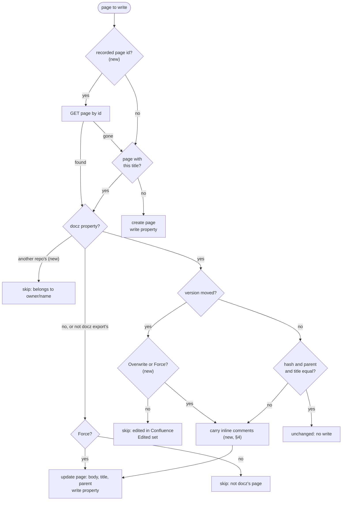
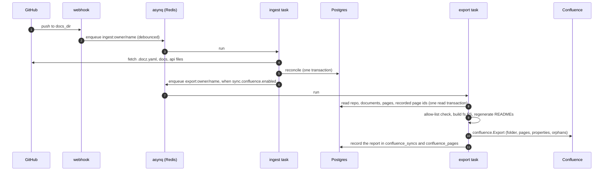

<!-- markdownlint-disable-file MD025 MD041 -->

# DESIGN-0021: Confluence export from docz-api: per-repository folders in shared spaces

<!--toc:start-->
- [Overview](#overview)
- [Goals and Non-Goals](#goals-and-non-goals)
  - [Goals](#goals)
  - [Non-Goals](#non-goals)
- [Background](#background)
- [Detailed Design](#detailed-design)
  - [1. Shape](#1-shape)
  - [2. The space layout](#2-the-space-layout)
  - [3. Package changes](#3-package-changes)
  - [4. Keeping inline comments](#4-keeping-inline-comments)
  - [5. The job](#5-the-job)
  - [6. Credentials and the allow-list](#6-credentials-and-the-allow-list)
  - [7. What the server records and serves](#7-what-the-server-records-and-serves)
  - [8. CLI changes](#8-cli-changes)
  - [9. Observability](#9-observability)
  - [10. Security](#10-security)
- [API / Interface Changes](#api--interface-changes)
- [Data Model](#data-model)
- [Testing Strategy](#testing-strategy)
- [Migration / Rollout Plan](#migration--rollout-plan)
- [Open Questions](#open-questions)
  - [1. How does a repository choose between the folder layout and Phase A's page layout?](#1-how-does-a-repository-choose-between-the-folder-layout-and-phase-as-page-layout)
  - [2. What does a reader see when they open the repository's folder?](#2-what-does-a-reader-see-when-they-open-the-repositorys-folder)
  - [3. Does the server's overwrite also adopt pages docz did not write?](#3-does-the-servers-overwrite-also-adopt-pages-docz-did-not-write)
  - [4. Does the CLI read through fs.FS as well?](#4-does-the-cli-read-through-fsfs-as-well)
  - [5. When is an export enqueued?](#5-when-is-an-export-enqueued)
  - [6. What happens to an ingest that commits while its repository's export is running?](#6-what-happens-to-an-ingest-that-commits-while-its-repositorys-export-is-running)
  - [7. What happens when two repositories want the same folder title?](#7-what-happens-when-two-repositories-want-the-same-folder-title)
  - [8. What are the server's credential variables called?](#8-what-are-the-servers-credential-variables-called)
  - [9. Which failed runs are retried?](#9-which-failed-runs-are-retried)
  - [10. Is #158 (inline comments) built under this design?](#10-is-158-inline-comments-built-under-this-design)
  - [11. If adding an inline comment bumps a page's version, what counts as an edit?](#11-if-adding-an-inline-comment-bumps-a-pages-version-what-counts-as-an-edit)
  - [12. How does the operator say where the server may write?](#12-how-does-the-operator-say-where-the-server-may-write)
  - [13. What happens to a repository's pages when its block is disabled or the App is uninstalled?](#13-what-happens-to-a-repositorys-pages-when-its-block-is-disabled-or-the-app-is-uninstalled)
- [References](#references)
<!--toc:end-->

<!--docz:overview:start-->
## Overview

docz-api exports every repository that opts in to Confluence Cloud. It runs
the export as a queue job after each ingest, with no checkout, from the rows
Postgres already holds. Many repositories can share one space: each one gets
a Confluence folder named after it, with its `docs_dir` rendered inside, and
every page title in it starts with the folder's name. The sync is one-way.
The repository is the source of truth, Confluence edits are overwritten, inline
comments are carried across the overwrite, and pages are archived, never
deleted. This is Phase B of DESIGN-0020 (issue #154), and it follows the
decisions recorded in INV-0020.

<!--docz:overview:end-->

## Goals and Non-Goals

<!--docz:goals:start-->
### Goals

- docz-api runs `confluence.Export` for every repository whose `.docz.yaml`
  enables `sync.confluence` and names a space the server allows, without a
  checkout.
- Many repositories share one space. Each gets a folder holding a home page,
  its type pages, its documents, its additional docs, and its own `Archive`.
  No title collides with another repository's.
- Exports run after a successful ingest, coalesced per repository and
  retried like ingest. An export failure never fails an ingest.
- The server overwrites edits made in Confluence, keeps inline comments
  anchored when the commented text is still present, and never deletes a
  page.
- A renamed document keeps its page, because docz-api finds pages by the id
  it recorded and not only by title.
- The API serves each document's Confluence URL and each repository's last
  sync. docz-site links a document to its page.
- The CLI and the server build the same tree from the same `.docz.yaml`, so
  a person can run `docz export confluence` against a repository the server
  also syncs.
- The CLI warns about every page it skipped because it was edited in
  Confluence.

<!--docz:goals:end-->

<!--docz:non-goals:start-->
### Non-Goals

- Per-repository or per-installation Atlassian credentials (INV-0020
  decision 4).
- A `POST` endpoint that triggers an export, and any admin surface
  (decision 7).
- Two-way sync. Nothing in Confluence is read back into a repository.
- Deleting pages. Orphans are archived; `--prune` is #157.
- Image attachments (#156) and Jira (#155).
- Keeping inline comments whose anchored text was rewritten. A comment
  whose text no longer appears exactly once loses its anchor and is
  reported (§4).
- More than one Atlassian site per deployment (DESIGN-0020 question 11).

<!--docz:non-goals:end-->

<!--docz:background:start-->
## Background

Phase A (DESIGN-0020, IMPL-0023, `v2.0.0-beta.7`) shipped
`pkg/export/confluence` and `docz export confluence`. `Render` is pure,
`Client` is injected, and `Export(ctx, rp, opts)` plans a page tree, renders
each page, and reconciles it against Confluence. The tree is a parent page
named by `sync.confluence.parent`, with a type page per type, the documents
under their type, and an `Archive` page for orphans. A page is found by
title and recognised by its `docz` content property
`{id, source, hash, version, docz}`. An edited page is skipped unless
`--force` is given.

INV-0020 asked what docz-api needs to run that export. Its findings, in
short:

| Finding | Consequence for this design |
| ------- | --------------------------- |
| `Export` reads documents, READMEs, the landing page, and additional docs from disk (Observation 1) | the package takes an `fs.FS` (§3) |
| Postgres holds every input except the type READMEs and index header overrides (Observation 2) | the job builds the inputs from rows and regenerates READMEs (§5) |
| Page titles are unique across a whole space (Observations 3, 7) | every page title carries the folder's name (§2) |
| A server-wide credential would let any installed repository write anywhere it reaches (Observation 4) | an allow-list of spaces (§6) |
| The ingest queue's shape fits an export task (Observation 5) | a second task type beside ingest (§5) |
| Folders carry content properties, hold pages, have per-space unique titles, and list their children through `direct-children` with the hierarchical-content scope (Observation 9) | a folder per repository, recognised by its property (§2, §3) |
| Overwriting a body orphans inline comments (Observation 8) | markers are carried into the new body (§4) |

The questions INV-0020 resolved on 2026-10-06, which this design does not
reopen:

| INV-0020 question | Decision |
| ----------------- | -------- |
| 1. Inputs without a checkout | `ExportOptions.FS`. An experiment, to be watched and tested once the code is in |
| 2. Where the inputs come from | Postgres rows, read after the ingest commits; READMEs regenerated |
| 3. What triggers an export | a separate asynq task, enqueued after a successful ingest |
| 4. Credentials | one server-wide account plus an allow-list |
| 5. Sharing a space | a Confluence folder per repository, named after it; titles carry the repository prefix |
| 6. A table of page ids | yes, passed back into `Export` so renames update in place |
| 7. The API | read-only: `confluence_url` on documents and a per-repository sync endpoint |
| 8. docz-site | a "View in Confluence" link |
| 9. Edits made in Confluence | the server overwrites; the CLI skips and warns `WARNING: ADR-0001 was edited in Confluence (v4, expected v3); not overwritten, use --force` |
| 10. Links to files not exported | GitHub blob URLs, no existence check |
| 11. Comments | carry inline-comment anchors into the new body (#158), landing before the server job |

Two facts about Confluence shape the rest. Folders and pages have separate
title namespaces: a page may share a folder's title, but two folders may
not share one, and two pages may not either. And a folder has no body, so
anything a reader should see on opening the repository's space entry has to
be a page.

A token for Phase B needs `read:space:confluence`, `read:page:confluence`,
`write:page:confluence`, `read:folder:confluence`, `write:folder:confluence`,
and `read:hierarchical-content:confluence`. Delete scopes are not needed.

<!--docz:background:end-->

<!--docz:detailed-design:start-->
## Detailed Design

### 1. Shape

The work is in four places. The library changes first and stands alone:
the CLI gains the folder layout before any server code exists.

| Where | What changes |
| ----- | ------------ |
| `pkg/doczcore/config` | `sync.confluence` gains `layout` and `folder`; `parent` becomes optional in the folder layout (§2, API changes) |
| `pkg/export/confluence` | reads through an `fs.FS`; builds the folder layout with prefixed titles; finds pages by recorded id; an `Overwrite` option; repository ownership in the property; carries inline comments (§3, §4) |
| `cmd/` | resolves the repository name for the folder; prints a `WARNING` line per edited page it skipped (§8) |
| `internal/export` (new) | the job: load rows, build the file system, run `Export`, record the report (§5) |
| `internal/queue` | an `export:confluence` task type beside `ingest:repo` (§5) |
| `internal/ingest` | enqueues an export after a successful reconcile (§5) |
| `internal/store` | `confluence_syncs` and `confluence_pages` tables and their queries (Data Model) |
| `internal/config`, `cmd/docz-api` | the credential and the allow-list; wiring (§6) |
| `internal/httpapi`, `api/openapi.yaml` | `confluence_url` on documents; `GET …/confluence` (§7) |
| `ui/` | the "View in Confluence" link (§7) |
| `charts/docz` | the credential, the allow-list, and an alert (Rollout) |

Layering is unchanged. `pkg/export/confluence` imports nothing from
`internal/`, and `internal/export` is the only server package that imports
it.

### 2. The space layout

Each repository's pages live in one Confluence folder. With
`layout: folder`, the default (question 1):

```text
DOCZ (space)
├── docz                                  folder; property {repo: donaldgifford/docz}
│   ├── docz                              home page; body = the api landing page, else a line naming the repository
│   ├── docz: Design documents            type page; body = the regenerated README index
│   │   ├── docz: DESIGN-0020: Confluence export: …
│   │   └── docz: DESIGN-0021: Confluence export from docz-api: …
│   ├── docz: Implementation plans
│   │   └── docz: IMPL-0023: Confluence export: the package and the CLI …
│   ├── docz: DEVELOPMENT.md               additional doc, api_pages only
│   └── docz: Archive                     orphans, moved here and never deleted
└── repo-guardian                         another repository's folder
    ├── repo-guardian
    └── repo-guardian: Design documents
        └── repo-guardian: DESIGN-0001: …
```

The rules:

- **The folder's title** is `sync.confluence.folder`, and defaults to the
  repository's name: the GitHub repository name on the server, and the
  `origin` remote's repository name in the CLI, falling back to the base
  name of the repository root. It sits under the page `parent` names when
  that is set, and at the top of the space otherwise.
- **Every page title in the folder starts with the folder's name and a
  colon** (`docz: ADR-0001: …`), except the home page, which is titled
  with the folder's name alone (question 2).
  Page titles are unique across the space, so the prefix is what lets two
  repositories each have an `ADR-0001` and a `Design documents` page. The
  home page can reuse the folder's title because folders and pages do not
  share a title namespace (INV-0020 Observation 9).
- **The folder carries a `docz` property**, `{"repo": "owner/name",
  "docz": "<version>"}`. A folder with the expected title whose property
  names a different repository, or that has no property, is not this
  repository's. The run stops with a `ConfigError` naming the folder and
  telling the owner to set `sync.confluence.folder` (question 7). Two
  repositories with the same name under different owners therefore need one
  of them to set `folder`.
- **The page property gains `repo`**: `{id, source, hash, version, docz,
  repo}`. A page whose property names another repository is never updated,
  adopted, or archived, even under `--force`. A Phase A property has no
  `repo`, and matches any repository, so pages written before this change
  are still recognised.
- **Links between pages** use the prefixed titles, because `ri:page`
  resolves a title within the space. Nothing else in the renderer changes.

`layout: page` is Phase A's tree, unchanged: `parent` is the root page, no
prefix, an unprefixed `Archive`. It is for a person exporting into a space
they own. The server refuses it (§6), because two repositories in page
layout collide on their first common title.

### 3. Package changes

`Export` keeps its signature. What it reads and how it finds pages change.

**Reading through an `fs.FS`.** `ExportOptions.FS` is the repository's
files, rooted at the repository root, with slash paths. The plan lists
each type directory with `fs.ReadDir`, keeps the names
`document.IsDoczFile` accepts, parses each with
`document.ParseFrontmatter`, and reads the README, the landing page, and
the additional docs with `fs.ReadFile`. When `FS` is nil, `Export` uses
`os.DirFS(rp.Root)`, so the CLI and the server go through one code path
(question 4). `rp` still supplies the configuration, and its `Root` is not
read at all when `FS` is set. A test pins the plan built through
`os.DirFS` against the one `rp.List` builds today, over this repository's
own `docs/`.

**The repository's identity.** `ExportOptions.Repository` is `owner/name`
when it is known (the server always knows it; the CLI knows it from the
remote). It names the default folder, fills the folder's and pages'
`repo` property, and replaces `filepath.Base(rp.Root)` in the home page's
placeholder line.

**Finding pages by id.** `ExportOptions.Pages` maps a property key (a
document id, `docz:type:<name>`, `docz:parent`, `docz:page:<path>`) to the
page id the caller recorded. For a key in the map, the reconcile asks
`Client.Page(id)` first and falls back to the title lookup when the page is
gone or has left the space. A document whose title changed is found by its
id, and its update writes the new title, so the page is renamed in place
instead of archived and recreated. The CLI passes no map and finds pages by
title, as it does today.

**Overwriting.** `ExportOptions.Overwrite` updates a docz page whose version
moved since docz last wrote it, which is what the server does (INV-0020
decision 9). It does not adopt a page with no property or another tool's
property: that stays `Force`, which now implies `Overwrite` (question 3).
An overwritten page is reported `Updated` with
`PageResult.Edited = &Edit{Version: 4, Expected: 3}`. A skipped edited page
carries the same `Edited` value with the action `Skipped`, which is what
the CLI's warning is built from (§8).

The reconcile, with the changes marked:



The title now joins the hash and the parent in the unchanged check, because
a page found by id may carry an old title.

**The folder.** In the folder layout the plan's first item is the folder,
then the home page, then the type pages and documents as today, then the
additional docs, with `Archive` created in the folder when the first orphan
needs it. `ExportOptions.Folder` is the folder's id when the caller recorded
one. Without it, the folder is looked for among the `direct-children` of
the `parent` page, or of the space's homepage when there is no parent,
which is where Confluence puts content created without a parent. A folder
not found is created. Creating one whose title is taken elsewhere in the
space fails with Confluence's 400, which the run reports as a
`ConfigError` naming the title.

**Orphans** are looked for in the folder and in each type page, through
`direct-children`, which lists folders as well as pages. Only pages are
candidates; the rules are Phase A's plus the `repo` check.

**The `Client` grows.** It is an interface in an EXPERIMENTAL package, so a
caller's own implementation must add the new methods:

| Method | Request | Used for |
| ------ | ------- | -------- |
| `Page(ctx, id) (*Page, error)` | `GET /pages/{id}` | finding a page by recorded id |
| `Body(ctx, id) ([]byte, error)` | `GET /pages/{id}?body-format=storage` | the current body, for inline comments (§4) |
| `Folder(ctx, id) (*Folder, error)` | `GET /folders/{id}` | a recorded folder |
| `CreateFolder(ctx, *NewFolder) (*Folder, error)` | `POST /folders` | the repository's folder |
| `SpaceHome(ctx, spaceID) (string, error)` | `GET /spaces/{id}` | where a parentless folder lives |
| `Children(ctx, id) ([]Node, error)` | `GET /pages/{id}/direct-children`, `GET /folders/{id}/direct-children` | orphans and the folder lookup; replaces the pages-only `/children` |
| `Property` / `SetProperty` | the page and folder property endpoints | the folder's property as well as each page's |

A missing page, folder, or property stays `(nil, nil)`. `Node` is a
`Page` with a `Type` of `page` or `folder`.

**Report fields.** `PageResult` gains `Key` (the property key, so a caller
can record a type or home page that has no document id), `Hash`, `Edited`,
and `Comments` (§4). `Report` gains `Folder`, the folder's id, title, and
URL.

### 4. Keeping inline comments

Footer comments belong to the page and survive any new body. An inline
comment is anchored inside the body by an element wrapping the text it was
made on:

```xml
<p>We chose <ac:inline-comment-marker ac:ref="3f2a…">Postgres</ac:inline-comment-marker> for the store.</p>
```

A body rendered fresh from markdown has no markers, so an update orphans
every inline comment on the page. Before an update writes a body, the
reconcile carries the markers across:

1. Read the current body with `Client.Body`. This happens only when the
   page is about to be updated, so an unchanged page costs nothing extra.
2. Collect each marker's `ac:ref` and the text it wraps, in document
   order. A marker whose text spans other elements (part bold, part not)
   is collected by its text content.
3. In the new body, find each marker's text inside character data only,
   never inside a tag, an attribute, a macro's parameters, or a code
   macro's `CDATA`, and outside any marker already placed. When the text
   occurs exactly once and lies within one text node, wrap it in the same
   marker. Otherwise the comment loses its anchor.
4. Report `PageResult.Comments{Kept, Lost []string}`, where `Lost` holds
   the text of each comment that could not be placed. The CLI prints a
   line for any lost comment, and the server records the count.

The property's `hash` is still the hash of the rendered body before markers
are added, so a page whose markdown has not changed reads as unchanged
whatever comments it has. The splice runs on the token stream the
well-formedness check already uses, so a wrapped body is checked the same
way as any other.

This is issue #158. It is in `pkg/export/confluence`, so the CLI gets it
under `--force` too, and it lands before the server job (INV-0020
decision 11). One fact needs a live check before the IMPL commits to it:
whether adding an inline comment in Confluence bumps the page's version
(question 11). If it does, every commented page reads as edited.

### 5. The job



**Enqueueing.** `ingest.Service` takes an optional `Exporter`
(`EnqueueExport(ctx, *queue.ExportJob) error`, satisfied by
`*queue.Client`) beside its `Indexer`. After the reconcile commits, when
the parsed config has `sync.confluence.enabled`, the service enqueues an
export for the repository. Like indexing, a failure to enqueue is logged at
error and does not fail the ingest. With no Atlassian credential configured
the server passes a nil `Exporter`, and no export is ever enqueued.
Every successful ingest enqueues, whether or not the reconcile changed
anything (question 5): ingest runs only for pushes that touch `docs_dir`,
`.docz.yaml`, or a watched file, so this is already rare, and running is
what reverts a Confluence edit.

**The task.** `export:confluence` on its own asynq queue, `export`.
`ExportJob{RepoID, Owner, Name, Reason, TraceParent, TraceState}`. The task
id is `export:owner/name`, so a burst coalesces as ingest's does, and the
id-conflict handling (`resolveTaskIDConflict`) is generalised over the task
type and queue rather than copied. No `ProcessIn`: ingest is already
debounced. `MaxRetry(5)`. The worker serves both queues with weights
`{ingest: 2, export: 1}` at the existing concurrency of 2, so an export
never starves ingest.

**Running.** `internal/export.Service.Run(ctx, repoID)`:

1. In one `REPEATABLE READ` read-only transaction, read the repo row, its
   documents (with `raw_md`), its pages, and its `confluence_syncs` and
   `confluence_pages` rows. One transaction means an ingest committing
   mid-read cannot hand the export half of each.
2. Decode `config_snapshot` into a `config.Config`. It is the parsed,
   normalised config ingest marshalled, with `sync` included, so no
   `.docz.yaml` is parsed again.
3. Stop with status `disabled` when the block is no longer enabled, and
   with `refused` when the site or space is not allowed (§6) or the layout
   is `page`. Neither is retried.
4. Build an `fstest.MapFS` keyed by repository path: each document's
   `raw_md` at its `path`; a README for each enabled type built with
   `index.Splice(nil, header, index.GenerateTable(entries, heading))` from
   the type's documents, with the embedded index header (a repository's own
   header override is not fetched, INV-0020 decision 2); the cached landing
   page (`repos.index_md`) at `api_landing_page`; and each `repo_pages` row
   at its `repo_path`.
5. Call `confluence.Export` with `FS`, `Repository: owner/name`,
   `Overwrite: true`, `Pages` and `Folder` from the recorded rows, the
   per-site `HTTPClient`, the server's version, and a resolver that turns
   any repository path into
   `https://github.com/<owner>/<name>/blob/<default_branch>/<path>` with no
   existence check (INV-0020 decision 10).
6. Write the report: upsert a `confluence_pages` row for every result with
   a page id, keep archived pages' rows with the action `archived`, and
   update `confluence_syncs` with the status, counts, folder, head SHA, and
   finish time.
7. Compare the head SHA it exported with `repos.last_synced_sha`. When an
   ingest committed meanwhile, run again from step 1, at most three times
   (question 6). An ingest that enqueues while this task is active is
   coalesced onto it, so without this loop that change would wait for the
   next push.

**Failures** follow IMPL-0006: every failed attempt logs its cause with the
task id, `retried`, `max_retry`, and repository, through the worker's
`ErrorHandler`. Whether a failed run is retried depends on the cause
(question 9):

| Cause | Status | Retried |
| ----- | ------ | ------- |
| `ConfigError` (no folder, a folder owned by another repository, a disabled block) | `failed` | no (`asynq.SkipRetry`) |
| `AuthError` (401, 403) | `failed` | no; it needs an operator, and the log names the scope the 403 named |
| a page failed with a `RequestError` of 429 or 5xx, or a network error | `partial` | yes |
| a page failed to render (`MalformedError`) | `partial` | no; retrying renders the same bytes |
| a cancelled context (shutdown) | `failed` | re-queued, not counted, as ingest's `isFailure` does |

The report is recorded on every attempt, so the API shows the last attempt
even while retries are pending. A run that reaches Confluence leaves what
it wrote written: `Export` checks the context between pages.

### 6. Credentials and the allow-list

One Atlassian account for the deployment (INV-0020 decision 4), read from
the environment by `internal/config`:

| Variable | Meaning |
| -------- | ------- |
| `CONFLUENCE_SITE` | the one Atlassian site, `https://<name>.atlassian.net` |
| `CONFLUENCE_EMAIL` | the account's email |
| `CONFLUENCE_API_TOKEN` | the token, a `config.Secret`; scoped, with the six scopes in Background |
| `CONFLUENCE_SPACES` | comma-separated space keys the server will write to |

Names are question 8; the shape (one site, a list of spaces) is question 12.
When the token is unset, the export is off: no task is enqueued, and the
API reports every repository's sync as `disabled on this server`. When it
is set, `CONFLUENCE_SITE` and a non-empty `CONFLUENCE_SPACES` are required,
and `Load` reports a missing one with the other configuration errors.

A repository whose `sync.confluence.site` is not `CONFLUENCE_SITE`, or
whose `space` is not in the list, is `refused`. That is recorded with the
reason, logged at warn, and not retried. The repository's owners chose the
space in their `.docz.yaml`. The operator chooses which spaces the server
lends its credential to, and a repository cannot widen that.

At startup the server checks the credential the way it checks the GitHub
App: resolve the cloud id, then `GET /spaces?keys=…` for the allowed
spaces. A 401 fails startup. Anything else, including a 403 or an allowed
space that does not exist, logs a warning and continues, because a
Confluence problem must not take down the read API.

### 7. What the server records and serves

`confluence_pages` is the record the API reads and the next export reads
back (Data Model). The API gains:

- **`documentDTO.confluence_url`**: the page's URL when the document's last
  export created, updated, left it unchanged, or skipped it with a page id,
  and `""` otherwise. An archived document has no row in `documents`, so it
  never appears.
- **`GET /api/v1/repos/{owner}/{name}/confluence`**: the repository's sync.

```json
{
  "repo": "donaldgifford/docz",
  "status": "succeeded",
  "reason": "",
  "site": "https://example.atlassian.net",
  "space": "DOCZ",
  "folder": {"id": "426780", "title": "docz", "url": "https://…"},
  "head_sha": "bd544e8…",
  "started_at": "2026-10-07T12:00:00Z",
  "finished_at": "2026-10-07T12:00:41Z",
  "counts": {"created": 0, "updated": 6, "unchanged": 70, "skipped": 0, "archived": 0, "failed": 0},
  "pages": [
    {"key": "ADR-0001", "title": "docz: ADR-0001: …", "source": "docs/adr/0001-….md",
     "action": "updated", "page_id": "65861", "url": "https://…", "version": 5,
     "edited": {"version": 4, "expected": 3}, "comments_lost": 0, "reason": ""}
  ]
}
```

`status` is one of `never`, `disabled`, `refused`, `running`, `succeeded`,
`partial`, `failed`. A repository with no row reports `never` with empty
fields and `[]` pages, not a 404, as the pages listing does. The spec
gains the schema with `additionalProperties: false`, and `info.version`
takes a minor bump.

docz-site shows "View in Confluence" on a document's page when
`confluence_url` is set. Nothing else on the site changes in this phase.

### 8. CLI changes

- The folder layout is the default, so `docz export confluence` builds the
  same tree the server does. The repository name comes from
  `GitResolver.RemoteURL`, already used for blob links.
- Each page skipped because it was edited in Confluence prints one line on
  stderr, whatever the log level:

  ```text
  WARNING: ADR-0001 was edited in Confluence (v4, expected v3); not overwritten, use --force
  ```

  The id is the document id, or the page title for a page with none. The
  per-page line on stdout and the exit codes do not change: a skip is
  still a warning, and `--strict` still makes it exit 1.
- A lost inline comment prints
  `WARNING: ADR-0001: an inline comment on "Postgres" lost its anchor`.
- `--force` adopts and overwrites as before, and now carries inline
  comments too.

### 9. Observability

- **Logs.** `export job complete` with the counts per action and the
  folder; one warn line per refused repository, per page skipped as
  another repository's, and per lost comment; the IMPL-0006 failure lines.
  Nothing logs the token: the client's errors never carry it, and the
  config value is a `config.Secret`.
- **Metrics.** `docz_api_export_jobs_total{reason,status}`,
  `docz_api_export_job_duration_seconds` (buckets to 600s, since a first
  export of a large repository makes hundreds of requests), and
  `docz_api_export_pages_total{action}`.
- **Traces.** The `queue.export` consumer span continues the ingest's
  trace through the job's trace fields, with `export.load`, `export.run`,
  and `export.record` children. `confluence.Hooks.Request` adds an event
  per Confluence request with the method, the path template, and the
  status.
- **Alert.** `DoczAPIExportFailures`, on failed or partial exports over 30
  minutes, in the chart's `PrometheusRule` and `contrib/`.

### 10. Security

- The allow-list is the boundary between what a repository asks for and
  what the server's credential can reach (§6).
- The server never adopts a page it did not write and never touches a page
  or folder another repository owns (§2, §3). `Overwrite` is not `Force`.
- Nothing is deleted, and the token has no delete scope to delete with.
- The repository's markdown is rendered by the same renderer the CLI uses,
  which escapes every attribute and checks its output well-formed, and
  inline comment markers are inserted only into character data (§4).
- A repository's `.docz.yaml` can name its own folder title. It cannot
  claim another repository's folder, because ownership is the property,
  not the title.

<!--docz:detailed-design:end-->

<!--docz:api-changes:start-->
## API / Interface Changes

**`.docz.yaml`**: two keys in `sync.confluence`, and `parent` loosened.

```yaml
sync:
  confluence:
    enabled: true
    site: https://example.atlassian.net
    space: DOCZ
    layout: folder        # folder (default) | page
    folder: ""            # folder title; empty = the repository's name
    parent: ""            # page the folder sits under; empty = the top of the space
    types: []
    exclude: []
    api_pages: false
    mermaid:
      viewer: auto
```

| Field | Default | Validation (when enabled) |
| ----- | ------- | ------------------------- |
| `layout` | `folder` | `folder` or `page` |
| `folder` | the repository's name | in the folder layout, no control characters, at most 255 characters, no leading or trailing space; must be empty in the page layout |
| `parent` | `""` | required in the page layout; optional in the folder layout |

`normalizeSync` backfills `layout` and trims `folder`. The repository name
is not known to `config`, so an empty `folder` stays empty in the config and
is resolved by `Export` from `ExportOptions.Repository`. `docz init` writes
the block disabled with `layout: folder` and no `parent`. The parity
suite's `sync` normaliser already drops the whole block.

**`pkg/export/confluence`** (EXPERIMENTAL):

```go
type ExportOptions struct {
    // … Phase A fields …
    FS         fs.FS             // the repository's files; nil = os.DirFS(rp.Root)
    Repository string            // owner/name; names the default folder and fills repo
    Pages      map[string]string // property key → recorded page id
    Folder     string            // recorded folder id
    Overwrite  bool              // update docz pages edited in Confluence
}

type PageResult struct {
    // … Phase A fields …
    Key      string    // property key
    Hash     string    // rendered body hash
    Edited   *Edit     // set when the page had been edited in Confluence
    Comments Comments  // inline comments kept and lost
}

type Edit struct{ Version, Expected int }
type Comments struct {
    Kept int
    Lost []string // the anchored text of each comment that lost its anchor
}

type Report struct {
    // … Phase A fields …
    Folder *Node // the repository's folder; nil in the page layout
}
```

The `Client` additions are in §3.

**docz-api environment**: `CONFLUENCE_SITE`, `CONFLUENCE_EMAIL`,
`CONFLUENCE_API_TOKEN`, `CONFLUENCE_SPACES` (§6), and an `-export
owner/name` flag beside `-onboard`, which enqueues one export and exits, for
an operator who wants a run now.

**HTTP API**: `documentDTO.confluence_url` and
`GET /api/v1/repos/{owner}/{name}/confluence` (§7), behind the existing
session and `authorize` gate. Spec minor bump.

**Chart (`charts/docz`)**: `api.confluence.site`, `api.confluence.email`,
`api.confluence.spaces`, and a `confluence-api-token` key in the API's
Secret (or `secrets.existingSecret`). The env block renders only when
`api.confluence.site` is set, and the token's key is required then.

<!--docz:api-changes:end-->

<!--docz:data-model:start-->
## Data Model

One goose migration adds two tables. Both cascade from `repos`, so an
uninstalled repository's records go with it, while its Confluence pages
stay where they are.

```sql
CREATE TABLE confluence_syncs (
    repo_id      BIGINT PRIMARY KEY REFERENCES repos (id) ON DELETE CASCADE,
    status       TEXT        NOT NULL,           -- disabled | refused | running | succeeded | partial | failed
    reason       TEXT        NOT NULL DEFAULT '',
    site         TEXT        NOT NULL DEFAULT '',
    space        TEXT        NOT NULL DEFAULT '',
    folder_id    TEXT        NOT NULL DEFAULT '',
    folder_title TEXT        NOT NULL DEFAULT '',
    folder_url   TEXT        NOT NULL DEFAULT '',
    head_sha     TEXT        NOT NULL DEFAULT '',
    counts       JSONB       NOT NULL DEFAULT '{}',
    started_at   TIMESTAMPTZ NOT NULL,
    finished_at  TIMESTAMPTZ
);

CREATE TABLE confluence_pages (
    repo_id       BIGINT      NOT NULL REFERENCES repos (id) ON DELETE CASCADE,
    key           TEXT        NOT NULL,          -- doc id, docz:parent, docz:type:<name>, docz:page:<path>
    doc_id        TEXT        NOT NULL DEFAULT '',
    page_id       TEXT        NOT NULL,
    title         TEXT        NOT NULL,
    url           TEXT        NOT NULL DEFAULT '',
    version       INTEGER     NOT NULL DEFAULT 0,
    hash          TEXT        NOT NULL DEFAULT '',
    action        TEXT        NOT NULL,
    reason        TEXT        NOT NULL DEFAULT '',
    edited_from   INTEGER     NOT NULL DEFAULT 0, -- the Confluence version overwritten, 0 if none
    comments_lost INTEGER     NOT NULL DEFAULT 0,
    synced_at     TIMESTAMPTZ NOT NULL,
    PRIMARY KEY (repo_id, key)
);

CREATE INDEX confluence_pages_doc ON confluence_pages (repo_id, doc_id) WHERE doc_id <> '';
```

Columns are `NOT NULL` with empty defaults rather than nullable, so sqlc
generates plain `string` and `int32` fields and the DTOs need no `pgtype`
mapping. The `documents` read joins `confluence_pages` on
`(repo_id, doc_id)` for `confluence_url`. A failed page keeps its previous
row's `page_id` and `url`, with the new action and reason, so a link that
worked keeps working through a failed run.

The page's `docz` property is still written: it is what lets a page
explain itself, what the CLI reads, and what the server trusts when its
table and Confluence disagree.

<!--docz:data-model:end-->

<!--docz:testing:start-->
## Testing Strategy

**Package (`pkg/export/confluence`)**, against the fake client, in
parallel:

- The plan through `os.DirFS` equals the plan through `rp.List` today,
  item for item, over this repository's `docs/` and the Phase A corpus.
  This is the regression gate for INV-0020 decision 1's experiment.
- An `fstest.MapFS` with the same files gives a byte-identical report and
  bodies.
- Folder layout: the tree, the prefixed titles, the home page, the folder
  property, a folder found among a parent's children, a folder owned by
  another repository (`ConfigError`), and a folder title taken elsewhere.
- A page found by recorded id and renamed in place; a recorded id that is
  gone falls back to the title.
- `Overwrite` updates an edited page and sets `Edited`; it skips a page
  with no property. `Force` does both. Neither touches another
  repository's page.
- Inline comments: a golden corpus of current bodies with markers and new
  renders, covering kept, moved, duplicated (lost), deleted (lost), text in
  a code block (never wrapped), and text spanning formatting. A fuzz target
  over the splice pins that its output is always well-formed and that
  removing the markers it added gives back the rendered body.
- `consumer_v2_export_test.go` exercises `FS`, `Overwrite`, and the folder
  layout from outside the module.

**CLI**: the `WARNING` lines on stderr for an edited page and a lost
comment; the folder default from the remote; the page layout unchanged.

**Server**:

- `internal/export` against a fake client and a fake store: the allow-list
  outcomes, the README regeneration, the resolver, the report recorded on
  failure, the retry classification table in §5, and the head-SHA loop.
- `internal/queue`: the export task id coalesces; the generalised conflict
  handling still passes ingest's tests unchanged.
- Store integration tests (testcontainers): the migration up and down, the
  upserts, and the documents join.
- An e2e integration test: ingest a fixture repository through the fake
  fetcher, run the export against an `httptest` Confluence that keeps
  pages, folders, and properties in memory, then assert the tree, the
  `confluence_url` on documents, and `GET …/confluence`. A second ingest
  that renames a document proves the page is renamed, not archived.
- The OpenAPI contract test covers the new endpoint and field.
- docz-site: a component test for the link.

**Live** (`//go:build live`, `just export-live`): extend the round trip to
create a folder, a page inside it, list it with `direct-children`, set the
folder property, and archive inside the folder. Then measure question 11:
add an inline comment by hand to a scratch page, read its version, and
re-export with a changed body to see the comment kept.

<!--docz:testing:end-->

<!--docz:rollout:start-->
## Migration / Rollout Plan

The package lands first and is usable from the CLI on its own, then the
server. Every PR is `dont-release`; one beta is cut when the server half is
in.

1. **Package and CLI.** `fs.FS` reading with the parity test, the folder
   layout and config keys, recorded ids, `Overwrite`, repository ownership,
   the report fields, and the CLI warning. A live CLI run on the scratch
   site in the folder layout.
2. **Inline comments (#158).** The splice, its corpus and fuzz target, and
   the live comment check. The answer to question 11 is recorded in the
   IMPL before the server phase starts.
3. **Server job.** The migration and queries, `internal/export`, the queue
   task, the enqueue from ingest, the config and allow-list, the startup
   check, metrics, and the e2e test.
4. **API and site.** The endpoint, `confluence_url`, the spec bump, the
   docz-site link.
5. **Chart and operations.** The chart values and alert, `contrib/`, and a
   runbook procedure for granting a space. Then a live server run with two
   repositories sharing the `DOCZ` space.

**This repository's own block.** `.docz.yaml` sets `parent: docz` today,
and its 76 pages sit under the `docz` page on the scratch site. Phase 1
moves the block to the folder layout. The folder layout's titles are new,
so the old tree is not updated: the first run creates the folder tree
beside it, and the old `docz` page and everything under it is moved to the
space's archive by hand. The home page would otherwise collide with the
old parent page's title. That is a one-off on a scratch site; no other
repository has enabled the block.

**Turning it off.** Unsetting `CONFLUENCE_API_TOKEN` stops every export and
leaves every page where it is. Disabling the block in one repository stops
that repository's exports; its pages stay, and its sync reports
`disabled`.

<!--docz:rollout:end-->

<!--docz:open-questions:start-->
## Open Questions

### 1. How does a repository choose between the folder layout and Phase A's page layout?

- a. **An explicit `layout` key, defaulting to `folder`, in the CLI and the
  server alike.** `parent` becomes optional and, in the folder layout,
  names the page the folder sits under. One rule means the CLI and the
  server build the same tree from the same `.docz.yaml`. It changes what a
  Phase A block with only `parent` set does, which is acceptable in an
  EXPERIMENTAL package with one user (this repository, migrated in Rollout
  step 1).
- b. Infer the layout from the keys: `folder` set, or `parent` empty, means
  the folder layout, and `parent` alone keeps Phase A's page layout. No new
  key, and existing blocks keep their behaviour, but the server must refuse
  every Phase A block, and the rule is harder to explain.
- c. The server always uses the folder layout and the CLI always uses the
  page layout. Nothing in the CLI changes, but the two build different
  trees for one repository, and a person cannot run the CLI against a
  repository the server syncs.
- d. Other.

### 2. What does a reader see when they open the repository's folder?

- a. **A home page inside the folder, titled with the folder's name, as
  its first child.** Its body is the `api:` landing page when `api_pages`
  is on, else a line naming the repository. Type pages, additional docs,
  and `Archive` are its siblings in the folder. Pages and folders have
  separate title namespaces, so the home page can share the folder's
  title, and opening the folder reads like opening `docs/index.md`.
- b. Phase A's tree inside the folder: a parent page holding everything
  else. One more level for every reader on every page.
- c. No home page: the folder lists the type pages directly, and the
  landing page is exported only as an additional doc.
- d. Other.

### 3. Does the server's overwrite also adopt pages docz did not write?

- a. **No. A new `Overwrite` option updates docz pages edited in
  Confluence, and `Force` keeps adopting pages with no property or another
  tool's property, now implying `Overwrite`.** The server sets `Overwrite`
  only. In a shared space, a server that adopts by title could take over a
  page a person wrote that happens to carry a prefixed title, and nobody
  would have asked it to.
- b. The server sets `Force`. One option, as INV-0020 decision 9 is worded
  ("as if under `--force`"), but it adopts.
- c. `Overwrite` as in (a), and the server also adopts a page with no
  property when its title is inside the repository's own folder, since
  nobody else should be writing there.
- d. Other.

### 4. Does the CLI read through `fs.FS` as well?

- a. **Yes: a nil `FS` is `os.DirFS(rp.Root)`, so there is one planning
  path.** A test pins it against today's `rp.List` plan. The experiment
  INV-0020 decision 1 asks to be watched is then exercised by every CLI run
  too, not only by the server.
- b. No: `FS` is a second path taken only when set, and the CLI keeps
  `rp.List`. Lower risk to the CLI, but two planners that can drift.
- c. Other.

### 5. When is an export enqueued?

- a. **After every successful ingest of a repository with the block
  enabled.** Ingest already runs only on relevant pushes, debounced, and an
  export of unchanged documents is two reads per page. Running is also what
  reverts a Confluence edit, which a one-way sync promises.
- b. Only when the reconcile changed a document, a page, a type, or the
  config snapshot, or the last export did not succeed. Fewer requests, but
  an edit in Confluence survives until the next change in the repository.
- c. (a), plus a periodic export (daily) of every enabled repository, so
  edits are reverted even in a quiet repository.
- d. Other.

### 6. What happens to an ingest that commits while its repository's export is running?

- a. **The running export compares the head SHA it exported with
  `repos.last_synced_sha` when it finishes and runs again, at most three
  times.** The enqueue made by that ingest is coalesced onto the active
  task, as ingest's own are, so this loop is what exports it.
- b. Accept the gap, as ingest does: the change is exported on the next
  push that touches the docs.
- c. Make the task id include the head SHA, so each ingest enqueues its
  own export, and serialise exports per repository with a Redis lock.
- d. Other.

### 7. What happens when two repositories want the same folder title?

- a. **The folder defaults to the repository's name. The folder's `docz`
  property names the repository that made it, and a repository that finds
  its folder title owned by another stops with a `ConfigError` telling it
  to set `sync.confluence.folder`.** Folder titles read the way the user
  asked (`<space>/docz/`), and the rare same-name pair is resolved by one
  line of config.
- b. Default the folder to `owner/name` everywhere. No collisions, but
  every folder title carries the owner, and so does every page prefix.
- c. Default to the name, and fall back to `owner/name` automatically on a
  collision. Nothing to configure, but which repository gets the short
  name depends on which exported first.
- d. Other.

### 8. What are the server's credential variables called?

- a. **`CONFLUENCE_SITE`, `CONFLUENCE_EMAIL`, `CONFLUENCE_API_TOKEN`,
  `CONFLUENCE_SPACES`.** They follow INV-0020 decision 4, and the prefix
  says which product they unlock in a server that will also read Jira's
  (#155).
- b. `ATLASSIAN_EMAIL` and `ATLASSIAN_API_TOKEN`, as the CLI reads and as
  DESIGN-0020 §7 sketched, plus `CONFLUENCE_SITE` and `CONFLUENCE_SPACES`.
  One name for the credential everywhere, and one token for Confluence and
  Jira later.
- c. Other.

### 9. Which failed runs are retried?

- a. **By cause, per the table in §5:** transient request failures retry,
  and configuration, authorisation, and render failures do not. The report
  is recorded on every attempt either way.
- b. Retry every failure up to `MaxRetry`, as ingest does. Simpler, but a
  401 or a malformed document is retried five times to the same result.
- c. Never retry; the next ingest is the retry.
- d. Other.

### 10. Is #158 (inline comments) built under this design?

- a. **Yes, as §4 and Rollout step 2.** The server overwrites, so it
  cannot ship without it, and the mechanism is small enough to specify
  here: read the body only when updating, place each marker where its text
  appears exactly once, report the rest.
- b. Its own DESIGN first, with this design depending on it. More room for
  the harder cases (text that moved, text spanning formatting), and a
  delay before the server job.
- c. Ship the server job without it and accept orphaned inline comments
  until #158 lands.
- d. Other.

### 11. If adding an inline comment bumps a page's version, what counts as an edit?

Unknown until the live check in Testing. If it does not bump the version,
this question closes.

- a. **A version bump is an edit, whatever caused it.** The server
  overwrites and carries the comment anyway, so it loses nothing. The CLI
  warns for every commented page and needs `--force` to update it, which
  the warning says.
- b. When the version moved, read the body, strip inline-comment markers,
  and compare the result with what docz last wrote. Exact, but it needs the
  last-written body stored (in the property or the table) and costs a body
  read for every page whose version moved.
- c. Other.

### 12. How does the operator say where the server may write?

- a. **One site, `CONFLUENCE_SITE`, and a list of space keys,
  `CONFLUENCE_SPACES`.** It matches DESIGN-0020 question 11 (one site per
  deployment), and one site means one cloud id and one client.
- b. A list of `site/SPACE` pairs, as INV-0020 decision 4 worded it. It
  allows several sites per deployment, which nothing else in the design
  does.
- c. One site and no space list: any space the token can write to. The
  token's own permissions are then the only boundary, which INV-0020
  decision 4 rejected.
- d. Other.

### 13. What happens to a repository's pages when its block is disabled or the App is uninstalled?

- a. **Nothing.** The pages stay where they are, their properties still
  name the repository, and re-enabling the block finds them again.
  `confluence_syncs` reports `disabled`, and an uninstall cascades the
  rows away. Removing pages is a person's call, as everywhere else.
- b. Move the repository's folder under a space-level `docz archive`
  folder, so active and inactive repositories are told apart in the tree.
- c. Other.

<!--docz:open-questions:end-->

<!--docz:references:start-->
## References

- Issue [#154](https://github.com/donaldgifford/docz/issues/154): Phase B,
  the docz-api job
- Issue [#158](https://github.com/donaldgifford/docz/issues/158): updates
  that keep Confluence comments
- Issues [#155](https://github.com/donaldgifford/docz/issues/155) (Jira),
  [#156](https://github.com/donaldgifford/docz/issues/156) (images),
  [#157](https://github.com/donaldgifford/docz/issues/157) (`--prune`)
- [INV-0020](../investigation/0020-docz-api-confluence-export-running-confluenceexport-without-a.md):
  the investigation and its decisions
- [DESIGN-0020](0020-confluence-export-docz-documents-as-confluence-cloud-pages.md):
  the export, the page model, and the §7 sketch this design replaces
- [IMPL-0023](../impl/0023-confluence-export-the-package-and-the-cli-design-0020-phase-a.md):
  Phase A as built
- [INV-0019](../investigation/0019-docz-api-sync-to-external-documentation-services-confluence-and.md):
  Confluence and its API
- [Confluence Cloud REST API v2](https://developer.atlassian.com/cloud/confluence/rest/v2/intro/):
  pages, folders, content properties, `direct-children`

<!--docz:references:end-->
