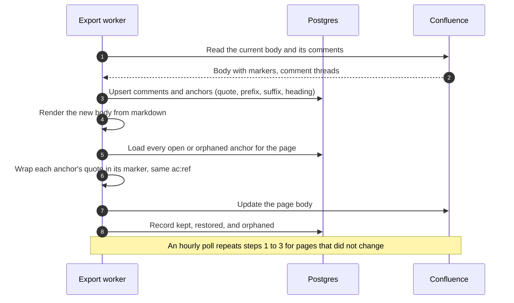
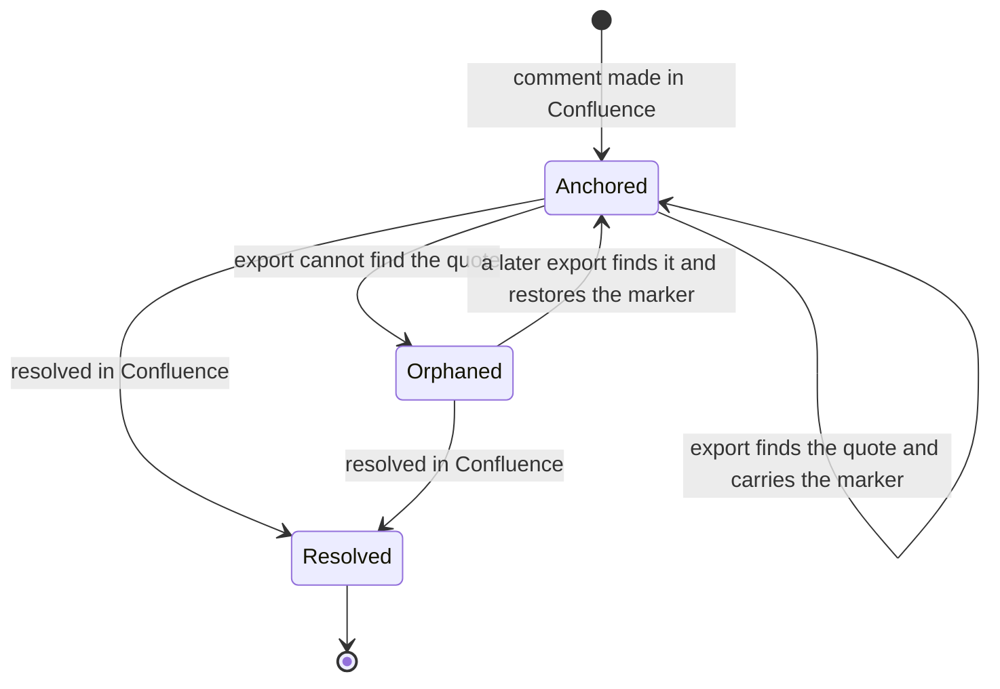

<!-- markdownlint-disable-file MD025 MD041 -->

# INV-0021: Confluence comments as a view layer kept across source changes

<!--toc:start-->
- [Question](#question)
- [Hypothesis](#hypothesis)
- [Context](#context)
- [Approach](#approach)
- [Environment](#environment)
- [Findings](#findings)
  - [Observation 1: the marker is the only link between a comment and the page](#observation-1-the-marker-is-the-only-link-between-a-comment-and-the-page)
  - [Observation 2: exact-once matching loses more than it has to](#observation-2-exact-once-matching-loses-more-than-it-has-to)
  - [Observation 3: the export already reads the page before it writes](#observation-3-the-export-already-reads-the-page-before-it-writes)
  - [Observation 4: the comment layer must stay out of git](#observation-4-the-comment-layer-must-stay-out-of-git)
  - [Observation 5: showing comments in docz-site crosses a permission boundary](#observation-5-showing-comments-in-docz-site-crosses-a-permission-boundary)
- [Conclusion](#conclusion)
- [Recommendation](#recommendation)
  - [1. Where does the comment layer live?](#1-where-does-the-comment-layer-live)
  - [2. How is an anchor described?](#2-how-is-an-anchor-described)
  - [3. How is a lost anchor put back?](#3-how-is-a-lost-anchor-put-back)
  - [4. When are comments read?](#4-when-are-comments-read)
  - [5. Does docz-site show the comments?](#5-does-docz-site-show-the-comments)
  - [6. What happens to a comment whose text is gone for good?](#6-what-happens-to-a-comment-whose-text-is-gone-for-good)
- [References](#references)
<!--toc:end-->

<!--docz:question:start-->
## Question

Can docz-api record the comments people leave on exported Confluence pages,
so that a comment whose anchored text survives a change to the source
document is put back on the new page, without anything about comments ever
reaching the markdown in git?

<!--docz:question:end-->

<!--docz:hypothesis:start-->
## Hypothesis

Yes. Comments are a layer over the rendered view, not part of the document:
the markdown in git stays the only source, and docz-api keeps the comment
layer beside it in Postgres. With each comment's anchor stored as the text it
was made on, plus some text either side of it, an export can find that text
in a new render more often than today's "the exact text appears once" rule
does, and can restore an anchor that an earlier export dropped. Once the
comments are in the database, docz-site can show them too.

<!--docz:hypothesis:end-->

<!--docz:context:start-->
## Context

**Triggered by:** the Phase B live run (IMPL-0024), where scenario 4 showed
a comment kept while its sentence was unchanged and lost once the sentence
changed.

The Confluence view exists so that people outside the repository can take
part in the docz flow, or at least read a set of the documents docz-api and
docz-site serve. Comments are how they take part: they are for human
discussion, they never change the source document, and they add to the view.

What happens today (#158, DESIGN-0021 §4, `pkg/export/confluence/comments.go`):

- Footer comments are attached to the page and survive any new body.
- Inline comments are anchored inside the body by an
  `ac:inline-comment-marker` element. On an update, `collectMarkers` reads
  the markers in the current body, and `carryMarkers` wraps the same text in
  the new render when it appears there exactly once. The rest are reported
  as lost (`PageResult.Comments.Lost`, `confluence_pages.comments_lost`).
- docz stores nothing about a comment. Once an update drops a marker, the
  marker is gone from the page, so no later export can put it back, even if
  the text returns.

This applies to every type the export writes. INV-0022 proposes leaving IMPL
documents out of the export, so in practice this covers RFCs, ADRs, designs,
investigations, runbooks, and pages.

<!--docz:context:end-->

<!--docz:approach:start-->
## Approach

1. Read the Confluence v2 comment API: list a page's inline and footer
   comments with their replies, and find which fields carry the marker ref,
   the original selection, the resolution status, the author, and the
   timestamps.
2. On the scratch site (`docz-fixture-basic`, RFC-0002), check what happens
   to an inline comment whose marker is dropped. Does its status become
   `dangling`, and does it attach again when a later version of the body
   carries a marker with the same `ac:ref`? Everything else depends on this.
3. Check whether a comment can be re-created through the API on someone's
   behalf, and what that costs: authorship, timestamps, and replies.
4. Measure what anchoring by quote and context gains over exact-once
   matching, by replaying the IMPL-0024 scenarios and the corpus documents'
   git history through both.
5. Sketch the schema and the read path (export time and polling), and what
   docz-site would show.

<!--docz:approach:end-->

<!--docz:environment:start-->
## Environment

| Component | Version / Value |
| --------- | --------------- |
| docz | `v2.0.0-beta.8` |
| Confluence | Cloud, REST v2, through the `api.atlassian.com/ex/confluence/<cloudId>` gateway |
| Scratch site | `dgifford06.atlassian.net`, spaces `DOCZ` and `DOCZ2` |
| Token scopes | Phase B's, plus `read:comment:confluence` (already granted for #158) |
| Fixtures | `donaldgifford/docz-fixture-*` (`test/live/confluence`) |

<!--docz:environment:end-->

<!--docz:findings:start-->
## Findings

### Observation 1: the marker is the only link between a comment and the page

An inline comment points at its anchor through the `ac:ref` of an
`ac:inline-comment-marker` in the body. `carryMarkers` keeps the ref, and
the live run showed the comment kept with the same ref. Nothing outside the
body records the anchor, so once a body without the marker is saved, docz
can't find the comment's text again. The comment still exists in
Confluence, but it is no longer attached to anything in the page.

### Observation 2: exact-once matching loses more than it has to

`carryMarkers` gives up when the marked text appears more than once in the
new render, and also when it was edited at all. A short selection such as
"the API" is usually ambiguous. A quote with a few words of context either
side (the W3C Web Annotation `TextQuoteSelector`: exact, prefix, suffix)
picks the right occurrence in most of those cases. Anchoring to the source
heading the text sits under narrows it further.

### Observation 3: the export already reads the page before it writes

On an `Updated` page, `Client.Body` reads the current body before the new
one is written, so collecting comments at that point costs one or two list
requests per changed page. Unchanged pages are not read today. So comments
made on a page that never changes would only be seen by polling.

With the comment layer, an export of a changed page would run like this:

### Observation 4: the comment layer must stay out of git

Nothing about comments may reach the repository: not the markdown, not a
sidecar file, and not a commit. The store in Postgres is the right place.
It already holds the export's state per page (`confluence_pages`), keyed by
repository and property key, so a comments table can hang off the same key.

### Observation 5: showing comments in docz-site crosses a permission boundary

Confluence decides who can read a comment through its space permissions,
and docz-site through its own login and the `authorize` seam (still
allow-all). Copying comments into docz-api means anyone who can read a
document in docz-site can also read the discussion on it, which may be a
wider audience than the space's.

<!--docz:findings:end-->

<!--docz:conclusion:start-->
## Conclusion

**Answer:** Inconclusive. The investigation is open. Approach step 2
decides the shape: whether a dangling comment can be attached again by
putting its marker back.

<!--docz:conclusion:end-->

<!--docz:recommendation:start-->
## Recommendation

Run Approach steps 1 to 3 on the scratch site, answer the questions below,
then write a DESIGN.

Under Questions 3 and 6 as recommended, a comment's anchor moves through these states:

### 1. Where does the comment layer live?

- **(a) Postgres in docz-api.** A `confluence_comments` table keyed by
  repository, property key, and comment id holds the thread, its status,
  and its anchor. Git never sees it. *(recommendation)*
- (b) Only in Confluence, as today, with a better anchoring rule in
  `carryMarkers`. That needs no storage, but a dropped anchor stays dropped.
- (c) A page property on each page holding the anchors. It needs no new
  table, but properties have a size limit and the CLI would start writing
  state it can't clean up.
- (d) Other.

### 2. How is an anchor described?

- **(a) A quote with context: the exact text, about 32 characters either
  side, and the source heading it sat under.** It picks the right occurrence
  when the exact text repeats. *(recommendation)*
- (b) The exact text only, as today, but remembered across exports.
- (c) A source position, the markdown line and column. It's precise, but
  any edit above the comment moves it.
- (d) Other.

### 3. How is a lost anchor put back?

- **(a) Write the stored marker, same `ac:ref`, into the next body where
  the anchor matches again.** The original comment, author, and replies come
  back intact. This depends on Approach step 2. *(recommendation)*
- (b) Re-create the comment through the API. It works even if (a) doesn't,
  but the docz bot becomes the author and the replies flatten.
- (c) Don't put it back, and report it in the API so someone can re-comment.
- (d) Other.

### 4. When are comments read?

- **(a) At export, for each page that is updated, plus a slow poll (hourly)
  of every exported page, so docz-site's copy stays current on pages that
  don't change.** *(recommendation)*
- (b) Only at export. It costs nothing extra, but the copy is stale on
  quiet pages.
- (c) Through Confluence webhooks. They need a Connect or Forge app, which
  is a lot of machinery for this.
- (d) Other.

### 5. Does docz-site show the comments?

- **(a) Yes, read-only, with a link to reply in Confluence, behind a server
  setting that is off by default (Observation 5).** *(recommendation)*
- (b) Yes, and docz-site can post replies to Confluence as the user. That
  needs per-user Atlassian OAuth.
- (c) No. The API stores comments only to restore anchors.
- (d) Other.

### 6. What happens to a comment whose text is gone for good?

- **(a) Keep it in the table as `orphaned`, show it in the API and in
  docz-site under the document with its original quote, and try to restore
  it on later exports.** *(recommendation)*
- (b) Mark it resolved in Confluence after N exports.
- (c) Drop it from the table.
- (d) Other.

<!--docz:recommendation:end-->

<!--docz:references:start-->
## References

- Issue [#158](https://github.com/donaldgifford/docz/issues/158): updates
  that keep inline comments
- [DESIGN-0021](../design/0021-confluence-export-from-docz-api-per-repository-folders-in.md)
  §4: comments
- [IMPL-0024](../impl/0024-confluence-export-from-docz-api-folders-comments-and-the-server.md):
  the live run, scenario 4
- [INV-0020](0020-docz-api-confluence-export-running-confluenceexport-without-a.md)
  Observation 8 and Question 11
- [INV-0022](0022-leaving-impl-documents-out-of-the-confluence-export-by-default.md):
  which types are exported
- [`pkg/export/confluence/comments.go`](../../pkg/export/confluence/comments.go) and
  [the Confluence migration](../../internal/store/migrations/20261007000000_add_confluence.sql)
- [W3C Web Annotation Data Model](https://www.w3.org/TR/annotation-model/#text-quote-selector):
  `TextQuoteSelector`

<!--docz:references:end-->
