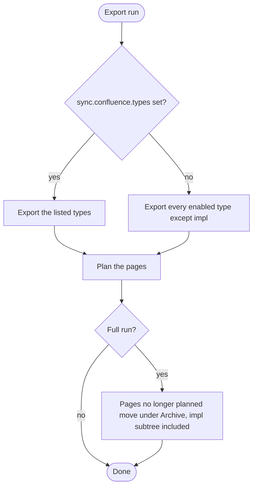

<!-- markdownlint-disable-file MD025 MD041 -->

# INV-0022: Leaving IMPL documents out of the Confluence export by default

<!--toc:start-->
- [Question](#question)
- [Hypothesis](#hypothesis)
- [Context](#context)
- [Approach](#approach)
- [Environment](#environment)
- [Findings](#findings)
  - [Observation 1: the mechanism exists; only the default is missing](#observation-1-the-mechanism-exists-only-the-default-is-missing)
  - [Observation 2: dropping a type archives its whole subtree](#observation-2-dropping-a-type-archives-its-whole-subtree)
  - [Observation 3: links to IMPLs still work](#observation-3-links-to-impls-still-work)
  - [Observation 4: the server can set the default but shouldn't override a repository's choice](#observation-4-the-server-can-set-the-default-but-shouldnt-override-a-repositorys-choice)
  - [Observation 5: the CLI is a separate question](#observation-5-the-cli-is-a-separate-question)
- [Conclusion](#conclusion)
- [Recommendation](#recommendation)
  - [1. Where does the default live?](#1-where-does-the-default-live)
  - [2. How does a repository say "everything, IMPL included"?](#2-how-does-a-repository-say-everything-impl-included)
  - [3. Is impl the only type left out?](#3-is-impl-the-only-type-left-out)
  - [4. What happens to IMPL pages already in Confluence?](#4-what-happens-to-impl-pages-already-in-confluence)
- [References](#references)
<!--toc:end-->

<!--docz:question:start-->
## Question

Should the Confluence export leave IMPL documents out unless a repository
asks for them? If so, where should that default live: on the server, in each
repository's `.docz.yaml`, or in both, with one able to override the other?

<!--docz:question:end-->

<!--docz:hypothesis:start-->
## Hypothesis

Yes. An IMPL is a working checklist for whoever, or whatever, is building
the thing, not a document for people to read. In Confluence it adds pages
nobody reads and versions nobody reviews, because every checked task is a
new version. A server-wide default that leaves IMPL out, which a repository
can override in `.docz.yaml`, fits a central API serving many repositories,
and needs very little code. `sync.confluence.types` already narrows the
export.

<!--docz:hypothesis:end-->

<!--docz:context:start-->
## Context

**Triggered by:** the Phase B live run and review of the exported tree, where
IMPL pages made up the noisiest part of each repository's folder.

Today, every enabled type is exported unless the repository lists the types
it wants:

- `sync.confluence.types` (IMPL-0023) narrows the export to the listed
  tokens. Empty means every enabled type (`canonicalTypes` in
  `pkg/export/confluence/plan.go`).
- docz-api (`internal/export/service.go`) decodes the repository's
  config snapshot and passes it through unchanged. The server controls
  where an export may write (`CONFLUENCE_SPACES`, `Allowed`) and refuses
  `layout: page`, but it has no opinion on which types are exported.
- This repository's `.docz.yaml` lists no `types`, so its IMPLs (23 of
  them) are exported, and so are the fixtures'.

INV-0021 (comments as a view layer) assumes the exported set is the set
people discuss, which is another reason to leave the IMPLs out.

<!--docz:context:end-->

<!--docz:approach:start-->
## Approach

1. Read how a type leaves the plan, and what a full run then does with the
   pages already in Confluence.
2. Read how links from exported documents to IMPLs resolve once IMPL is not
   exported.
3. Lay out where the default can live (server, repository, CLI) and how
   each would combine with `sync.confluence.types`.
4. Run it on the scratch site: drop `impl` from `docz-fixture-basic`'s
   export, and watch the folder through two exports.

<!--docz:approach:end-->

<!--docz:environment:start-->
## Environment

| Component | Version / Value |
| --------- | --------------- |
| docz | `v2.0.0-beta.8` |
| Scratch site | `dgifford06.atlassian.net`, space `DOCZ` |
| Fixtures | `donaldgifford/docz-fixture-basic` (`test/live/confluence`) |

<!--docz:environment:end-->

<!--docz:findings:start-->
## Findings

### Observation 1: the mechanism exists; only the default is missing

`sync.confluence.types` already does this per repository, and it is
validated (`validateSyncTypes`: each token must resolve to an enabled type).
A server default could fill an empty `types` list with every enabled type
except the excluded ones, before `confluence.Export` runs. Because the
setting lives on the config and not on `ExportOptions.Types`, the run is
still a full run, and orphans are still archived.

### Observation 2: dropping a type archives its whole subtree

From a reading of `orphans.go`, not yet run live: on a full run, the
folder's children are candidates. The IMPL type page (key
`docz:type:impl`) is no longer planned, so it is moved under
`<folder>: Archive`, and its documents move with it because they are its
children. Nothing is deleted, and the pages stay readable under Archive.
Turning the default on for an existing repository therefore makes one
visible change to its folder. Approach step 4 checks this.

With the default from Question 1 (a), an export chooses its types like this:

### Observation 3: links to IMPLs still work

Links from an exported document are resolved against what the run writes,
and anything else goes to the caller's resolver. Once IMPL is not exported,
a link from a DESIGN to its IMPL resolves to the GitHub blob URL, in the
server and in the CLI alike, which is a reasonable place to read an IMPL.

### Observation 4: the server can set the default but shouldn't override a repository's choice

The allow-list (`CONFLUENCE_SPACES`) is a limit a repository can't widen,
because it decides where a credential may write. Which types are exported
isn't that kind of decision: it's about what is useful to read, and the
repository knows best. A default the repository can override fits it
better than a limit the repository can't override.

### Observation 5: the CLI is a separate question

`docz export confluence` reads the same `sync:` block, but runs without the
server. If only the server gets the default, the same repository exports a
different set from a laptop than from docz-api. That difference would also
appear as orphans being archived and restored, as the two alternate.

<!--docz:findings:end-->

<!--docz:conclusion:start-->
## Conclusion

**Answer:** Inconclusive. The investigation is open. The findings support
leaving IMPL out by default. The questions below decide where the default
lives.

<!--docz:conclusion:end-->

<!--docz:recommendation:start-->
## Recommendation

### 1. Where does the default live?

- **(a) In the library, so the server and the CLI agree. When
  `sync.confluence.types` is empty, every enabled type except `impl` is
  exported. A repository that wants IMPLs lists its types, `impl`
  included.** One rule everywhere, and no server setting.
  *(recommendation)*
- (b) On the server: `CONFLUENCE_EXCLUDE_TYPES=impl` (the default). It
  applies only when a repository's `types` is empty, so a repository that
  lists `impl` still gets it. The CLI keeps exporting everything
  (Observation 5).
- (c) On the server, all or nothing: `CONFLUENCE_EXPORT_IMPL=false`, and the
  repository can't override it. It's the simplest, and the least flexible.
- (d) Other.

### 2. How does a repository say "everything, IMPL included"?

- **(a) List the types: `types: [rfc, adr, design, impl, investigation]`.**
  It's explicit, and the existing validation covers it. *(recommendation)*
- (b) A new key, `sync.confluence.include_impl: true`.
- (c) A wildcard, `types: ["*"]`.
- (d) Other.

### 3. Is `impl` the only type left out?

- **(a) Yes. Name it as a single built-in in the registry
  (`DocTypeDef.Export: false`), so a custom type can't be left out by
  accident.** *(recommendation)*
- (b) A per-type `export: false` key in `.docz.yaml`, so a repository can
  mark its own custom types the same way.
- (c) Other.

### 4. What happens to IMPL pages already in Confluence?

- **(a) Archived on the next full run, as Observation 2 describes, noted in
  the release notes and RUNBOOK-0003.** *(recommendation)*
- (b) Left where they are, with no further updates. That needs a "frozen"
  state the export doesn't have.
- (c) Other.

<!--docz:recommendation:end-->

<!--docz:references:start-->
## References

- [INV-0021](0021-confluence-comments-as-a-view-layer-kept-across-source-changes.md):
  comments as a view layer
- [DESIGN-0021](../design/0021-confluence-export-from-docz-api-per-repository-folders-in.md):
  the server export
- [RUNBOOK-0003](../runbook/0003-enable-confluence-export-on-docz-api.md):
  enabling the export on docz-api
- [`pkg/export/confluence/plan.go`](../../pkg/export/confluence/plan.go)
  (`canonicalTypes`) and [`orphans.go`](../../pkg/export/confluence/orphans.go)
- [`pkg/doczcore/config/sync.go`](../../pkg/doczcore/config/sync.go) (`validateSyncTypes`)
- [`internal/export/service.go`](../../internal/export/service.go) (`once`, `export`)

<!--docz:references:end-->
