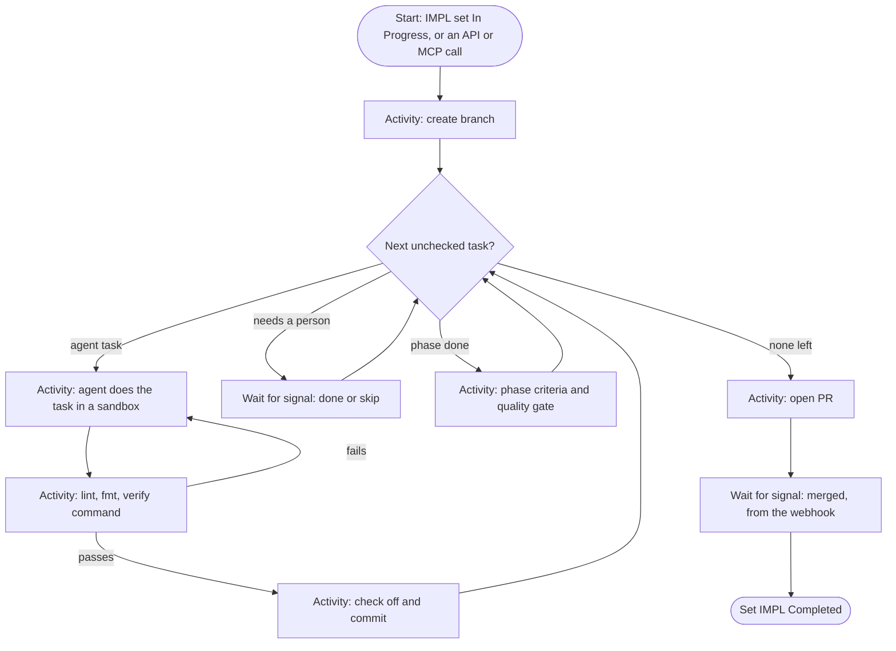

<!-- markdownlint-disable-file MD025 MD041 -->

# INV-0023: A Temporal control plane for docz with docz-api as coordinator

<!--toc:start-->
- [Question](#question)
- [Hypothesis](#hypothesis)
- [Context](#context)
- [Approach](#approach)
- [Environment](#environment)
- [Findings](#findings)
  - [Observation 1: the IMPL format is already machine-addressable](#observation-1-the-impl-format-is-already-machine-addressable)
  - [Observation 2: the loop maps onto Temporal directly](#observation-2-the-loop-maps-onto-temporal-directly)
  - [Observation 3: git stays the record of a document; Temporal records a run](#observation-3-git-stays-the-record-of-a-document-temporal-records-a-run)
  - [Observation 4: what docz-api gains](#observation-4-what-docz-api-gains)
  - [Observation 5: what changes or goes away](#observation-5-what-changes-or-goes-away)
  - [Observation 6: agents need a sandbox, a budget, and a boundary](#observation-6-agents-need-a-sandbox-a-budget-and-a-boundary)
- [Conclusion](#conclusion)
- [Recommendation](#recommendation)
  - [1. What does the coordinator own?](#1-what-does-the-coordinator-own)
  - [2. What starts a run?](#2-what-starts-a-run)
  - [3. Where do agents run?](#3-where-do-agents-run)
  - [4. Temporal self-hosted or Temporal Cloud?](#4-temporal-self-hosted-or-temporal-cloud)
  - [5. Does asynq move to Temporal?](#5-does-asynq-move-to-temporal)
  - [6. How does a task say it needs a person?](#6-how-does-a-task-say-it-needs-a-person)
- [References](#references)
<!--toc:end-->

<!--docz:question:start-->
## Question

What would it take for docz-api to coordinate the state of each repository's
documents, and run IMPL documents as Temporal workflows, following the same
loop a person runs today by hand (take the next unchecked task, do it,
verify it, check it off, commit)? How much of today's flow, and of
docz-api, would change?

This stays at the level of shape and cost. It is not a design.

<!--docz:question:end-->

<!--docz:hypothesis:start-->
## Hypothesis

It's feasible, and most of the pieces exist. `pkg/impl` already gives every
task an address (`2.3`), a verify command, and its deferred or skipped
state. `docwrite.SetTaskStateBytes` checks a task off from bytes, and
docz-api already reads repositories through a GitHub App and reacts to
webhooks. What's new is everything around those pieces:

- a Temporal service, either self-hosted or Temporal Cloud;
- a pool of sandboxed agent workers, each with a checkout;
- write access to repositories;
- authorization that means something, which docz-api lacks today.

Git stays the source of truth. The workflow records execution, not
document state.

<!--docz:hypothesis:end-->

<!--docz:context:start-->
## Context

**Triggered by:** running IMPL-0018 to IMPL-0024 through an agent loop
(`donald-loop`) and doing the surrounding steps by hand.

How an IMPL runs today:

1. A person writes or approves the IMPL, with phases, numbered tasks,
   verify lines, and success criteria.
2. An agent session on a laptop runs the loop. It finds the first
   unchecked task, does it, runs `just lint` and `just fmt` and the task's
   verify command, checks the task off, and commits. Tasks that need a
   person are marked `deferred - human required`, and the loop moves on.
3. The loop ends when every phase is done or deferred and the completion
   promise is emitted. If the session dies, the next one re-reads the
   checkboxes and carries on, so state lives entirely in the document and
   git.
4. A person does what was deferred (credentials, live runs, releases),
   opens the PR, merges it, tags the release, and sets the IMPL to
   Completed.

The loop is durable only because the document is its state. It runs only
where an agent session is running, and nothing outside that session can
see it, pause it, or approve a step in it.

What docz-api is today: it reads and indexes documents, keeps nothing a
person writes, and holds no write credentials for a repository (the App is
Contents read-only). Its background work runs on asynq (ingest, export).
Authorization is the allow-all seam behind a session cookie.

<!--docz:context:end-->

<!--docz:approach:start-->
## Approach

1. Map the loop above onto Temporal primitives: workflows, activities,
   signals, updates, queries, and child workflows.
2. Decide what "state of each document" means for the coordinator: what
   it owns, and what stays in git.
3. List what docz-api gains and loses: endpoints, tables, webhooks,
   permissions, the chart, and the queue.
4. Find where agents run and what guards them.
5. Build a throwaway spike: a workflow over one fixture IMPL with a stub
   agent activity that only checks tasks off. It runs against
   `temporal server start-dev`.

<!--docz:approach:end-->

<!--docz:environment:start-->
## Environment

| Component | Version / Value |
| --------- | --------------- |
| docz | `v2.0.0-beta.8` |
| Temporal | Go SDK `go.temporal.io/sdk` (current 1.x); `temporal server start-dev` for the spike |
| Agent runtime | to be chosen (Question 3) |
| Repository writes | GitHub App, today Contents read-only |

<!--docz:environment:end-->

<!--docz:findings:start-->
## Findings

### Observation 1: the IMPL format is already machine-addressable

`impl.Parse` returns phases by token, and tasks with `ID` (`2.3`), `Text`,
`Checked`, `Verify`, `Deferred`, `Skipped`, and a byte-accurate `Line`.
Phases carry `Criteria`. A workflow can address work by task ID rather than
by position, and re-parse the document before each task, so an edit made
mid-run is picked up. No template change is needed to start, although a
standard way to mark a task that needs a person (today it's free text in
the deferred note) would let the workflow tell "a person must do this" from
"later".

### Observation 2: the loop maps onto Temporal directly

- **Workflow:** one per IMPL run (`ImplRun`, id `impl:<owner>/<repo>:<IMPL id>`),
  with a child workflow per phase so its history stays bounded, and
  Continue-As-New between phases.
- **Activities:** run the agent on a task, verify, commit, open the PR.
  Each one retries on its own policy. An agent activity has a long timeout
  and heartbeats.
- **Signals and updates:** `pause`, `resume`, `cancel`, `complete-task` (a
  person did a deferred task), `skip-task`, and `merged`.
- **Queries:** the current phase, the task, and the last failure.

The IMPL statuses already line up: In Progress is running, Paused is
paused, Cancelled is cancelled, and Completed is set by the workflow
after the merge.

### Observation 3: git stays the record of a document; Temporal records a run

A document's status, checkboxes, and text belong in git, where docz-api
already reads them. If the coordinator kept its own copy of document state,
the two would drift. The coordinator should own only what git can't hold:
which runs exist, where each one is, and who approved what. So "managing
the state of each document" means watching a document through its
lifecycle, not storing the document. Pushes reach docz-api as webhooks
already, and a status change in a push can start or signal a workflow.

### Observation 4: what docz-api gains

- A Temporal client, and workers for the coordinating activities (branch,
  commit, PR, and status), all of which are GitHub API calls.
- Endpoints for starting, listing, and reading runs, plus pause, resume,
  cancel, and approving a task, all specced in `api/openapi.yaml`.
- An `impl_runs` table mirroring each run's state for the API and
  docz-site, or reads straight from Temporal's visibility store.
- Webhook handling for `pull_request` (merged) and for pushes that change
  an IMPL's status.
- GitHub App permissions: Contents **write** and Pull requests **write**.
  This is the largest change in kind: docz-api becomes able to change
  repositories.
- Real authorization: who may start, approve, or cancel a run, per
  repository. The `authorize` seam has to stop being allow-all
  (INV-0024 covers the token side).
- docz-site: a run view for an IMPL, showing each phase and task, live
  status, and the approve and skip actions.
- Chart: a Temporal dependency (an external endpoint, or the Temporal chart
  backed by Postgres) and a separate deployment for the agent workers.

### Observation 5: what changes or goes away

- The local agent loop becomes one way to run an IMPL rather than the only
  way. It keeps working, since both read the same checkboxes.
- asynq could stay for ingest and export, or both could become Temporal
  workflows, which would leave docz-api with one engine instead of two.
  Moving them isn't needed for IMPL runs, so it can wait.
- The person's steps shrink to approving, doing deferred tasks, merging,
  and tagging. Opening the PR, setting statuses, and checking tasks off
  move into the workflow.

### Observation 6: agents need a sandbox, a budget, and a boundary

An agent activity needs a checkout, the toolchain (Go, just, Bun), and
model access. It must not run inside docz-api, which holds every
repository's read credentials and the Confluence token. It needs its own
pool of workers on its own task queue, each run in a fresh sandbox with a
token scoped to one repository and one branch. Guards:

- the workflow pushes only to its own branch;
- merging is always a person's job;
- every task has a budget of time and tokens;
- a failed verify retries a fixed number of times, then waits for a person.

<!--docz:findings:end-->

<!--docz:conclusion:start-->
## Conclusion

**Answer:** Inconclusive. The investigation is open. The mapping holds up
on paper (Observations 1 and 2). The cost is in write access, real
authorization, and running agents safely (Observations 4 and 6), not in
the workflow itself. The spike (Approach step 5) is the next evidence.

<!--docz:conclusion:end-->

<!--docz:recommendation:start-->
## Recommendation

Build the spike, settle the questions below, and write a DESIGN for IMPL
runs only. Leave asynq where it is.

### 1. What does the coordinator own?

- **(a) Runs only. Git stays the record of every document, and the
  coordinator watches documents through webhooks and owns IMPL runs.**
  *(recommendation)*
- (b) A lifecycle workflow per document as well, for reviews, reminders,
  and stale drafts, starting with IMPL runs and adding these later.
- (c) The coordinator owns document state, and git follows it. This
  inverts the source of truth, so it is not recommended.
- (d) Other.

### 2. What starts a run?

- **(a) An explicit call (API, docz-site, or an MCP tool), allowed only for
  an IMPL whose status is In Progress.** *(recommendation)*
- (b) A push that sets an IMPL to In Progress on the default branch.
- (c) Both.
- (d) Other.

### 3. Where do agents run?

- **(a) A separate agent-worker deployment polling its own task queue,
  running the Claude Agent SDK in a fresh container per task, with a
  token scoped to the repository.** *(recommendation)*
- (b) A hosted agent runtime (such as Claude Managed Agents) called from an
  activity, with no sandbox for docz to run.
- (c) docz-api's own workers. Not recommended: that would mix credentials
  (Observation 6).
- (d) Other.

### 4. Temporal self-hosted or Temporal Cloud?

- **(a) Self-hosted for the homelab, on the existing Postgres through the
  Temporal chart, with the endpoint configurable so Cloud is a value
  change.** *(recommendation)*
- (b) Temporal Cloud from the start.
- (c) Other.

### 5. Does asynq move to Temporal?

- **(a) Not now. Revisit once IMPL runs are in production.**
  *(recommendation)*
- (b) Yes, in the same project, so docz-api has one engine.
- (c) Other.

### 6. How does a task say it needs a person?

- **(a) A fixed deferred note, `deferred - human required`, which the
  parser exposes as `Deferred.Human`.** It is what the loop writes already.
  *(recommendation)*
- (b) A separate marker such as `[human]`.
- (c) Other.

<!--docz:recommendation:end-->

<!--docz:references:start-->
## References

- [INV-0024](0024-an-mcp-server-for-docz-api-with-oauth-and-token-auth.md):
  agent access and tokens
- [INV-0022](0022-leaving-impl-documents-out-of-the-confluence-export-by-default.md):
  IMPLs are for execution, not reading
- [`pkg/impl`](../../pkg/impl/doc.go) (`Parse`, `Phase`, `Task`) and
  [`pkg/doczcore/docwrite`](../../pkg/doczcore/docwrite/) (`SetTaskStateBytes`, `SetStatusBytes`)
- [`internal/`](../../internal/): `queue`, `webhook`, `githubapp`, and `authorize`
- [Temporal documentation](https://docs.temporal.io/): workflows,
  activities, signals, updates, Continue-As-New, and worker task queues

<!--docz:references:end-->
