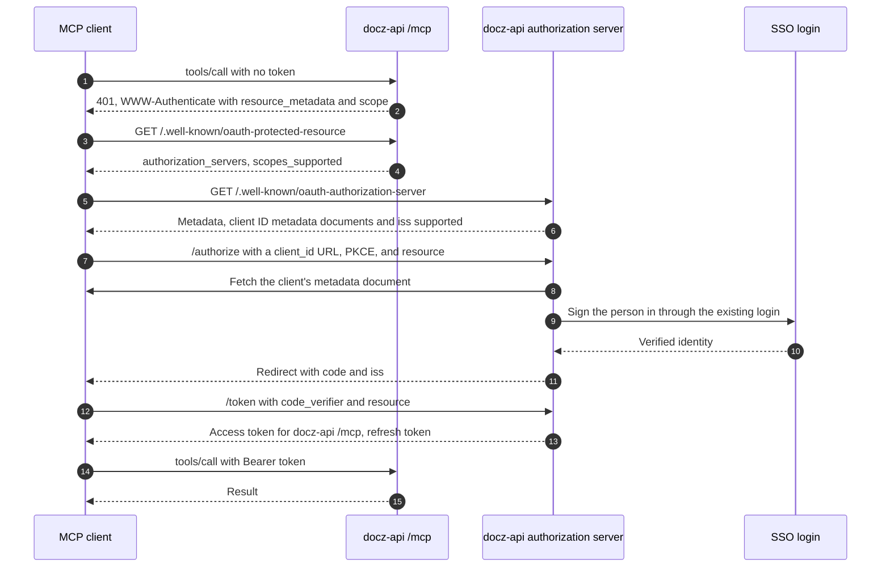
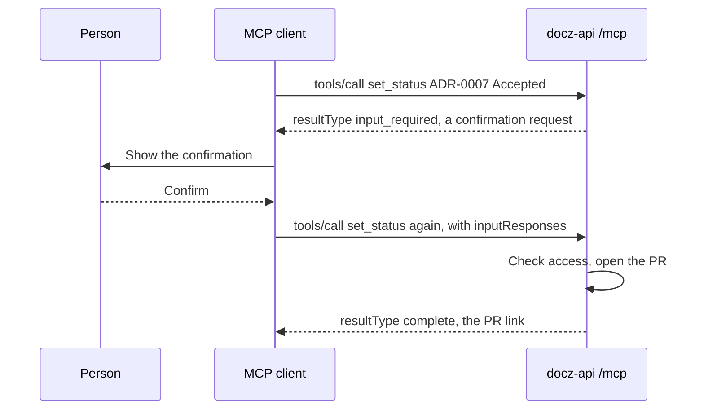

<!-- markdownlint-disable-file MD025 MD041 -->

# INV-0024: An MCP server for docz-api with OAuth and token auth

<!--toc:start-->
- [Question](#question)
- [Hypothesis](#hypothesis)
- [Context](#context)
- [Approach](#approach)
- [Environment](#environment)
- [Findings](#findings)
  - [Observation 1: what the 2026-07-28 revision asks of a remote server](#observation-1-what-the-2026-07-28-revision-asks-of-a-remote-server)
  - [Observation 2: docz-api needs its own authorization server](#observation-2-docz-api-needs-its-own-authorization-server)
  - [Observation 3: in-process beats a proxy over the REST API](#observation-3-in-process-beats-a-proxy-over-the-rest-api)
  - [Observation 4: the tools should be shaped for agents, not mirrored from REST](#observation-4-the-tools-should-be-shaped-for-agents-not-mirrored-from-rest)
  - [Observation 5: authorization stops being optional](#observation-5-authorization-stops-being-optional)
  - [Observation 6: document text is untrusted input to an agent](#observation-6-document-text-is-untrusted-input-to-an-agent)
  - [Observation 7: statelessness suits docz-api](#observation-7-statelessness-suits-docz-api)
- [Conclusion](#conclusion)
- [Recommendation](#recommendation)
  - [1. Where does the MCP server run?](#1-where-does-the-mcp-server-run)
  - [2. Who issues the tokens?](#2-who-issues-the-tokens)
  - [3. How do unattended callers authenticate?](#3-how-do-unattended-callers-authenticate)
  - [4. Does the REST API accept the same bearer tokens?](#4-does-the-rest-api-accept-the-same-bearer-tokens)
  - [5. How is client registration handled?](#5-how-is-client-registration-handled)
  - [6. What if the Go SDK lags the 2026-07-28 revision?](#6-what-if-the-go-sdk-lags-the-2026-07-28-revision)
  - [7. What does the first release include?](#7-what-does-the-first-release-include)
  - [8. What does authorization check?](#8-what-does-authorization-check)
- [References](#references)
<!--toc:end-->

<!--docz:question:start-->
## Question

How should docz expose an MCP endpoint that lets agents read, and later
change, docz documents through docz-api? It should follow current MCP
practice, authenticate with OAuth for people's agents and with tokens for
unattended callers such as a Temporal worker, and be safer than handing an
agent the REST API and a cookie.

<!--docz:question:end-->

<!--docz:hypothesis:start-->
## Hypothesis

An MCP server mounted in the docz-api binary at `/mcp` gives agents one
safe, typed surface:

- it speaks Streamable HTTP, statelessly, as the 2026-07-28 revision
  requires;
- it acts as an OAuth 2.1 resource server, with docz-api also issuing the
  tokens;
- its tools are curated, rather than a one-to-one copy of the REST routes.

It reads through the same store, search, and authorization code as the
REST API. The same token layer also gives the REST API bearer tokens, which
INV-0023's workflows need anyway.

<!--docz:hypothesis:end-->

<!--docz:context:start-->
## Context

**Triggered by:** agents already work on docz documents (the IMPL loop),
but they do it through a local checkout. Nothing gives an agent a
governed way into docz-api, and INV-0023's workflows will need one.

What docz-api offers today:

- REST `/api/v1` (spec 1.6.0): repositories, types, documents, pages, the
  index, the changelog, the Confluence status, and search. All of it is
  read-only.
- Authentication: a session cookie from GitHub, Okta, or Keycloak login, or
  `AUTH_PROVIDERS=none`. There are no bearer tokens, API keys, or
  service credentials.
- Authorization: `internal/authorize` is a seam that allows every
  repository to every session.

<!--docz:context:end-->

<!--docz:approach:start-->
## Approach

1. Read the MCP specification, revision 2026-07-28: its authorization
   section, its security considerations, the Tasks extension, and the
   Multi Round-Trip Requests (MRTR) pattern. Check which revision the
   official Go SDK (`github.com/modelcontextprotocol/go-sdk`) implements,
   and whether it supports the stateless protocol yet.
2. Choose where the server runs and how it reaches docz-api's data.
3. Choose the authorization server and the token types: interactive users,
   unattended workers, and the REST API.
4. Draft the tools and resources, with annotations and output schemas, and
   their scopes.
5. List the threats specific to this server (document content is
   untrusted text an agent reads) and the guards against them.
6. Spike: a read-only `/mcp` with `search_docs` and `get_doc`, behind a
   static development token, driven from Claude Code.

<!--docz:approach:end-->

<!--docz:environment:start-->
## Environment

| Component | Version / Value |
| --------- | --------------- |
| docz | `v2.0.0-beta.8`; API spec 1.6.0 |
| MCP specification | [2026-07-28](https://modelcontextprotocol.io/specification/2026-07-28) |
| MCP Go SDK | `github.com/modelcontextprotocol/go-sdk`, with support for 2026-07-28 to be confirmed (Approach step 1) |
| Login providers | GitHub OAuth, Okta and Keycloak OIDC (`internal/auth`) |

<!--docz:environment:end-->

<!--docz:findings:start-->
## Findings

### Observation 1: what the 2026-07-28 revision asks of a remote server

**The protocol is stateless.** There is no `initialize` handshake and no
`Mcp-Session-Id`:

- every request carries its protocol version and client capabilities in
  `_meta`;
- the server must answer `server/discover` with its versions, its
  capabilities, and who it is;
- list results (`tools/list`, `resources/list`) are the same for every
  caller, and carry `ttlMs` and `cacheScope` so clients can cache them;
- state that has to last across calls travels as a handle the server
  issues and the client passes back as an ordinary tool argument;
- change notifications arrive on an opt-in `subscriptions/listen` stream.

**Transport.** Streamable HTTP with POST requests. Each request carries
`Mcp-Method` and `Mcp-Name` headers, so a proxy or middleware can route,
log, or rate-limit a call without reading its body. A broken response
stream is not resumed: the client re-sends the request.

**Asking the person something.** Servers no longer send requests of their
own to the client. Under Multi Round-Trip Requests (MRTR), a tool that
needs input returns an `InputRequiredResult` (`resultType:
"input_required"`), and the client retries the original call with the
answers. This is how a write tool asks for confirmation. Elicitation itself
is still part of the protocol.

**Deprecated.** Sampling, Roots, and Logging are deprecated: log through
OpenTelemetry instead. OpenTelemetry trace context (`traceparent`,
`tracestate`) now has documented `_meta` keys.

**Tasks** are an official extension, `io.modelcontextprotocol/tasks`:

- the server returns a durable task handle;
- the client polls it with `tasks/get`;
- the client sends input mid-flight with `tasks/update`.

**Authorization**, for HTTP transports:

- The MCP server is an OAuth 2.1 resource server. It must publish
  Protected Resource Metadata (RFC 9728) at
  `/.well-known/oauth-protected-resource`. An unauthenticated request gets
  `401` with a `WWW-Authenticate` header naming that document and the
  scopes the call needs. A token without enough scope gets `403` with
  `error="insufficient_scope"`, naming every scope the call needs in one
  challenge.
- The authorization server publishes RFC 8414 or OIDC discovery metadata.
  It should include `iss` in authorization responses (RFC 9207) and
  advertise that it does; a later revision is expected to make this
  mandatory.
- Clients use PKCE and send `resource` (RFC 8707) with the server's
  canonical URI. The server must accept only tokens issued for it as the
  audience, and must not pass any token on to another service.
- **Client registration:** Client ID Metadata Documents are what clients
  and servers should support. Pre-registration is allowed. Dynamic Client
  Registration (RFC 7591) is **deprecated** and kept only for
  authorization servers that can't do metadata documents.
- Clients acting for themselves (`client_credentials`) are covered by the
  authorization extensions in the `ext-auth` repository, not by the core.

### Observation 2: docz-api needs its own authorization server

GitHub OAuth issues tokens for GitHub's API, not for a third-party resource,
so a GitHub-login deployment has no authorization server an MCP client
could use. Okta and Keycloak can serve as one, but a docz deployment may
have neither. The common pattern for a server in this position is to be its
own authorization server:

- docz-api's `/authorize` sends the person through the login that already
  exists (GitHub, Okta, or Keycloak);
- it issues short-lived, audience-bound access tokens and rotating refresh
  tokens;
- it publishes the metadata above.

The same token service can issue personal access tokens, and client
credentials for workers.

An MCP client's first call, with docz-api as both the server and the authorization server:

### Observation 3: in-process beats a proxy over the REST API

A separate MCP service calling `/api/v1` would need bearer tokens on the
REST API anyway, and would add a hop and a second place to decide
authorization. Mounted in docz-api, the MCP handlers call the same store,
search, and `authorize` code as the REST handlers. The OpenAPI spec stays
the contract for REST, and the MCP tool schemas for MCP. Splitting it out
later stays possible if the load ever demands it.

### Observation 4: the tools should be shaped for agents, not mirrored from REST

An agent does better with a few tools that answer whole questions than
with fifteen routes. A first, read-only set:

- `search_docs` (query and facets);
- `get_doc`, which returns the markdown plus the typed fields for its type,
  such as phases and tasks for an IMPL;
- `list_docs` (repository, type, and status);
- `get_impl_progress` (phases, tasks, and what is deferred).

Documents can also be MCP resources (`docz://<owner>/<repo>/<type>/<id>`),
so a client can attach them as context. Listing them in a fixed order
(repository, type, then id) and caching them with `ttlMs` suits the
2026-07-28 rules.

Write tools wait on INV-0023's write access: `set_status`, `check_task`,
and `create_doc`. Each one is marked `destructiveHint` where it changes a
repository, and confirmed through MRTR: the first call returns
`input_required` with a confirmation request, and the change happens on the
retry that carries the answer.

An IMPL run is a Tasks-extension task. `start_impl_run` returns a task
handle, `tasks/get` reads the run's state (a workflow query), and
`tasks/update` carries a person's approval of a deferred task (a workflow
update).

A write tool's confirmation under MRTR:

### Observation 5: authorization stops being optional

Once tokens reach agents, the allow-all `authorize` seam is the weakest
part. Each token has to carry who it acts for, and each tool call has to
check that principal's access to the repository: read for the read tools,
and write or run for the rest. The scopes follow the same split:
`docs:read`, `docs:write`, and `impl:run`.

### Observation 6: document text is untrusted input to an agent

Documents and Confluence comments (INV-0021) are written by anyone with
push access, or a Confluence login. An agent reading them through MCP can
be prompt-injected by their content. The server can't stop that, but it
can limit the damage:

- results are returned as data, never as instructions;
- write tools never act on a document's say-so without a confirmation;
- per-token rate limits apply;
- every tool call is logged with its principal, for audit.

### Observation 7: statelessness suits docz-api

docz-api runs as several replicas behind a Service, with an HPA in the
chart. With no MCP sessions, any replica can answer any call. That needs no
sticky routing and no session store, which the 2025-11-25 session model
would have required (a Redis-backed session table, or affinity). The one
piece of state that lasts across calls, an IMPL run, already has a durable
handle: its Temporal workflow id, carried as the task handle. The
`traceparent` in `_meta` joins MCP calls to the traces docz-api already
emits, and the `Mcp-Method` and `Mcp-Name` headers give the request logger
and the rate limiter a tool name without parsing the body.

<!--docz:findings:end-->

<!--docz:conclusion:start-->
## Conclusion

**Answer:** Inconclusive. The investigation is open. The direction is
clear: an in-process MCP server, with docz-api as the authorization server.
The authorization model (Observation 5) is the real work, and the spike
(Approach step 6) comes next.

<!--docz:conclusion:end-->

<!--docz:recommendation:start-->
## Recommendation

### 1. Where does the MCP server run?

- **(a) In the docz-api binary, at `/mcp`, calling the same internal
  services as REST.** *(recommendation)*
- (b) A separate service that calls `/api/v1` with bearer tokens.
- (c) A local stdio server, run by each user, that calls the API. It's
  simple, but every user then holds a long-lived token.
- (d) Other.

### 2. Who issues the tokens?

- **(a) docz-api, as an OAuth 2.1 authorization server that delegates login
  to the providers it already has. It issues audience-bound JWTs, rotating
  refresh tokens, personal access tokens, and client credentials, and
  includes `iss` in authorization responses (RFC 9207).**
  *(recommendation)*
- (b) An external authorization server only (Keycloak or Okta), with
  docz-api validating its JWTs. It's less code, but a GitHub-login
  deployment gets no MCP.
- (c) Long-lived API keys only. That isn't current practice for remote MCP.
- (d) Other.

### 3. How do unattended callers authenticate?

- **(a) The OAuth client credentials grant, as the `ext-auth` extension
  describes it: one pre-registered client per worker deployment, with
  short-lived tokens limited to the repositories the run needs.**
  *(recommendation)*
- (b) Personal access tokens issued to a service account.
- (c) Other.

### 4. Does the REST API accept the same bearer tokens?

- **(a) Yes. `/api/v1` takes either the session cookie or a bearer token
  through one middleware, so docz-site is unchanged and scripts get
  tokens.** *(recommendation)*
- (b) No. Tokens are for `/mcp` only.
- (c) Other.

### 5. How is client registration handled?

- **(a) Client ID Metadata Documents and pre-registered clients (for
  docz's own tooling and the workers). No Dynamic Client Registration: it
  is deprecated in 2026-07-28, and docz-api would be a new authorization
  server with no older clients to support.** *(recommendation)*
- (b) As (a), plus Dynamic Client Registration behind a setting that is off
  by default, for clients that haven't adopted metadata documents.
- (c) Pre-registered clients only.
- (d) Other.

### 6. What if the Go SDK lags the 2026-07-28 revision?

- **(a) Use the official Go SDK, and wait for its 2026-07-28 support before
  shipping, since a stateless server on the old session model would be
  rebuilt soon after.** *(recommendation)*
- (b) Implement the stateless JSON-RPC surface by hand on chi. It's small
  for a read-only server, but every later revision becomes docz's to
  follow.
- (c) Ship on 2025-11-25 sessions now and migrate later.
- (d) Other.

### 7. What does the first release include?

- **(a) Read-only tools and resources only, with write tools after
  INV-0023's write access and the authorization model exist.**
  *(recommendation)*
- (b) Read tools plus `set_status` and `check_task` on day one.
- (c) Other.

### 8. What does authorization check?

- **(a) Repository-level grants per principal (read, write, run), checked in
  `authorize` for both REST and MCP. Initially they come from the GitHub
  App's installation repositories plus a server-side admin list.**
  *(recommendation)*
- (b) The user's own GitHub permission on the repository, looked up per
  request.
- (c) Scopes only, with no per-repository check.
- (d) Other.

<!--docz:recommendation:end-->

<!--docz:references:start-->
## References

- [INV-0023](0023-a-temporal-control-plane-for-docz-with-docz-api-as-coordinator.md):
  the workflows that need tokens and write tools
- [INV-0021](0021-confluence-comments-as-a-view-layer-kept-across-source-changes.md):
  comments as untrusted text
- [Model Context Protocol specification 2026-07-28](https://modelcontextprotocol.io/specification/2026-07-28)
  and its [changelog](https://modelcontextprotocol.io/specification/2026-07-28/changelog):
  Streamable HTTP, [Authorization](https://modelcontextprotocol.io/specification/2026-07-28/basic/authorization),
  MRTR, and the Tasks extension
- [MCP authorization extensions](https://github.com/modelcontextprotocol/ext-auth):
  client credentials
- [RFC 9728](https://www.rfc-editor.org/rfc/rfc9728) (Protected Resource Metadata),
  [RFC 8707](https://www.rfc-editor.org/rfc/rfc8707) (Resource Indicators),
  [RFC 8414](https://www.rfc-editor.org/rfc/rfc8414) (Authorization Server Metadata),
  [RFC 9207](https://www.rfc-editor.org/rfc/rfc9207) (Issuer Identification), and
  [OAuth 2.1](https://datatracker.ietf.org/doc/draft-ietf-oauth-v2-1/)
- [`internal/`](../../internal/): `auth`, `authhttp`, `session`, and `authorize`;
  [`api/openapi.yaml`](../../api/openapi.yaml)

<!--docz:references:end-->
