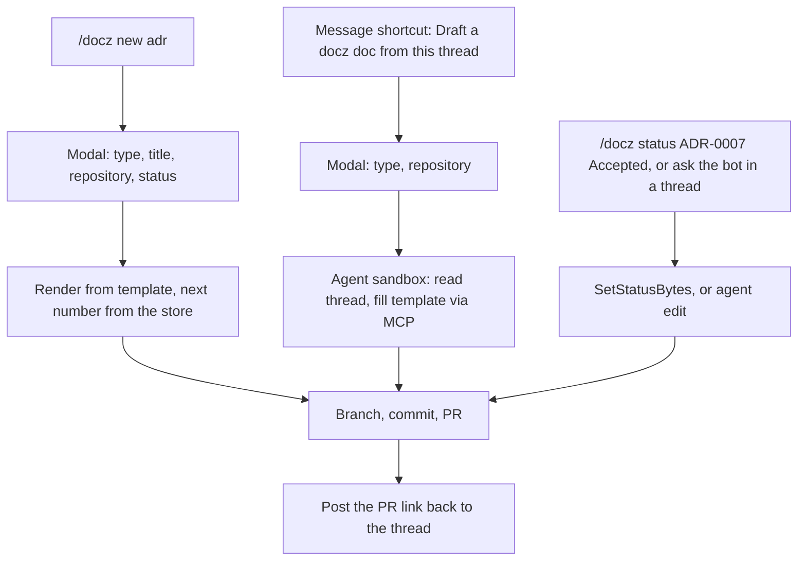

<!-- markdownlint-disable-file MD025 MD041 -->

# INV-0025: A Slack bot for creating and changing docz documents

<!--toc:start-->
- [Question](#question)
- [Hypothesis](#hypothesis)
- [Context](#context)
- [Approach](#approach)
- [Environment](#environment)
- [Findings](#findings)
  - [Observation 1: three flows, only one of which needs an agent](#observation-1-three-flows-only-one-of-which-needs-an-agent)
  - [Observation 2: Slack's 3-second acknowledgement forces a queue](#observation-2-slacks-3-second-acknowledgement-forces-a-queue)
  - [Observation 3: numbers come from the store, and need serialising](#observation-3-numbers-come-from-the-store-and-need-serialising)
  - [Observation 4: the default repository is configuration, not convention](#observation-4-the-default-repository-is-configuration-not-convention)
  - [Observation 5: identity is the hard part](#observation-5-identity-is-the-hard-part)
  - [Observation 6: the agent sees untrusted text and must stay narrow](#observation-6-the-agent-sees-untrusted-text-and-must-stay-narrow)
- [Conclusion](#conclusion)
- [Recommendation](#recommendation)
  - [1. Where does the bot run?](#1-where-does-the-bot-run)
  - [2. Events API over HTTP, or Socket Mode?](#2-events-api-over-http-or-socket-mode)
  - [3. How is a Slack user tied to a docz user?](#3-how-is-a-slack-user-tied-to-a-docz-user)
  - [4. What does the bot change, and how?](#4-what-does-the-bot-change-and-how)
  - [5. What is the default repository?](#5-what-is-the-default-repository)
  - [6. What ships first?](#6-what-ships-first)
- [References](#references)
<!--toc:end-->

<!--docz:question:start-->
## Question

What would a Slack interface to docz look like? It would let someone create a
docz document, or change one, from Slack. Documents go to one central
repository by default, or to a repository the person names. Drafting from a
conversation happens in an agent sandbox that reaches docz through its API or
MCP server.

<!--docz:question:end-->

<!--docz:hypothesis:start-->
## Hypothesis

It is feasible, and it is mostly the pieces INV-0023 and INV-0024 already
call for, behind a new front door:

- a Slack app whose requests docz-api verifies and acknowledges;
- deterministic creation through `docwrite.Render`, which needs no agent;
- an agent run in INV-0023's sandboxed workers for "draft this from the
  thread", calling INV-0024's MCP tools;
- every change lands as a pull request, so git and review stay the
  gate.

What's new is the default repository. Mapping a Slack user to a docz user is
simple, because both share SSO, so the email matches.

<!--docz:hypothesis:end-->

<!--docz:context:start-->
## Context

**Triggered by:** decisions and proposals that start as Slack threads and
either never become documents, or become them days later by hand.

What exists:

- Rendering a new document without a checkout: `docwrite.Render(opts,
  number)` returns the filename and content from bytes.
  `docwrite.NextNumber` reads a directory, so a server works the number out
  from its own `documents` table instead.
- Status and checkbox changes on bytes: `SetStatusBytes` and
  `SetTaskStateBytes`.
- A webhook receiver that verifies a signature before doing any work and
  queues the work (`internal/webhook`, the GitHub pattern).
- A `users` table keyed by login provider and subject, with email.

What doesn't exist yet: write access to repositories (INV-0023),
bearer tokens and real authorization (INV-0024), and agent workers
(INV-0023).

<!--docz:context:end-->

<!--docz:approach:start-->
## Approach

1. List the Slack surfaces that fit: slash commands, message shortcuts,
   modals, the App Home, and Slack's assistant (AI app) threads. Note what
   each needs: scopes, the 3-second acknowledgement, and signature
   verification.
2. Walk the three flows end to end: a quick create, drafting from a thread,
   and changing an existing document.
3. Decide where the bot runs and how it reaches docz-api.
4. Decide how a Slack user becomes a docz principal, and what they may do
   where.
5. Decide what the default repository is and how a person names another.
6. Spike: a slash command that opens a modal and creates a PR in a scratch
   repository through `docwrite.Render` and the GitHub API.

<!--docz:approach:end-->

<!--docz:environment:start-->
## Environment

| Component | Version / Value |
| --------- | --------------- |
| docz | `v2.0.0-beta.8` |
| Slack | Slack app, with Events API or Socket Mode (Question 2) |
| Go client | `github.com/slack-go/slack` (community; Slack's Bolt SDKs don't cover Go) |
| Depends on | INV-0023 (write access, agent workers), INV-0024 (tokens, MCP tools) |

<!--docz:environment:end-->

<!--docz:findings:start-->
## Findings

### Observation 1: three flows, only one of which needs an agent

- **Quick create** is deterministic. The modal collects the type, title,
  repository, and status, the template is rendered, and a PR opens. No model
  is involved, and it can ship before any agent work.
- **Draft from a thread** reads the thread and fills the template's
  sections, such as an ADR's context, decision, and consequences. That is
  agent work, done in a sandbox.
- **Change** covers a status change (`SetStatusBytes`), checking a task
  off, or an edit described in words. The first two are deterministic and
  the last is agent work.

Every flow ends in a pull request and a reply in the thread, so Slack
never changes a repository's default branch directly.

### Observation 2: Slack's 3-second acknowledgement forces a queue

Slack expects an interaction to be acknowledged within 3 seconds. The
handler must check the signing secret (`X-Slack-Signature`, with a
5-minute timestamp window), acknowledge, and queue the work. That is the
GitHub webhook's shape exactly. A quick create finishes in seconds and
posts back through `response_url` or `chat.postMessage`. A draft is a
run of minutes. The bot shows progress (Slack's assistant threads have a
status line), then posts the PR.

### Observation 3: numbers come from the store, and need serialising

Two people creating an ADR in the same repository at once would both get
the next number from the store. Serialising creates per repository, with a
queue task id like ingest's (`create:<owner>/<repo>`), gives each one its
own number. The PR can still collide with a document merged in the
meantime, so the create re-checks the number on the branch before opening
it.

### Observation 4: the default repository is configuration, not convention

A central repository (for example `<org>/docs`) catches what has no better
home. It needs a server setting (`SLACK_DEFAULT_REPO`), the docz-api App
installed on it with write access, and a `.docz.yaml`. Naming another
repository (`/docz new adr --repo owner/name`, or a menu in the modal)
needs the same App installation and write access there. The menu can offer
only repositories docz-api has ingested and the person may write to.

### Observation 5: identity is the hard part

A Slack user id means nothing to docz-api, but its email does. Slack and
docz sign people in through the same SSO, so a person's Slack email is the
email on their docz `users` row, which docz-api records only once the
identity provider has verified it (`internal/auth` drops an unverified
email). Slack's `users.info`, with `users:read.email`, gives that email,
and docz-api matches it to the `users` row. No linking step is needed.

Two edges:

- **No `users` row yet.** A person who has never signed in to docz-site
  has no row. The bot replies with a sign-in link and retries once they
  have signed in.
- **GitHub login.** A deployment using GitHub login instead of Okta or
  Keycloak stores the person's primary GitHub email, which may not be
  their SSO email. Those deployments fall back to linking: the bot sends
  a link to docz-site's login and stores the Slack id on the `users` row.

Either way, the bot acts **as that person** (an authorization check
against INV-0024's per-repository grants), not as a bot that can do
anything anywhere. The commit's author, or a `Co-authored-by` line, names
the person, and the document's `author:` comes from their docz profile.

### Observation 6: the agent sees untrusted text and must stay narrow

A Slack thread is untrusted input, just as INV-0024 Observation 6 says of
documents. The drafting agent gets:

- the thread's messages, as data;
- read tools, and one write tool that opens a PR on a bot branch in the
  chosen repository;
- a token scoped to that repository;
- a time and token budget.

It never merges, and nothing it writes goes further than a PR.

<!--docz:findings:end-->

<!--docz:conclusion:start-->
## Conclusion

**Answer:** Inconclusive. The investigation is open. Quick create stands
on its own once docz-api can write to a repository. Drafting and editing
need INV-0023's agent workers and INV-0024's tools and tokens, so the bot
should follow those, not lead them.

<!--docz:conclusion:end-->

<!--docz:recommendation:start-->
## Recommendation

### 1. Where does the bot run?

- **(a) In docz-api: a `/slack/events` and `/slack/interactions` receiver
  beside the GitHub webhook, with the work queued. Quick creates run in
  docz-api's workers, and drafts run in INV-0023's agent workers.**
  *(recommendation)*
- (b) A separate `docz-slack` service, acting as an MCP client of docz-api
  with client credentials. It is cleanly separated, but acting on a
  person's behalf then needs token exchange (RFC 8693).
- (c) A Slack-hosted or third-party agent platform with docz's MCP server
  attached.
- (d) Other.

### 2. Events API over HTTP, or Socket Mode?

- **(a) Events API over HTTP, verified by the signing secret.** docz-api
  already needs public ingress for GitHub webhooks, and it is the mode
  Slack requires for a distributed app. *(recommendation)*
- (b) Socket Mode: a WebSocket out from docz-api, so it needs no public
  URL, which suits a homelab behind Tailscale. But each replica holds a
  socket, so delivery is spread across replicas and has to be coordinated.
- (c) Both, chosen by configuration.
- (d) Other.

### 3. How is a Slack user tied to a docz user?

- **(a) Match on email. Slack and docz share SSO, so the Slack email is
  the docz user's verified email. A person with no `users` row gets a
  sign-in link, and a deployment on GitHub login falls back to linking
  once.** *(recommendation)*
- (b) Always link once through docz-site's login, and store the Slack id on
  the `users` row.
- (c) Match on email only, with no fallback.
- (d) Other.

### 4. What does the bot change, and how?

- **(a) Always through a pull request: new documents, status changes, and
  edits alike, with the link posted back to the thread.**
  *(recommendation)*
- (b) Commit status changes and checkbox ticks straight to the default
  branch, and open PRs only for new documents and edits.
- (c) Other.

### 5. What is the default repository?

- **(a) One server setting, `SLACK_DEFAULT_REPO`, which can be overridden
  per Slack channel (a channel's default stored by `/docz config repo
  owner/name`), and per request.** *(recommendation)*
- (b) One server setting, overridden per request only.
- (c) No default: always ask.
- (d) Other.

### 6. What ships first?

- **(a) Quick create and status change, both deterministic, once docz-api
  can write. Drafting and edits come after INV-0023's agent workers.**
  *(recommendation)*
- (b) Everything together, behind the agent workers.
- (c) Other.

<!--docz:recommendation:end-->

<!--docz:references:start-->
## References

- [INV-0023](0023-a-temporal-control-plane-for-docz-with-docz-api-as-coordinator.md):
  write access and agent workers
- [INV-0024](0024-an-mcp-server-for-docz-api-with-oauth-and-token-auth.md):
  tokens, authorization, and MCP tools
- [`pkg/doczcore/docwrite`](../../pkg/doczcore/docwrite/): `Render`,
  `SetStatusBytes`, and `SetTaskStateBytes`
- [`internal/webhook`](../../internal/webhook/): the verify, acknowledge,
  and queue pattern
- [Slack: verifying requests](https://api.slack.com/authentication/verifying-requests-from-slack),
  [Socket Mode](https://api.slack.com/apis/socket-mode), and
  [AI apps](https://api.slack.com/docs/apps/ai)
- [RFC 8693](https://www.rfc-editor.org/rfc/rfc8693): OAuth 2.0 Token Exchange

<!--docz:references:end-->
