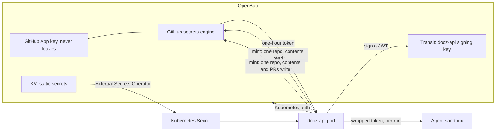

<!-- markdownlint-disable-file MD025 MD041 -->

# INV-0026: OpenBao for docz credentials and just-in-time tokens

<!--toc:start-->
- [Question](#question)
- [Hypothesis](#hypothesis)
- [Context](#context)
- [Approach](#approach)
- [Environment](#environment)
- [Findings](#findings)
  - [Observation 1: GitHub is a natural fit for just-in-time tokens](#observation-1-github-is-a-natural-fit-for-just-in-time-tokens)
  - [Observation 2: Atlassian has no token-minting API for people's tokens](#observation-2-atlassian-has-no-token-minting-api-for-peoples-tokens)
  - [Observation 3: docz-api's own tokens can be signed where the key can't leak](#observation-3-docz-apis-own-tokens-can-be-signed-where-the-key-cant-leak)
  - [Observation 4: static secrets need no code change](#observation-4-static-secrets-need-no-code-change)
  - [Observation 5: who authenticates to OpenBao](#observation-5-who-authenticates-to-openbao)
  - [Observation 6: OpenBao becomes a dependency on the hot path](#observation-6-openbao-becomes-a-dependency-on-the-hot-path)
- [Conclusion](#conclusion)
- [Recommendation](#recommendation)
  - [1. Is OpenBao required or optional?](#1-is-openbao-required-or-optional)
  - [2. How are GitHub tokens minted?](#2-how-are-github-tokens-minted)
  - [3. How are Atlassian credentials handled?](#3-how-are-atlassian-credentials-handled)
  - [4. What signs docz-api's tokens (INV-0024)?](#4-what-signs-docz-apis-tokens-inv-0024)
  - [5. How do static secrets reach the pod?](#5-how-do-static-secrets-reach-the-pod)
  - [6. How do agent sandboxes get credentials?](#6-how-do-agent-sandboxes-get-credentials)
- [References](#references)
<!--toc:end-->

<!--docz:question:start-->
## Question

Can OpenBao hold docz's credentials, and mint short-lived ones on demand?
That would cover GitHub installation tokens scoped to one repository and
Atlassian access tokens. It could also manage docz-api's own API keys and
signing keys, so that docz-api and its agent workers keep fewer long-lived
secrets than they do today.

<!--docz:question:end-->

<!--docz:hypothesis:start-->
## Hypothesis

Mostly yes, and unevenly:

- **GitHub fits best.** A GitHub App already issues one-hour installation
  tokens, so with the App's private key inside OpenBao, a secrets engine can
  mint a token narrowed to one repository and a few permissions, and the
  key never leaves OpenBao.
- **Atlassian fits partly.** Its API tokens can't be minted through an API,
  but a service account with OAuth 2.0 client credentials can be exchanged
  for short-lived access tokens.
- **docz-api's own tokens fit well.** OpenBao's Transit engine can sign
  docz-api's tokens, so the signing key never leaves OpenBao.

Static secrets (database URLs, the Meilisearch key, the session secret) move
with no code change, through the chart's existing `existingSecret` and an
operator that syncs from OpenBao.

<!--docz:hypothesis:end-->

<!--docz:context:start-->
## Context

**Triggered by:** INV-0023 and INV-0025 need per-run, per-repository write
credentials for agent sandboxes, and INV-0024 needs docz-api to issue and
sign tokens. Today every credential docz-api holds is long-lived.

What docz-api holds today (`internal/config`, the `charts/docz` API
Secret), all read once at startup from the environment:

| Credential | Kind | What a leak gives |
| ---------- | ---- | ----------------- |
| `GITHUB_APP_PRIVATE_KEY` | RSA key | A token for every installed repository, with every App permission |
| `GITHUB_WEBHOOK_SECRET` | HMAC secret | Forged webhooks |
| `CONFLUENCE_API_TOKEN` | Scoped API token (up to a year) | Read and write on every allowed space |
| `SESSION_SECRET` | HMAC secret | Forged OAuth state |
| `GITHUB_OAUTH_CLIENT_SECRET`, `OKTA_CLIENT_SECRET`, `KEYCLOAK_CLIENT_SECRET` | OAuth client secrets | Impersonating docz-api to the identity provider |
| `DATABASE_URL`, `REDIS_URL`, `MEILI_API_KEY` | Connection secrets | The data stores |

OpenBao is the Linux Foundation fork of HashiCorp Vault, kept open source
under MPL 2.0 when Vault moved to the BSL. Its API and most of its engines
match Vault's.

<!--docz:context:end-->

<!--docz:approach:start-->
## Approach

1. Check what OpenBao ships and what it can load: KV v2, Transit, the
   Kubernetes auth method, the database secrets engine, external plugins,
   and its OIDC identity provider.
2. GitHub: test a GitHub App secrets engine plugin (for example
   `vault-plugin-secrets-github`) on OpenBao. Mint an installation token
   narrowed to one repository with `contents: write`, and confirm the
   App key can't be read back.
3. Atlassian: confirm that an Atlassian service account with OAuth 2.0
   client credentials can call the Confluence v2 API through the gateway
   with the scopes the export needs. If it can't, the fallback is a scoped
   API token in KV, rotated by hand.
4. docz-api's tokens: sign a JWT with Transit, publish the public key as a
   JWKS, and verify it in docz-api.
5. Decide how docz-api, its agent workers, and the CLI authenticate to
   OpenBao.
6. Sort each credential in the table into: stays static (synced by an
   operator), minted on demand, or signed in OpenBao.

<!--docz:approach:end-->

<!--docz:environment:start-->
## Environment

| Component | Version / Value |
| --------- | --------------- |
| docz | `v2.0.0-beta.8` |
| OpenBao | 2.x; Go client `github.com/openbao/openbao/api/v2` |
| Deployment | Kubernetes, `charts/docz`; OpenBao through its Helm chart |
| Sync for static secrets | External Secrets Operator (OpenBao/Vault provider), or the OpenBao Agent injector |

<!--docz:environment:end-->

<!--docz:findings:start-->
## Findings

### Observation 1: GitHub is a natural fit for just-in-time tokens

An installation token is short-lived by design (one hour), and GitHub lets
the minter narrow it to named repositories and a subset of the App's
permissions. With the private key inside OpenBao and a secrets engine that
signs the App JWT there:

- docz-api asks for a token for `owner/repo` with `contents: read` to
  ingest, and holds no key at all.
- INV-0023's coordinator asks for `contents: write` and `pull_requests:
  write` on one repository for one run, and hands the agent sandbox only
  that token.
- A leaked sandbox token reaches one repository for under an hour.

The plugin isn't part of OpenBao. Whether a Vault community plugin loads
and runs on OpenBao 2.x is Approach step 2. Without it, docz-api mints the
narrowed token itself with the key, read from OpenBao: the sandboxes get
the same narrowing, but docz-api still holds the key.

### Observation 2: Atlassian has no token-minting API for people's tokens

Atlassian API tokens are created by a person in their account settings, and
scoped tokens last up to a year. An organization's service accounts, with
OAuth 2.0 client credentials, are the route to short-lived tokens: OpenBao
holds the client secret, and docz-api (or a small plugin) exchanges it for
an access token when an export runs. Whether that works for the scopes the
export needs, through the gateway the export already uses, is Approach step
3. Until it's confirmed, the scoped API token can live in KV, which gains
little over a Kubernetes Secret except audit and a single place to rotate
it.

### Observation 3: docz-api's own tokens can be signed where the key can't leak

INV-0024 makes docz-api an authorization server issuing JWTs. With Transit:

- docz-api asks OpenBao to sign each token, and the private key never
  leaves OpenBao;
- the public keys are published as docz-api's JWKS;
- a key is rotated in OpenBao while older versions still verify.

Personal access tokens are opaque and random, and only their hashes are
stored in Postgres, so they need no OpenBao at all. OpenBao's own OIDC
provider could issue the tokens instead. But docz-api's authorization (per
repository, per principal) would then live in OpenBao policy, which is the
wrong home for it.

### Observation 4: static secrets need no code change

The chart already has a seam: the API Secret's `existingSecret`. The
External Secrets Operator, or the OpenBao Agent injector, can fill that
Secret from KV:

- `SESSION_SECRET`, the webhook secret, and the OAuth client secrets;
- `MEILI_API_KEY`;
- `DATABASE_URL`, either static, or from the database secrets engine with
  rotation, which docz-api would need to reconnect for.

This is the first step, and it is useful on its own: one place to rotate,
and an audit log.

### Observation 5: who authenticates to OpenBao

- **docz-api:** OpenBao's Kubernetes auth method, with the pod's
  service-account token, mapped to a policy that may mint tokens and use
  Transit.
- **Agent sandboxes:** these never authenticate to OpenBao. The
  coordinator mints the narrowed token and passes it in, response-wrapped
  if it crosses a process boundary. Then a compromised sandbox has no
  OpenBao identity at all.
- **The CLI** (`docz export confluence`): unchanged. It reads
  `ATLASSIAN_*` from the environment, and a person may fill that from
  `bao kv get` if they like.

Where each credential comes from, with OpenBao configured:

### Observation 6: OpenBao becomes a dependency on the hot path

If docz-api mints a GitHub token per ingest, OpenBao going down stops
ingest. Caching each minted token until shortly before it expires (as
`ghinstallation` does with the key today) limits that to OpenBao being
unreachable for most of an hour. `/readyz` should not include OpenBao:
reads keep serving without it.

<!--docz:findings:end-->

<!--docz:conclusion:start-->
## Conclusion

**Answer:** Inconclusive. The investigation is open. GitHub (Observation 1)
and docz-api's own signing (Observation 3) are strong fits. Atlassian
(Observation 2) depends on service-account OAuth. Static secrets
(Observation 4) can move today with no code. Approach steps 2 and 3 are
the deciding experiments.

<!--docz:conclusion:end-->

<!--docz:recommendation:start-->
## Recommendation

### 1. Is OpenBao required or optional?

- **(a) Optional. docz-api keeps working from environment variables, and
  OpenBao is a configured provider (`CREDENTIALS_PROVIDER=openbao`) that a
  homelab can skip.** *(recommendation)*
- (b) Required for v2.0.0 deployments with write access, since write
  credentials are the ones worth protecting.
- (c) Other.

### 2. How are GitHub tokens minted?

- **(a) In OpenBao, through a GitHub App secrets engine plugin, with the
  key never leaving OpenBao, if Approach step 2 shows the plugin runs on
  OpenBao.** *(recommendation)*
- (b) In docz-api, with the key read from OpenBao KV at startup and tokens
  narrowed per call. Sandboxes get the same narrowing, but docz-api holds
  the key.
- (c) As today, with the key in a Kubernetes Secret.
- (d) Other.

### 3. How are Atlassian credentials handled?

- **(a) A service account with OAuth 2.0 client credentials, with the
  secret in OpenBao and short-lived access tokens fetched per export, if
  Approach step 3 holds. Until then, the scoped API token lives in KV.**
  *(recommendation)*
- (b) The scoped API token in KV, rotated by hand.
- (c) A custom OpenBao plugin for the exchange.
- (d) Other.

### 4. What signs docz-api's tokens (INV-0024)?

- **(a) OpenBao Transit when OpenBao is configured, and a key from a
  Kubernetes Secret when it isn't, behind one signer interface in
  `internal/`.** *(recommendation)*
- (b) OpenBao's OIDC provider issues the tokens.
- (c) Always a local key.
- (d) Other.

### 5. How do static secrets reach the pod?

- **(a) External Secrets Operator syncing KV into the chart's
  `existingSecret`, with no chart change.** *(recommendation)*
- (b) The OpenBao Agent injector writing files.
- (c) docz-api reading KV itself at startup.
- (d) Other.

### 6. How do agent sandboxes get credentials?

- **(a) Only what the coordinator mints for them, passed in per run and
  response-wrapped. They have no OpenBao identity.** *(recommendation)*
- (b) Kubernetes auth per sandbox, with a per-run policy.
- (c) Other.

<!--docz:recommendation:end-->

<!--docz:references:start-->
## References

- [INV-0023](0023-a-temporal-control-plane-for-docz-with-docz-api-as-coordinator.md):
  write access and agent sandboxes
- [INV-0024](0024-an-mcp-server-for-docz-api-with-oauth-and-token-auth.md):
  docz-api as an authorization server
- [INV-0025](0025-a-slack-bot-for-creating-and-changing-docz-documents.md):
  write access from Slack
- [OpenBao](https://openbao.org/docs/): secrets engines (KV, Transit,
  database), auth methods (Kubernetes), and plugins
- [GitHub: installation access tokens](https://docs.github.com/en/rest/apps/apps#create-an-installation-access-token-for-an-app),
  which can be narrowed to repositories and permissions
- [`vault-plugin-secrets-github`](https://github.com/martinbaillie/vault-plugin-secrets-github),
  the community plugin to test on OpenBao
- [External Secrets Operator](https://external-secrets.io/)
- [`internal/config`](../../internal/config/config.go) and
  [`charts/docz`](../../charts/docz/values.yaml): the credentials docz-api
  holds today

<!--docz:references:end-->
