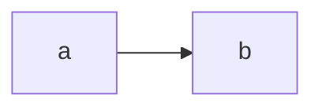

# TEST-0001: Anchors and alerts

See [Section two](#section-two) and [the sub-heading](#a-sub-heading-with-code) below.

> [!NOTE]
> A note alert with `code` and **strong**.

> [!WARNING]
> A warning alert.

## Section one

Text with a link to [DESIGN-0019](docs/design/0019-runbook-a-sixth-built-in-document-type-disabled-by-default.md#1-the-problem) in the pushed set.

## Section two

### A sub-heading with `code`

- [ ] an open task
- [x] a done task

## Wide table

| Date | PR | Commit | Verified by | Notes |
| --- | --- | --- | --- | --- |
| 2026-10-05 | [#149](https://github.com/donaldgifford/docz/pull/149) | `989c773` | Donald Gifford | A five-column row with enough text in the last cell that the table has to be wider than Confluence's default content column to show it on one line without wrapping every cell. |
