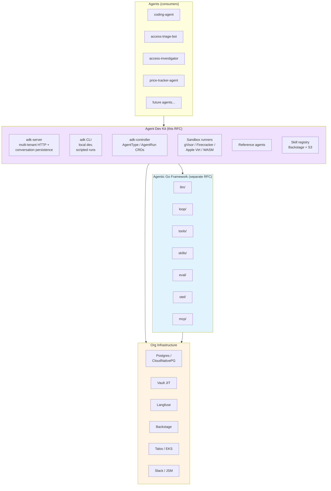

<!-- markdownlint-disable-file MD025 MD041 -->

# RFC 0001: Agent Dev Kit on the Agentic Go Framework

**Status:** Draft **Author:** Donald Gifford **Date:** 2026-05-10

<!--toc:start-->

- [Summary](#summary)
- [Problem Statement](#problem-statement)
- [Proposed Solution](#proposed-solution)
- [Design](#design)
  - [Layered architecture](#layered-architecture)
  - [Component design](#component-design)
    - [adk-server](#adk-server)
    - [adk CLI](#adk-cli)
    - [adk-controller](#adk-controller)
    - [Sandbox runners](#sandbox-runners)
    - [Reference agents](#reference-agents)
    - [Skill registry](#skill-registry)
  - [Comparison to shelley](#comparison-to-shelley)
  - [Multi-tenant data model](#multi-tenant-data-model)
- [Alternatives Considered](#alternatives-considered)
- [Implementation Phases](#implementation-phases)
  - [Phase 0 — Prerequisites](#phase-0--prerequisites)
  - [Phase 1 — adk-server + CLI + reference agent (single-tenant, no controller)](#phase-1--adk-server--cli--reference-agent-single-tenant-no-controller)
  - [Phase 2 — multi-tenant + adk-controller](#phase-2--multi-tenant--adk-controller)
  - [Phase 3 — sandbox runners](#phase-3--sandbox-runners)
  - [Phase 4 — skill registry v2 + ecosystem](#phase-4--skill-registry-v2--ecosystem)
- [Risks and Mitigations](#risks-and-mitigations)
- [Success Criteria](#success-criteria)
- [References](#references)
<!--toc:end-->

<!--docz:summary:start-->
## Summary

Build an **Agent Dev Kit (ADK)** on top of the agentic Go framework — the
opinionated, batteries-included product layer that turns the framework (a
library) into a complete development and operations environment for agents.
Where the framework provides primitives (provider abstraction, `Tool` shape,
loop, skills, eval, OTel/Langfuse), the ADK provides a server, CLI, persistence
layer, sandbox runners, reference agent implementations, and a multi-tenant
operational story. Inspired by `boldsoftware/shelley` and its predecessor
`sketch.dev` but designed for the org's stack: multi-tenant, Postgres /
CloudNativePG, Vault JIT, Backstage, Talos / EKS, and the existing agent
platform's AgentType/AgentRun CRDs.

This RFC depends on the [agentic Go framework RFC](#references) landing first;
the ADK is a layer on top, not a replacement.

> **Update (2026-07-02,
> [ADR-0003](../adr/0003-develop-sdk-harness-and-adk-layers-in-one-repo-defer-repo-split.md)):**
> the ADK no longer targets its own repository. Components land in
> `sdk-booty-sh`, layered above the framework packages and structured for later
> extraction only if a real split trigger fires. References to "the ADK repo" in
> this document should be read as this repo. The local-dev runner slice
> (`adk run`) was pulled forward by
> [DESIGN-0002](../design/0002-doc-driven-agent-loop-harness-v1-design.md) as
> the doc-driven loop harness (`dloop`); the "framework churn breaking the ADK"
> risk below is largely dissolved by co-location.
<!--docz:summary:end-->

<!--docz:problem:start-->
## Problem Statement

The agentic Go framework will give us a clean library for building agents. It
will not give us:

- A multi-tenant HTTP server with conversation persistence and per- tenant auth
- A CLI for local agent development, ad-hoc runs, and scripted invocations
- A Kubernetes deployment story (already designed separately as the agent
  platform's AgentType/AgentRun CRDs — but the controller needs to be wired to
  actually launch framework-built agents)
- Sandbox runners for code-executing agents (covered by a separate sandbox INV;
  the ADK is what consumes its conclusions)
- Reference implementations of the patterns we expect agent authors to follow
- A way to share skills across agents and teams
- A persistence layer that fits org infrastructure (Postgres, not SQLite;
  multi-tenant, not single-user)

Without these, every agent we build (triage bot, access investigator, price
tracker, future ones) will reimplement the operational layer slightly
differently. We've already seen this start to happen — the price tracker has its
own LLM client wiring; the triage bot RFC sketches its own thread persistence;
the access investigator will sketch its own Slack/JSM/EventBridge plumbing.
Without an ADK, each of these grows its own divergent server, persistence,
deploy, and observability story. With an ADK, they all build on the same product
layer and only the agent-specific logic differs.

The framework alone is necessary but not sufficient.
<!--docz:problem:end-->

<!--docz:proposal:start-->
## Proposed Solution

The ADK is six components, each built on the agentic framework:

1. **`adk-server`** — HTTP server with conversation persistence, multi-tenant
   auth, agent run dispatch, and optional SSE/WebSocket streaming for
   chat-shaped UIs. Replaces the bespoke server each agent would otherwise
   build.
2. **`adk` CLI** — local-dev driver, scripted run interface, agent authoring
   helpers (`adk new agent`, `adk run`, `adk skills list`). Replaces the bespoke
   CLI each agent author would otherwise build.
3. **`adk-controller`** — Kubernetes operator implementing the `AgentType` /
   `AgentRun` CRDs already designed in the agent platform DESIGN suite.
   Translates CRDs into framework-built agent processes inside harness
   containers, with Vault JIT credentials injected per-run.
4. **Sandbox runners** — pluggable per the sandbox INV's conclusions. The ADK
   ships opinionated defaults (gVisor for in-cluster moderate isolation,
   Firecracker for high-isolation execution, Apple Virtualization framework for
   Mac dev) and exposes the `SandboxRunner` interface for users to plug their
   own.
5. **Reference agents** — at least three:
   - **`coding-agent`** (shelley-equivalent: bash, patch, search, think tools;
     the "agentic coding assistant" pattern)
   - **`access-triage-bot`** (the Slack triage bot from the sibling RFC)
   - **`price-tracker-agent`** (the existing tracker, ported onto the ADK as a
     validation that the kit handles non-chat-shaped agents)
6. **Skill registry** — internal store for sharing skills across agents and
   teams. Skills are versioned, signable, and discoverable. Backed by Backstage
   catalog metadata; storage in object storage (Garage S3 in homelab, S3 in
   prod).

Optional but probably-skipped: **a minimal UI**. Shelley ships its own React UI;
we should not. We already have Slack as the primary chat surface, Backstage as
the developer portal, and JSM as the ticket workflow. A bespoke ADK UI would
compete with all three. The ADK ships an OpenAPI/SSE surface that existing UIs
(Slack, Backstage plugins, internal portals) can consume; building "yet another
chat UI" is out of scope.
<!--docz:proposal:end-->

## Design

### Layered architecture



The framework is the library. The ADK is the kit. Agents are the consumers.
Infrastructure is what everything runs on.

### Component design

#### adk-server

HTTP server with these responsibilities:

- **Auth** — OIDC / SSO via Okta. Multi-tenant: every request is scoped to a
  tenant (a team, a service principal, or a CI runner). Tenant determines which
  agent types are runnable, which skills are visible, and which Vault paths are
  reachable.
- **Conversation persistence** — Postgres-backed. Schema accommodates the
  framework's `Conversation` / `Message` model with multi-tenant attribution and
  full audit (who ran what when, what tools fired, what budgets were consumed).
- **Agent run dispatch** — receives a "run agent X with input Y" request,
  validates against tenant permissions, enqueues to River (existing convention),
  returns a run ID.
- **Streaming surface** — SSE (and optionally WebSocket) for consumers that want
  token-by-token streaming. Slack adapter, for example, doesn't need streaming;
  an interactive Backstage plugin might.
- **OpenAPI surface** — generated from Go types; consumers (Slack bot, Backstage
  plugin, CLI) use the generated client.

#### adk CLI

Distributed as a single Go binary (homebrew tap, plus direct download for
Linux). Subcommands:

- `adk new agent <name>` — scaffolds a new agent project (skeleton with
  framework imports, example tool, example skill, OTel wiring, Dockerfile)
- `adk run <agent> [--input <file>]` — runs an agent locally, optionally with
  sandbox isolation (defaults from the OS — Apple Virtualization on Mac,
  rootless Podman on Linux dev)
- `adk skills list / show / install` — interacts with the skill registry
- `adk eval <agent> --dataset <file>` — runs the framework's eval harness
  against a ground-truth dataset; gateable in CI
- `adk auth login` — Okta SSO flow for the developer; tokens stored via
  1Password CLI integration (existing convention)

#### adk-controller

Implements the `AgentType` and `AgentRun` CRDs already designed in the agent
platform DESIGN suite. Per-run lifecycle:

1. `AgentRun` resource is created (by webhookd, River job, or another controller
   — e.g., the triage bot Slack adapter)
2. Controller resolves the `AgentType` (the agent image + runtime config),
   allocates a harness Pod, mounts framework runtime, injects skills from the
   registry
3. Controller requests Vault JIT credentials scoped to the run's declared
   resource needs (per the agent platform's secret model)
4. Harness Pod runs the agent, streams events to adk-server via the internal API
   (Pod cannot reach Vault again; secrets are single-use)
5. On completion, controller updates the `AgentRun` status with results, costs,
   errors; harness Pod terminates

The controller is thin — most of the lifecycle work is in the agent platform's
existing operator. The ADK extension is the part that knows how to materialize a
framework-built agent inside a harness container.

#### Sandbox runners

Per the sandbox INV (sibling doc), the framework defines a `SandboxRunner`
interface:

```go
type SandboxRunner interface {
    Name() string
    Capabilities() Capabilities  // filesystem, network, exec, gpu
    Run(ctx context.Context, spec ExecSpec) (Result, error)
}
```

The ADK ships opinionated default implementations:

- **`gvisor`** — for in-cluster moderate-isolation execution (most agent
  code-execution workloads in Kubernetes)
- **`firecracker`** — for high-isolation in-cluster execution (untrusted code,
  PR-review agents); via `firecracker-go-sdk`
- **`apple-virt`** — for Mac developer workflows; via `Code-Hex/vz/v3`
- **`podman-rootless`** — for Linux dev / homelab fast iteration
- **`wasm-wasmtime`** — for tools that compile to WebAssembly

Agent authors choose a runner via config; ADK validates the runner is available
on the host and degrades gracefully (with a logged warning) when not.

#### Reference agents

Three reference implementations, each living under `examples/` in the ADK repo:

**`coding-agent`** — the shelley-equivalent. Tools: `bash`, `patch`, `search`,
`think`, `todo`. Demonstrates the pattern for agents that modify a working tree.
Used internally for code-modifying tasks (the agent that drafts Renovate config
updates, the one that proposes docz template fixes, etc.). Sandboxed via gVisor
or Firecracker per deployment context.

**`access-triage-bot`** — the Slack triage bot from the sibling RFC.
Demonstrates a chat-shaped, multi-turn, identity-aware agent. No code execution;
sandbox unused.

**`price-tracker-agent`** — port of the existing server price tracker.
Demonstrates a non-chat-shaped, scheduled, batch-processing agent. Validates
that the ADK isn't accidentally biased toward chat-only patterns.

These three together cover the major shapes (chat, batch, code-mod) and serve as
the "follow this example" answer for new agent authors.

#### Skill registry

Skills are discoverable across the org. Each skill has:

- A `Skill` interface implementation (markdown-fronted by default per the
  framework's Q4 resolution)
- A semantic version
- A signature (sigstore-backed, via `cosign` — fits the existing homelab
  security stack)
- Backstage catalog metadata (owner team, stability tier, documentation link)
- Bundled assets in object storage (Garage S3 homelab, S3 prod)

The `adk skills` CLI subcommands talk to the registry. Skills can be marked
tenant-scoped (only this team's agents can use it) or global. The registry is
read-through-cached at the harness pod startup.

### Comparison to shelley

| Aspect                     | Shelley                    | ADK                                                 |
| -------------------------- | -------------------------- | --------------------------------------------------- |
| **Tenant model**           | Single-user                | Multi-tenant from day 1                             |
| **Persistence**            | SQLite + sqlc              | Postgres / CloudNativePG                            |
| **UI**                     | Bundled React app          | None — consumers (Slack, Backstage) bring their own |
| **Distribution**           | Homebrew + binary          | Homebrew + binary + container image + K8s operator  |
| **Auth**                   | None (local-only)          | Okta OIDC, multi-tenant                             |
| **Backends**               | Anthropic-focused          | Anthropic + OpenAI-compat + Ollama                  |
| **Observability**          | Internal SSE traces        | Langfuse + OTel native                              |
| **Sandboxing**             | None (runs on host)        | Pluggable; opinionated defaults                     |
| **Skill model**            | Skills package             | Markdown-first via framework's `Skill` interface    |
| **Coding-agent specifics** | First-class (`claudetool`) | One reference agent among several                   |
| **Deployment target**      | Developer laptop           | Laptop + K8s + harness container                    |
| **Secrets**                | Env vars / config          | Vault JIT per-run                                   |
| **Queue**                  | Inline                     | River (Postgres-native)                             |

The shape rhymes; the choices diverge wherever shelley's product context
(single-user, laptop, coding-only) differs from ours (multi-tenant, prod + dev,
any agent shape).

### Multi-tenant data model

Schema sketch (Postgres, managed via existing tooling — sqlc or sqlx with
golang-migrate, TBD):

- `tenants` — id, name, created_at, parent_tenant_id (for team hierarchies)
- `agent_types` — id, tenant_id, name, version, image, runtime_config (the type
  definition; mirrors the K8s `AgentType` CRD)
- `agent_runs` — id, agent_type_id, tenant_id, principal (the identity that
  started the run), status, started_at, completed_at, budget, consumed
- `conversations` — id, agent_run_id, tenant_id, started_at
- `messages` — id, conversation_id, role, content, tool_calls, tool_results,
  tokens_in, tokens_out, model, cost_usd, created_at
- `skills` — id, name, version, signature, owner_tenant, scope (global /
  tenant), bundle_uri
- `audit_log` — id, tenant_id, principal, event, target, metadata, created_at
  (every action — start run, fetch skill, decode auth message — gets a row)

Foreign keys enforced. RLS policies (Postgres row-level security) enforce tenant
isolation at the database layer, not just the application.

<!--docz:alternatives:start-->
## Alternatives Considered

**Just ship the framework, no kit.** Each agent team builds their own server,
persistence, CLI, deployment, sandbox, and observability wiring. Fastest path
for the framework itself, slowest path for every downstream consumer. We've
already seen the divergence start; without an ADK, it accelerates. Rejected —
the framework alone is insufficient and the cost of "everyone reimplements" is
paid in perpetuity.

**Adopt shelley wholesale.** Take shelley's full repo, swap our provider
abstraction in, fix the multi-tenant story, replace SQLite with Postgres, drop
the React UI. By the time we're done, we've forked shelley and inherited its
design choices for everything we didn't deliberately change. Rejected — the
surgery is bigger than building our own kit on top of our framework, and
shelley's design choices are right for shelley's product, not ours.

**Build only the operator, no server / CLI.** The agent platform already has the
operator design; arguably the rest is unnecessary ceremony. Rejected — local
development without the CLI is painful (every iteration requires a K8s
round-trip), and the server is needed for any chat-shaped or interactive
consumer (Slack, Backstage, even just `curl`-based debugging).

**Build only server + CLI, no operator.** Skip the K8s integration; agents run
as long-lived processes managed by something else (systemd, nomad, just a
daemon). Rejected — the agent platform's CRD-driven model is already designed
and gives us per-run Vault JIT, harness isolation, and the right ops story.
Skipping the controller throws away that work.

**Bundle a UI.** Shelley does. We'd be reinventing Slack, Backstage, and JSM in
worse versions of each. Rejected — ADK exposes an OpenAPI surface; consumers
bring their own UI. The triage bot uses Slack; the access investigator uses JSM
tickets and Slack threads; future agents can have Backstage plugins. None of
these benefit from a bespoke ADK UI.

**Make the ADK a single monolithic binary.** Server, CLI, controller, runners
all in one. Easier to release. Rejected — the controller is a long-lived
Kubernetes process, the server is a long-lived HTTP process, the CLI is a
short-lived dev tool, the runners are per-execution processes. Different
lifecycles, different permissions, different failure domains. Splitting them is
the right call; sharing the framework gives us the consistency that matters.
<!--docz:alternatives:end-->

## Implementation Phases

### Phase 0 — Prerequisites

The framework RFC must land first. The ADK is a layer on top; without the
framework's `Tool` shape, `Skill` interface, `Loop` driver, and provider
abstraction, the ADK has no foundation.

The sandbox INV must conclude before Phase 3 starts; until then, the ADK's
`SandboxRunner` interface is sketched but not wired.

### Phase 1 — adk-server + CLI + reference agent (single-tenant, no controller)

**Goal:** End-to-end "run an agent locally and via HTTP" with conversation
persistence, but without the K8s deployment story or multi-tenant auth.
Validates the core surface.

- `adk-server` HTTP API (single-tenant; auth = single shared token)
- Postgres persistence (single schema, tenant column unused)
- `adk` CLI: `new agent`, `run`, `auth login`
- Reference agent: `access-triage-bot` (the simplest of the three; proves
  chat-shaped flow and identity resolution)
- OTel/Langfuse wired through

**Exit criteria:** triage bot runs end-to-end via the ADK with the same UX as it
would standalone; nothing about the bot's code knows "I'm running on the ADK"
beyond the framework imports.

### Phase 2 — multi-tenant + adk-controller

**Goal:** Production-ready multi-tenant deployment.

- Okta OIDC auth on the server
- Tenant-scoped data model (RLS policies)
- `adk-controller` implementing `AgentType` / `AgentRun` CRDs
- Vault JIT integration per-run (existing agent-platform pattern)
- River queue for agent run dispatch
- Skill registry v1 (read-only, manually populated)
- Second reference agent: `price-tracker-agent` (validates non-chat shape)

**Exit criteria:** triage bot and price tracker both deployed via CRDs in
homelab; tenant isolation verified via security review.

### Phase 3 — sandbox runners

**Goal:** Code-executing agents work safely.

- `SandboxRunner` interface in the framework (covered there, finalized here)
- Default implementations: `gvisor`, `firecracker`, `apple-virt`,
  `podman-rootless`, `wasm-wasmtime`
- Third reference agent: `coding-agent` (validates code-execution flow)
- Sandbox runner selection per `AgentType` config

**Exit criteria:** coding-agent runs in a Firecracker microVM in homelab; same
agent runs in Apple Virtualization on Mac dev with identical behavior modulo
platform-specific paths.

### Phase 4 — skill registry v2 + ecosystem

**Goal:** Skills become first-class shareable artifacts.

- Skill registry: write API, sigstore signing, Backstage metadata
- `adk skills install` resolves and verifies signatures
- Documentation site (under docz wiki / Backstage TechDocs)
- Migration: pull ad-hoc skills out of agent repos into the registry

**Exit criteria:** ≥ 10 shared skills in the registry; skills versioned and
signed; agent authors discover skills via Backstage.

<!--docz:risks:start-->
## Risks and Mitigations

| Risk                                                       | Impact                                   | Likelihood                  | Mitigation                                                                                                                                   |
| ---------------------------------------------------------- | ---------------------------------------- | --------------------------- | -------------------------------------------------------------------------------------------------------------------------------------------- |
| Scope creep — ADK becomes a shelley clone with extra steps | High — wasted effort, no differentiation | Medium                      | Stay disciplined: ADK is the org-fit layer, not a coding-agent product. Reference agents are reference, not the focus                        |
| Multi-tenant security mistake (cross-tenant data leak)     | Critical — privacy / compliance          | Low with RLS                | Postgres RLS at the schema layer; security review before each tenant-touching change; integration tests that explicitly try to cross tenants |
| Framework churn breaking the ADK                           | Medium — stop-the-world refactors        | Medium until framework v1.0 | ADK pins to framework versions; framework follows semver; ADK's CI runs against framework HEAD nightly to catch breakage early               |
| Becoming the bottleneck for new agents                     | High — slows down agent dev              | Medium                      | Reference agents must be runnable without ADK changes; framework + bring-your-own-server is always a supported escape hatch                  |
| Vault JIT integration complexity                           | Medium — secret-management bugs          | Medium                      | Reuse the agent platform's existing pattern verbatim; no new secret model in the ADK                                                         |
| K8s controller bugs orphan harness pods                    | Medium — resource leak                   | Medium                      | Owner references; finalizers; periodic reconciliation; existing operator patterns from the homelab                                           |
| Reference agents diverge from production agents            | Medium — examples become stale           | High over time              | Reference agents are the actual production agents (triage bot is shipped from the example dir); no parallel "demo" implementations           |
| Skill registry signing key compromise                      | High — supply-chain attack on agents     | Low                         | Sigstore + transparency log; key rotation runbook; audit log of every skill resolution                                                       |
| ADK ships before framework hits v1 stability               | Medium — public surface churn            | High in early phases        | ADK v0.x explicitly experimental; no public API guarantees until framework v1                                                                |
<!--docz:risks:end-->

<!--docz:criteria:start-->
## Success Criteria

**Phase 1:**

- Triage bot runs identically on the ADK and standalone (modulo config); the
  agent code is unaware of the deployment context
- Time from `adk new agent` to a running first iteration: < 10 minutes for a
  developer who has never touched the ADK before

**Phase 2:**

- Tenant isolation verified by security review (RLS, audit log, JIT scope
  verification)
- Triage bot and price tracker both deployed via CRDs in homelab cluster,
  observable in Langfuse, with cost attribution by tenant

**Phase 3:**

- Coding agent runs in Firecracker microVM (production-shape) and Apple
  Virtualization (dev-shape) with identical observable behavior on a fixed test
  input

**Phase 4:**

- ≥ 10 versioned, signed skills in the registry
- ≥ 3 production agents on the ADK (triage, investigator, tracker port, plus any
  new ones since)
- Time-to-first-prototype for a new agent author: < 1 day for chat- shaped, < 2
  days for code-execution-shaped

**Org-level outcomes:**

- Every new agent built in the org uses the ADK by default; building outside the
  ADK requires a justification doc
- Time to deploy a new agent to production: days, not weeks
- Single source of truth for agent observability, cost attribution, and audit
  (Langfuse + Postgres audit log)
<!--docz:criteria:end-->

<!--docz:references:start-->
## References

- Forthcoming: Agentic Go Framework RFC (sibling, the foundation this RFC layers
  on top of)
- Forthcoming: Sandbox Options INV (sibling, conclusions feed Phase 3 defaults)
- Forthcoming: AWS Access Triage Slack Bot RFC (sibling; first reference agent)
- Internal: Agent platform RFC + DESIGN suite (AgentType / AgentRun CRDs,
  harness containers, Vault JIT, River queue)
- Internal: Backstage IDP catalog (skill registry metadata source)
- External: [boldsoftware/shelley](https://github.com/boldsoftware/shelley) —
  primary inspiration, with the divergences documented in the comparison table
- External: [boldsoftware/sketch](https://github.com/boldsoftware/sketch) —
  shelley's predecessor; the Sketch coding-agent product
- External: [Code-Hex/vz](https://github.com/Code-Hex/vz) — Apple Virtualization
  framework Go binding (Phase 3 dependency)
- External:
  [firecracker-go-sdk](https://github.com/firecracker-microvm/firecracker-go-sdk)
  — Firecracker Go SDK (Phase 3 dependency)
- External: Postgres RLS documentation — for tenant isolation patterns
<!--docz:references:end-->
