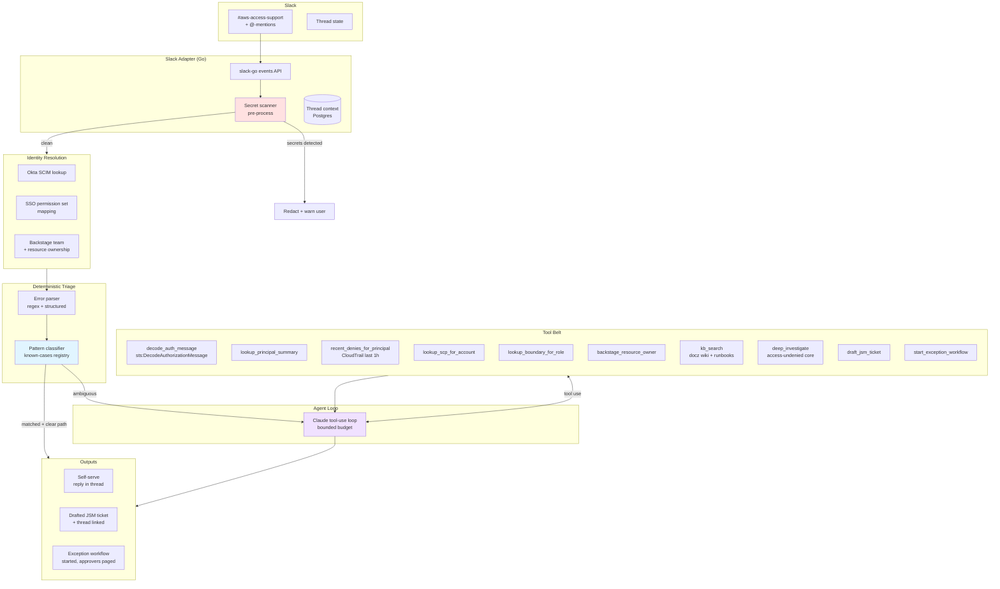

<!-- markdownlint-disable-file MD025 MD041 -->

# RFC 0002: AWS Access Triage Slack Bot

**Status:** Draft **Author:** Donald Gifford **Date:** 2026-05-10

<!--toc:start-->

- [Summary](#summary)
- [Problem Statement](#problem-statement)
- [Proposed Solution](#proposed-solution)
- [Design](#design)
  - [Architecture](#architecture)
  - [Conversation flow](#conversation-flow)
  - [Identity resolution](#identity-resolution)
  - [Pattern classifier (Phase 1 coverage)](#pattern-classifier-phase-1-coverage)
  - [Agent loop and tool belt](#agent-loop-and-tool-belt)
  - [Three outcome paths](#three-outcome-paths)
  - [Persistence and audit](#persistence-and-audit)
  - [Privacy and safety controls](#privacy-and-safety-controls)
- [Alternatives Considered](#alternatives-considered)
- [Implementation Phases](#implementation-phases)
  - [Phase 1: Deterministic core (no LLM)](#phase-1-deterministic-core-no-llm)
  - [Phase 2: Agent loop](#phase-2-agent-loop)
  - [Phase 3: Deep investigation tool](#phase-3-deep-investigation-tool)
  - [Phase 4: Exception workflow integration](#phase-4-exception-workflow-integration)
- [Risks and Mitigations](#risks-and-mitigations)
- [Success Criteria](#success-criteria)
- [References](#references)
<!--toc:end-->

<!--docz:summary:start-->
## Summary

Stand up a Slack bot in `#aws-access-support` that triages AWS access errors
pasted by developers, resolves their identity context (Slack → Okta → AWS roles
via SSO), and either provides self-serve guidance, files a routed JSM ticket
with full context, or initiates an exception process for compliance-blocked
requests. The bot is **triage-only** — it never modifies IAM directly. It is
optimized for the long tail of operational errors (wrong profile, expired SSO,
wrong region, SCP blocks) that make up the bulk of access support volume, not
for the rare deep policy-chain analysis case.
<!--docz:summary:end-->

<!--docz:problem:start-->
## Problem Statement

The org has ~1,500 developers across 200+ AWS accounts authenticating via
Okta-federated SSO, with permissions enforced through a mix of permission sets,
identity-based policies, resource policies, permissions boundaries, and SCPs
from Control Tower. When a developer hits an `AccessDenied` or related error,
the current paths are:

1. Ask in `#aws-access-support` and wait for a human triager
2. File a JSM ticket and wait for the platform team
3. Try to self-diagnose against runbooks scattered across docz wikis, Backstage,
   and Confluence

Empirically, the majority of these issues are not policy-chain problems that
require deep IAM analysis. They are operational:

- Expired SSO session
- Wrong AWS profile selected for the target account
- Wrong region (e.g., resource is in `us-east-2`, request hit `us-east-1`)
- Cross-account access where the user picked the wrong assumable role
- Action blocked by an SCP from Control Tower (Tier-2 OUs in particular)
- Action blocked by a permissions boundary on a developer-bootstrap role
- MFA-required action without an MFA-authenticated session
- Encoded authorization failure messages that haven't been decoded
- Resource genuinely doesn't exist (typo'd ARN, deleted resource)
- Service-linked role not yet created in the account

A handful of these patterns cover most of the support load. The pattern match
plus the user's identity context is enough to fully resolve the question for
most threads — without needing an LLM, IAM simulation, or human triager. The
remaining cases break down into:

- **Genuinely missing permission** — the user has the right permission set but a
  specific action is missing; they need a policy update
- **Wrong access path** — the user has another permission set or assumable role
  that already covers the action; they should use that instead
- **Exception required** — the action is intentionally blocked at the org level
  (SCP, boundary, framework), and granting it requires an exception process

In all three cases the bot's job is to **identify which path applies and route
correctly with full context attached**, not to grant access.

Today, that routing is done entirely by humans, and the routing decision is the
slowest part of the pipeline. A 1-minute self-serve answer becomes a 4-hour wait
for a human to read the same error and reach the same conclusion.
<!--docz:problem:end-->

<!--docz:proposal:start-->
## Proposed Solution

A Slack bot in `#aws-access-support` (and bot-allowed in any team channel on
@-mention) that:

1. **Detects access-error pastes** automatically via patterns, or responds to
   explicit `@aws-helper` mentions
2. **Parses the paste** with deterministic extractors to pull error code,
   service, API call, principal ARN, resource ARN, account, region, and any SCP
   / boundary / MFA indicators
3. **Resolves the developer's identity** (Slack user → Okta → AWS roles
   accessible via SSO + Backstage team ownership)
4. **Classifies against known patterns** (deterministic-first; ~70% of threads
   should match a known pattern and never invoke an LLM)
5. **Falls back to an agent loop** for ambiguous cases, with a bounded tool
   budget and structured tool I/O
6. **Routes to one of three outcomes**:
   - **Self-serve**: bot replies in-thread with the fix or runbook link
   - **Ticket with suggestion**: bot drafts a JSM ticket with the specific
     access change needed, routed to the right component, with this thread
     linked
   - **Exception process**: bot identifies the org-level block (SCP, boundary,
     framework) and starts the documented exception workflow with the right
     approver chain

The bot **never modifies IAM**, **never grants permission sets**, and **never
approves anything**. It is a fast, contextful triager that shortens the gap
between "developer is blocked" and "the right human is working on the right
ticket."
<!--docz:proposal:end-->

## Design

### Architecture

### Conversation flow

A typical thread proceeds as:

1. Developer pastes error or `@aws-helper` mentions with a question
2. Bot runs the secret scanner; if anything looks like a credential, replies
   with a redacted warning, instructs rotation, and stops
3. Bot resolves developer identity (cached per Slack user, refreshed hourly)
4. Bot runs the parser and classifier
5. If the classifier matches a known pattern with high confidence: bot posts the
   answer in-thread, optionally with a 👍 reaction action to take a follow-up
   step (file a ticket, etc.)
6. If ambiguous or no match: bot enters the agent loop with a 12-call tool
   budget and 60-second wall-clock budget
7. Agent emits a structured outcome: `SELF_SERVE`, `DRAFT_TICKET`,
   `START_EXCEPTION`, or `ESCALATE_TO_HUMAN`
8. Bot acts on the outcome (post message, draft ticket on user confirmation,
   page on-call)
9. Thread is persisted with the outcome, all tool calls, and the linked identity
   for audit and future evals

### Identity resolution

Identity is the feature that distinguishes this bot from a generic
LLM-with-AWS-docs helper. Resolution chain on every thread:

1. **Slack user → Okta identity**: Slack ID maps to Okta user via the existing
   Slack-Okta integration. Okta user has email, manager, department, and Okta
   group memberships
2. **Okta groups → SSO permission sets**: each Okta group maps to one or more
   permission sets in SSO, scoped to specific accounts. From this we know every
   (account, permission set) pair the developer can currently assume
3. **Slack user → Backstage team**: Backstage IDP catalog has team membership
   and resource ownership. From this we know which AWS accounts and resources
   the developer's team owns, vs. what they're trying to access
4. **Cache** the resolution result per Slack user with a 1-hour TTL, refreshed
   lazily

This context is attached to every tool call as structured metadata, not as
free-text in the model prompt. The agent loop never gets to decide who someone
is; it gets a typed `UserContext` and reasons over it.

### Pattern classifier (Phase 1 coverage)

The classifier runs deterministic pattern matchers in priority order. A match
short-circuits the pipeline and the bot replies without invoking the LLM.
Day-one patterns:

- **Expired SSO session**: error mentions `ExpiredToken`,
  `InvalidClientTokenId`, or
  `The security token included in the request is expired` → reply with the
  correct `aws sso login --profile X` command, where `X` comes from the user's
  SSO config
- **Wrong account**: account ID in error ARN ≠ account ID resolvable from the
  user's likely profile → suggest the correct profile from their SSO permission
  sets
- **Wrong region**: error mentions a region; resource ARN has a different region
  (or is in a global service the user wouldn't expect regional behavior on) →
  flag the mismatch
- **SCP explicit deny**: error message contains
  `with an explicit deny in a service control policy` → look up the SCP for the
  target account, identify the specific deny statement, name the SCP and the
  owning OU, route to the SCP exception process
- **Permissions boundary deny**: error message contains
  `with an explicit deny in a permissions boundary` → identify the boundary
  policy attached to the role, name the deny statement, route to the team that
  owns the bootstrap role
- **MFA required**: error message contains `MultiFactorAuthentication` or
  condition key `aws:MultiFactorAuthPresent` → guide to MFA- authenticated
  session
- **Encoded auth message**: response contains an
  `Encoded authorization failure message` → call
  `sts:DecodeAuthorizationMessage` server-side, re-classify against the decoded
  structured message
- **NoSuchEntity / NoSuchBucket / ResourceNotFound**: not actually an IAM
  problem; either typo or stale reference. Reply asking the user to verify the
  ARN, optionally check Backstage for the canonical name
- **Service-linked role missing**: specific error patterns per service (e.g.,
  `AWSServiceRoleFor*` not present) → guide to the one-time bootstrap

Each pattern is a Go struct implementing a `Pattern` interface with
`Match(ctx, ParsedError) (Verdict, bool)`. New patterns ship as code PRs with
tests, not as runtime config.

### Agent loop and tool belt

When the classifier doesn't match cleanly, the agent loop takes over. The loop
is bounded:

- Max 12 tool calls per thread
- 60-second total wall clock
- Structured tool I/O — every tool returns typed Go structs that are serialized
  to the model as JSON; no free-text tool returns
- All claims about specific SCPs, roles, policies, or owners must be grounded in
  a tool result; the model cannot assert specifics from general knowledge

The tool belt splits into three categories:

**Context-gathering (read-only, side-effect-free):**

- `decode_auth_message` — wraps `sts:DecodeAuthorizationMessage`
- `lookup_principal_summary` — IAM role summary, attached policies, boundary,
  recent assume-role activity
- `recent_denies_for_principal` — CloudTrail denies for this principal in the
  last hour, helps identify pattern of failed attempts
- `lookup_scp_for_account` — walks org tree, returns SCPs and the OU attachment
  chain
- `lookup_boundary_for_role` — fetches and parses the boundary policy
- `backstage_resource_owner` — given a resource ARN, returns the owning team and
  on-call rotation
- `kb_search` — hybrid keyword + vector search over docz wiki and runbooks

**Deep analysis (heavy, only for residual cases):**

- `deep_investigate` — calls the access-undenied-aws Go port (separate RFC); the
  deterministic policy walker. Only invoked when other tools haven't produced a
  clear cause and the case looks like an actual policy-chain problem, which
  empirically is the minority of cases

**Action (gated, never modifies IAM):**

- `draft_jsm_ticket` — creates a draft JSM ticket with the thread linked, the
  user's context attached, and a specific suggestion (which permission set,
  which policy statement, etc.). Requires user confirmation (👍 reaction) before
  submission
- `start_exception_workflow` — files the exception workflow ticket with the
  framework owner team for SCP / boundary / framework blocks

### Three outcome paths

Every thread terminates in one of:

1. **Self-serve resolution** — bot's reply in-thread is the answer. User
   unblocks themselves. Bot reacts ✅ on the user's first confirmation message,
   or auto-closes after 24h of inactivity
2. **Drafted ticket with suggestion** — bot identified that the user needs an
   access change, knows which one, and drafts the JSM ticket with the specific
   permission set or policy change needed. The ticket is created on user 👍,
   routed to the right component, with the Slack thread linked as evidence
3. **Exception process** — bot identified an org-level block. The exception
   workflow ticket is filed with the framework owner team (e.g., platform-aws
   for SCP exceptions, security for boundary exceptions), with the original
   error, the specific SCP/boundary statement, and the user's identity context
   attached

### Persistence and audit

Every thread persists to Postgres with:

- Slack thread ID, channel ID, parent message ID
- Resolved Okta identity at the time of the thread
- Parsed error structure
- All tool calls (name, input, output, latency, cost)
- All model invocations (prompt, response, tokens, cost)
- Final outcome and any tickets / actions filed
- User reactions (acceptance signal for evals)

This data feeds Langfuse traces for evals and future fine-tuning, and provides a
full audit trail when security needs to review what the bot did or didn't say.

### Privacy and safety controls

- **Secret scanner** runs on every paste before any other processing. Detects
  AWS access keys, session tokens, JWTs, and common credential formats. On
  detection: the original message is logged only with the secret redacted, the
  user is warned in-thread, and rotation instructions are linked. The bot stops
  processing that paste
- **Identity-aware filtering** on every tool result. The bot will not surface
  details about resources, principals, or accounts the asking developer is not
  entitled to know about. A junior dev asking about an unrelated production
  account gets "I can't share details about that account; ask your team lead"
- **Prompt injection resistance**: pasted content is treated as untrusted user
  input. It is provided to the model as tool-result data with structural
  separation, never appended to the system prompt
- **No live IAM modification** under any circumstance, regardless of what the
  user asks for or the error suggests. Action paths produce drafted tickets and
  exception workflows only
- **Per-channel allowlist**: bot only operates in `#aws-access-support` and
  channels that have explicitly opted in via a slash command, to prevent
  accidental cross-team data exposure

<!--docz:alternatives:start-->
## Alternatives Considered

**Generic LLM-with-AWS-docs helper bot.** Off-the-shelf chatbots can explain
what `s3:CreateBucket` does in the abstract. They can't tell a developer that
the SCP `DenyS3BucketCreationOutsideApprovedAccounts` on OU `Tier2-Apps` is
what's blocking them, that the bucket they want already has an owner in
Backstage, or that the JSM ticket should be routed to `PLATFORM-AWS` with tag
`scp-exception`. The org-context integration is the value; a generic helper has
none of it. Rejected as insufficient.

**Pure deterministic rule engine, no LLM.** Considered. Phase 1 of this RFC is
essentially this — and Phase 1 alone probably handles 60-70% of threads. The
reason to allow an agent loop in later phases is the long tail of cases where
multiple patterns partially match, where the right answer requires correlation
across CloudTrail history and identity context, or where the error is genuinely
novel. A pure rule engine handles the bulk efficiently but degrades to "I don't
know, paging human" on too many threads. Phased approach (rules first, agent
later) gets the best of both.

**Live IAM modification from chat.** A 👍 reaction on the bot's suggestion could
in principle trigger the actual permission change via the access provisioning
system. Rejected on security grounds: a compromised Slack session would become a
permission-escalation path, the audit trail is muddier than a JSM ticket, and
the principle of "chat is not a control plane for production IAM" is
non-negotiable. The bot drafts; humans approve through normal review.

**Build into the existing JSM bot.** Considered. JSM has a Slack integration for
ticket creation but isn't conversational, doesn't do real-time error parsing,
and doesn't have the identity-resolution layer. Treating this as a JSM-bot
extension would tightly couple us to JSM's product roadmap and constrain us to
ticket-shaped interactions. The right model is "this bot files JSM tickets when
appropriate" not "this bot is a JSM frontend."

**Use the access-undenied-aws Python tool directly.** The upstream tool is
event-stream oriented (CloudTrail events as input), not conversational, and runs
synchronously per event. A Slack-driven triage flow has different shape
(multi-turn, identity-aware, escalation-routed). The Go port of
access-undenied-aws is a tool the bot can invoke (`deep_investigate`), not the
bot itself.
<!--docz:alternatives:end-->

## Implementation Phases

### Phase 1: Deterministic core (no LLM)

**Goal:** Working bot that handles the 60-70% of threads matchable by known
patterns, ships fast, builds usage data for later phases.

- Slack adapter (slack-go events API, thread-aware)
- Secret scanner (existing libs: trufflehog patterns or gitleaks)
- Error parser (regex + structured field extraction)
- Identity resolver (Okta SCIM, SSO config, Backstage)
- Pattern classifier with the eight day-one patterns
- Self-serve replies and JSM ticket drafting (manual confirmation)
- Postgres persistence
- OTel tracing to Langfuse

**Exit criteria:** ≥50% of `#aws-access-support` threads resolved self-serve in
<60 seconds; zero secret leaks in audit; pattern false- positive rate <5%.

### Phase 2: Agent loop

**Goal:** Handle the residual cases that don't match a clean pattern.

- Agent loop with 12-call tool budget
- Context-gathering tool belt (decode, principal summary, CloudTrail
  correlation, SCP lookup, boundary lookup, Backstage)
- KB search over docz wiki and runbooks
- Structured outcome emission (`SELF_SERVE` / `DRAFT_TICKET` / `START_EXCEPTION`
  / `ESCALATE_TO_HUMAN`)
- Multi-turn conversation support (clarifying questions)

**Exit criteria:** ≥75% of threads resolved without human escalation; agent loop
cost per thread under $0.10 average; agent hallucination rate (asserting facts
not in tool results) <1%, measured via Langfuse evals.

### Phase 3: Deep investigation tool

**Goal:** Add the policy-chain analyzer (the Go port of access-undenied-aws —
separate RFC) as the `deep_investigate` tool.

- Wire the deterministic policy walker as a tool the agent can call
- Cross-account assume-role for `iam:SimulateCustomPolicy`
- Vault JIT credentials per-account (reuses agent platform infrastructure)

**Exit criteria:** Deep investigation invoked on <10% of threads, returns a
clear cause on >80% of those, and is the source of cited evidence in any
policy-change tickets the bot drafts.

### Phase 4: Exception workflow integration

**Goal:** Close the loop on framework-blocked requests.

- Exception workflow ticket templates per framework (SCP, boundary, Wiz
  framework, etc.)
- Direct integration with the JSM-orchestrated Okta group assignment workflow
  for permission-set escalations
- Auto-population of approver chain from the framework owner registry

**Exit criteria:** Median time from "blocked dev posts in Slack" to "correct
exception workflow ticket open with approver paged" <5 minutes.

<!--docz:risks:start-->
## Risks and Mitigations

| Risk                                      | Impact                                                 | Likelihood                     | Mitigation                                                                                                            |
| ----------------------------------------- | ------------------------------------------------------ | ------------------------------ | --------------------------------------------------------------------------------------------------------------------- |
| Hallucinated SCP / role / policy names    | High — incorrect routing, dev sent on wild goose chase | Medium without controls        | All specifics must come from tool results; structured tool I/O; periodic Langfuse evals on assertion-grounding        |
| Pasted secrets persisted in logs          | High — credential exposure                             | High without controls          | Secret scanner runs first; original paste never persisted; redacted version only                                      |
| Confident wrong answers eroding trust     | High — devs stop using the bot                         | Medium                         | Confidence thresholds, explicit "I'm not sure" path, escalate-to-human always one click away                          |
| Cross-tenant info leakage                 | High — privacy / compliance                            | Medium                         | Identity-aware filtering on every tool result; per-channel allowlist; audit trail                                     |
| Prompt injection via paste content        | Medium — bot misbehavior                               | High (hostile pastes are easy) | Pasted content as tool-result data only, never appended to system prompt; structural separation                       |
| LLM cost runaway under volume spike       | Medium — budget overrun                                | Medium                         | Phase 1 is LLM-free; Phase 2 has bounded tool budget; per-day cost cap with auto-degrade to deterministic-only        |
| Bot becomes critical path, fails noisily  | Medium — outages block support                         | Low                            | Bot is additive to existing human triage, not a replacement; graceful degradation to "post a message saying I'm down" |
| SCP / framework owner data goes stale     | Medium — wrong routing                                 | Medium                         | Owner registry sourced from Backstage catalog, single source of truth; periodic reconciliation                        |
| Devs use bot to probe other teams' access | Low — abuse                                            | Low                            | Identity-aware filtering, audit trail, channel allowlist                                                              |
<!--docz:risks:end-->

<!--docz:criteria:start-->
## Success Criteria

**Phase 1 (deterministic):**

- ≥50% of threads resolved self-serve in <60 seconds median
- Pattern false-positive rate <5%, measured via user follow-up ("that didn't fix
  it") signal
- Zero secret-leak incidents in monthly audit
- 100% of threads logged with linked identity for audit

**Phase 2 (agent loop):**

- ≥75% of threads resolved without human escalation
- Median time-to-first-useful-reply <10 seconds
- Agent loop cost per thread <$0.10 average
- Agent hallucination rate <1% on Langfuse evals (sample of 100/week)

**Phase 3 (deep investigation):**

- Deep investigation invoked on <10% of threads (the residual hard cases, not
  the bulk)
- Cited cause in ≥80% of policy-change tickets, traceable to the tool result

**Phase 4 (exception workflow):**

- Median time from blocked dev → correct exception ticket open with approver
  paged: <5 minutes
- ≥90% of exception tickets routed to the correct framework owner on first try

**Org-level outcomes:**

- 50% reduction in median time-to-resolve for AWS access tickets (baseline
  measured pre-rollout from JSM)
- Reduction in `#aws-access-support` human-triager hours per week (track via
  Slack analytics + on-call rotation surveys)
<!--docz:criteria:end-->

<!--docz:references:start-->
## References

- Upstream:
  [tenable/access-undenied-aws](https://github.com/tenable/access-undenied-aws)
  — Python policy-chain analyzer, source of inspiration for Phase 3's
  `deep_investigate` tool
- Related (forthcoming): RFC for the Go port of access-undenied-aws, which
  becomes the `deep_investigate` tool
- Related (forthcoming): RFC for the agentic Go framework / SDK that this bot
  will be built on (extracted from the server price tracker's interface-driven
  LLM client)
- Internal: Agent platform RFC + DESIGN suite (AgentType / AgentRun CRDs,
  harness containers, Vault JIT) — this bot is a candidate first consumer
- Internal: Wiz operator RFC + Backstage-to-Wiz sync — same identity / ownership
  data flows
- Internal: docz wiki (MkDocs) — KB search target for the `kb_search` tool
- AWS docs:
  [Service Control Policies](https://docs.aws.amazon.com/organizations/latest/userguide/orgs_manage_policies_scps.html),
  [Permissions Boundaries](https://docs.aws.amazon.com/IAM/latest/UserGuide/access_policies_boundaries.html),
  [DecodeAuthorizationMessage](https://docs.aws.amazon.com/STS/latest/APIReference/API_DecodeAuthorizationMessage.html)
<!--docz:references:end-->
