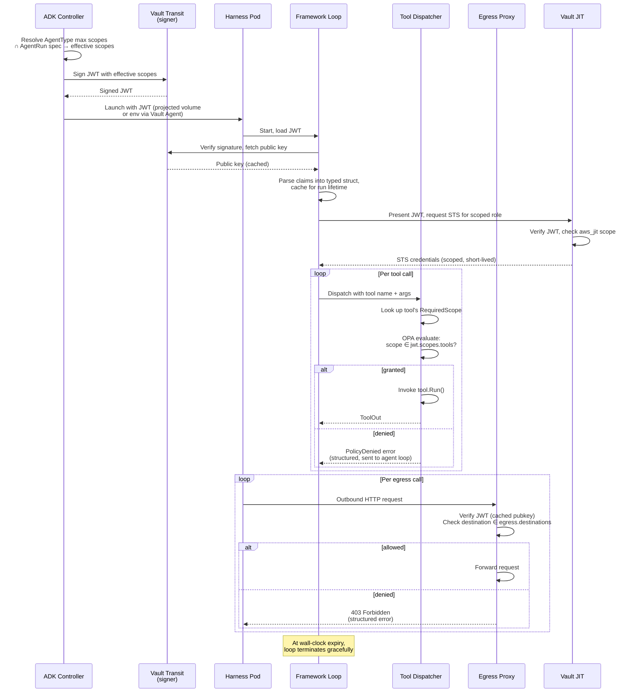

<!-- markdownlint-disable-file MD025 MD041 -->

# RFC 0003: Agent Capability Tokens

**Status:** Draft **Author:** Donald Gifford **Date:** 2026-05-10

<!--toc:start-->

- [Summary](#summary)
- [Problem Statement](#problem-statement)
- [Proposed Solution](#proposed-solution)
- [Design](#design)
  - [Token lifecycle](#token-lifecycle)
  - [JWT claim structure](#jwt-claim-structure)
  - [Enforcement points](#enforcement-points)
  - [Policy engine (OPA, embedded)](#policy-engine-opa-embedded)
  - [Scope vocabulary registry](#scope-vocabulary-registry)
  - [Key management](#key-management)
  - [Failure modes](#failure-modes)
- [Alternatives Considered](#alternatives-considered)
- [Implementation Phases](#implementation-phases)
  - [Phase 1 — Framework verify primitive + dispatcher hook](#phase-1--framework-verify-primitive--dispatcher-hook)
  - [Phase 2 — ADK controller as token issuer](#phase-2--adk-controller-as-token-issuer)
  - [Phase 3 — Egress proxy + FS mount enforcement](#phase-3--egress-proxy--fs-mount-enforcement)
  - [Phase 4 — Vault JIT integration](#phase-4--vault-jit-integration)
  - [Phase 5 — Scope vocabulary registry + tooling](#phase-5--scope-vocabulary-registry--tooling)
- [Risks and Mitigations](#risks-and-mitigations)
- [Success Criteria](#success-criteria)
- [References](#references)
<!--toc:end-->

## Summary

Introduce a **capability token** model — a controller-signed JWT issued at
AgentRun creation that establishes cryptographic provenance for the agent's
runtime environment and carries scoped claims for tool calls, network egress,
filesystem access, AWS JIT credentials, and budget limits. The framework's tool
dispatcher verifies the token once at agent startup, caches typed claims, and
evaluates each tool invocation against the claims via an embedded OPA policy
engine. Out-of-process enforcement points (network egress proxy, filesystem
mount setup, Vault JIT) verify the same token to gate non-Go-code-path access.
The model ties the previously orthogonal isolation, budget, and identity-aware-
filtering mechanisms into a single cryptographically grounded authorization
story without inventing new infrastructure.

## Problem Statement

The framework and ADK currently have three security mechanisms operating
independently:

1. **Sandbox isolation** (gVisor in v1; per the sandbox INV) prevents the agent
   from making syscalls outside its containment boundary
2. **Budget enforcement** (per framework INV Q9) prevents runaway token /
   tool-call / wall-clock consumption
3. **Identity-aware filtering** (per the triage bot RFC) prevents tools from
   surfacing cross-tenant data

These are real controls but they don't compose. Each has its own trust story,
its own bypass surface, and its own audit trail. As the tool inventory grows
(the AWS access investigator will add ~12 tools; the coding-agent reference adds
~6; ADK Phase 4 reference agents add more), the lack of a unified authorization
model becomes brittle in three specific ways:

- **No cryptographic provenance.** An agent inside its sandbox is just some Go
  process running with ambient permissions defined by its binary and config
  files. A tool receiving a call has no signed evidence that the call comes from
  a specific AgentRun authorized for specific scopes. Audit trails are
  reconstructive ("which agent ran this tool?") rather than verifiable ("this
  tool call was authorized by AgentRun X with scope Y at time Z, signature
  attached").

- **Trust in Vault JIT is implicit.** The agent-platform design issues per-run
  STS credentials via Vault. Vault has to verify something about the requester
  before issuing. Today that's implicit (IRSA, service-account JWT, ambient pod
  identity). Formalizing it — Vault verifies the agent capability JWT and issues
  STS scoped to the JWT's AWS-scope claims — removes the implicit-trust footgun
  and gives Vault a clean authorization boundary.

- **Retrofit cost grows with tool inventory.** Tools written without an
  authorization gate today will each grow their own ad-hoc auth shim later, or
  worse, not have one. By the time ADK Phase 4 ships, we'll have 30+ tools with
  inconsistent auth checks. Adding a single verification gate in the framework's
  dispatcher from day 1 means all tools — including ones we haven't written yet
  — are gated through one mechanism that they don't have to reason about.

A capability-token model addresses all three. The JWT is the signed provenance;
Vault's JWT auth backend formalizes the existing implicit trust; the framework's
dispatcher gate enforces uniformly across the tool inventory.

## Proposed Solution

A controller-issued, Vault-Transit-signed JWT carries the agent's identity,
provenance, and scoped permissions for the duration of an AgentRun. The JWT is:

- **Issued** by the ADK controller at AgentRun creation, after resolving the
  AgentType's maximum scopes intersected with the AgentRun spec
- **Signed** by Vault Transit (existing infrastructure, no new trust root) with
  a rotation-managed key
- **Verified once** at framework startup; typed claims are cached for the
  agent's lifetime
- **Bounded** by the agent's wall-clock budget plus a small buffer; no refresh
  path
- **Sandbox-bound** via a `provenance.sandbox_instance_id` claim that pins the
  token to a specific harness pod UID
- **Enforced** at five surfaces: tool dispatch (in-process), egress proxy
  (sidecar), filesystem mounts (harness pod setup), Vault JIT (Vault's JWT auth
  method), and the framework's budget loop

Policy evaluation uses OPA embedded as a Go library
(`github.com/open-policy-agent/opa/rego`), not the OPA daemon. Rego policies are
loaded once at framework startup and compiled. Per-call evaluation is
microsecond-scale on cached compiled queries.

See the sibling ADRs for the JWT-over-SPIFFE and OPA-over-Cedar decisions.

## Design

### Token lifecycle



### JWT claim structure

```json
{
  "iss": "adk-controller.platform.internal",
  "sub": "agentrun/01HXYZ...",
  "aud": ["adk-tools", "vault", "egress-proxy"],
  "exp": 1715212345,
  "iat": 1715212000,
  "jti": "01HXYZ...",

  "agent": {
    "type": "access-triage-bot",
    "type_version": "v1.4.2",
    "tenant": "platform-aws",
    "principal": "okta:donald.gifford@corp.io",
    "run_id": "01HXYZ..."
  },

  "provenance": {
    "sandbox_runtime": "gvisor",
    "sandbox_instance_id": "harness-pod-uid-abc123",
    "image_digest": "sha256:...",
    "controller_version": "v0.3.1",
    "framework_version": "v0.1.0"
  },

  "scopes": {
    "tools": [
      "aws.iam.simulate",
      "aws.cloudtrail.lookup_events",
      "aws.sts.decode_authorization_message",
      "kb.search",
      "backstage.resource_owner"
    ],
    "egress": {
      "mode": "allowlist",
      "destinations": [
        "sts.amazonaws.com",
        "iam.amazonaws.com",
        "cloudtrail.us-east-1.amazonaws.com",
        "internal.langfuse.corp"
      ]
    },
    "fs": {
      "read": ["/skills/", "/agent-input/"],
      "write": ["/agent-workspace/"],
      "quota_bytes": 524288000
    },
    "aws_jit": {
      "role_arn_pattern": "arn:aws:iam::*:role/access-triage-reader-*",
      "max_session_seconds": 900
    },
    "budget": {
      "max_tokens": 50000,
      "max_tool_calls": 12,
      "max_wallclock_seconds": 60
    }
  }
}
```

Claim notes:

- `aud` is multi-valued because the same token is verified by tools, Vault, and
  the egress proxy. Each enforcement point checks for its expected audience
  entry.
- `jti` is the unique token ID — equal to the AgentRun ID. Allows one-shot
  revocation if needed (Vault Transit doesn't natively revoke JWTs; we maintain
  a small Redis-backed revocation set with TTL = max token lifetime).
- `provenance.sandbox_instance_id` is set by the controller at pod creation;
  tools that want to verify "this token belongs to the pod it claims to be in"
  can check the local pod UID against this claim.
- `scopes.budget` is the signed, immutable upper bound. The framework's loop
  reads from here and enforces; OTel/Langfuse records actual consumption against
  the signed limits. Tampering with the in-memory loop budget doesn't help an
  attacker — the signed limit is the ceiling.
- All scope vocabulary entries (`aws.iam.simulate`, etc.) are registered in a
  central docz page (`docs/reference/scopes.md`) and lint-enforced in CI.

### Enforcement points

**1. Tool dispatch (in-process).** The framework's tool dispatcher is the gate.
Each `*llm.Tool` struct has a new optional field:

```go
type Tool struct {
    Name        string
    Description string
    InputSchema Schema
    RequiredScope string          // NEW: scope vocabulary entry
    Run         func(ctx context.Context, input json.RawMessage) ToolOut
}
```

If `RequiredScope` is empty, the tool is treated as `unscoped` — a denylist of
unscoped tools is maintained in the framework so adding new ones requires a code
change (no accidentally-unscoped tools). The dispatcher always runs:

```go
decision := policyEngine.Eval(ctx, EvalInput{
    Subject:        jwt.Agent,
    Action:         tool.RequiredScope,
    Resource:       call.ResourceContext,  // optional, tool-provided
    GrantedScopes:  jwt.Scopes.Tools,
})
if !decision.Allow {
    return ToolOut{}, PolicyDenied{
        Scope: tool.RequiredScope,
        Reason: decision.Reason,
    }
}
return tool.Run(ctx, call.Input)
```

`PolicyDenied` is a structured error returned to the agent loop. The agent
receives it as a tool result and can reason about it ("I tried to call X but the
policy denied; let me try Y instead"). Langfuse traces the denial with full
context.

**2. Egress proxy (sidecar).** A small Go proxy runs as a sidecar in the harness
pod. The agent's HTTP client is preconfigured (via environment variable /
config) to use `http://localhost:PROXY_PORT` as its proxy. The proxy:

- Receives the JWT once at startup (same projected volume as the framework)
- Verifies the signature
- On every outbound request, checks the destination host against
  `scopes.egress.destinations` (exact match or suffix match per a policy bit)
- For HTTPS, the proxy is a forward proxy (CONNECT) and does not MITM TLS —
  destination matching is on the CONNECT target hostname. No certificate
  injection, no per-pod CA trust pollution.
- Denied requests return 403 with a JSON error body containing the denied
  destination and the matching policy rule

Belt-and-braces: a `NetworkPolicy` on the harness pod denies all egress except
to the proxy port (or to a Kubernetes Service that points at it). gVisor's
networking namespace prevents bypass via raw sockets. The proxy is the single
egress point.

**3. Filesystem mounts (harness pod setup).** Set at pod creation by the
controller, not at runtime. The harness pod spec has:

- `scopes.fs.read` paths mounted read-only (ConfigMap, Secret, projected volume,
  or PV depending on content)
- `scopes.fs.write` paths mounted on an `emptyDir` with the quota enforced via
  `sizeLimit`
- Nothing else is mounted. The container's root filesystem is read-only
  (`securityContext.readOnlyRootFilesystem: true`)

This makes filesystem enforcement structural — there is no API by which the
agent can request more filesystem access mid-run. The token is consulted at pod
creation; after that, the kernel and the mount table enforce.

**4. Vault JIT.** Vault's JWT auth method is configured with the ADK
controller's signing key as the bound issuer. A Vault role binds to the
`agent.tenant` and `scopes.aws_jit.role_arn_pattern` claims; when an agent
presents the JWT to request AWS credentials, Vault:

- Verifies the JWT against the bound issuer
- Checks that the requested AWS role matches `scopes.aws_jit.role_arn_pattern`
- Issues STS credentials with TTL ≤ `scopes.aws_jit.max_session_seconds`

This replaces the existing implicit IRSA / projected-token pattern with
explicit, capability-token-driven STS issuance. No new infrastructure — the
existing Vault is the same Vault.

**5. Budget loop (framework).** The framework's loop reads `scopes.budget` at
startup and enforces the three dimensions (tokens, tool calls, wall-clock) per
Q9 of the framework INV. The signed budget claim is what makes the dual-layer
story complete: Langfuse records actual consumption (observability layer); the
loop blocks at the signed ceiling (enforcement layer); the ceiling itself is
signed by the controller, so tampering with the loop binary doesn't lift the
limit.

### Policy engine (OPA, embedded)

Per the sibling ADR (`ADR-NNNN: Use OPA for scope policy evaluation`), policies
are written in Rego and evaluated via `github.com/open-policy-agent/opa/rego`.
Loaded at framework startup, compiled once, evaluated per call.

Example policy:

```rego
package agent.capability

default allow = false

# A tool call is allowed if the tool's required scope is in the
# token's granted tool scopes.
allow {
    input.action == granted
    granted := input.granted_scopes[_]
}

# Tool-resource-bound check: for tools that operate on a specific
# resource, also enforce tenant ownership.
allow {
    input.action == granted
    granted := input.granted_scopes[_]
    resource_in_tenant(input.resource, input.subject.tenant)
}

resource_in_tenant(resource, tenant) {
    resource.tenant == tenant
}

# Special-case: aws.iam.simulate is always allowed if scoped,
# regardless of resource — it's a query, not a mutation.
allow {
    input.action == "aws.iam.simulate"
    "aws.iam.simulate" in input.granted_scopes
}
```

The policy bundle is versioned in a `policies/` directory alongside the agent
code, baked into the harness container image. Hot-reload is not supported in v1
— policy changes ship as new container builds. This is a deliberate choice;
hot-reload introduces the same trust- boundary question the JWT is solving.

### Scope vocabulary registry

A single docz page at `docs/reference/scopes.md` is the canonical registry. Each
entry:

```markdown
## aws.iam.simulate

- **Description**: Invoke iam:SimulateCustomPolicy or
  iam:SimulatePrincipalPolicy against a target principal/policy set
- **Risk tier**: read-only
- **Granted to**: access-triage-bot, access-investigator, coding-agent
- **Owner**: platform-aws@corp.io
- **Added**: 2026-05-10 (RFC-NNNN)
```

The registry is enforced via lint: a CI check parses every `*llm.Tool`
declaration in the framework + agent repos, extracts each `RequiredScope` value,
and verifies it has an entry in the registry. Unregistered scopes fail CI.

Scope names follow reverse-DNS-style: `<service>.<resource>.<action>`. Service
is the first segment; resource is optional for service-wide actions; action is
verb-shaped. This convention is non-negotiable in the lint.

### Key management

Signing key lives in Vault Transit, named `agent-capability-token-v1`. Rotation
cadence: quarterly, with overlapping validity windows. Public keys are fetched
from Vault's `/transit/keys/agent-capability-token-v1` endpoint by verifiers
(framework, egress proxy, Vault JIT itself); the endpoint returns all valid
public keys, keyed by version. Tokens carry the `kid` (key ID) header so
verifiers know which version to check.

Rotation procedure:

1. Generate new key version in Vault Transit (existing API)
2. Wait for verifiers to fetch updated public-key set (default: 5min cache TTL)
3. Mark new version as `latest`; controller starts signing with it
4. Old version remains valid for token TTL window (max 1h given the
   wall-clock-budget-based lifetime)
5. After window, mark old version `deprecated`; remove after one additional
   rotation cycle

Compromise procedure: revoke the signing key version in Vault Transit, clear the
verifier public-key cache, force re-fetch. All tokens signed with the
compromised version are rejected immediately. Active AgentRuns terminate;
controller re-issues new tokens against the new key for any AgentRuns the
operator chooses to resume.

### Failure modes

| Failure                              | Detection                                      | Response                                                                                           |
| ------------------------------------ | ---------------------------------------------- | -------------------------------------------------------------------------------------------------- |
| Token verification fails at startup  | Framework fails to start                       | Pod restarts; controller is alerted; AgentRun status: FailedToStart                                |
| Token expires mid-run                | Framework wall-clock budget enforcement        | Graceful termination, partial results returned, AgentRun status: BudgetExceeded                    |
| Tool dispatch denies a scope         | Policy engine returns deny                     | Structured `PolicyDenied` to agent loop; agent can reason and try alternatives                     |
| Egress proxy denies a destination    | Proxy returns 403                              | Agent's HTTP client gets the error; tool surfaces it                                               |
| Vault JIT denies STS request         | Vault returns permission denied                | Tool that needed AWS creds returns an error; agent can request a different role or surface to user |
| Signing key compromise               | Operational signal (security alert)            | Key revoke + cache flush; all in-flight runs terminate                                             |
| Tool author forgets `RequiredScope`  | Lint catches at CI                             | Build fails; tool is in the unscoped-denylist by default                                           |
| Policy bug allows wrong scope        | Policy test suite + regal lint + manual review | Hotfix as a new policy bundle release; existing runs unaffected (policies baked-in)                |
| Token theft from compromised sandbox | sandbox_instance_id binding + short lifetime   | Attacker gets the remaining wall-clock window; ≤ 60s for triage bot, similar for others            |

## Alternatives Considered

**No capability model (status quo).** Three orthogonal mechanisms, no
cryptographic provenance, retrofit cost grows with tool inventory. Rejected —
this is what the RFC is solving.

**SPIFFE/SPIRE workload identity.** Industry-standard answer. JWT-SVIDs would
slot into our model identically. The cost is running SPIRE servers and agents,
designing federation, learning the SPIFFE operational model. v1 doesn't need
federation across clusters or external workloads; deferred to v2 (see sibling
ADR).

**Cedar policy engine.** AWS's open-source IAM-shaped policy language with a Go
SDK. Cleaner syntax for our specific authz model (principal/action/resource).
Rejected for v1 because the team already has Rego muscle from Conftest for
Terraform IaC; one policy language across IaC + agent authz beats two (see
sibling ADR).

**Custom Go scope-matcher.** Write a simple
`Allowed(scope, granted []string) bool` function and call it a day. Works for
the simple case (scope ∈ granted), breaks down the moment a tool needs
resource-bound constraints ("this tool, only for resources in tenant X"),
time-bound constraints, or aggregate constraints ("max N calls of this tool per
run"). Rejected — embedded OPA handles these uniformly.

**Macaroons / Biscuit tokens.** Both support delegation (attenuation) cleanly —
a token holder can derive a more-restricted token without involving the issuer.
Interesting for v3+ scenarios (agent A wants to delegate a subset of its
capability to a tool that in turn calls agent B), but the v1 case doesn't need
delegation. JWT is the right starting point.

**Mutual TLS only.** Per-tool mTLS for in-process tools is absurd; for
out-of-process enforcement (egress, Vault) mTLS without a capability claim is
just authentication, not authorization. Capability tokens are required
regardless of transport.

**Ambient pod identity (IRSA / projected service-account token).** What the
agent platform implicitly relies on today. Works for AWS auth (the existing
case). Doesn't carry tool / egress / fs / budget scopes; doesn't bind to
AgentRun identity; doesn't have provenance claims. Capability tokens are a
superset.

## Implementation Phases

This RFC delivers in five phases, sequenced against the framework RFC, ADK RFC,
and sandbox INV phasing.

### Phase 1 — Framework verify primitive + dispatcher hook

**Goal:** The framework can verify a capability JWT and gate tool dispatch on
scope checks.

- `auth/` package in the framework
- JWT parser and verifier with pluggable signer (Vault Transit for v1; mockable
  for tests)
- Typed `Claims` struct
- `RequiredScope` field on `*llm.Tool`
- Tool dispatcher integrates the policy gate
- OPA embedded via `github.com/open-policy-agent/opa/rego`
- Policy bundle loading from a `policies/` directory at startup
- Structured `PolicyDenied` error type
- Unit tests for verify, claims parsing, dispatcher gate, policy eval

**Exit criteria:** A test agent with two tools (one allowed scope, one denied
scope) demonstrates the gate works. CI lint passes on the scope vocabulary
registry.

### Phase 2 — ADK controller as token issuer

**Goal:** AgentRun creation produces a signed JWT, injected into the harness
pod.

- ADK controller computes effective scopes from AgentType max ∩ AgentRun spec
- Vault Transit signing key provisioned (Terraform)
- Controller signs JWT via Vault Transit API
- JWT injected into harness pod via projected volume (preferred) or env var
  (fallback)
- Public-key endpoint exposed by Vault Transit; verifier cache TTL configured
- Key rotation runbook documented

**Exit criteria:** Triage bot AgentRun in homelab Talos produces a signed JWT;
framework verifies it; tool gate enforces.

### Phase 3 — Egress proxy + FS mount enforcement

**Goal:** Out-of-process enforcement of egress and filesystem scopes.

Depends on the sandbox INV's runner integration (gVisor in v1).

- Egress proxy implementation (Go, forward HTTP proxy, JWT-aware)
- Harness pod spec updated to include proxy sidecar
- `NetworkPolicy` denies non-proxy egress
- FS mount setup driven by `scopes.fs` claims at pod creation
- `readOnlyRootFilesystem` enforced
- `emptyDir.sizeLimit` enforces quota

**Exit criteria:** Triage bot in EKS staging successfully reaches allowlisted
destinations and is denied for non-allowlisted ones; filesystem writes outside
the workspace fail.

### Phase 4 — Vault JIT integration

**Goal:** Vault issues STS credentials based on the capability JWT rather than
implicit pod identity.

- Vault JWT auth method configured with controller signing key as bound issuer
- Vault role binds to `agent.tenant` + `scopes.aws_jit.role_arn_pattern`
- Existing IRSA pattern migrated; capability JWT becomes the authentication
  credential
- Documentation updated

**Exit criteria:** AWS-touching agents (triage bot, access investigator) receive
STS via JWT-auth; existing IRSA paths deprecated for these agents.

### Phase 5 — Scope vocabulary registry + tooling

**Goal:** Operational maturity around the scope vocabulary.

- `docs/reference/scopes.md` populated with all in-use scopes
- CI lint enforces vocabulary registration
- regal lint on all `policies/` directories
- Policy test suite (one OPA test per allow/deny branch)
- Scope change process documented (RFC if new scope, ADR if
  semantically-significant change)

**Exit criteria:** Adding a new tool requires (a) registering the scope, (b)
updating the relevant policy, (c) passing lint + tests. No code path bypasses
these.

## Risks and Mitigations

| Risk                                 | Impact                          | Likelihood                                     | Mitigation                                                                                                                       |
| ------------------------------------ | ------------------------------- | ---------------------------------------------- | -------------------------------------------------------------------------------------------------------------------------------- |
| Tool author bypasses dispatcher      | Critical — defeats the model    | Low if framework is the only registration path | Tools registered only via framework's `RegisterTool`; lint catches in-package shortcuts; code review                             |
| Signing key compromise               | Critical — forged tokens        | Low                                            | Vault Transit + rotation + audit; revoke + cache-flush playbook                                                                  |
| OPA policy bug grants wrong scope    | High — unauthorized tool calls  | Medium without rigor                           | regal lint, policy test suite (allow + deny branches per rule), required review for `policies/` changes                          |
| Egress proxy as SPOF                 | Medium — agent network fails    | Low                                            | Sidecar with restart-on-failure; proxy down → agent's network is down (fail-closed, not bypass)                                  |
| Scope vocabulary churn               | Medium — registry rot           | High over time                                 | Treat scopes as a contract; semver; RFC for new ones; deprecation process with grace period                                      |
| Performance overhead at dispatch     | Low — microseconds              | Low                                            | Compiled OPA queries cached; benchmark in CI; budget <5ms p99                                                                    |
| Token theft from compromised sandbox | Medium — limited window         | Medium                                         | Short lifetime (≤ wall-clock budget); `sandbox_instance_id` binding; audience scoping; future: replay-detection via jti tracking |
| Rotation runbook drift               | Medium — operational mishap     | Medium                                         | Runbook tested quarterly; key rotation simulation as part of disaster-recovery drills                                            |
| Policy hot-reload requested mid-run  | Low — operational temptation    | Medium                                         | Policies are baked into images; the same trust-boundary argument the JWT is solving rules out hot-reload                         |
| Cross-cluster federation needed      | Medium — JWT model insufficient | Low for v1, growing later                      | SPIFFE migration path documented in the sibling ADR; v2 work                                                                     |

## Success Criteria

**Phase 1:**

- 100% of tool dispatches in test agents go through the policy gate (verified by
  dispatcher unit tests + integration test)
- Zero tool calls succeed without a matching scope in chaos testing
  (deliberately misconfigured agent)
- Policy evaluation latency <5ms p99 on a 50-rule policy bundle

**Phase 2:**

- Triage bot AgentRun produces a valid JWT in <100ms (controller-side including
  Vault Transit signing call)
- JWT verification at framework startup <10ms
- Key rotation runbook executes cleanly in homelab (rehearsal)

**Phase 3:**

- Egress allowlist enforced; chaos test confirms denied destinations return 403
  and are logged with denial context
- Filesystem writes outside `scopes.fs.write` fail with predictable errors
- Quota exhaustion produces a clean error, not a wedged pod

**Phase 4:**

- AWS-touching agents receive STS via JWT-auth on every run
- Audit log shows JWT-bound STS issuance with traceable AgentRun ID
- Implicit IRSA paths deprecated and removed from these agents

**Phase 5:**

- Scope vocabulary registry has 100% coverage of in-use scopes (lint passes)
- regal lint passes on all `policies/` directories
- Policy test suite covers every allow/deny branch (coverage reported in CI)
- Adding a new tool without registering its scope fails CI

**Org-level outcomes:**

- A security review can answer "what is agent X authorized to do?" by reading
  the AgentType spec, not by reading code
- Every tool call has a signed audit trail tying it to an AgentRun, principal,
  scope, and policy decision
- Vault JIT is the single AWS-creds issuance path for agents; no
  ambient-pod-identity backdoors

## References

- Forthcoming sibling ADR:
  `Use JWT for v1 agent capability tokens; defer SPIFFE to v2`
- Forthcoming sibling ADR: `Use OPA (embedded) for scope policy evaluation`
- Forthcoming: Agentic Go Framework RFC — `auth/` package is added here
- Forthcoming: ADK RFC — controller-as-token-issuer role added to Phase 2
- Forthcoming: Sandbox Options INV — egress proxy added to Q7 (network)
  discussion
- Forthcoming: AWS Access Triage Slack Bot RFC — declares its tool / egress / fs
  scopes per this model
- Internal: Agent platform RFC + DESIGN suite (Vault JIT pattern, AgentType /
  AgentRun CRDs)
- Internal: Backstage IDP (resource ownership for tenant-scope checks)
- External: [Open Policy Agent](https://www.openpolicyagent.org/) — embedded
  library: `github.com/open-policy-agent/opa/rego`
- External:
  [Vault Transit secrets engine](https://developer.hashicorp.com/vault/docs/secrets/transit)
  — JWT signing
- External:
  [Vault JWT auth method](https://developer.hashicorp.com/vault/docs/auth/jwt) —
  JWT verification for STS issuance
- External: [regal](https://github.com/StyraInc/regal) — Rego linter
- External: [SPIFFE](https://spiffe.io/) — deferred to v2; documented for future
  migration
- External: [Cedar](https://www.cedarpolicy.com/) — rejected for v1; documented
  in sibling ADR
